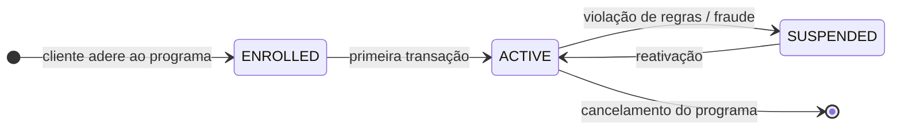
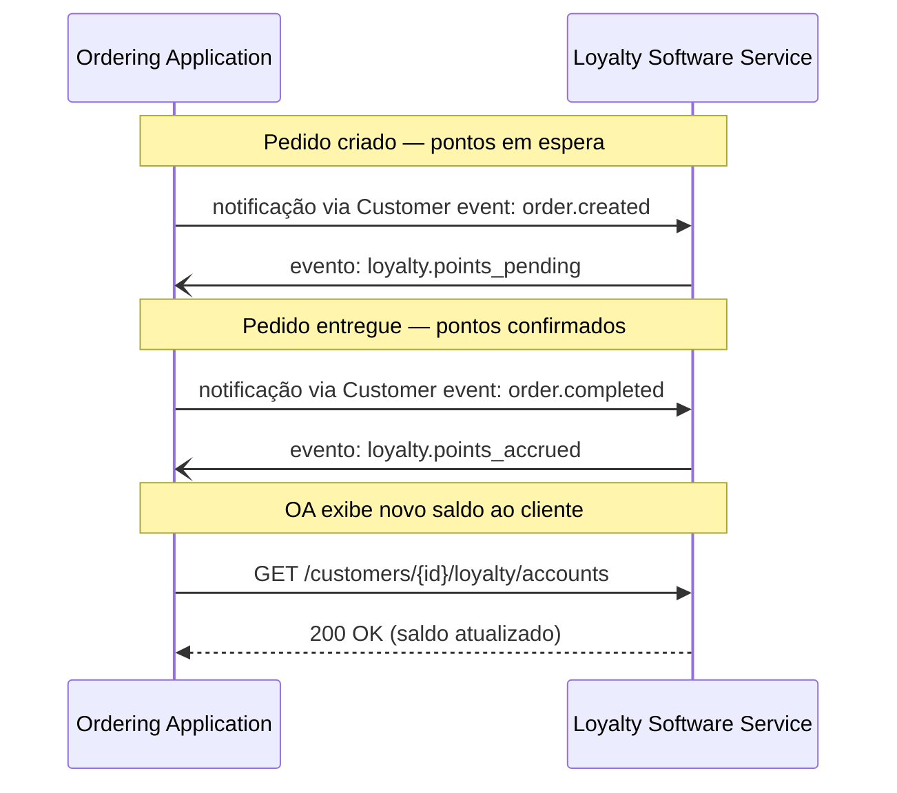
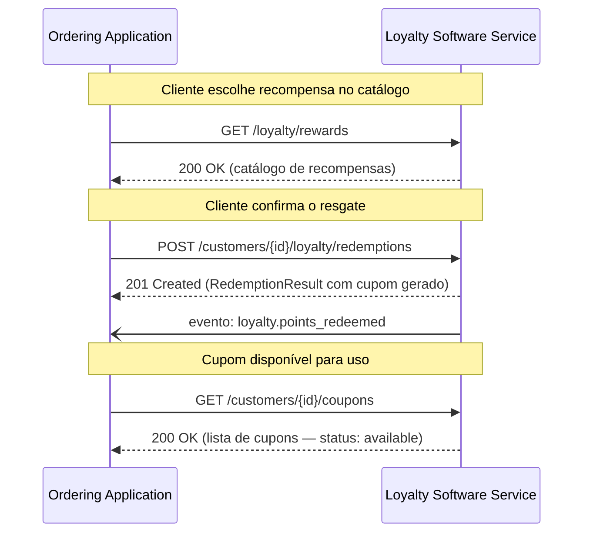
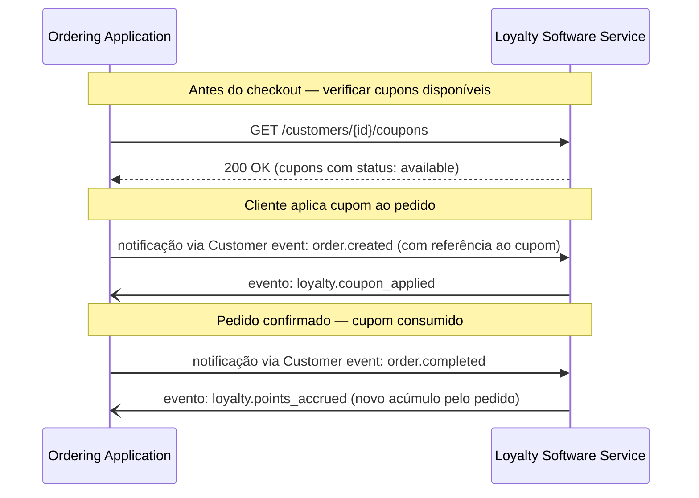
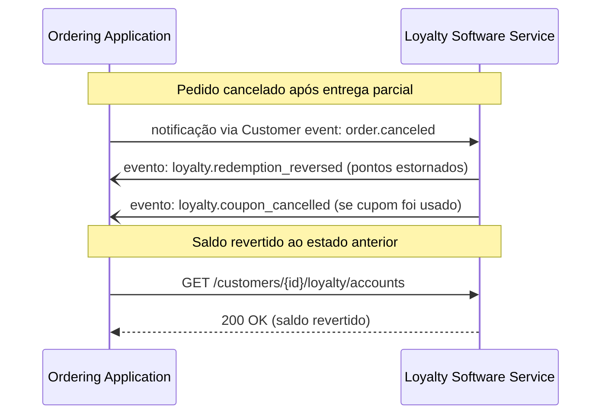
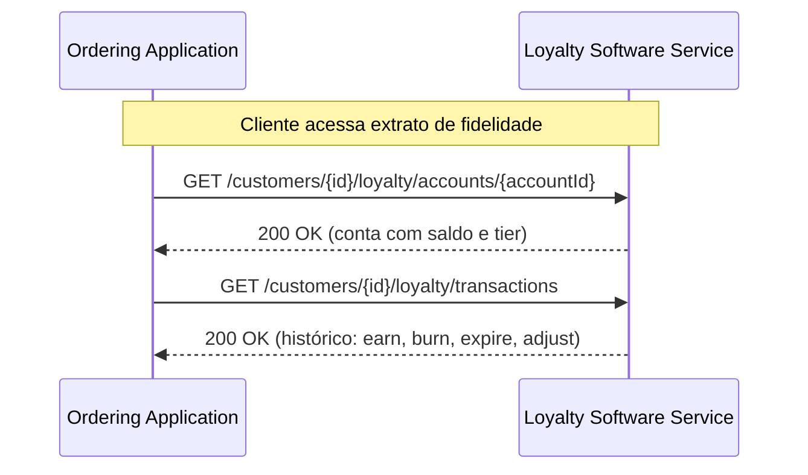

# Loyalty / Fidelidade

  Extensão
  loyalty
  pai: Customer
  Novo na V2

  
Regras e fluxos nesta página. Contrato HTTP na referência OpenAPI (Customer).

  <a href="../reference/customer/">Abrir referência OpenAPI →</a>

> Extensão da [Customer Capability](../protocol/customer.md) · Extension name: `loyalty`

## Para que serve

A extensão **Loyalty** padroniza a interoperabilidade entre a plataforma de pedidos e o sistema de fidelidade: consulta de saldo, acúmulo de pontos vinculado a pedidos, resgates de recompensas, aplicação de cupons e histórico de transações de fidelidade.

Sem um padrão, cada integração entre plataforma e sistema de loyalty precisava negociar bilateralmente como identificar a conta do cliente, quando e como acumular pontos, como tratar resgates parciais e o que acontece com o saldo em caso de cancelamento. O Loyalty elimina essa negociação ao definir a **conta de fidelidade** como entidade central e um conjunto fixo de operações e eventos sobre ela.

!!! warning "Loyalty é uma extensão, não uma capability autônoma"
    Esta extensão pressupõe que ambas as partes já implementaram a **capability Customer**. Os dados de cadastro do cliente, leads e pedidos trafegam pelo Customer; o Loyalty adiciona, sobre esse contexto, a camada de fidelidade e cupons.

    Implementações que não possuem a capability Customer ativa não podem usar esta extensão.

!!! info "O que o Loyalty NÃO padroniza"
    Regras internas de programa — lógica de acúmulo, política de tiers, expiração de pontos, elegibilidade de campanhas — são responsabilidade de cada implementação e ficam fora do escopo deste protocolo.

---

## Os dois lados da integração

| Papel | Responsabilidade |
|---|---|
| **Loyalty Software Service** | Sistema de fidelidade ou CRM com módulo de loyalty. **Hospeda** as interfaces de saldo, transações, recompensas, resgates e cupons. **Emite** eventos do ciclo de vida de fidelidade. |
| **Ordering Application** | Plataforma de pedidos (app próprio, marketplace, PDV, totem). **Consome** as interfaces de fidelidade para exibir saldo, aplicar cupons no checkout e confirmar resgates. |

Em todas as operações desta extensão, o Loyalty Software Service é o servidor e a Ordering Application é o cliente.

---

## Conceitos-chave

### A conta de fidelidade

A **conta de fidelidade** agrega o saldo e o histórico de movimentações de um cliente em um programa específico. Um cliente pode ter contas em múltiplos programas.

| Campo | Descrição |
|---|---|
| `customerId` | Referência ao cliente na capability Customer |
| `programId` | Identificador do programa de fidelidade |
| `summary.pointsAvailable` | Saldo disponível para resgate |
| `summary.pointsPending` | Pontos aguardando confirmação (ex.: pedido ainda em entrega) |
| `summary.pointsExpiringSoon` | Pontos próximos do vencimento |

### Status da conta de fidelidade

| Status | Significado |
|---|---|
| `ENROLLED` | Cliente inscrito, ainda sem movimentação |
| `ACTIVE` | Conta com movimentação; acúmulo e resgates habilitados |
| `SUSPENDED` | Conta suspensa — operações bloqueadas até reativação |

### Tipos de transação

| Tipo | Quando ocorre |
|---|---|
| `earn` | Acúmulo de pontos vinculado a um pedido concluído |
| `burn` | Baixa de pontos por resgate de recompensa ou cupom |
| `expire` | Expiração de pontos por vencimento |
| `adjust` | Ajuste manual por suporte ou política de negócio |

### Cupons

O cupom é a representação do benefício gerado por um resgate. Um resgate cria um cupom com código, tipo (`discount`, `free_item`, `cashback`) e status de uso.

| Status do cupom | Significado |
|---|---|
| `available` | Disponível para uso no checkout |
| `applied` | Aplicado a um pedido em andamento |
| `used` | Consumido — pedido confirmado |
| `expired` | Expirado sem uso |
| `cancelled` | Cancelado (ex.: pedido cancelado) |

### Eventos

| Evento | Gatilho |
|---|---|
| `loyalty.account_linked` | Conta de fidelidade vinculada ao cliente |
| `loyalty.points_accrued` | Pontos confirmados após pedido concluído |
| `loyalty.points_pending` | Pontos em espera (pedido ainda não entregue) |
| `loyalty.points_expired` | Pontos expirados por vencimento |
| `loyalty.points_redeemed` | Resgate realizado — pontos baixados |
| `loyalty.redemption_reversed` | Resgate estornado (ex.: pedido cancelado) |
| `loyalty.coupon_applied` | Cupom aplicado ao checkout |
| `loyalty.coupon_cancelled` | Cupom cancelado |

---

## Fluxos

### Acúmulo de pontos após pedido

O acúmulo acontece de forma **assíncrona** — o Loyalty Software Service aguarda a confirmação de entrega antes de creditar os pontos definitivamente.

### Resgate de recompensa

O cliente troca pontos por uma recompensa. O resgate gera um cupom que pode ser usado no próximo pedido.

### Aplicação de cupom no checkout

O cliente usa o cupom gerado por um resgate (ou recebido por outra origem) em um novo pedido.

### Estorno por cancelamento

Pedido cancelado após acúmulo ou uso de cupom — pontos e cupons são revertidos.

### Consulta de histórico

---

## Implementando o Loyalty Software Service

Se você hospeda as interfaces de fidelidade, atente para:

**Trate o acúmulo como assíncrono.** Só confirme pontos (`earn`) após a entrega definitiva do pedido (`order.completed`). Registre pontos pendentes (`loyalty.points_pending`) imediatamente após `order.created` para que a Ordering Application possa exibir a previsão ao cliente — mas deixe claro no payload que são pontos em espera.

**Revertam tudo no cancelamento.** Um `order.canceled` deve disparar estorno de pontos acumulados (`redemption_reversed`) e cancelamento de cupons gerados ou aplicados (`coupon_cancelled`). O cliente não pode ficar com benefícios de um pedido que não foi concluído.

**Valide o saldo antes de confirmar um resgate.** `POST /customers/{id}/loyalty/redemptions` deve verificar se `pointsAvailable` é suficiente para cobrir o custo da recompensa. Rejeite com `422 Unprocessable Entity` se o saldo for insuficiente — nunca permita saldo negativo.

**Emita eventos para cada transição.** Toda movimentação de pontos ou mudança de status de cupom deve gerar o evento correspondente. A Ordering Application depende desses eventos para manter a tela do cliente atualizada.

**Declare suporte no discovery.** Anuncie na capability Customer quais grupos de operações você suporta: balance, accrual, redemption, coupon validation. Declare também o modo de timing (real-time ou deferred) para o acúmulo.

---

## Implementando a Ordering Application

Se você consome as interfaces de fidelidade e exibe saldo e benefícios ao cliente, atente para:

**Exiba pontos pendentes com clareza.** Use `summary.pointsPending` para mostrar a previsão de pontos que serão creditados após a entrega — mas diferencie visualmente do saldo disponível (`pointsAvailable`) para não criar expectativas incorretas.

**Consulte cupons disponíveis antes do checkout.** Ao abrir a tela de pagamento, faça `GET /customers/{id}/coupons` para listar cupons com `status: available`. Não assuma que o cupom gerado em um resgate anterior ainda está disponível — pode ter sido usado em outra sessão.

**Associe o cupom ao pedido ao enviá-lo.** Ao enviar o evento `order.created`, inclua a referência ao cupom aplicado para que o Loyalty Software Service possa transicioná-lo para `applied` e depois `used`.

**Receba e trate eventos de estorno.** Implemente o webhook que recebe `loyalty.redemption_reversed` e `loyalty.coupon_cancelled` — atualize a tela de fidelidade e notifique o cliente quando um benefício for revertido por cancelamento.

**Alerte sobre pontos expirando.** Use `summary.pointsExpiringSoon` para criar alertas proativos na interface — um cliente que perde pontos por falta de aviso tem uma experiência ruim que impacta diretamente o programa de fidelidade.

---

!!! tip "Checklist — Loyalty Software Service"
    - Acúmulo de pontos é assíncrono: `pending` após `order.created`, `earn` após `order.completed`.
    - Cancelamento reverte pontos e cancela cupons afetados — sempre.
    - Saldo validado antes de confirmar resgate; saldo negativo nunca permitido.
    - Evento emitido para cada movimentação de pontos e mudança de status de cupom.
    - Grupos de operações e modo de timing (real-time / deferred) declarados no discovery.

!!! tip "Checklist — Ordering Application"
    - Pontos pendentes exibidos com distinção clara do saldo disponível.
    - Cupons consultados antes do checkout — não assumir disponibilidade sem verificar.
    - Referência ao cupom incluída no payload do pedido ao enviar `order.created`.
    - Webhook implementado para receber `loyalty.redemption_reversed` e `loyalty.coupon_cancelled`.
    - Alerta de `pointsExpiringSoon` exibido proativamente na interface de fidelidade.

---

**Referência completa de campos e regras normativas:** [API Customer & Loyalty →](../reference/customer.md)

---

  
Próximo passo

  

    <a href="../reference/customer/">Abrir referência OpenAPI</a>
    <a href="../protocol/customer/">Protocolo Customer</a>
    <a href="reviews/">Extensão Reviews</a>
  

