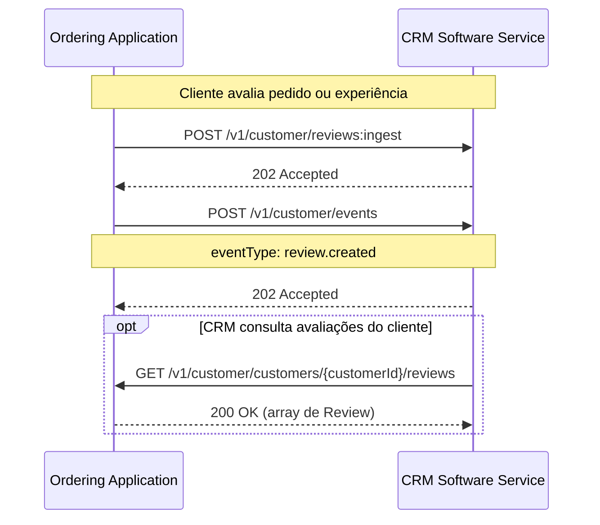

# Reviews / Avaliações

  Extensão
  reviews
  pai: Customer

> Extensão da [Customer Capability](../protocol/customer.md) · Extension name: `reviews`  
> REST/HTTP binding: [Referência da API — Customer](../reference/customer.md)

## Para que serve

A extensão **Reviews** padroniza o envio e a consulta de avaliações de clientes entre a plataforma de pedidos e o sistema de CRM — notas, categorias de pergunta e texto livre — sem impor um questionário único do mercado.

Sem um padrão, cada integração precisava negociar bilateralmente como representar escala de notas (estrelas, NPS, like/dislike), se a avaliação é simples ou categorizada, e como amarrar (quando existir) pedido, merchant e cliente. O Reviews elimina essa negociação ao definir um modelo flexível de avaliação e eventos associados.

!!! warning "Reviews é uma extensão, não uma capability autônoma"
    Esta extensão pressupõe a **capability Customer**. Cadastro de cliente, leads e contexto relacional trafegam pelo Customer; o Reviews adiciona, sobre esse contexto, a camada de avaliações.

    Implementações que não possuem a capability Customer ativa não podem usar esta extensão.

!!! info "O que o Reviews NÃO padroniza"
    Disparo de pesquisa (timing, canal, QR Code), moderação editorial, agregação multi-canal (Google, marketplaces) e regras internas de score — ficam a cargo de cada implementação.

---

## Os dois lados da integração

| Papel | Responsabilidade |
|---|---|
| **Ordering Application** | Origina ou coleta a avaliação (app, totem, pós-pedido, salão). **Envia** avaliações e eventos ao CRM. |
| **CRM Software Service** | **Consome** avaliações para inteligência, NPS e qualidade; pode **consultar** histórico por cliente. |

---

## Conceitos-chave

### Avaliação (Review)

Uma avaliação registra a opinião do cliente sobre um pedido, uma experiência de salão ou outro contexto declarado.

| Aspecto | Diretriz V2 |
|---|---|
| Escalas | Estrelas, NPS (0–10), like/dislike — o modelo deve acomodar os três |
| Overall | Nota geral opcional (ou como tipo de pergunta), sem forçar média automática de categorias |
| Categorias / perguntas | Vocabulário **aberto** (string), não enum fechado do protocolo |
| Identificadores | `merchantId` relevante na prática; `orderId` frequentemente ausente no mundo real |
| Cliente | Preferir vínculo com Customer quando houver identificador; permitir enriquecimento posterior |

### Eventos

| Evento | Gatilho |
|---|---|
| `review.created` | Avaliação submetida pelo cliente |

Eventos **DEVEM** representar fatos de negócio, não comandos. O CRM DEVE processá-los de forma idempotente.

---

## Fluxo típico

Detalhes de endpoints, schemas e códigos de erro estão na [referência OpenAPI de Customer](../reference/customer.md).

---

## Relação com Customer e Loyalty

| Módulo | Papel |
|---|---|
| **Customer** (capability) | Identidade, leads, pedidos no contexto CRM, eventos de relacionamento |
| **Reviews** (extensão) | Avaliações e `review.created` |
| **Loyalty** (extensão) | Programas, saldo, resgate, cupons |

As três peças são declaradas no [Discovery](../protocol/discovery.md). Reviews e Loyalty podem ser adotadas de forma independente **desde que** Customer esteja ativo e o manifesto declare o suporte.

---

## Discovery

Implementações que expõem Reviews DEVEM declarar a extensão sob a capability `customer` no documento well-known (por exemplo via lista de `extensions`).

---

  
Próximo passo

  

    <a href="../protocol/customer/">Voltar ao protocolo Customer</a>
    <a href="../reference/customer/">Abrir referência OpenAPI</a>
    <a href="loyalty/">Ver extensão Loyalty</a>
  

