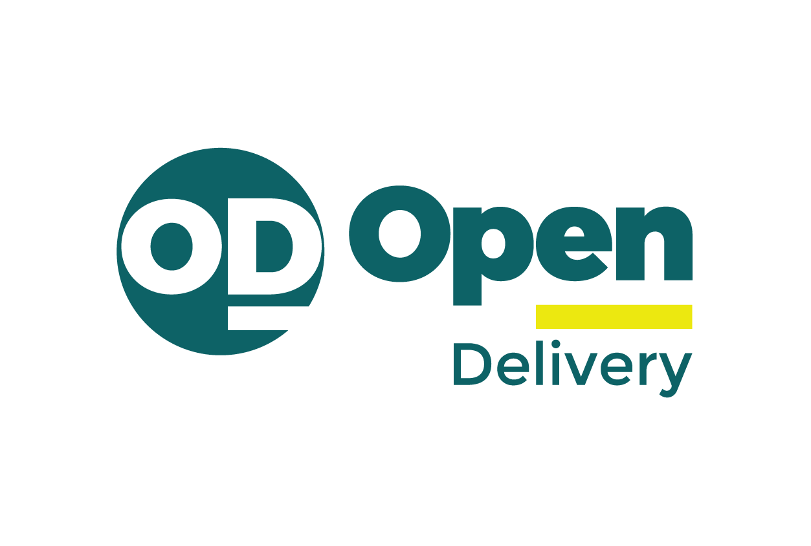

---
hide:
  - toc
title: Open Delivery Protocol
description: The common language for ordering applications, software services, and logistics providers.
---

  <!-- ── HERO ──────────────────────────────────────────────── -->
  

    

      <h1>Open Delivery Protocol</h1>
      

        The common language for ordering, fulfillment, and delivery.
      

      

        Open Delivery defines building blocks for food and retail delivery coordination—from
        merchant catalog discovery to order placement and last-mile logistics—allowing
        the ecosystem to interoperate through one standard, without custom bilateral integrations.
      

      <a href="documentation/core-concepts/" class="promo-button">Get started</a>
    

    

      
    

  

  <!-- ── PROMO CARDS ───────────────────────────────────────── -->
  

    

      <h3>Learn</h3>
      
Protocol overview, core concepts, and design principles

      <a href="documentation/core-concepts/" class="promo-button">Read the docs</a>
    

    

      <h3>Implement</h3>
      
GitHub repo, technical spec, and capability reference

      <a href="https://github.com/Abrasel-Nacional/opendelivery-v2" class="promo-button" target="_blank">View on GitHub</a>
    

    

      <h3>Contribute</h3>
      
Feedback, issues, and pull requests welcome

      <a href="https://github.com/Abrasel-Nacional/opendelivery-v2/issues" class="promo-button" target="_blank">Open an issue</a>
    

  

  

  <!-- ── CORE CAPABILITIES ─────────────────────────────────── -->
  

    <h2>Core capabilities</h2>
    

      The protocol is organized into independent capabilities. Each capability specifies
      information model, supported operations, interaction roles, and interoperability obligations.
    

    

      Before any capability is used, participants discover each other through the mandatory
      well-known document defined by the protocol.
    

  

  

    

      
🏢

      <h3>Merchant</h3>
      
Merchant entity structure and operational rules. Menus, categories, items, availability.

       <a href="specification/merchant/" class="promo-button">Learn more</a>
    

    

      
📋

      <h3>Orders</h3>
      
Order lifecycle, state management, and coordination. Idempotency, events, cancellation.

       <a href="specification/orders/" class="promo-button">Learn more</a>
    

    

      
👤

      <h3>Customer</h3>
      
Customer, lead, and customer-linked order interoperability for CRM, loyalty, and marketing use cases.

       <a href="specification/customer/" class="promo-button">Learn more</a>
    

    

      
📍

      <h3>Logistics</h3>
      
Delivery coordination and tracking. Address resolution, delivery states, and updates.

       <a href="specification/logistics/" class="promo-button">Learn more</a>
    

  

  

  <!-- ── FEATURES ──────────────────────────────────────────── -->
  

    <h2>Built for flexibility, neutrality, and scale</h2>
    

      Delivery coordination demands interoperability. Open Delivery is built on
      transport-agnostic protocol semantics—REST, MCP, or any other binding—so
      different systems work together without custom integration per pair.
    

  

  

    

      

        
🔄

        

          <h3>Transport-agnostic</h3>
          
Protocol semantics define conformance. Transport binding (REST, MCP, queues) is a separate layer. The same protocol works over any data interchange mechanism.

        

      

      

        
🏪

        

          <h3>Merchants at the center</h3>
          
Built to facilitate commerce while ensuring merchants retain control of their catalog, pricing, and operational rules. Merchant context is the single source of truth.

        

      

      

        
📐

        

          <h3>Normative and unambiguous</h3>
          
Uses RFC 2119 keywords (MUST, MUST NOT, SHOULD, MAY) throughout. No implicit behavior—if it is not normatively stated, it is not required.

        

      

      

        
🔗

        

          <h3>Autonomous peers</h3>
          
Ordering Application, Software Service, and Logistics Service are independent peers. There is no central orchestrator—each party decides autonomously.

        

      

      

        
🔒

        

          <h3>Secure and merchant-scoped</h3>
          
Credentials are merchant-scoped. Implementations MUST NOT share a single credential set across merchants. Security contracts are first-class protocol citizens.

        

      

    

  

  

  <!-- ── GET STARTED ───────────────────────────────────────── -->
  

    

      <h2>Get started today</h2>
      

        Open Delivery is an open standard designed to let ordering apps, merchant software,
        and logistics providers interact seamlessly—without needing custom, one-off
        integrations for every connection. We actively seek your feedback and contributions.
      

    

    

      

        
📖

        

          <h3><a href="documentation/core-concepts/">Read the concepts</a></h3>
          
Understand parties, capabilities, and coordination model

        

      

      

        
📐

        

          <h3><a href="protocol/guidelines/">Follow the rules</a></h3>
          
Cross-cutting normative rules and RFC 2119 language

        

      

      

        
🏗️

        

          <h3><a href="protocol/authentication/">Set up access</a></h3>
          
Understand the shared authentication flow before protected capability operations

        

      

    

  

