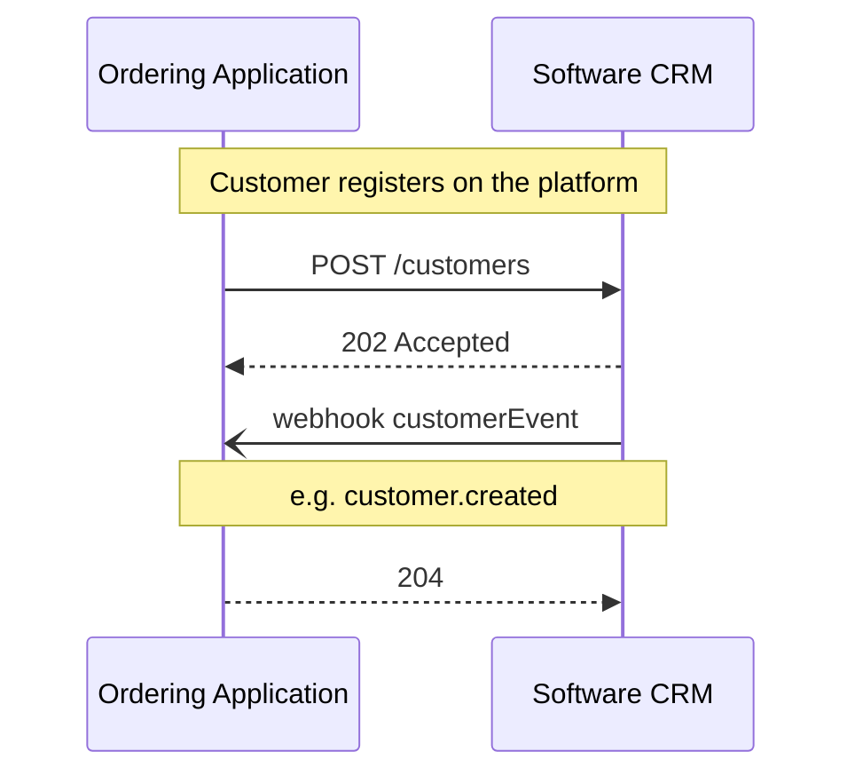
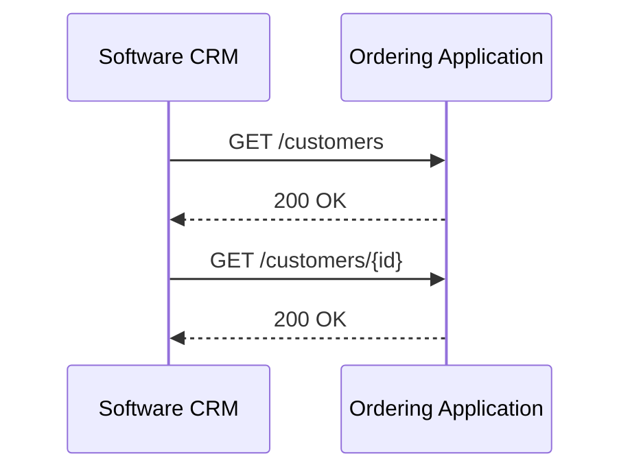
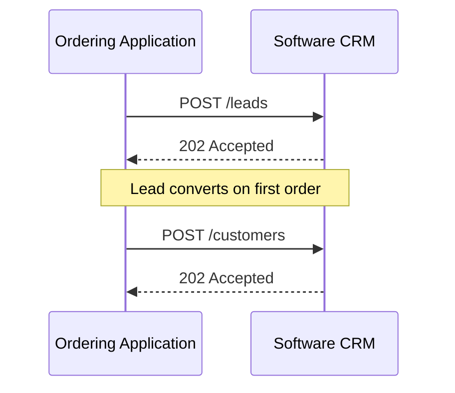
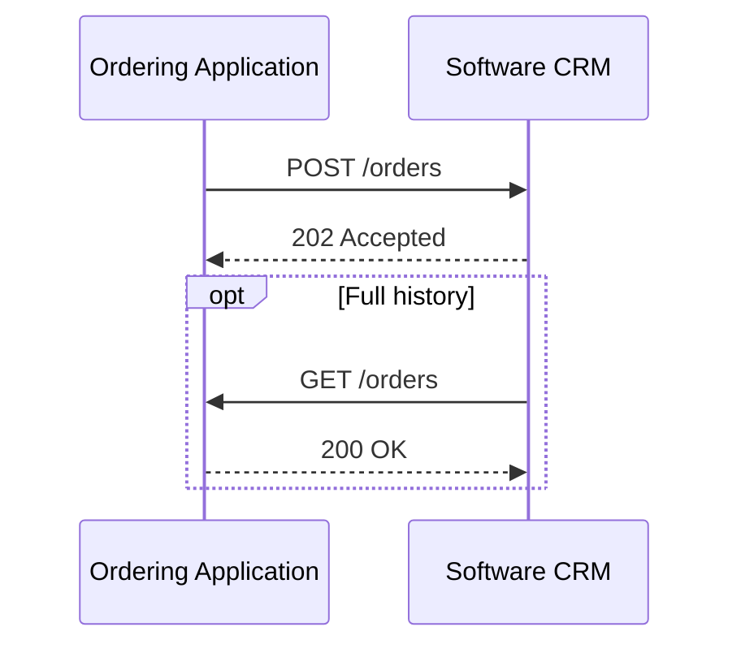

# Customer

<p class="od-meta">
 <span class="od-badge od-badge--core">Capability</span>
 <span class="od-badge od-badge--code">customer</span>
 <span class="od-badge od-badge--new">New in V2</span>
</p>

!!! note "API Spec"
    The implementable contract (endpoints, fields, errors, and examples) is in the **[Customer API Spec](../reference/customer.md)** — English only.

This page is the **overview**: what Customer is, roles, modules, and how the docs are split. Reviews and loyalty details live in the child pages.

---

## What it is for

The **Customer** capability standardizes exchange of **customer data** in the Open Delivery ecosystem: profiles, leads, order history in a relationship context, reviews, events, and loyalty programs.

The protocol capability name is always **`customer`**. There is **no** capability named “CRM”.

**CRM software** (and similar products — marketing automation, loyalty engines, quality tools) is a **product class** that connects to the ecosystem and **implements or consumes** Customer endpoints. Guides may say “Software CRM”; the pattern name remains **Customer**.

Customer **does not require** Orders for core profiles, leads, and reviews. When relationship-context orders are exchanged, Customer has **its own** ingest/query endpoints; the **order data shape is the same as** [Orders](orders.md) — do not redefine order schema here.

Without a standard, every platform–relationship-software pair negotiated identifiers, leads, events, and loyalty bilaterally. Customer removes that negotiation.

---

## How the docs are organized

Discovery capability `customer` is **one**. Docs split for reading:

| Page | Content |
|---|---|
| **Customer** (this) | Concept, roles, discovery, ops map, core customer data |
| **[Reviews](reviews.md)** | Reviews and `review.created` |
| **[Loyalty](loyalty.md)** | Accounts, points, coupons, redemptions, loyalty events |

```
Customer (capability)
├── Customer data → customers, leads, orders (context), events
├── Reviews → ratings
└── Loyalty → programs, balance, redemption, coupons
```

!!! note "Not protocol extensions"
    **Reviews** and **Loyalty** are **modules** of Customer — not Discovery extensions and not separate capabilities.
    Parties MAY implement **only** Reviews endpoints, **only** Loyalty endpoints, or only core customer data — as long as the manifest declares those operations under capability `customer`.

---

## What changes from V1 to V2

!!! info "New domain in V2"
    Customer (and its Reviews and Loyalty modules) **did not exist** as a protocol capability in V1. In V2 they enter as a new ecosystem domain.

| Topic | V1 | V2 |
|---|---|---|
| **Customer data** | Bilateral / ad-hoc | Normative **Customer** capability |
| **Reviews** | Outside the protocol | Customer module |
| **Loyalty** | Outside the protocol | Customer module |
| **Orders in CRM context** | N/A | Own endpoints; **same shape** as [Orders](orders.md) |

---

## Roles

| Role | Responsibility |
|---|---|
| **Ordering Application** | Typical origin of customer, lead, review, and often order history. **Pushes** and/or **serves** pull APIs. Receives event webhooks. |
| **Software CRM** (or other Customer host) | System that **hosts** Customer endpoints (ingest, query, loyalty, reviews) and/or **pulls** from the Ordering Application. Emits events when it is the authority for the fact. |

Integration modes: **push** (OA → host), **pull** (host → OA), or **hybrid**. Declare modes and `supportedOperations` in [Discovery](discovery.md).

---

## Key concepts — customer data

### The customer (`Customer`)

Central entity. The only required field is `identifier` — canonical key for deduplication and reconciliation.

| `identifier` field | Description | Example `type` values |
|---|---|---|
| `type` | Identifier kind | `document`, `phone`, `email`, `external_id`, `custom` |
| `value` | Value | phone, document, email |

Other fields (`name`, `contacts`, `document`, `demographics`, `address`, `externalIds`, `metadata`) are optional — a customer MAY start with only the identifier and be enriched later.

### Customer status

| Status | Meaning |
|---|---|
| `lead` | Acquisition phase — no order yet |
| `active` | Active relationship |
| `inactive` | No recent interaction |

### Orders in Customer context

Order view for **analytics and relationship** — **does not** replace the operational lifecycle in [Orders](orders.md). Software CRM **MUST NOT** change operational status, cancel, or modify kitchen/logistics orders.

### Relationship events

Business facts (not commands). Process **idempotently**. Typical examples:

| Event | Trigger |
|---|---|
| `customer.created` / `customer.updated` | Profile create or update |
| `customer.opted_in` / `customer.opted_out` | Consent |
| `lead.created` | Lead captured |
| `order.created` / `order.completed` / `order.canceled` | Order facts in relationship context |
| `review.created` | Review submitted (Reviews module) |

Loyalty events (`loyalty.*`) are covered in [Loyalty](loyalty.md).

---

## Flows (core)

### Push — customer registration



### Pull — synchronization



### Lead



### Order in relationship context



Field-level contract: [Customer API Spec](../reference/customer.md). Reviews: [Reviews](reviews.md). Loyalty: [Loyalty](loyalty.md).

---

## Map: goal → page → operation

| Goal | Page | Operation (spec) |
|---|---|---|
| List / send customers | this | `listCustomers` · `upsertCustomers` |
| List / send leads | this | `listLeads` · `upsertLeads` |
| Orders in Customer context | this | `listOrders` · `upsertOrders` · `getOrderById` |
| Reviews | [Reviews](reviews.md) | `listReviews` · `createReviews` · `getReviewById` |
| Programs and balance | [Loyalty](loyalty.md) | `listLoyaltyPrograms` · `listCustomerLoyaltyAccounts` · … |
| Redemption / coupons | [Loyalty](loyalty.md) | `createLoyaltyRedemption` · `listLoyaltyCoupons` · … |
| Webhooks | this / Loyalty | `receiveCustomerEvent` · `receiveLoyaltyEvent` |

---

## Discovery

Parties that expose Customer **MUST** declare capability `customer` in the well-known document. Include endpoint, modes, and `supportedOperations` for active modules (core, reviews, loyalty).

```json
"capabilities": {
  "customer": {
    "endpoint": "https://api.example.com/od/v2",
    "supportedOperations": [
      "listCustomers",
      "upsertCustomers",
      "listReviews",
      "createReviews",
      "listCustomerLoyaltyAccounts",
      "createLoyaltyRedemption"
    ]
  }
}
```

Do not declare Reviews or Loyalty as separate capabilities or Discovery extensions — they are operations of capability `customer`. Guide: [Discovery](discovery.md).

---

## Authorization

Bearer OAuth 2.0. Preferred scope: `od.crm` (historical name for the customer-data domain) or equivalent scopes in the manifest. See [Authentication](authentication.md).

---

## Implementing Software CRM (host)

**Process ingest asynchronously.** Typical writes return `202 Accepted`.

**Use `identifier` + `externalIds[]` for deduplication.** Do not assume the same id across systems.

**Idempotent events.** Deduplicate by event id / business key.

**Expose GET when pull mode is declared.**

**Do not alter the operational Orders lifecycle.** Customer consumes order context; it does not drive the kitchen.

**Honor consent.** `customer.opted_out` takes precedence for communications.

---

## Implementing the Ordering Application

**Declare modules and operations in Discovery** before operational exchange.

**Emit events** for relevant customer, lead, order-context, and review changes.

**Allow incomplete data** — only `identifier` is required on the customer.

**Align order shape** with [Orders](orders.md) when sending history.

---

## Out of scope

| Topic | Where |
|---|---|
| Operational order lifecycle | [Orders](orders.md) |
| Dining account | [Indoor](indoor.md) |
| Delivery | [Logistics](logistics.md) |
| Store and catalog | [Merchant](merchant.md) |
| Campaign rules, tiers, internal NPS scoring | Outside the protocol (each implementation) |

---

!!! tip "Checklist — Software CRM"
    - Ingest returns `202`; async processing.
    - Dedup via `identifier` / `externalIds[]`.
    - Idempotent events.
    - GET when pull is in the manifest.
    - Operational order untouched.
    - Opt-out applied immediately.

!!! tip "Checklist — Ordering Application"
    - Capability `customer` + active module operations in Discovery.
    - Events on relevant changes.
    - `identifier` on every customer payload.
    - Partial data accepted.
    - Order shape aligned with Orders when applicable.

<div class="od-related">
  <p class="od-related__label">Related</p>
  <ul class="od-related__list">
    <li><a href="../reference/customer.md">Customer API Spec</a></li>
    <li><a href="reviews.md">Reviews</a></li>
    <li><a href="loyalty.md">Loyalty</a></li>
    <li><a href="orders.md">Orders</a></li>
    <li><a href="discovery.md">Discovery</a></li>
  </ul>
</div>
