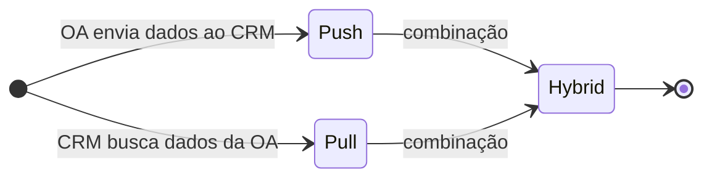
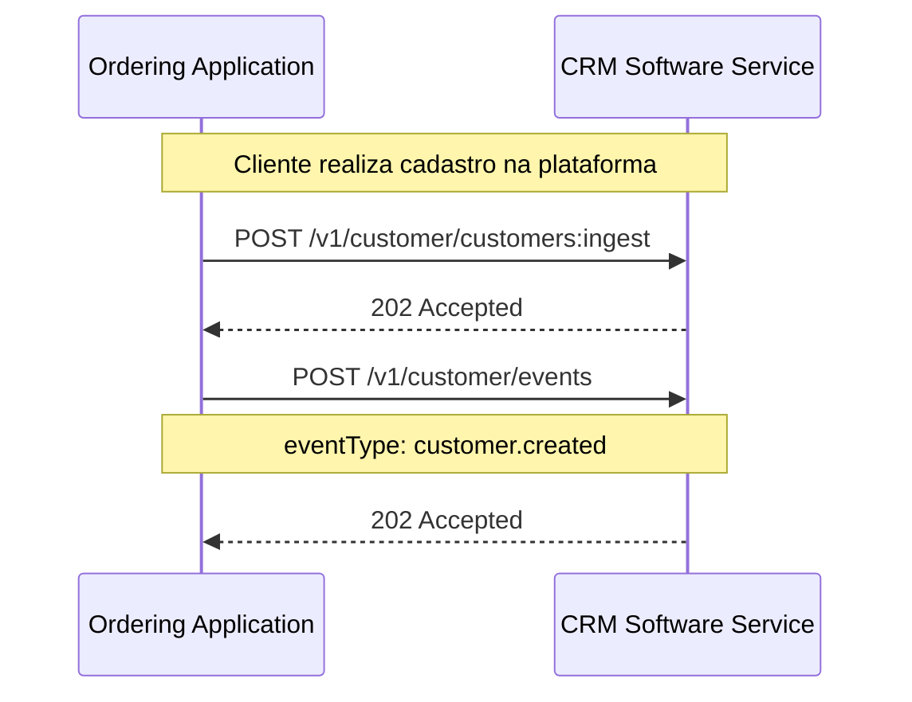
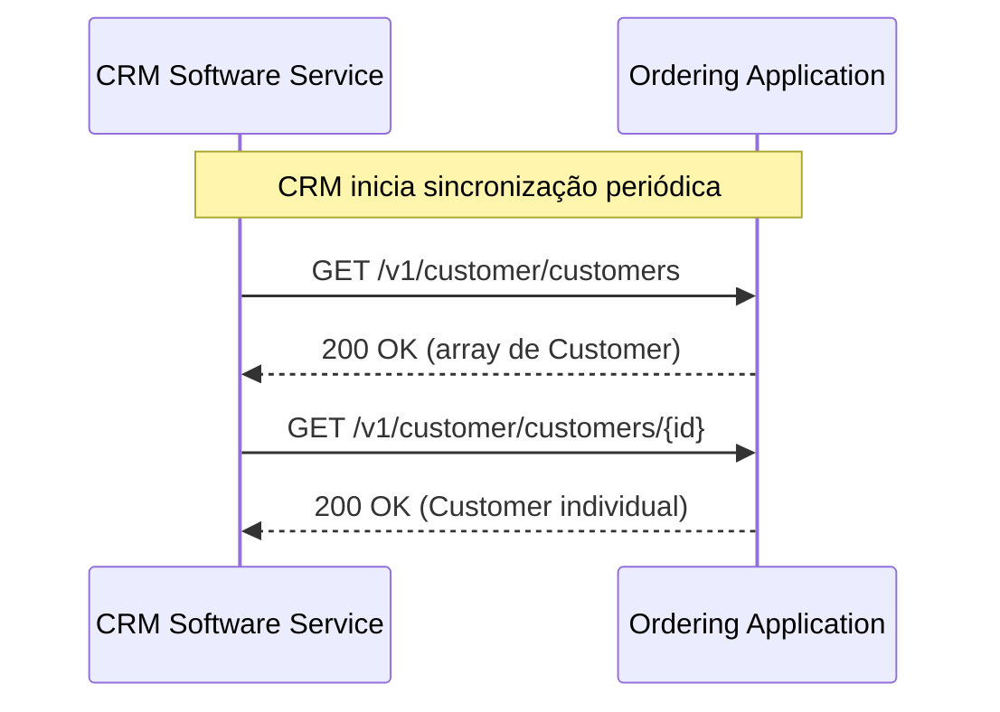
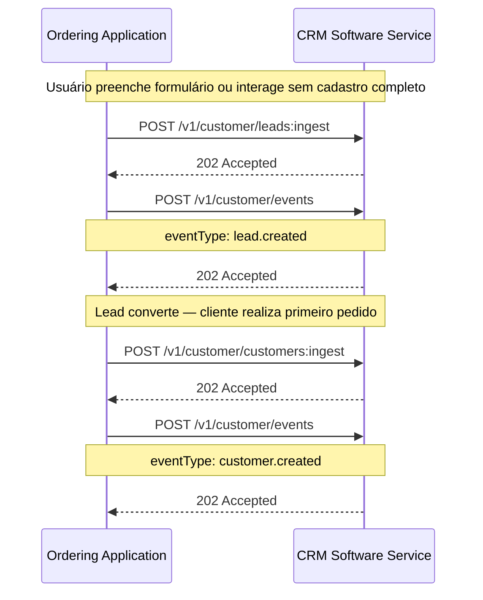
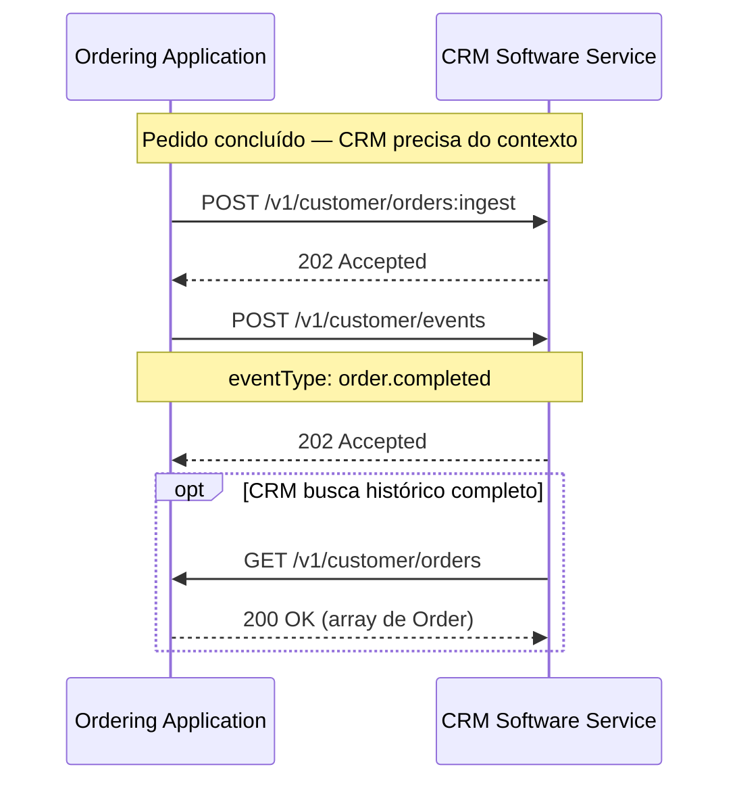
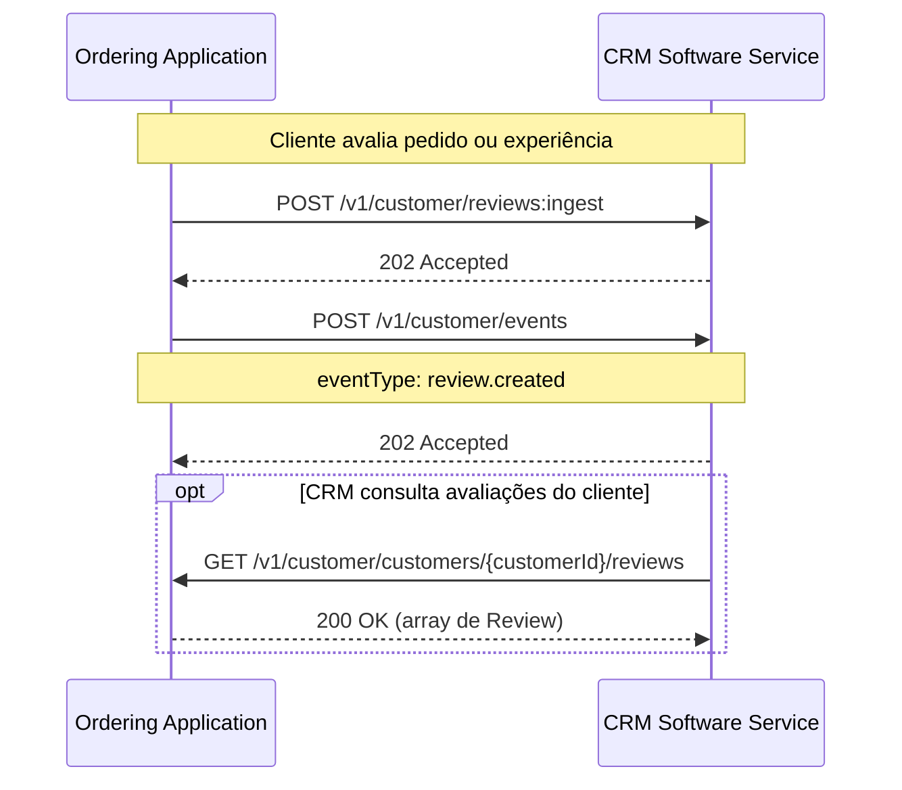

# Customer / CRM

> Capability name: `customer` · Extension associada: [Loyalty](../extensions/loyalty.md)
> REST/HTTP binding: [Customer Endpoints](../transport-bindings/rest-http-customer.md)

## Para que serve

A capability **Customer** padroniza a troca de dados de clientes e eventos de relacionamento entre a plataforma de pedidos e o sistema de CRM. Ela cobre o cadastro de clientes, leads, pedidos no contexto de CRM, avaliações e eventos de engajamento — sem assumir controle sobre o ciclo de vida operacional dos pedidos.

Sem um padrão, cada integração entre plataforma e CRM precisava negociar bilateralmente como representar dados de cliente: qual identificador usar para deduplicação, como sincronizar leads, quando enviar eventos, como lidar com avaliações. O Customer elimina essa negociação ao definir o **cliente** como entidade central e um conjunto fixo de operações e eventos sobre ele.

!!! info "Customer não é loyalty"
    Esta capability cobre a estrutura de dados e os eventos do relacionamento com o cliente. Regras de negócio de fidelidade — pontos, cashback, catálogo de prêmios — são responsabilidade da [extensão Loyalty](../extensions/loyalty.md).

---

## Os dois lados da integração

| Papel | Responsabilidade |
|---|---|
| **Ordering Application** | Plataforma de origem dos dados (app próprio, marketplace, PDV, totem). **Expõe** dados de cliente, lead e pedido para sincronização, e **recebe** resultados de inteligência do CRM. |
| **CRM Software Service** | Sistema de CRM, automação de marketing ou backend de fidelidade. **Consome** dados da plataforma e **expõe** visões de inteligência quando solicitado. |

A integração pode ser **push** (a Ordering Application envia dados ao CRM), **pull** (o CRM busca dados da plataforma) ou **híbrida**. Ambos os modos são suportados; a combinação usada deve ser declarada via discovery antes do início da troca operacional.

---

## Conceitos-chave

### O cliente (Customer)

O cliente é a entidade central da capability. O único campo obrigatório é o `identifier` — uma chave canônica que permite deduplicação e reconciliação entre sistemas.

| Campo do `identifier` | Descrição | Exemplos de `type` |
|---|---|---|
| `type` | Tipo do identificador | `document`, `phone`, `email`, `external_id`, `custom` |
| `value` | Valor do identificador | `"+5511999999999"`, `"CPF:123.456.789-00"` |

Todos os demais campos (`name`, `contacts`, `document`, `demographics`, `address`, `externalIds`, `metadata`) são opcionais — o cliente pode ser registrado com apenas o identificador e enriquecido posteriormente.

### Modos de integração

| Modo | Descrição |
|---|---|
| `push` | Ordering Application envia clientes, leads, pedidos e eventos ao CRM via POST |
| `pull` | CRM busca clientes, leads e pedidos da Ordering Application via GET |
| `hybrid` | Push para algumas entidades e pull para outras |

### Status do cliente

| Status | Significado |
|---|---|
| `lead` | Pessoa em fase de aquisição — ainda não realizou pedido |
| `active` | Cliente com relacionamento ativo |
| `inactive` | Cliente sem interação recente |

### Eventos

A cada ação relevante do cliente, a Ordering Application **DEVE** emitir o evento correspondente ao CRM:

| Evento | Gatilho |
|---|---|
| `customer.created` | Novo cliente registrado |
| `customer.updated` | Dados do cliente alterados |
| `customer.opted_in` | Cliente deu opt-in para comunicação |
| `customer.opted_out` | Cliente retirou consentimento |
| `lead.created` | Novo lead capturado |
| `order.created` | Pedido realizado pelo cliente |
| `order.completed` | Pedido entregue/concluído |
| `order.canceled` | Pedido cancelado |
| `review.created` | Avaliação submetida pelo cliente |

Eventos **DEVEM** representar fatos de negócio, não comandos. O CRM DEVE processá-los de forma idempotente.

---

## Fluxos

Os fluxos abaixo mostram as sequências de chamadas entre a Ordering Application e o CRM Software Service.

### Fluxo push — cadastro de cliente

A Ordering Application registra um novo cliente e envia o evento correspondente ao CRM.

### Fluxo pull — sincronização de clientes

O CRM busca a lista de clientes da plataforma para enriquecer sua base.

### Fluxo de lead

Captura de lead pela plataforma e envio ao CRM para qualificação.

### Fluxo de pedido no contexto CRM

A Ordering Application envia o snapshot do pedido ao CRM para análise de comportamento.

### Fluxo de avaliação

Cliente submete avaliação; plataforma envia ao CRM e emite evento.

---

## Implementando o CRM Software Service

Se você recebe dados e expõe interfaces de inteligência de cliente, atente para:

**Processe ingestões de forma assíncrona.** Todas as operações de ingestão (`POST`) retornam `202 Accepted` — o processamento ocorre em background. Nunca bloqueie a resposta aguardando persistência ou enriquecimento.

**Suporte identificadores externos para deduplicação.** O campo `identifier` é a chave canônica do cliente. Use `externalIds[]` para reconciliar o mesmo cliente entre sistemas diferentes (ex.: PDV com código `C12345` e CRM com ID `crm:93821`). Nunca assuma que o mesmo cliente terá o mesmo ID em todos os sistemas.

**Processe eventos de forma idempotente.** O mesmo evento pode ser entregue mais de uma vez. Use `event.occurredAt` e o identificador da entidade para detectar duplicatas e evitar processamento redundante.

**Exponha endpoints de pull quando declarado no discovery.** Se a integração suportar o modo pull, você deve implementar os endpoints GET (`/customers`, `/orders`, `/leads`) e retornar os dados com paginação quando o volume for alto.

**Não altere o ciclo de vida operacional dos pedidos.** O CRM DEVE ser consumidor do contexto de pedido — NUNCA atualizar status, cancelar ou modificar pedidos operacionais. A visão de pedido no Customer é somente para analytics e relacionamento.

**Preserve o consentimento.** Dados recebidos com `customer.opted_out` DEVEM ser marcados e excluídos de listas de comunicação imediatamente. Eventos `customer.opted_out` têm precedência sobre qualquer outro estado de consentimento.

---

## Implementando a Ordering Application

Se você é a origem dos dados e expõe interfaces para o CRM, atente para:

**Declare o modo de integração no discovery.** Antes do início da troca operacional, exponha no discovery quais modos você suporta (`push`, `pull`, `hybrid`) e quais grupos de operações estão disponíveis (customer, lead, order-view, event, review).

**Emita eventos para cada ação relevante.** Toda mudança significativa no cliente, lead ou pedido deve gerar o evento correspondente ao CRM. Uma mudança sem evento é uma mudança invisível para o sistema de relacionamento.

**Use o `identifier` como chave canônica.** Ao enviar um cliente, sempre inclua o `identifier` com o tipo e valor apropriados. Use `externalIds[]` para incluir referências cruzadas de outros sistemas.

**Permita dados incompletos.** O `identifier` é o único campo obrigatório — você PODE enviar clientes com dados parciais. O CRM irá enriquecer progressivamente conforme novos dados estiverem disponíveis.

**Envie pedidos apenas com os campos de contexto CRM.** A visão de pedido no Customer contém somente os campos relevantes para analytics de relacionamento (`orderId`, `customerId`, `salesChannel`, `timestamps`). Não replique o payload operacional completo.

**Suporte consultas GET se declarado no discovery.** Se você declarou suporte a pull, implemente os endpoints GET e retorne os dados de forma consistente e paginada.

---

!!! tip "Checklist — CRM Software Service"
    - Ingestões retornam `202 Accepted` e processamento ocorre de forma assíncrona.
    - Identificadores externos (`externalIds[]`) suportados para deduplicação e reconciliação.
    - Eventos processados de forma idempotente — duplicatas detectadas por `occurredAt` + ID da entidade.
    - Endpoints GET implementados quando o modo pull está declarado no discovery.
    - Ciclo de vida operacional dos pedidos preservado — CRM não altera status de pedidos.
    - Consentimento opt-out tratado imediatamente e com precedência.

!!! tip "Checklist — Ordering Application"
    - Modo de integração (`push`, `pull`, `hybrid`) declarado no discovery antes da troca operacional.
    - Evento emitido para cada ação relevante de cliente, lead ou pedido.
    - Campo `identifier` presente em todos os payloads de cliente.
    - Dados parciais aceitos — não exija completude para registrar um cliente.
    - Payload de pedido no contexto CRM limitado aos campos de analytics (não replica o pedido operacional).
    - Endpoints GET disponíveis quando pull está declarado no discovery.

---

**Referência completa de campos e regras normativas:** [API Customer →](../reference/customer.md)
