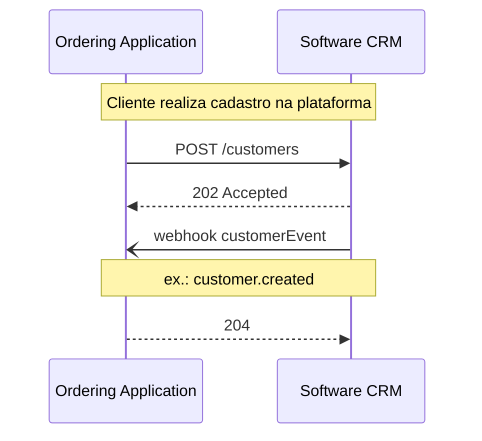
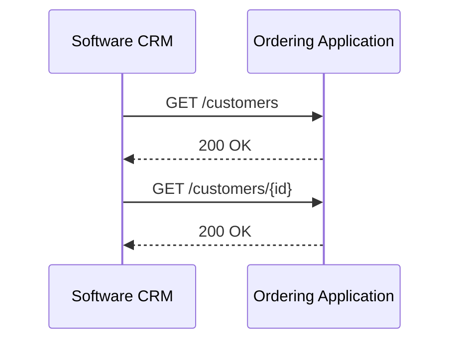
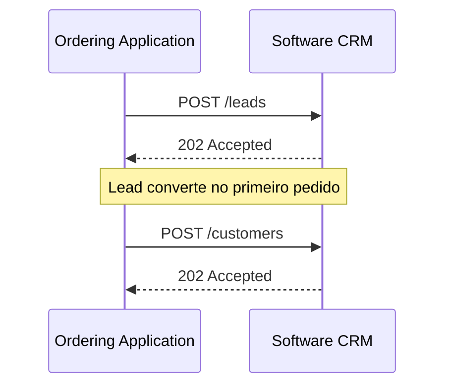
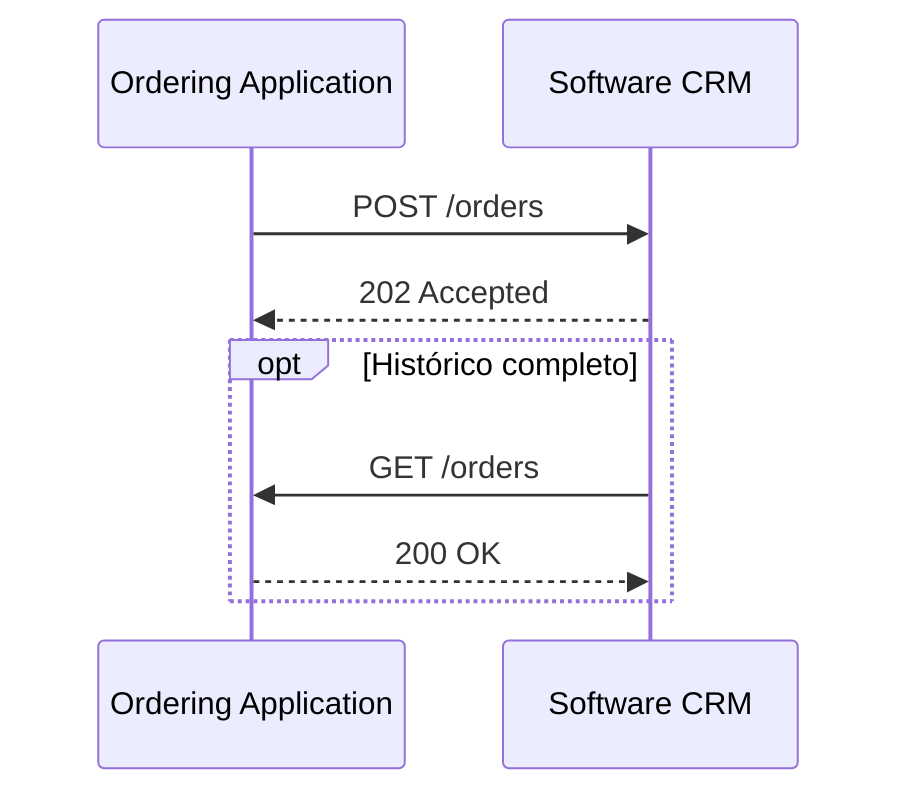

# Customer

<p class="od-meta">
 <span class="od-badge od-badge--core">Capability</span>
 <span class="od-badge od-badge--code">customer</span>
 <span class="od-badge od-badge--new">Novo na V2</span>
</p>

!!! note "Especificação da API"
    O contrato implementável (endpoints, campos, erros e exemplos) está na **[especificação de Customer](../reference/customer.md)** — somente em inglês.

Esta página é a **visão geral** da capability: o que é, papéis, módulos e como a documentação se divide. Detalhe de avaliações e fidelidade está nas páginas filhas.

---

## Para que serve

A capability **Customer** padroniza a troca de **dados do cliente** no ecossistema Open Delivery: cadastro, leads, histórico de pedidos no contexto de relacionamento, avaliações, eventos e programas de fidelidade.

O nome da capability no protocolo é **sempre `customer`**. Não existe capability chamada “CRM”.

**Software CRM** (e afins — automação de marketing, motor de fidelidade, ferramenta de qualidade) é uma **classe de produto** que se conecta ao ecossistema e **implementa ou consome** endpoints de Customer. Em português, o domínio de negócio pode ser descrito como **dados do cliente**; o nome do padrão permanece **Customer**.

Customer **não exige** Orders para o núcleo de cadastro, leads e reviews. Quando houver troca de pedidos no contexto de relacionamento, a capability tem **endpoints próprios** de ingestão/consulta; a **estrutura de dados do pedido é a mesma** definida em [Orders](orders.md) — não se redefine o schema de pedido aqui.

Sem um padrão, cada integração entre plataforma e software de relacionamento precisava negociar bilateralmente identificadores, leads, eventos e fidelidade. Customer elimina essa negociação.

---

## Como a documentação se organiza

A capability `customer` no Discovery é **uma só**. Na documentação ela se divide para leitura:

| Página | Conteúdo |
|---|---|
| **Customer** (esta) | Conceito, papéis, discovery, mapa de ops, núcleo de dados do cliente |
| **[Reviews](reviews.md)** | Avaliações e `review.created` |
| **[Loyalty](loyalty.md)** | Contas, pontos, cupons, resgates e eventos de fidelidade |

```
Customer (capability)
├── Dados do cliente → customers, leads, orders (contexto), events
├── Reviews → avaliações
└── Loyalty → programas, saldo, resgate, cupons
```

!!! note "Não são extensões do protocolo"
    **Reviews** e **Loyalty** são **módulos** de Customer — não extensões Discovery e não capabilities separadas.
    É permitido implementar **somente** endpoints de Reviews, **somente** de Loyalty, ou o núcleo de dados do cliente — desde que o manifesto declare as operações sob a capability `customer`.

---

## O que muda da V1 para a V2

!!! info "Domínio novo na V2"
    Customer (e seus módulos Reviews e Loyalty) **não existiam** na V1 como capability do protocolo. Na V2 entram como domínio novo do ecossistema.

| Tema | V1 | V2 |
|---|---|---|
| **Dados do cliente** | Integrações bilaterais / ad-hoc | Capability **Customer** normativa |
| **Reviews** | Fora do protocolo | Módulo de Customer |
| **Loyalty** | Fora do protocolo | Módulo de Customer |
| **Pedidos no CRM** | N/A | Endpoints próprios; **mesmo shape** de [Orders](orders.md) |

---

## Papéis

| Papel | Responsabilidade |
|---|---|
| **Ordering Application** | Origem típica de cliente, lead, review e, com frequência, histórico de pedidos. **Envia** (push) e/ou **serve** APIs de pull. Recebe webhooks de eventos. |
| **Software CRM** (ou outro host de Customer) | Sistema que **hospeda** endpoints de Customer (ingestão, consulta, loyalty, reviews) e/ou **puxa** dados da Ordering Application. Emite eventos quando é a autoridade do fato. |

A integração pode ser **push** (OA → host), **pull** (host → OA) ou **híbrida**. Declare os modos e as `supportedOperations` no [Discovery](discovery.md).

---

## Conceitos-chave — dados do cliente

### O cliente (`Customer`)

Entidade central. O único campo obrigatório é o `identifier` — chave canônica para deduplicação e reconciliação.

| Campo do `identifier` | Descrição | Exemplos de `type` |
|---|---|---|
| `type` | Tipo do identificador | `document`, `phone`, `email`, `external_id`, `custom` |
| `value` | Valor | `"+5511999999999"`, documento, e-mail |

Demais campos (`name`, `contacts`, `document`, `demographics`, `address`, `externalIds`, `metadata`) são opcionais — o cliente pode nascer só com o identificador e ser enriquecido depois.

### Status do cliente

| Status | Significado |
|---|---|
| `lead` | Em aquisição — ainda sem pedido |
| `active` | Relacionamento ativo |
| `inactive` | Sem interação recente |

### Pedidos no contexto Customer

Visão de pedido para **analytics e relacionamento** — **não** substitui o ciclo de vida operacional de [Orders](orders.md). O Software CRM **NÃO DEVE** alterar status operacional, cancelar ou modificar o pedido da cozinha/logística.

### Eventos de relacionamento

Fatos de negócio (não comandos). Processar de forma **idempotente**. Exemplos típicos:

| Evento | Gatilho |
|---|---|
| `customer.created` / `customer.updated` | Cadastro ou alteração |
| `customer.opted_in` / `customer.opted_out` | Consentimento |
| `lead.created` | Lead capturado |
| `order.created` / `order.completed` / `order.canceled` | Fatos de pedido no contexto de relacionamento |
| `review.created` | Avaliação submetida (módulo Reviews) |

Eventos de fidelidade (`loyalty.*`) estão em [Loyalty](loyalty.md).

---

## Fluxos (núcleo)

### Push — cadastro de cliente



### Pull — sincronização



### Lead



### Pedido no contexto de relacionamento



Contrato de campos e códigos: [especificação Customer](../reference/customer.md). Avaliações: [Reviews](reviews.md). Fidelidade: [Loyalty](loyalty.md).

---

## Mapa: objetivo → página → operação

| Objetivo | Página | Operação (spec) |
|---|---|---|
| Listar / enviar clientes | esta | `listCustomers` · `upsertCustomers` |
| Listar / enviar leads | esta | `listLeads` · `upsertLeads` |
| Pedidos no contexto Customer | esta | `listOrders` · `upsertOrders` · `getOrderById` |
| Avaliações | [Reviews](reviews.md) | `listReviews` · `createReviews` · `getReviewById` |
| Programas e saldo | [Loyalty](loyalty.md) | `listLoyaltyPrograms` · `listCustomerLoyaltyAccounts` · … |
| Resgate / cupons | [Loyalty](loyalty.md) | `createLoyaltyRedemption` · `listLoyaltyCoupons` · … |
| Webhooks | esta / Loyalty | `receiveCustomerEvent` · `receiveLoyaltyEvent` |

---

## Discovery

Participantes que expõem Customer **DEVEM** declarar a capability `customer` no well-known. Inclua endpoint, modos e `supportedOperations` dos módulos ativos (núcleo, reviews, loyalty).

```json
"capabilities": {
  "customer": {
    "endpoint": "https://api.example.com/od/v2",
    "supportedOperations": [
      "listCustomers",
      "upsertCustomers",
      "listReviews",
      "createReviews",
      "listCustomerLoyaltyAccounts",
      "createLoyaltyRedemption"
    ]
  }
}
```

Não declare Reviews ou Loyalty como capabilities ou extensões separadas — são operações da capability `customer`. Guia: [Discovery](discovery.md).

---

## Autorização

Bearer OAuth 2.0. Escopo preferido: `od.crm` (nome histórico do domínio de dados do cliente) ou escopos equivalentes no manifesto. Ver [Autenticação](authentication.md).

---

## Implementando o Software CRM (host)

**Processe ingestões de forma assíncrona.** Writes típicos retornam `202 Accepted`.

**Use `identifier` + `externalIds[]` para deduplicação.** Não assuma o mesmo ID em todos os sistemas.

**Eventos idempotentes.** Deduplique por id de evento / chave de negócio.

**Exponha GET se o modo pull estiver declarado.**

**Não altere o ciclo operacional de Orders.** Customer consome contexto de pedido; não comanda a cozinha.

**Preserve consentimento.** `customer.opted_out` tem precedência em comunicações.

---

## Implementando a Ordering Application

**Declare módulos e operações no Discovery** antes da troca operacional.

**Emita eventos** para mudanças relevantes de cliente, lead, pedido (contexto) e review.

**Permita dados incompletos** — só `identifier` é obrigatório no cliente.

**Alinhe o shape de pedido** com [Orders](orders.md) quando enviar histórico.

---

## O que não cobre

| Tema | Onde |
|---|---|
| Ciclo de vida operacional do pedido | [Orders](orders.md) |
| Conta de salão | [Indoor](indoor.md) |
| Entrega | [Logistics](logistics.md) |
| Loja e cardápio | [Merchant](merchant.md) |
| Regras de campanha, tier, score NPS interno | Fora do protocolo (cada implementação) |

---

!!! tip "Checklist — Software CRM"
    - Ingestões retornam `202`; processamento assíncrono.
    - Deduplicação por `identifier` / `externalIds[]`.
    - Eventos idempotentes.
    - GET implementados quando pull está no manifesto.
    - Pedido operacional intocado.
    - Opt-out respeitado de imediato.

!!! tip "Checklist — Ordering Application"
    - Capability `customer` + operações dos módulos ativos no Discovery.
    - Eventos emitidos nas mudanças relevantes.
    - `identifier` em todo payload de cliente.
    - Dados parciais aceitos.
    - Shape de pedido alinhado a Orders quando aplicável.

<div class="od-related">
  <p class="od-related__label">Relacionado</p>
  <ul class="od-related__list">
    <li><a href="../reference/customer.md">Especificação de Customer</a></li>
    <li><a href="reviews.md">Reviews</a></li>
    <li><a href="loyalty.md">Loyalty</a></li>
    <li><a href="orders.md">Orders</a></li>
    <li><a href="discovery.md">Discovery</a></li>
  </ul>
</div>
