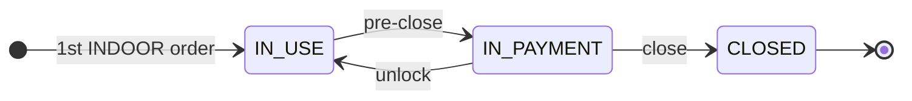
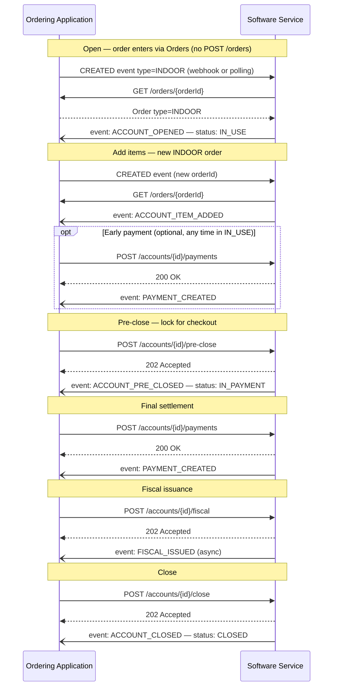
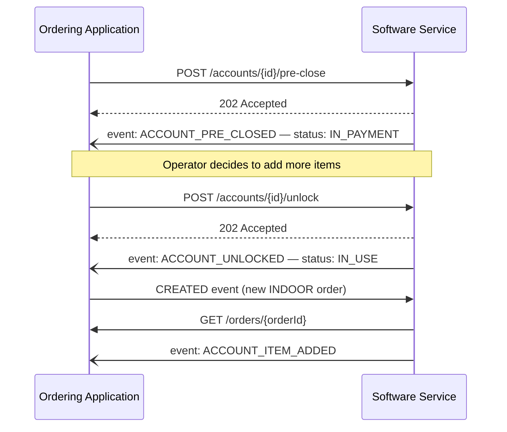
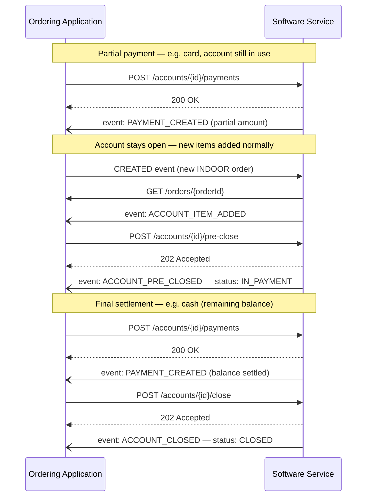
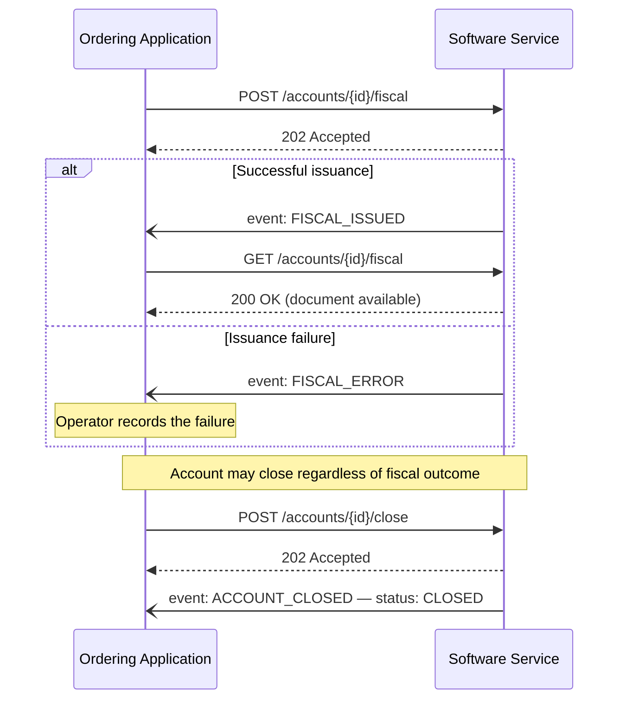
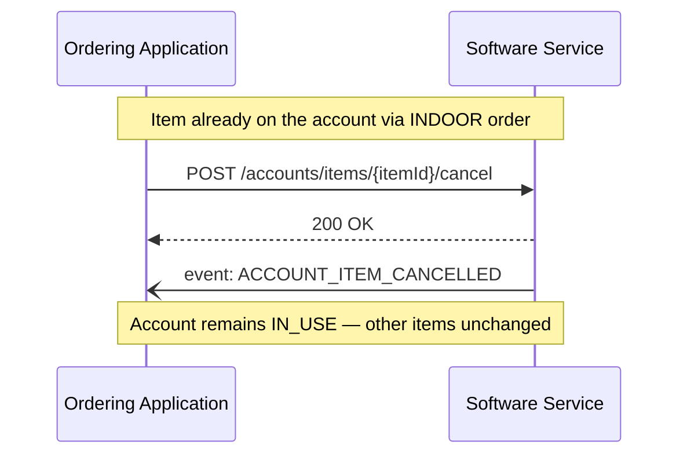
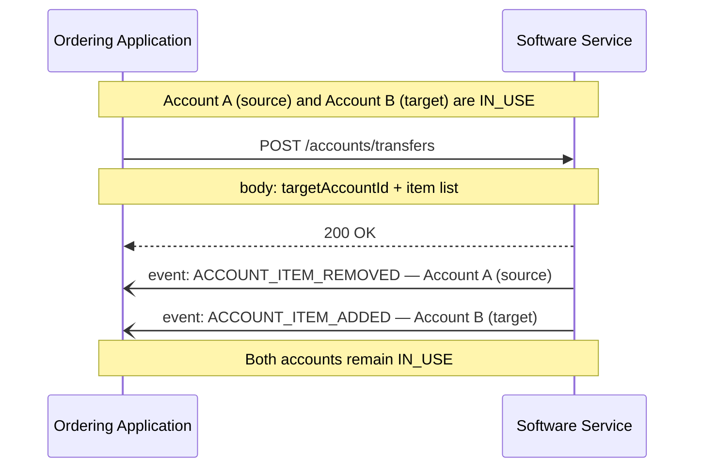

# Indoor / Table Service

<p class="od-meta">
 <span class="od-badge od-badge--ext">Extension</span>
 <span class="od-badge od-badge--code">indoor</span>
 <span class="od-badge">parent: Orders</span>
 <span class="od-badge od-badge--new">New in V2</span>
</p>

!!! note "API Spec"
    The implementable contract (endpoints, fields, errors, and examples) is in the **[Indoor API Spec](../reference/indoor.md)** — English only.

The **Indoor** capability standardizes on-premise consumption — table, tab, and counter — covering both waiter-mediated service and **full self-service** via totem, QR Code, or tablet. It covers the full dining session: grouping orders into an **account**, registering payments (including partial ones), issuing fiscal documents, and closing the account — kept in sync between the restaurant management system and the ordering application.

This page is a **reading guide**: concepts, roles, **account vs order**, flows, and checklists. Field-level contract lives in the API Spec (note above).

!!! note "Repeated account lifecycle call"
    If the operation was **already applied** (e.g. pre-close while account is already `IN_PAYMENT`, close while already `CLOSED`), the host returns **`202`** — not `409` merely because it was duplicated. See [Conventions](../reference/conventions.md#duplicate-lifecycle-operations) and [Indoor API Spec](../reference/indoor.md).

---

## What it is for

In traditional delivery, an order is born and ends as an isolated unit: created, prepared, delivered, closed. On the floor the reality is different. An account opens — at a table, on a tab, or at a self-service counter — and receives **several orders over time**, possibly from different channels (waiter tablet, customer QR Code, totem). Items are cancelled or transferred to another account, the total is split, paid in parts, and only then is the account closed with fiscal issuance.

Without a standard, every POS–floor-app integration had to bilaterally negotiate how to represent that accumulation: where the total lives, how to cancel an item without cancelling the whole order, when to issue the invoice, how to handle partial payment. Indoor removes that negotiation by defining the **account** as the central entity and a fixed set of operations and events on it.

---

## What changes from V1 to V2

!!! important "Breaking - read before migrating"
    Indoor in V2 turns a common set of bilateral integrations into a normative contract. If your company already operates dine-in with proprietary flows, these are the highest-impact migration points.

| Topic | V1 / legacy integrations | V2 |
|---|---|---|
| **Capability model** | Usually proprietary or POS-coupled | Explicit **Indoor** capability with normative contract |
| **Item entry** | Often described as local account opening | Always via **Orders**: `CREATED` event + `GET /orders/{id}` with `fulfillment.orderType: INDOOR` |
| **Central entity** | Order, account, or ticket varied by integrator | **Account** is the operational entity for grouping, payment, close, and fiscal |
| **Account events** | Format and transport were proprietary | `ACCOUNT_*`, `PAYMENT_*`, and `FISCAL_*` events are standardized |
| **Event delivery** | Polling, webhook, or proprietary integrations | **Webhook-only** |
| **Repeated mutation** | Repeated `pre-close` / `close` often treated as error | **`202`** if target state was already applied |
| **Payment timing** | Frequently coupled to final checkout only | Payment may happen in `IN_USE` or `IN_PAYMENT` |

There is no `POST /orders` to create an order in the protocol - including Indoor. The order is born in Orders and the account is born from that order.

---

## Prerequisite: Orders protocol

!!! warning "Indoor is an Orders extension, not a standalone capability"
    Both parties **MUST** implement the **Orders** protocol before Indoor. The **dining account is opened from an order**: when the Software Service processes an order with `fulfillment.orderType: INDOOR` (`CREATED` event + `GET /orders/{id}` — **there is no `POST /orders`**) for an operational key with no open account, it creates the account. Later INDOOR orders on the same key only accumulate items.

    Order **lifecycle and order-event** details live only in Orders — they are not redefined here. Implementations without active Orders **MUST NOT** use this capability.

    - Guide: [Orders](orders.md)
    - Contract: [Orders API Spec](../reference/orders.md)

The order is the **channel that brings items in**; the account is the **operational aggregator** of those orders for payment, close, and fiscal integration.

---

## Roles

| Role | Responsibility |
|---|---|
| **Software Service** | Restaurant management system. **Hosts and implements** all endpoints in this spec and **emits** account lifecycle events. |
| **Ordering Application** | Ordering surface (totem, waiter tablet, customer app, front desk). **Consumes** endpoints and **receives** events via webhook to stay in sync. |

In every operation of this capability the Software Service is the server and the Ordering Application is the client.

---

## Account vs events

This is the most important distinction to avoid mixing Indoor with Orders.

| Concept | What it is | Source of truth |
|---|---|---|
| **INDOOR order** | Item entry channel | [Orders](orders.md) |
| **Account** | Operational session aggregator | `GET /accounts` / `GET /accounts/{accountId}` |
| **Account event** | Immutable notified fact about the account | `accountEvent` webhook |

**Rules:**

1. The order still follows the Orders lifecycle; Indoor does **not** redefine `order.status`.
2. The account is the source of truth for grouping, payments, lock, and close.
3. `202 Accepted` on account mutations does not mean final outcome; business confirmation closes via event and/or GET reconciliation.
4. Account events are notifications, not commands.
5. Deduplicate by `eventId` and do not assume strict delivery ordering.

---

## Discovery

Participants that expose Indoor **MUST** declare `capabilities.indoor` in the well-known manifest (`GET /.well-known/opendelivery`), per the [Discovery API Spec](../reference/discovery.md). Indoor remains an **Orders extension at the domain level**, but its public Discovery declaration is published as its own object.

Typical Indoor declaration fields in Discovery (normative detail in [Discovery API Spec](../reference/discovery.md)):

| Field | Meaning |
|---|---|
| `invoiceIssuer` | Who issues the fiscal document (`pos` / `app` / `platform`) |
| `invoiceIssueMoment` | When it is issued (`account_closing`, `item_addition`, `payment`) |
| `usesAccountId` | Whether the participant tracks sessions with `accountId` |

```json
"capabilities": {
 "indoor": {
 "version": "1.0.0",
 "supported": true,
 "endpoint": "https://api.example.com/od/v2",
 "invoiceIssuer": "pos",
 "invoiceIssueMoment": "account_closing",
 "usesAccountId": true
 }
}
```

General guide: [Discovery](discovery.md). Contract: [Discovery API Spec](../reference/discovery.md).

---

## Map: goal → API Spec operation

Use this table to go from business flow to HTTP contract. All links open the [Indoor API Spec reference](../reference/indoor.md).

| Goal | Operation | Spec |
|---|---|---|
| Open account / add items | `CREATED` event + `GET /orders/{id}` with `fulfillment.orderType: INDOOR` | [Orders](../reference/orders.md) (prerequisite) |
| Query account (table/tab) | `GET /accounts?operationMode&identifier` | `getAccount` |
| Query account by ID | `GET /accounts/{accountId}` | `getAccountById` |
| Pre-close (lock) | `POST /accounts/pre-close` | `preCloseAccount` |
| Unlock | `POST /accounts/unlock` | `unlockAccount` |
| Close account | `POST /accounts/close` | `closeAccount` |
| Cancel item | `POST /accounts/items/{itemId}/cancel` | `cancelAccountItem` |
| Transfer items/account | `POST /accounts/transfers` | `transferAccountContent` |
| Post payment | `POST /accounts/payments` | `createPayment` |
| List payments | `GET /accounts/payments` | `listAccountPayments` |
| Request fiscal | `POST /accounts/fiscal` | `requestFiscalDocument` |
| List fiscal documents | `GET /accounts/fiscal` | `listAccountFiscalDocuments` |
| Receive events | Webhook `accountEvent` | `receiveAccountEvent` |

---

## Key concepts

### The account (Account)

The **account** aggregates all orders, items, payments, and fiscal documents of a consumption session. Each account is located by an **operational key** — the pair `operationMode` + `identifier`:

| `operationMode` | Meaning | Example `identifier` |
|---|---|---|
| `TABLE` | Table service | `"5"` (table 5) |
| `TAB` | Tab service | `"A-102"` |
| `COUNTER` | Counter consumption | `"3"` (position 3) |

Besides the operational key, the account may have an internal POS `accountId`. Primary lookup uses the operational key (`GET /accounts?operationMode=TABLE&identifier=5`); when `accountId` is already known, use `GET /accounts/{accountId}`. The account always carries `lastEvent` with the **type** of the last emitted event (e.g. `ACCOUNT_ITEM_ADDED`) — useful for sync and debugging when webhook delivery is uncertain (e.g. after reconnection).

### Origin channels (originChannel)

`operationMode` defines how the account is **grouped** — not where the order **entered**. That is `originChannel`, present on each order, and this is where Indoor makes clear it does not assume waiter-mediated service only:

| `originChannel.type` | Description |
|---|---|
| `TOTEM` | Self-service on a physical totem in the venue. |
| `QR_CODE` | Customer scans a QR Code on the table/tab and orders on their phone. |
| `CUSTOMER_TABLET` | Tablet handed to the customer to order directly. |
| `WAITER_TABLET` | Tablet used by the waiter/attendant to place the order. |
| `FRONT_DESK` | Order placed at the front desk. |
| `POS` | Order originated directly on the POS. |
| `APP` | Venue or third-party ordering app. |
| `WHATSAPP` | Order received via WhatsApp. |
| `OTHER` | Any other unlisted channel. |

`operationMode` and `originChannel` are independent: the same account may accumulate orders from **different channels** during the session. For example, the customer opens the account via QR Code (`originChannel: QR_CODE`) and later the waiter posts an extra item on a tablet (`originChannel: WAITER_TABLET`) — both land on the same account because they share the operational key. The channel is order metadata only; it does not define account identity.

### `fulfillment.indoor` object on the order

In Orders payloads, Indoor data lives at `order.fulfillment.indoor`.

V2 canonical values (technical identifiers) are always in English:

- `operationMode`: `TABLE`, `TAB`, `COUNTER`
- `consumptionType`: `DINE_IN`, `TAKEAWAY`
- `originChannel.type`: `TOTEM`, `QR_CODE`, `CUSTOMER_TABLET`, `WAITER_TABLET`, `FRONT_DESK`, `POS`, `APP`, `WHATSAPP`, `OTHER`

Common mapping from legacy labels: `MESA -> TABLE`, `COMANDA -> TAB`, `BALCAO -> COUNTER`, `CONSUMIR_NO_LOCAL -> DINE_IN`, `LEVAR -> TAKEAWAY`.

| Field | Type | Required | Description / enum |
|---|---|---|---|
| `operationMode` | `string` | Yes | Account operation mode: `TABLE`, `TAB`, `COUNTER` |
| `identifier` | `string` | Yes | Operational identifier (table/tab/counter) |
| `account.id` | `string` | No | Account id when already known |
| `originChannel.type` | `string` | Yes | Order origin channel |
| `originChannel.id` | `string` | No | Specific device/channel/origin id |
| `originChannel.notes` | `string` | No | Free-text note about the channel |
| `consumptionType` | `string` | Yes | Consumption intent: `DINE_IN`, `TAKEAWAY` |
| `fulfillment.type` | `string` | Conditional | On-premise handoff mode: `DISPATCH` or `CALL` |
| `fulfillment.call.notifyOriginator` | `boolean` | Conditional | Notify originator in call flow |
| `fulfillment.call.type` | `string` | Conditional | Call type: `TICKET_NUMBER`, `PAGER`, `CALL_NAME`, `WHATSAPP`, `OTHER` |
| `fulfillment.call.label` | `string` | Conditional | Visible call label (ticket/name/pager etc.) |
| `fulfillment.dispatch.id` | `string` | Conditional | Dispatch point id |
| `fulfillment.dispatch.label` | `string` | Conditional | Dispatch point display label |
| `fulfillment.dispatch.sector` | `string` | Conditional | Sector/operational area |
| `fulfillment.dispatch.seat.id` | `string` | Conditional | Seat/position identifier |
| `fulfillment.dispatch.seat.label` | `string` | Conditional | Seat/position display label |
| `service.waiterCode` | `string` | No | Waiter/attendant code |
| `service.waiterName` | `string` | No | Waiter/attendant name |
| `service.peopleCount` | `integer` | No | Number of people in session |
| `notifications.whatsAppId` | `string` | No | WhatsApp identifier for notifications |
| `fiscal.shouldIssueDocument` | `boolean` | Conditional | Whether a fiscal document should be issued |
| `fiscal.documentStatus` | `string` | No | Known fiscal status: `NOT_ISSUED`, `ISSUED`, `PENDING` |
| `fiscal.printDocument` | `boolean` | No | Whether document printing is requested |
| `fiscal.paymentNSURequiredForNFCE` | `boolean` | No | Whether payment NSU is required for NFC-e |

### How the account is born

The account is **not created by any endpoint in this spec**. It is created automatically in the Software Service when Orders processes an order with `fulfillment.orderType: INDOOR` (entry via `CREATED` event and snapshot on `GET /orders/{id}` — **no `POST /orders`**) for an operational key that has no open account — whether that order comes from a waiter, a totem, or a QR Code. From then on, new INDOOR orders for the same key **accumulate items** on the existing account, regardless of each order’s origin channel.

### Account status



| Status | Meaning |
|---|---|
| `IN_USE` | Account open, accepting new items. Payments may also be posted here. |
| `IN_PAYMENT` | Account pre-closed/locked — no new items, but still accepts payments, awaiting close. |
| `CLOSED` | Account permanently closed. No further operations are accepted. |

### Payments and closing

This is the area that most often confuses Indoor integrations, so it is worth highlighting carefully:

**Payment does not depend on pre-close.** `POST /accounts/payments` may be called at any time — while the account is `IN_USE` or already `IN_PAYMENT`. You do not need to wait for pre-close to register a partial payment: many venues take payments throughout the session (e.g. the customer pays a round of drinks mid-meal).

**Pre-close is a lock, not a payment trigger.** `POST /accounts/pre-close` blocks new items, signalling the account is ready for final checkout. That is when the **last payment** is expected — remaining balance if earlier payments exist, or the full amount if none yet.

**Close is final.** `POST /accounts/close` should only be called when paid total covers the account amount. After close, **no further operations are accepted** — including new payments.

| Operation | `IN_USE` | `IN_PAYMENT` |
|---|---|---|
| Add items (via Orders) | ✅ | ❌ |
| Cancel item | ✅ | ❌ |
| Transfer items | ✅ | ❌ |
| **Post payment** (`POST /accounts/payments`) | ✅ | ✅ |
| Pre-close (`pre-close`) | ✅ | — |
| Unlock (`unlock`) | — | ✅ |
| Close (`close`) | ❌ | ✅ |

Payment is deliberately the only operation valid in both states — it allows charging the customer without locking the rest of account operations.

### Events

On every relevant transition, the Software Service **MUST** notify the Ordering Application via webhook. There is no polling for Indoor events: delivery is **webhook-only**, and the Ordering Application must implement an endpoint compatible with the `accountEvent` contract in the spec.

#### Account event matrix {#matriz-de-eventos-da-conta}

<div class="od-matrix__legend">
 <span><span class="od-badge od-badge--must">MUST</span> emit in the core flow</span>
 <span><span class="od-badge od-badge--may">MAY</span> depending on scenario</span>
 <span>Account status after the event (when applicable)</span>
</div>

<div class="od-matrix" markdown>

<div class="od-matrix__scroll" markdown>

| Event | Trigger | Obligation | Account status | Notes |
|---|---|---|---|---|
| `ACCOUNT_OPENED` | Account created (INDOOR order) | <span class="od-badge od-badge--must">MUST</span> | `IN_USE` | Dining session opened |
| `ACCOUNT_ITEM_ADDED` | New INDOOR order adds items | <span class="od-badge od-badge--must">MUST</span> | `IN_USE` | Order is the item channel |
| `ACCOUNT_ITEM_REMOVED` | Items transferred to another account | <span class="od-badge od-badge--may">MAY</span> | `IN_USE` | Transfer between tables/tabs |
| `ACCOUNT_ITEM_CANCELLED` | Item cancelled | <span class="od-badge od-badge--must">MUST</span> | `IN_USE` | Item cancel, not account cancel |
| `PAYMENT_CREATED` | Payment posted | <span class="od-badge od-badge--must">MUST</span> | — | Valid in `IN_USE` and `IN_PAYMENT` |
| `PAYMENT_UPDATED` | Internal adjustment of an existing payment | <span class="od-badge od-badge--may">MAY</span> | — | Reconciliation; omit if no post-create update |
| `ACCOUNT_PRE_CLOSED` | Account locked for payment | <span class="od-badge od-badge--must">MUST</span> | `IN_PAYMENT` | Lock — no new items |
| `ACCOUNT_UNLOCKED` | Lock reversed | <span class="od-badge od-badge--may">MAY</span> | `IN_USE` | Reopens for new items |
| `FISCAL_ISSUED` | Fiscal document issued | <span class="od-badge od-badge--must">MUST</span> | — | If fiscal requested; async; GET as fallback |
| `FISCAL_ERROR` | Fiscal issuance failed | <span class="od-badge od-badge--must">MUST</span> | — | If fiscal requested and failed; account may still close |
| `ACCOUNT_CLOSED` | Account closed permanently | <span class="od-badge od-badge--must">MUST</span> | `CLOSED` | Irreversible |

</div>
</div>

!!! tip "Indoor orders vs account"
    The **order** lifecycle for INDOOR (CREATED → CONFIRMED → …) is in the [Orders matrix — INDOOR profile](orders.md#perfil-indoor). The matrix above is only the **account**.

!!! note "Webhook payloads and JSON examples"
    Examples for each `EventType` and the `EventNotification` contract are in the API Spec, operation [`receiveAccountEvent`](../reference/indoor.md) — not duplicated here to avoid drift.

---

## Out of MVP (V2.1+)

The Indoor committee discussed and **left out** of this release candidate:

| Topic | Status |
|---|---|
| Table reservations and waitlists | Post-V2 (possible V2.1) |
| “Call waiter” endpoint | Evaluated; not normative in this RC |
| Structured transfer history (`TransferHistoryEntry`) | Under discussion; use `reason` on `TransferRequest` |
| Account event polling (`GET /events`) | Commented in the spec; delivery is **webhook-only** |
| Automatic lock / pre-close timeout by origin | Under operational evaluation |

Do not expect these behaviours from a V2.0.0-rc-compliant implementation.

---

## Flows

The flows below show the call sequence between Ordering Application and Software Service, and the events emitted at each step.

### Happy path

Full dining session: open via INDOOR order, add items, pre-close, payment, fiscal issuance, and close.



### Unlock

The Ordering Application may reverse a pre-close, returning the account to `IN_USE` to keep adding items.



### Partial payments

An account may receive multiple payments over its lifetime, not only after pre-close — including interleaved with new items, since payment and items do not compete for the same lock. The example below shows a partial payment while still `IN_USE` (e.g. customer pays a round of drinks mid-session), then more items, then pre-close and final settlement.



### Fiscal issuance

Issuance is **asynchronous** — the Software Service returns `202 Accepted` and emits the event when the document is available. The account may be closed even without successful issuance.



### Item cancellation

Cancels a specific item on an `IN_USE` account. The account stays open; other items are unaffected.



### Transfer between accounts

Moves items from one account to another — e.g. table change, groups splitting, or a counter order reassigned to a tab. Both accounts must be `IN_USE`.



---

## Implementing the Software Service

If you host the endpoints and manage accounts, pay attention to:

**Open the account on the first INDOOR order.** When Orders processes a `fulfillment.orderType: INDOOR` order (`CREATED` event + GET — no `POST /orders`) for an operational key with no active account, create the account and emit `ACCOUNT_OPENED`. Later orders for the same key accumulate items (`ACCOUNT_ITEM_ADDED`) instead of opening a new account.

**Emit an event for every transition.** Every relevant state change must produce the corresponding event, delivered via webhook (`accountEvent`). The Ordering Application relies exclusively on these events to sync — a transition without an event is an invisible transition. There is no polling fallback: if the webhook fails, use the account’s `lastEvent` field to reconcile state.

**Treat pre-close as a real lock — but only for items.** An `IN_PAYMENT` account must not accept new items. If the operator needs to add something, require an explicit `unlock` (`ACCOUNT_UNLOCKED`, back to `IN_USE`). **Payment is not part of that lock**: `POST /accounts/{id}/payments` must remain accepted in both `IN_USE` and `IN_PAYMENT` at any time — do not require pre-close before posting a payment.

**Validate payment before close, not before pay.** Accumulate `PAYMENT_CREATED` over the whole account life and only accept `POST /accounts/{id}/close` when paid total covers the account amount — unless your own business rules (courtesy, discount). After close, reject any further operation, including new payments: `close` is the only truly irreversible milestone.

**Make fiscal issuance asynchronous.** Respond `202 Accepted` immediately and emit `FISCAL_ISSUED` or `FISCAL_ERROR` when the result is available. Do not block account close waiting on SEFAZ.

**Keep totals consistent.** Cancellations, transfers, and new orders must reflect immediately in `totals`, because the Ordering Application shows that value to the customer.

---

## Implementing the Ordering Application

If you consume the endpoints and display the account to operator or customer, pay attention to:

**Locate the account by operational key.** Use `GET /accounts?operationMode=...&identifier=...` as the primary access path. Only use `GET /accounts/{accountId}` when you already have an `accountId` from a previous response.

**Receive events via webhook.** Indoor has no polling: implement the webhook endpoint (per the `accountEvent` contract in the spec) to receive `ACCOUNT_ITEM_ADDED`, `PAYMENT_CREATED`, `FISCAL_ISSUED`, etc. in real time and update the UI. Use account `lastEvent` to reconcile if you suspect a missed delivery.

**Do not wait for pre-close to post a payment.** `POST /accounts/{id}/payments` works with the account `IN_USE` or `IN_PAYMENT` — use it whenever the customer wants to pay, even mid-session. Reserve `pre-close` for when the account must stop accepting new items.

**Do not assume immediate close after payment.** Payment and close are distinct steps. Post payments with `POST /accounts/{id}/payments` and only then call `POST /accounts/{id}/close` — typically after `pre-close`, when the remaining balance (or full total if no prior payments) is settled.

**Treat fiscal issuance as asynchronous.** After `202 Accepted`, wait for `FISCAL_ISSUED` (or `FISCAL_ERROR`) — do not expect the document in the request response. Call `GET /accounts/{id}/fiscal` when the event arrives.

**Reflect cancellations and transfers immediately.** On `ACCOUNT_ITEM_CANCELLED` or `ACCOUNT_ITEM_REMOVED`/`ACCOUNT_ITEM_ADDED`, update the displayed account — the customer must not see items that already left the account.

---

!!! tip "Checklist — Software Service"
    - Account created and `ACCOUNT_OPENED` emitted on first INDOOR order.
    - Every state transition emits the corresponding event.
    - `IN_PAYMENT` account rejects new items until `unlock`.
    - Payment (`POST /accounts/payments`) accepted in `IN_USE` **and** `IN_PAYMENT`, without requiring pre-close.
    - Paid total validated before accepting close.
    - After `close`, every further operation is rejected — including new payments.
    - Fiscal issuance responds `202` and later emits `FISCAL_ISSUED` / `FISCAL_ERROR`.
    - `totals` reflect cancellations and transfers immediately.

!!! tip "Checklist — Ordering Application"
    - Account located by operational key (`operationMode` + `identifier`).
    - Webhook endpoint implemented and registered for events (no polling).
    - Payments may be posted at any time (`IN_USE` or `IN_PAYMENT`), not only after pre-close.
    - Payment and close treated as separate steps.
    - Fiscal issuance treated as asynchronous (wait for the event).
    - Cancellations and transfers reflected in the UI in real time.

<div class="od-related">
  <p class="od-related__label">Related</p>
  <ul class="od-related__list">
    <li><a href="../reference/indoor.md">Indoor API Spec</a> — account, payments, fiscal</li>
    <li><a href="../reference/orders.md">Orders API Spec</a> — prerequisite</li>
    <li><a href="orders.md">Orders</a> — domain guide</li>
    <li><a href="discovery.md">Discovery</a></li>
  </ul>
</div>
