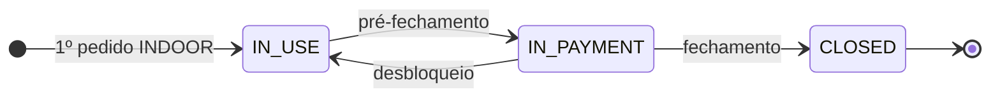
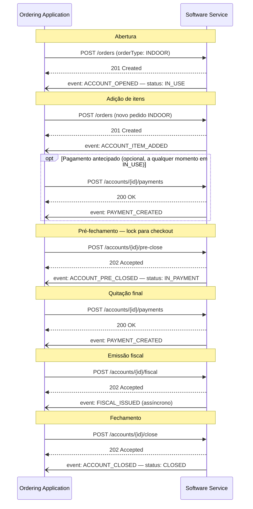
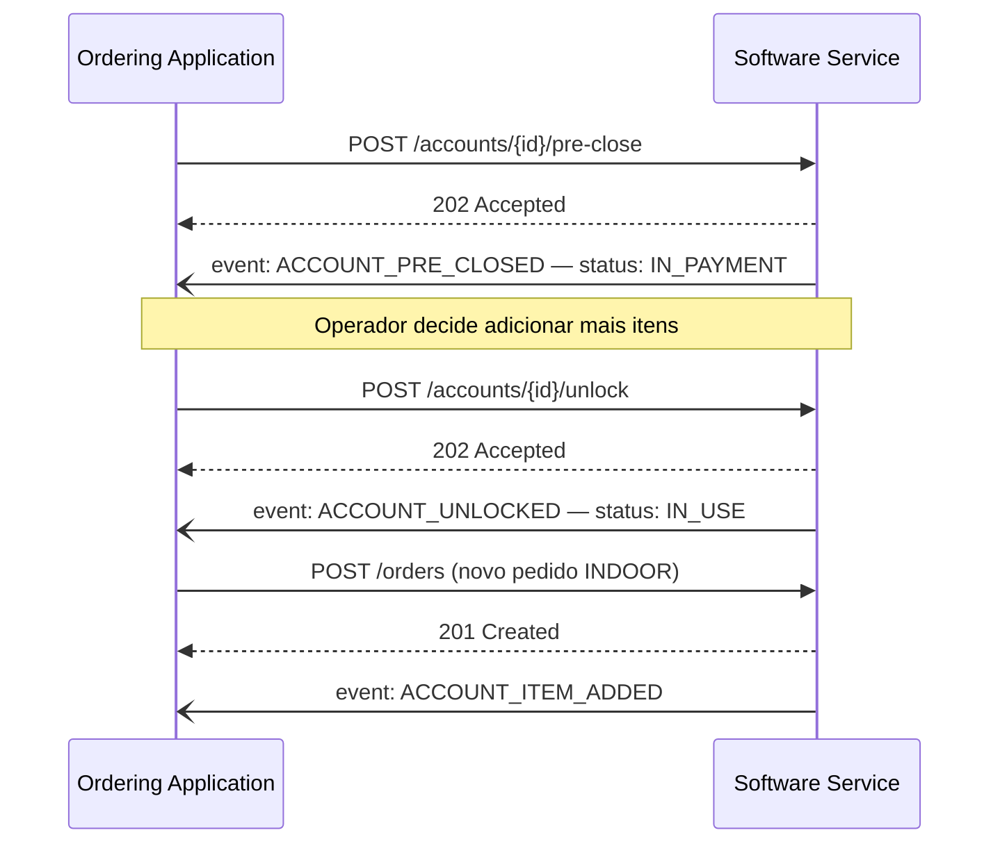
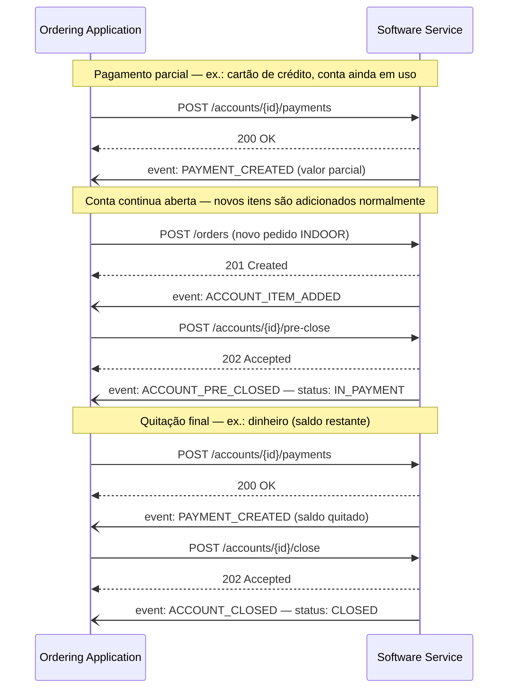
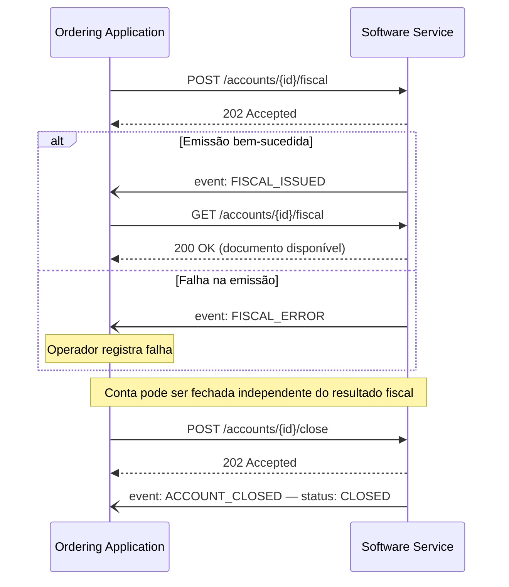
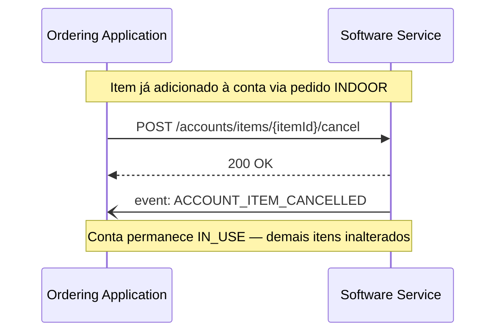
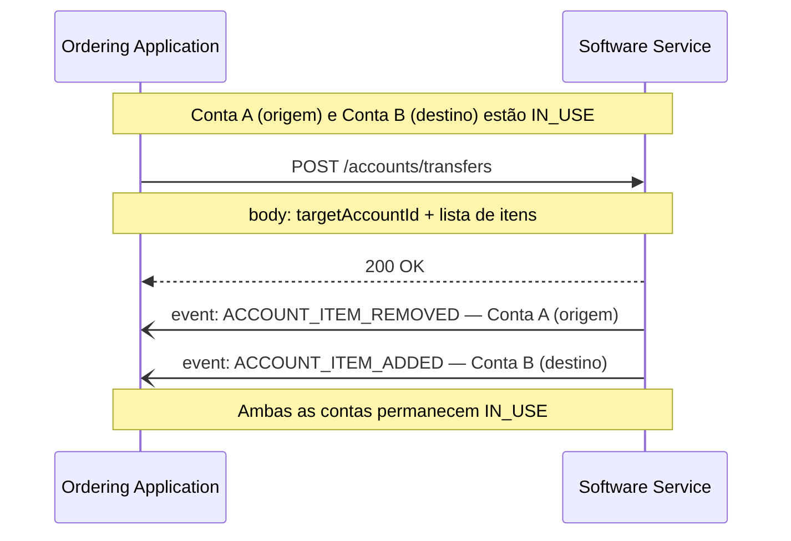

# Indoor / Salão

  Extensão
  indoor
  pai: Orders
  Novo na V2

  
Regras e fluxos nesta página. Contrato HTTP na referência OpenAPI.

  <a href="../reference/indoor/">Abrir referência OpenAPI →</a>

A capability **Indoor** padroniza as operações de consumo no local — mesa, comanda e balcão — cobrindo tanto atendimento mediado por garçom quanto **autoatendimento completo** via totem, QR Code ou tablet. Ela cobre o ciclo completo de uma sessão de salão: agrupar os pedidos numa **conta**, registrar pagamentos (inclusive parciais), emitir documento fiscal e fechar a conta — tudo sincronizado entre o sistema de gestão do restaurante e a aplicação de pedido.

Esta página explica o que é a capability, os conceitos que você precisa dominar, os fluxos de interação e como implementar cada lado. As regras normativas e a referência completa de campos estão na [spec da API Indoor](../reference/indoor.md).

---

## Para que serve

No delivery tradicional, um pedido nasce e morre como uma unidade isolada: é criado, preparado, entregue, encerrado. No salão a realidade é outra. Uma conta abre — numa mesa, numa comanda ou num balcão de autoatendimento — e recebe **vários pedidos ao longo do tempo**, possivelmente vindos de canais diferentes (garçom com tablet, cliente pelo QR Code, totem). Itens são cancelados ou transferidos para outra conta, o total é dividido, pago em partes, e só então a conta é fechada com emissão fiscal.

Sem um padrão, cada integração entre PDV e aplicação de salão precisava negociar bilateralmente como representar esse acúmulo: onde fica o total, como cancelar um item sem cancelar o pedido inteiro, quando emitir a nota, como tratar pagamento parcial. O Indoor elimina essa negociação ao definir a **conta** como entidade central e um conjunto fixo de operações e eventos sobre ela.

---

## Pré-requisito: protocolo de Orders

!!! warning "Indoor é uma extensão de Orders, não uma capability autônoma"
    Esta capability pressupõe que ambas as partes já implementaram o **protocolo de Orders** do Open Delivery. Um pedido indoor (`orderType: INDOOR`) trafega pelo mesmo ciclo de vida e pelos mesmos mecanismos de evento de qualquer outro pedido. O Indoor adiciona, sobre esse fluxo base, a gestão da conta de salão.

    Implementações que não possuem o protocolo de Orders ativo não podem usar esta capability.

O pedido é o **canal de entrada de itens**; a conta é o **agrupador operacional** desses pedidos para fins de pagamento, fechamento e integração fiscal.

---

## Os dois lados da integração

| Papel | Responsabilidade |
|---|---|
| **Software Service** | Sistema de gestão do restaurante. **Hospeda e implementa** todos os endpoints desta spec e **emite** os eventos do ciclo de vida da conta. |
| **Ordering Application** | Aplicação de pedido (totem, tablet do garçom, app do cliente, frente de caixa). **Consome** os endpoints e **recebe** os eventos via webhook para manter-se sincronizada. |

Em todas as operações desta capability o Software Service é o servidor e a Ordering Application é o cliente.

---

## Conceitos-chave

### A conta (Account)

A **conta** é o agrupador de todos os pedidos, itens, pagamentos e documentos fiscais de uma sessão de consumo. Cada conta é localizada por uma **chave operacional** — a combinação `operationMode` + `identifier`:

| `operationMode` | Significado | Exemplo de `identifier` |
|---|---|---|
| `TABLE` | Atendimento por mesa | `"5"` (mesa 5) |
| `TAB` | Atendimento por comanda | `"A-102"` |
| `COUNTER` | Consumo no balcão | `"3"` (posição 3) |

Além da chave operacional, a conta pode ter um `accountId` interno do PDV. A consulta primária é feita pela chave operacional (`GET /accounts?operationMode=TABLE&identifier=5`); quando o `accountId` já é conhecido, há também `GET /accounts/{accountId}`. A conta sempre traz um campo `lastEvent` com o **tipo** do último evento emitido (ex.: `ACCOUNT_ITEM_ADDED`) — útil para sincronização e depuração quando a entrega do webhook é incerta (ex.: após reconexão).

### Canais de origem (originChannel)

O `operationMode` define como a conta é **agrupada** — mas não diz por onde o pedido **entrou**. Essa informação é do `originChannel`, presente em cada pedido, e é aqui que fica explícito que o Indoor não pressupõe atendimento mediado por garçom:

| `originChannel.type` | Descrição |
|---|---|
| `TOTEM` | Autoatendimento em totem físico no estabelecimento. |
| `QR_CODE` | Cliente escaneia um QR Code na mesa/comanda e pede pelo próprio celular. |
| `CUSTOMER_TABLET` | Tablet entregue ao cliente para pedir diretamente, sem intermediário. |
| `WAITER_TABLET` | Tablet usado pelo garçom/atendente para lançar o pedido. |
| `FRONT_DESK` | Pedido lançado na frente de caixa. |
| `POS` | Pedido originado diretamente no sistema de ponto de venda. |
| `APP` | App de pedido do estabelecimento ou de terceiros. |
| `WHATSAPP` | Pedido recebido via WhatsApp. |
| `OTHER` | Qualquer outro canal não listado. |

`operationMode` e `originChannel` são independentes: uma mesma conta pode acumular pedidos de **canais diferentes** ao longo da sessão. Por exemplo, o cliente abre a conta pelo QR Code (`originChannel: QR_CODE`) e, depois, o garçom lança um item adicional pelo tablet (`originChannel: WAITER_TABLET`) — ambos os pedidos caem na mesma conta porque compartilham a chave operacional (`operationMode` + `identifier`). O canal é só um metadado do pedido, não afeta a identidade da conta.

### Como a conta nasce

A conta **não é criada por nenhum endpoint desta spec**. Ela nasce automaticamente no Software Service quando o protocolo de Orders processa um pedido com `orderType: INDOOR` para uma chave operacional que ainda não tem conta aberta — seja esse pedido originado por um garçom, um totem ou um QR Code. A partir daí, novos pedidos INDOOR para a mesma chave **acumulam itens** na conta existente, independente do canal de origem de cada um.

### Status da conta

| Status | Significado |
|---|---|
| `IN_USE` | Conta aberta, aceitando novos itens. Pagamentos também podem ser registrados aqui. |
| `IN_PAYMENT` | Conta pré-fechada/bloqueada — não aceita novos itens, mas continua aceitando pagamentos, aguardando o fechamento. |
| `CLOSED` | Conta fechada definitivamente. Nenhuma operação adicional é aceita. |

### Pagamentos e fechamento

Este é o ponto que mais gera confusão em integrações Indoor, então vale destacar com cuidado:

**Pagamento não depende de pré-fechamento.** `POST /accounts/payments` pode ser chamado a qualquer momento — com a conta `IN_USE` ou já `IN_PAYMENT`. Não é preciso esperar o pré-fechamento para registrar um pagamento parcial: muitos estabelecimentos recebem pagamentos ao longo da sessão (ex.: o cliente paga uma rodada de bebidas no meio do consumo).

**Pré-fechamento é um lock, não um gatilho de pagamento.** `POST /accounts/pre-close` bloqueia novos itens, sinalizando que a conta está pronta para o checkout final. É o momento em que se espera o **último pagamento** — o saldo restante, se já houve pagamentos anteriores, ou o valor total, se nenhum pagamento foi feito até então.

**Fechamento é definitivo.** `POST /accounts/close` só deve ser chamado quando o total pago cobrir o valor da conta. Após o fechamento, **nenhuma operação adicional é aceita** — incluindo novos pagamentos.

| Operação | `IN_USE` | `IN_PAYMENT` |
|---|---|---|
| Adicionar itens (via Orders) | ✅ | ❌ |
| Cancelar item | ✅ | ❌ |
| Transferir itens | ✅ | ❌ |
| **Registrar pagamento** (`POST /accounts/payments`) | ✅ | ✅ |
| Pré-fechar (`pre-close`) | ✅ | — |
| Desbloquear (`unlock`) | — | ✅ |
| Fechar (`close`) | ❌ | ✅ |

Pagamento é, propositalmente, a única operação válida nos dois estados — é o que permite cobrar o cliente sem travar o resto da operação da conta.

### Eventos

A cada transição relevante, o Software Service **DEVE** notificar a Ordering Application via webhook. Não há polling para eventos Indoor: a entrega é **exclusivamente via webhook**, e a Ordering Application deve implementar um endpoint compatível com o contrato `accountEvent` da spec para recebê-los.

#### Matriz de eventos da conta {#matriz-de-eventos-da-conta}

  MUST emitir no fluxo core
  MAY conforme cenário
  Status da conta após o evento (quando aplicável)

| Evento | Gatilho | Obrigatoriedade | Status da conta | Observações |
|---|---|---|---|---|
| `ACCOUNT_OPENED` | Conta criada (pedido INDOOR) | MUST | `IN_USE` | Abertura da sessão de salão |
| `ACCOUNT_ITEM_ADDED` | Novo pedido INDOOR adiciona itens | MUST | `IN_USE` | Pedido é canal de itens |
| `ACCOUNT_ITEM_REMOVED` | Itens transferidos para outra conta | MAY | `IN_USE` | Transferência entre mesas/comandas |
| `ACCOUNT_ITEM_CANCELLED` | Item cancelado | MUST | `IN_USE` | Cancelamento de item, não da conta |
| `PAYMENT_CREATED` | Pagamento lançado | MUST | — | Válido em `IN_USE` e `IN_PAYMENT` |
| `ACCOUNT_PRE_CLOSED` | Conta bloqueada para pagamento | MUST | `IN_PAYMENT` | Lock — sem novos itens |
| `ACCOUNT_UNLOCKED` | Bloqueio revertido | MAY | `IN_USE` | Reabre para novos itens |
| `FISCAL_ISSUED` | Documento fiscal emitido | MUST | — | Assíncrono; GET como fallback |
| `FISCAL_ERROR` | Falha na emissão fiscal | MUST | — | Assíncrono; conta pode fechar mesmo assim |
| `ACCOUNT_CLOSED` | Conta fechada definitivamente | MUST | `CLOSED` | Irreversível |

!!! tip "Pedidos Indoor vs conta"
    O ciclo de vida do **pedido** INDOOR (CREATED → CONFIRMED → …) está na [matriz Orders — perfil INDOOR](orders.md#perfil-indoor). A matriz acima é só da **conta** (Account).

---

## Fluxos

Os fluxos abaixo mostram a sequência de chamadas entre a Ordering Application e o Software Service, e os eventos emitidos em cada passo.

### Fluxo normal

Ciclo completo de uma sessão de salão: abertura via pedido INDOOR, adição de itens, pré-fechamento, pagamento, emissão fiscal e fechamento.

### Desbloqueio (unlock)

A Ordering Application pode reverter um pré-fechamento, devolvendo a conta ao estado `IN_USE` para continuar adicionando itens.

### Pagamentos parciais

Uma conta pode receber múltiplos pagamentos ao longo de toda a sua vida útil, não apenas após o pré-fechamento — inclusive intercalados com a inclusão de novos itens, já que pagamento e itens não competem pelo mesmo lock. O exemplo abaixo mostra um pagamento parcial registrado ainda em `IN_USE` (ex.: o cliente paga uma rodada de bebidas no meio do consumo), seguido da inclusão de mais itens, e só então o pré-fechamento e a quitação final.

### Emissão fiscal

A emissão é **assíncrona** — o Software Service retorna `202 Accepted` e emite o evento quando o documento fica disponível. A conta pode ser fechada mesmo sem emissão bem-sucedida.

### Cancelamento de item

Cancela um item específico dentro de uma conta `IN_USE`. A conta permanece aberta e os demais itens não são afetados.

### Transferência entre contas

Move itens de uma conta para outra — ex.: mesa muda de lugar, grupos se separam, ou um pedido de balcão é remanejado para uma comanda. Ambas as contas devem estar `IN_USE`.

---

## Implementando o Software Service

Se você hospeda os endpoints e gerencia as contas, atente para:

**Abra a conta na recepção do primeiro pedido INDOOR.** Quando o protocolo de Orders processar um pedido `orderType: INDOOR` para uma chave operacional sem conta ativa, crie a conta e emita `ACCOUNT_OPENED`. Pedidos seguintes para a mesma chave acumulam itens (`ACCOUNT_ITEM_ADDED`) em vez de abrir uma conta nova.

**Emita um evento para cada transição.** Toda mudança de estado relevante precisa gerar o evento correspondente, notificado via webhook (`accountEvent`). A Ordering Application depende exclusivamente desses eventos para se sincronizar — uma transição sem evento é uma transição invisível. Não há fallback de polling: se o webhook falhar, use o campo `lastEvent` da conta para reconciliar o estado.

**Trate o pré-fechamento como um bloqueio real — mas só para itens.** Uma conta `IN_PAYMENT` não deve aceitar novos itens. Se o operador precisar adicionar algo, exija o `unlock` explícito (`ACCOUNT_UNLOCKED`, volta a `IN_USE`). **Pagamento não entra nesse bloqueio**: `POST /accounts/{id}/payments` deve continuar sendo aceito tanto em `IN_USE` quanto em `IN_PAYMENT`, a qualquer momento — não exija pré-fechamento como condição para registrar um pagamento.

**Valide o pagamento antes de fechar, não antes de pagar.** Acumule os `PAYMENT_CREATED` ao longo de toda a vida da conta e só aceite `POST /accounts/{id}/close` quando o total quitado cobrir o valor da conta — salvo regras de negócio próprias (cortesia, desconto). Após o fechamento, rejeite qualquer operação adicional, incluindo novos pagamentos: `close` é o único marco realmente irreversível do ciclo de vida.

**Faça a emissão fiscal assíncrona.** Responda `202 Accepted` imediatamente e emita `FISCAL_ISSUED` ou `FISCAL_ERROR` quando o resultado estiver disponível. Não bloqueie o fechamento da conta esperando a SEFAZ.

**Mantenha os totais consistentes.** Cancelamentos, transferências e novos pedidos precisam refletir imediatamente em `totals`, já que a Ordering Application exibe esse valor ao cliente.

---

## Implementando a Ordering Application

Se você consome os endpoints e exibe a conta ao operador ou cliente, atente para:

**Localize a conta pela chave operacional.** Use `GET /accounts?operationMode=...&identifier=...` como forma primária de acesso. Só use `GET /accounts/{accountId}` quando já tiver o `accountId` retornado anteriormente.

**Receba eventos via webhook.** O Indoor não tem polling: implemente o endpoint de webhook (conforme o contrato `accountEvent` da spec) para receber `ACCOUNT_ITEM_ADDED`, `PAYMENT_CREATED`, `FISCAL_ISSUED` etc. em tempo real e atualizar a tela. Use o `lastEvent` da conta para reconciliar o estado caso suspeite de entrega perdida.

**Não espere o pré-fechamento para lançar um pagamento.** `POST /accounts/{id}/payments` funciona com a conta `IN_USE` ou `IN_PAYMENT` — use-o sempre que o cliente quiser pagar, mesmo no meio do consumo. Reserve o `pre-close` para o momento em que a conta deve parar de aceitar novos itens.

**Não assuma fechamento imediato após o pagamento.** Pagamento e fechamento são passos distintos. Lance os pagamentos com `POST /accounts/{id}/payments` e só então chame `POST /accounts/{id}/close` — tipicamente após o `pre-close`, quando o saldo restante (ou total, se nenhum pagamento anterior existiu) é quitado.

**Trate a emissão fiscal como assíncrona.** Após `202 Accepted`, aguarde o evento `FISCAL_ISSUED` (ou `FISCAL_ERROR`) — não espere o documento na resposta da requisição. Consulte `GET /accounts/{id}/fiscal` quando o evento chegar.

**Reflita cancelamentos e transferências na hora.** Ao receber `ACCOUNT_ITEM_CANCELLED` ou `ACCOUNT_ITEM_REMOVED`/`ACCOUNT_ITEM_ADDED`, atualize a conta exibida — o cliente não pode ver itens que já saíram da conta.

---

!!! tip "Checklist — Software Service"
    - Conta criada e `ACCOUNT_OPENED` emitido na recepção do 1º pedido INDOOR.
    - Todas as transições de estado emitem o evento correspondente.
    - Conta `IN_PAYMENT` rejeita novos itens até o `unlock`.
    - Pagamento (`POST /accounts/payments`) é aceito em `IN_USE` **e** `IN_PAYMENT`, sem depender de pré-fechamento.
    - Total quitado é validado antes de aceitar o fechamento.
    - Após `close`, toda operação adicional é rejeitada — incluindo novos pagamentos.
    - Emissão fiscal responde `202` e emite `FISCAL_ISSUED` / `FISCAL_ERROR` depois.
    - `totals` refletem cancelamentos e transferências imediatamente.

!!! tip "Checklist — Ordering Application"
    - Conta localizada pela chave operacional (`operationMode` + `identifier`).
    - Endpoint de webhook implementado e registrado para receber eventos (sem polling).
    - Pagamentos podem ser lançados a qualquer momento (`IN_USE` ou `IN_PAYMENT`), não só após o pré-fechamento.
    - Pagamento e fechamento tratados como passos separados.
    - Emissão fiscal tratada como assíncrona (aguarda o evento).
    - Cancelamentos e transferências refletidos na interface em tempo real.

---

**Referência completa de campos e regras normativas:** [API Indoor →](../reference/indoor.md)

---

  
Próximo passo

  

    <a href="../reference/indoor/">Abrir referência OpenAPI</a>
    <a href="orders/">Protocolo Orders</a>
  

