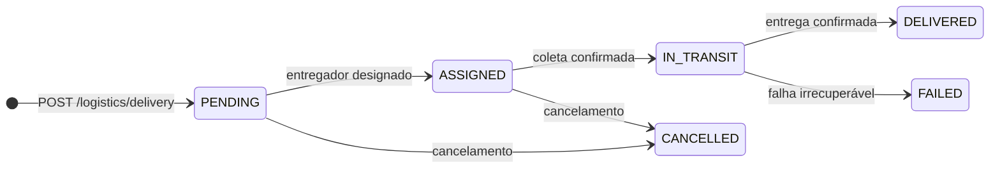

# Logística

<p class="od-meta">
 <span class="od-badge od-badge--core">Capability</span>
 <span class="od-badge od-badge--code">logistics</span>
</p>

!!! note "Especificação da API"
    O contrato implementável (endpoints, campos, erros e exemplos) está na **[especificação de Logistics](../reference/logistics.md)** — somente em inglês.

## Visão Geral

A capability **Logística** define os primitivos de coordenação de entrega vinculados a um contexto de pedido. Ela conecta a Ordering Application ou o Software Service à Plataforma de Logística que executará ou orquestrará a entrega.

Esta capability cobre:

- Consulta de disponibilidade e cotação de entrega
- Criação e acompanhamento de uma entrega
- Progressão do status (despacho, coleta, trânsito, entrega)
- Reporte de problemas com preservação de histórico
- Cancelamento explícito e auditável

Esta capability **não** cobre:

- Ciclo de vida do pedido (capability Orders)
- Publicação de catálogo (capability Merchant)
- Relacionamento com cliente e CRM (capability Customer)

!!! note "Chamada repetida no ciclo da entrega"
    Se a operação **já foi aplicada** (entrega já no estado alvo), o host **retorna `202`** — não `422`/`409` só por duplicidade. Ver [Convenções](../reference/conventions.md#duplicidade-de-operacoes-de-ciclo-de-vida) e [especificação Logistics](../reference/logistics.md).

---

## Papéis

| Papel | Responsabilidade |
|---|---|
| **Delivery Platform** | Executa ou orquestra a entrega. Expõe as interfaces de disponibilidade, despacho, rastreamento e cancelamento. |
| **Software Service** | Disponibiliza contexto operacional do estabelecimento (endereço, horário, readiness). Consome progressão e eventos de entrega. |
| **Ordering Application** | Origina a demanda de entrega e acompanha o status. Consome atualizações de rastreamento e ETA. |

Em todas as operações desta capability, a **Delivery Platform é o Provider** das interfaces; os demais papéis são Consumers.

---

## Modelo de dados

### Entidade Delivery

| Campo | Tipo | Obrigatório | Descrição |
|---|---|---|---|
| `id` | string | SIM | Identificador único da entrega |
| `orderId` | string | SIM | Identificador do pedido — referência compartilhada entre as partes |
| `status` | string (enum) | SIM | Status atual da entrega |
| `merchant` | object | SIM | Estabelecimento de origem (endereço, contato) |
| `pickup` | object | SIM | Contexto de coleta (endereço, contato) |
| `dropoff` | object | SIM | Contexto de entrega (endereço, contato) |
| `courier` | object | NÃO | Informações do entregador (nome, telefone, veículo, rastreamento) |
| `price` | object | NÃO | Custo da entrega (valor, moeda) |
| `eta` | string | NÃO | Estimativa de tempo de entrega (ISO 8601 date-time) |
| `trackingUrl` | string | NÃO | URL de rastreamento em tempo real |

### Ciclo de vida da entrega



| Status | Significado |
|---|---|
| `PENDING` | Entrega criada, aguardando designação de entregador |
| `ASSIGNED` | Entregador designado, a caminho da coleta |
| `IN_TRANSIT` | Item coletado, em trânsito para o endereço de entrega |
| `DELIVERED` | Entrega concluída |
| `CANCELLED` | Entrega cancelada (antes da coleta) |
| `FAILED` | Falha irrecuperável após coleta iniciada |

---

## Fluxo principal

### 1. Verificar disponibilidade e obter cotação

Antes de criar uma entrega, o Consumer DEVE verificar se a Delivery Platform cobre o par origem/destino e obter a cotação:

```
POST /logistics/availability
```

A resposta inclui `available: true/false`, a cotação de preço e o tempo estimado. Se `available: false`, o Consumer DEVE **não** criar a entrega com esta plataforma e tentar outra (se declarada no discovery).

### 2. Criar a entrega

```
POST /logistics/delivery
```

Retorna `202 Accepted`. A entrega é criada em status `PENDING`. O `orderId` é o identificador compartilhado que as partes usam para correlacionar a entrega com o pedido de negócio — não pressupõe que a capability Orders esteja implementada.

A Delivery Platform DEVE associar o `orderId` ao registro interno de entrega. Este vínculo é permanente e DEVE ser preservado em todos os eventos subsequentes.

### 3. Acompanhar a progressão

O Consumer consulta o status atual via:

```
GET /logistics/delivery/{orderId}
```

Ou recebe atualizações assíncronas via eventos (push), se declarado no discovery.

### 4. Sinalizar prontidão para coleta

Quando o pedido está pronto para ser coletado pelo entregador, o Software Service ou Ordering Application notifica a Delivery Platform:

```
POST /logistics/delivery/{orderId}/ready-for-pickup
```

### 5. Confirmar coleta

A Delivery Platform confirma que o entregador coletou o pedido:

```
POST /logistics/delivery/{orderId}/collected
```

A entrega transita para `IN_TRANSIT`.

### 6. Confirmar entrega

A Delivery Platform confirma que o pedido chegou ao cliente:

```
POST /logistics/delivery/{orderId}/delivered
```

A entrega transita para `DELIVERED`.

---

## Problemas durante a entrega

Incidentes (endereço não encontrado, cliente ausente, problema no veículo) são reportados sem encerrar a entrega:

```
POST /logistics/delivery/{orderId}/problem
```

O reporte de problema DEVE preservar o histórico de ocorrências — cada chamada adiciona uma entrada, não substitui as anteriores. O status da entrega permanece `IN_TRANSIT` exceto se o problema for irrecuperável (`FAILED`).

---

## Cancelamento

O cancelamento é explícito e auditável:

```
POST /logistics/delivery/{orderId}/cancel
```

O cancelamento DEVE ser possível nos status `PENDING` e `ASSIGNED`. Em `IN_TRANSIT`, o cancelamento pode ser rejeitado pela Delivery Platform com `422 Unprocessable Entity` — neste caso, o Consumer deve tratar a situação como falha e acionar suporte.

---

## Discovery

Participantes que expõem a capability Logística DEVEM declarar `logistics` no documento well-known.

```json
"capabilities": {
 "logistics": {
 "baseUrl": "https://api.example.com",
 "operations": ["availability", "delivery", "tracking"],
 "trackingMode": "push"
 }
}
```

O campo `trackingMode` DEVE ser `push` (eventos assíncronos) ou `pull` (polling via GET). A Ordering Application DEVE adaptar sua estratégia de acompanhamento conforme o modo declarado.

---

## Autorização

Todas as operações da capability Logística exigem autenticação Bearer (OAuth 2.0) com credenciais geradas **por aplicação** (não por estabelecimento).

Escopos mínimos recomendados:

| Escopo | Operações |
|---|---|
| `logistics.read` | Consulta de disponibilidade e status |
| `logistics.write` | Criação e progressão de entregas |
| `logistics.events.write` | Emissão de eventos de entrega |

---

## Regras normativas

**A Delivery Platform DEVE:**

- Retornar `202 Accepted` para todas as operações de mutação
- Preservar o `orderId` em todos os eventos emitidos
- Manter histórico de problemas — cada `POST /problem` adiciona uma entrada
- Responder `422 Unprocessable Entity` para transições de estado inválidas
- Declarar `trackingMode` no discovery

**O Consumer (Ordering Application ou Software Service) DEVE:**

- Verificar disponibilidade (`POST /logistics/availability`) antes de criar uma entrega
- Tratar `202 Accepted` como confirmação de recebimento, não de execução
- Implementar estratégia de acompanhamento compatível com o `trackingMode` declarado
- Cancelar a entrega explicitamente antes de cancelar o pedido correspondente

<div class="od-related">
  <p class="od-related__label">Relacionado</p>
  <ul class="od-related__list">
    <li><a href="../reference/logistics.md">Especificação de Logistics</a> — endpoints e eventos</li>
    <li><a href="orders.md">Orders</a> — status do pedido vs tracking</li>
    <li><a href="../reference/orders.md">Especificação de Orders</a></li>
    <li><a href="../reference/conventions.md">Regras gerais</a></li>
  </ul>
</div>
