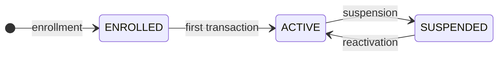
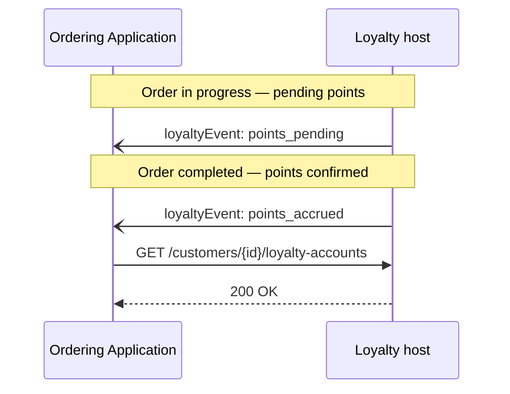
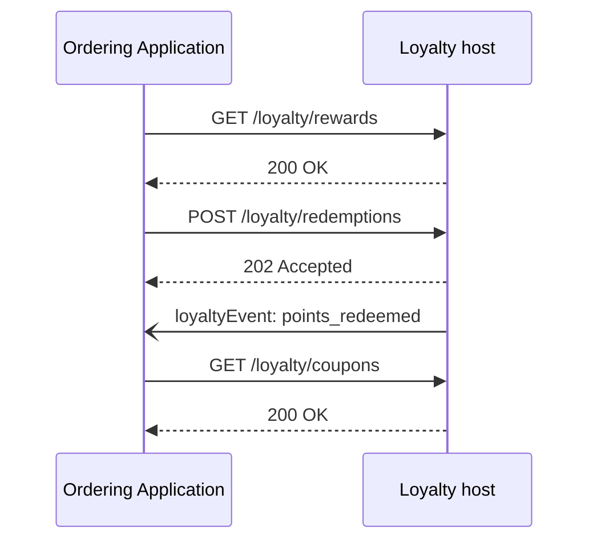
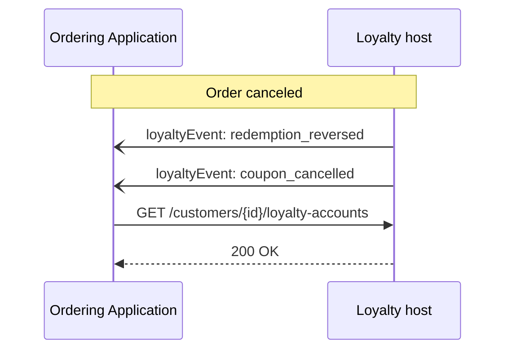

# Loyalty

<p class="od-meta">
 <span class="od-badge od-badge--core">Module</span>
 <span class="od-badge od-badge--code">customer · loyalty</span>
 <span class="od-badge">parent: Customer</span>
 <span class="od-badge od-badge--new">New in V2</span>
</p>

!!! note "API Spec"
    The implementable contract is in the **[Customer API Spec](../reference/customer.md)** (Loyalty tags) — English only.

**Loyalty** is a **module** of the [Customer](customer.md) capability — not a Discovery extension and not a separate capability.

Parties MAY implement **only** the loyalty endpoints of this capability, without Reviews and without full leads/order sync. In Discovery, declare those operations under `customer`. Loyalty engines and **Software CRM** with a points module are typical hosts.

---

## What it is for

Standardizes **loyalty** interoperability: balance lookup, accrual tied to orders, redemptions, coupons, and transaction history — between the Ordering Application and the Loyalty host.

Without a standard, each integration negotiated account identity, accrual timing, partial redemptions, and reverse-on-cancel behavior.

!!! info "What Loyalty does NOT standardize"
    Program business rules — earn rates, tiers, expiry, campaign eligibility — stay in each implementation.

---

## Roles

| Role | Responsibility |
|---|---|
| **Loyalty host** (Software CRM / loyalty engine) | **Hosts** balance, transactions, rewards, redemptions, and coupons. **Emits** loyalty events. |
| **Ordering Application** | **Consumes** interfaces to show balance, apply coupons at checkout, and confirm redemptions. |

For this module’s operations, the Loyalty host is typically the server and the Ordering Application the client.

---

## Key concepts

### Loyalty account

Aggregates balance and history for a customer in a program. A customer MAY have accounts in multiple programs.

| Field | Description |
|---|---|
| `customerId` | Customer reference |
| `programId` | Loyalty program |
| `summary.pointsAvailable` | Available balance |
| `summary.pointsPending` | Points awaiting confirmation |
| `summary.pointsExpiringSoon` | Points nearing expiry |

### Account status



| Status | Meaning |
|---|---|
| `ENROLLED` | Enrolled, no movement yet |
| `ACTIVE` | Accrual and redemptions enabled |
| `SUSPENDED` | Movement operations blocked |

| Operation | `ENROLLED` | `ACTIVE` | `SUSPENDED` |
|---|---|---|---|
| Read balance | ✅ | ✅ | ✅ |
| Earn | MAY | ✅ | MUST NOT |
| Redeem | MAY | ✅ | MUST NOT |
| Use coupon | MAY | ✅ | MUST NOT |

### Transaction types

| Type | When |
|---|---|
| `earn` | Accrual after completed order |
| `burn` | Points spent on redemption |
| `expire` | Expiry |
| `adjust` | Manual adjustment |

### Coupons

Benefit from redemption (or other source): code, type (`discount`, `free_item`, `cashback`), status (`available`, `applied`, `used`, `expired`, `cancelled`).

### Events

| Event | Trigger |
|---|---|
| `loyalty.account_linked` | Account linked |
| `loyalty.points_accrued` | Points confirmed |
| `loyalty.points_pending` | Points pending |
| `loyalty.points_expired` | Expiry |
| `loyalty.points_redeemed` | Redemption |
| `loyalty.redemption_reversed` | Redemption reversed |
| `loyalty.coupon_applied` / `loyalty.coupon_cancelled` | Coupon |

---

## Flows

### Accrual after order

Accrual is **async**: pending points while the order is open; confirmation after completion (relationship facts / Orders).



### Redemption



### Reverse on cancel



Spec operations: `listLoyaltyPrograms`, `listCustomerLoyaltyAccounts`, `getLoyaltyAccountById`, `listLoyaltyTransactions`, `listLoyaltyRewards`, `listLoyaltyCoupons`, `createLoyaltyRedemption`, webhook `receiveLoyaltyEvent`.

---

## Implementing the Loyalty host

**Async accrual.** Confirm `earn` after order completion; use pending for UI forecasts.

**Reverse on cancel.** Affected points and coupons must roll back.

**Validate balance on redemption.** Reject insufficient balance; never allow negative balance.

**Emit events** on every relevant movement.

**Declare operations in Discovery** under `customer`.

---

## Implementing the Ordering Application

**Separate pending vs available** points in the UI.

**Query coupons** before checkout.

**Associate coupon with the order** when applicable (relationship facts / Orders).

**Handle reverse webhooks** and `pointsExpiringSoon` alerts.

---

## Relation to other modules

| Module | Role |
|---|---|
| **Customer data** | Identity and `customerId` binding |
| **Reviews** | Ratings (independent of Loyalty) |
| **Loyalty** (this) | Loyalty and coupons |

Parties MAY implement **Loyalty only** among Customer modules.

---

## Discovery

```json
"capabilities": {
  "customer": {
    "endpoint": "https://api.example.com/od/v2",
    "supportedOperations": [
      "listCustomerLoyaltyAccounts",
      "listLoyaltyRewards",
      "createLoyaltyRedemption",
      "listLoyaltyCoupons"
    ]
  }
}
```

Do not declare `loyalty` as a separate capability or extension.

---

!!! tip "Checklist — Host"
    - Pending after create; `earn` after completion.
    - Cancel reverses points and coupons.
    - Balance validated on redemption.
    - Events per movement.
    - Operations under `customer` in Discovery.

!!! tip "Checklist — Ordering Application"
    - Pending vs available clear in UI.
    - Coupons checked at checkout.
    - Reverse webhook implemented.
    - Expiry alert when available.

<div class="od-related">
  <p class="od-related__label">Related</p>
  <ul class="od-related__list">
    <li><a href="../reference/customer.md">Customer API Spec</a></li>
    <li><a href="customer.md">Customer</a> — overview</li>
    <li><a href="reviews.md">Reviews</a></li>
    <li><a href="orders.md">Orders</a></li>
    <li><a href="discovery.md">Discovery</a></li>
  </ul>
</div>
