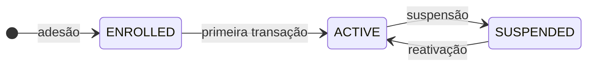
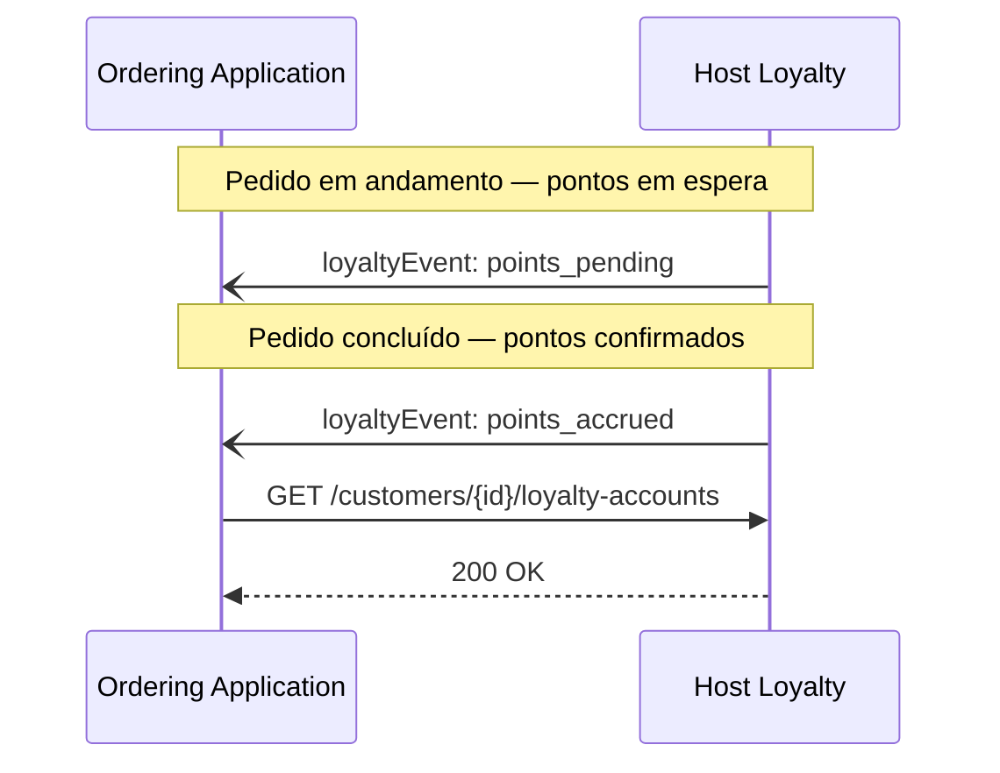
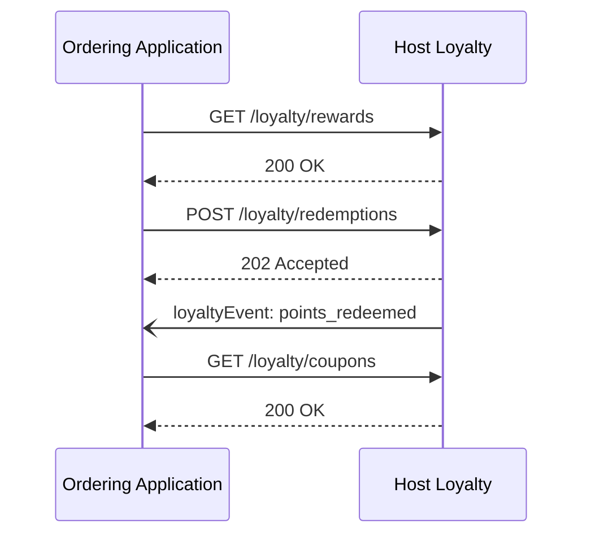
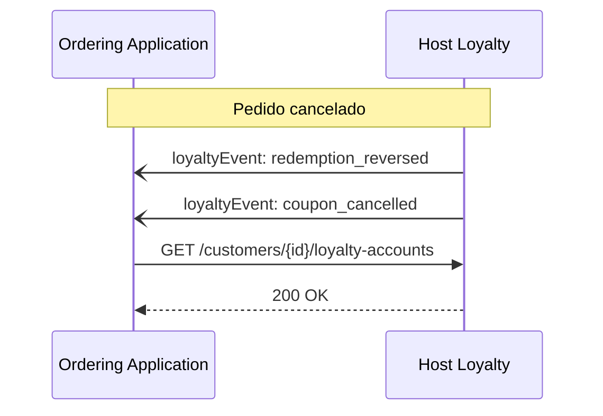

# Loyalty

<p class="od-meta">
 <span class="od-badge od-badge--core">Módulo</span>
 <span class="od-badge od-badge--code">customer · loyalty</span>
 <span class="od-badge">pai: Customer</span>
 <span class="od-badge od-badge--new">Novo na V2</span>
</p>

!!! note "Especificação da API"
    O contrato implementável está na **[especificação de Customer](../reference/customer.md)** (tags Loyalty) — somente em inglês.

**Loyalty** é um **módulo** da capability [Customer](customer.md) — não é extensão Discovery nem capability separada.

É permitido implementar **somente** os endpoints de fidelidade desta capability, sem Reviews e sem o núcleo completo de leads/pedidos. No Discovery, declare as operações sob `customer`. Softwares de fidelidade e **Software CRM** com módulo de pontos são os hosts típicos.

---

## Para que serve

Padroniza interoperabilidade de **fidelidade**: consulta de saldo, acúmulo vinculado a pedidos, resgates, cupons e histórico de transações — entre a Ordering Application e o host de Loyalty.

Sem um padrão, cada integração negociava identificação da conta, timing de acúmulo, resgates parciais e estorno em cancelamento.

!!! info "O que Loyalty NÃO padroniza"
    Regras internas de programa — taxa de acúmulo, tiers, expiração, elegibilidade de campanhas — ficam em cada implementação.

---

## Papéis

| Papel | Responsabilidade |
|---|---|
| **Host de Loyalty** (Software CRM / motor de fidelidade) | **Hospeda** saldo, transações, recompensas, resgates e cupons. **Emite** eventos de fidelidade. |
| **Ordering Application** | **Consome** as interfaces para exibir saldo, aplicar cupons no checkout e confirmar resgates. |

Nas operações deste módulo, o host de Loyalty é o servidor e a Ordering Application é o cliente (padrão típico).

---

## Conceitos-chave

### Conta de fidelidade

Agrega saldo e histórico de um cliente em um programa. Um cliente pode ter contas em múltiplos programas.

| Campo | Descrição |
|---|---|
| `customerId` | Referência ao cliente |
| `programId` | Programa de fidelidade |
| `summary.pointsAvailable` | Saldo disponível |
| `summary.pointsPending` | Pontos aguardando confirmação |
| `summary.pointsExpiringSoon` | Pontos próximos do vencimento |

### Status da conta



| Status | Significado |
|---|---|
| `ENROLLED` | Inscrito, sem movimentação |
| `ACTIVE` | Acúmulo e resgates habilitados |
| `SUSPENDED` | Operações de movimento bloqueadas |

| Operação | `ENROLLED` | `ACTIVE` | `SUSPENDED` |
|---|---|---|---|
| Ler saldo | ✅ | ✅ | ✅ |
| Acumular | MAY | ✅ | MUST NOT |
| Resgatar | MAY | ✅ | MUST NOT |
| Usar cupom | MAY | ✅ | MUST NOT |

### Tipos de transação

| Tipo | Quando |
|---|---|
| `earn` | Acúmulo após pedido concluído |
| `burn` | Baixa por resgate |
| `expire` | Expiração |
| `adjust` | Ajuste manual |

### Cupons

Benefício gerado por resgate (ou outra origem): código, tipo (`discount`, `free_item`, `cashback`) e status (`available`, `applied`, `used`, `expired`, `cancelled`).

### Eventos

| Evento | Gatilho |
|---|---|
| `loyalty.account_linked` | Conta vinculada |
| `loyalty.points_accrued` | Pontos confirmados |
| `loyalty.points_pending` | Pontos em espera |
| `loyalty.points_expired` | Expiração |
| `loyalty.points_redeemed` | Resgate |
| `loyalty.redemption_reversed` | Estorno de resgate |
| `loyalty.coupon_applied` / `loyalty.coupon_cancelled` | Cupom |

---

## Fluxos

### Acúmulo após pedido

Acúmulo é **assíncrono**: pontos pendentes após criação/andamento; confirmação após conclusão do pedido (fatos de relacionamento / Orders).



### Resgate



### Estorno por cancelamento



Operações na spec: `listLoyaltyPrograms`, `listCustomerLoyaltyAccounts`, `getLoyaltyAccountById`, `listLoyaltyTransactions`, `listLoyaltyRewards`, `listLoyaltyCoupons`, `createLoyaltyRedemption`, webhook `receiveLoyaltyEvent`.

---

## Implementando o host de Loyalty

**Acúmulo assíncrono.** Confirme `earn` após conclusão do pedido; use pendentes para previsão na UI.

**Estorne no cancelamento.** Pontos e cupons afetados devem reverter.

**Valide saldo no resgate.** Rejeite saldo insuficiente; nunca permita saldo negativo.

**Emita eventos** em cada movimentação relevante.

**Declare operações no Discovery** sob `customer`.

---

## Implementando a Ordering Application

**Separe pontos pendentes de disponíveis** na UI.

**Consulte cupons** antes do checkout.

**Associe cupom ao pedido** quando aplicável (fatos de relacionamento / Orders).

**Trate webhooks de estorno** e alertas de `pointsExpiringSoon`.

---

## Relação com outros módulos

| Módulo | Papel |
|---|---|
| **Dados do cliente** | Identidade e vínculo `customerId` |
| **Reviews** | Avaliações (independente de Loyalty) |
| **Loyalty** (este) | Fidelidade e cupons |

Pode-se implementar **só Loyalty** entre os módulos de Customer.

---

## Discovery

```json
"capabilities": {
  "customer": {
    "endpoint": "https://api.example.com/od/v2",
    "supportedOperations": [
      "listCustomerLoyaltyAccounts",
      "listLoyaltyRewards",
      "createLoyaltyRedemption",
      "listLoyaltyCoupons"
    ]
  }
}
```

Não declare `loyalty` como capability ou extensão separada.

---

!!! tip "Checklist — Host"
    - Pendente após criação; `earn` após conclusão.
    - Cancelamento reverte pontos e cupons.
    - Saldo validado no resgate.
    - Eventos por movimentação.
    - Operações sob `customer` no Discovery.

!!! tip "Checklist — Ordering Application"
    - Pendentes vs disponíveis claros na UI.
    - Cupons verificados no checkout.
    - Webhook de estorno implementado.
    - Alerta de expiração quando disponível.

<div class="od-related">
  <p class="od-related__label">Relacionado</p>
  <ul class="od-related__list">
    <li><a href="../reference/customer.md">Especificação de Customer</a></li>
    <li><a href="customer.md">Customer</a> — visão geral</li>
    <li><a href="reviews.md">Reviews</a></li>
    <li><a href="orders.md">Orders</a></li>
    <li><a href="discovery.md">Discovery</a></li>
  </ul>
</div>
