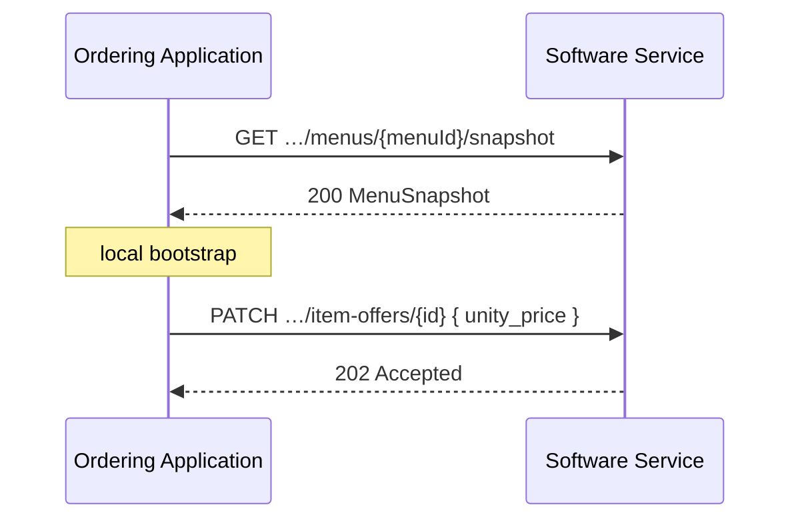

# Menus

<p class="od-meta">
 <span class="od-badge od-badge--core">Capability</span>
 <span class="od-badge od-badge--code">merchant</span>
 <span class="od-badge">Merchant · catalog</span>
</p>

!!! note "API Spec"
    The implementable contract is in the **[Merchant API Spec](../reference/merchant.md)** — English only.

!!! note "Part of Merchant"
    **Menus** and **[Store data](merchant-store.md)** make up the `merchant` capability (see [overview](merchant.md)). They are not Discovery extensions.

This page covers the **catalog**: menus, categories, item-offers, option-groups, and options. Services and pause: [Store data](merchant-store.md).

---

## Breaking V1 → V2 (catalog)

!!! important "End of monolithic merchantUpdate"
    In V1, catalog updates used the **`merchantUpdate` / `menuUpdated`** webhook with a full payload. In V2 the normative path is **CRUD per entity** + **`GET …/snapshot`** for bootstrap.

| Field / model | V1 | V2 |
|---|---|---|
| Publication | Monolithic webhook | CRUD + snapshot |
| `option_price` | Optional | **Required** (0 if free) |
| Option `subtotal` | Present / confusing | **Removed** |
| `unity_price` | Implicit | **Explicit** |
| `quantity_available` | — | **New** (operational) |

---

## Hierarchy

```
Merchant
├── Service (DELIVERY / TAKEOUT / INDOOR) → menuId
└── Menu
 └── Category
 └── ItemOffer
 └── OptionGroup (recursive)
 └── Option → OptionGroup…
```

A merchant may have **multiple menus**. Each [Service](merchant-store.md#serviço-service) may reference the active menu via `menuId`.

---

## Snapshot vs CRUD

| Scenario | Approach | operationId |
|---|---|---|
| Initial load / reconciliation | Full snapshot | `getMenuSnapshot` |
| List menus | Listing | `listMenus` |
| Price / name / availability | Entity PATCH/PUT | `updateItemOffer`, … |
| New item / category / option | POST | `createItemOffer`, `createCategory`, `createOption` |
| Removal | DELETE (async `202`) | `deleteItemOffer`, … |

```
GET /merchants/{merchantId}/menus/{menuId}/snapshot
```

The snapshot returns the hierarchy (categories → item-offers → option-groups → options). It is the practical replacement for the V1 “full menu” **for bootstrap**, not a return of the monolithic webhook.



---

## ItemOffer and pricing

| Field | Required | Notes |
|---|---|---|
| `unity_price` | YES | Base price in minor units |
| `quantity_available` | NO | **Operational** signal (e.g. 10 portions left). **Not** multi-channel stock. Omitted/`null` = no declared limit; `0` = unavailable |
| `status` | YES | `AVAILABLE` / `UNAVAILABLE` |
| `externalCode` | NO | POS internal code |

---

## OptionGroup and Option (recursive)

OptionGroups may nest (e.g. size → doneness → sauce). Real-world depth is usually 2–3 levels.

!!! important "`option_price` required in V2"
    Every `Option` MUST have `option_price`. No extra cost: `0`. V1 option `subtotal` is removed — on the order, use `unity_price` + sum of `option_price` (see [Orders](orders.md)).

---

## Operations map (catalog)

| Goal | operationId |
|---|---|
| List menus | `listMenus` |
| Snapshot | `getMenuSnapshot` |
| Categories | `listCategories` · `createCategory` · `replaceCategory` · `deleteCategory` |
| Item offers | `listItemOffers` · `createItemOffer` · `replaceItemOffer` · `updateItemOffer` · `deleteItemOffer` |
| Option groups | `listOptionGroups` · `createOptionGroup` · `replaceOptionGroup` · `deleteOptionGroup` |
| Options | `listOptions` · `createOption` · `replaceOption` · `deleteOption` |

---

## Sync model

Who is the **source of truth** for the catalog (POS vs originator) must be clear in Discovery and the commercial contract. The protocol:

- Does **not** reintroduce `merchantUpdate` as the V2 core path  
- Does **not** define a catalog-delta webhook in the MVP  
- Reconciliation: snapshot + CRUD  

Async mutations return **`202`**; synchronous creates may return **`201`** with a body.

---

## Checklists

!!! tip "Checklist — Ordering Application"
    - [ ] Bootstrap with snapshot  
    - [ ] Deltas via CRUD, not monolithic webhook  
    - [ ] Always expect `option_price`  
    - [ ] Treat `quantity_available` as a hint, not stock guarantee  

!!! tip "Checklist — Software Service"
    - [ ] Referential integrity menu → … → options  
    - [ ] `202` on async mutations  
    - [ ] No `merchantType` / no V1 option `subtotal`  

---

## Out of MVP

| Topic | Status |
|---|---|
| Catalog delta notification webhook | Not core-normative |
| Free-form custom fields | Out of MVP |
| Multi-channel stock control | Out of scope |

---

<div class="od-related">
  <p class="od-related__label">Related</p>
  <ul class="od-related__list">
    <li><a href="../reference/merchant.md">Merchant API Spec</a></li>
    <li><a href="merchant-store.md">Store data</a></li>
    <li><a href="merchant.md">Merchant overview</a></li>
    <li><a href="orders.md">Orders</a> — prices on the order</li>
  </ul>
</div>
