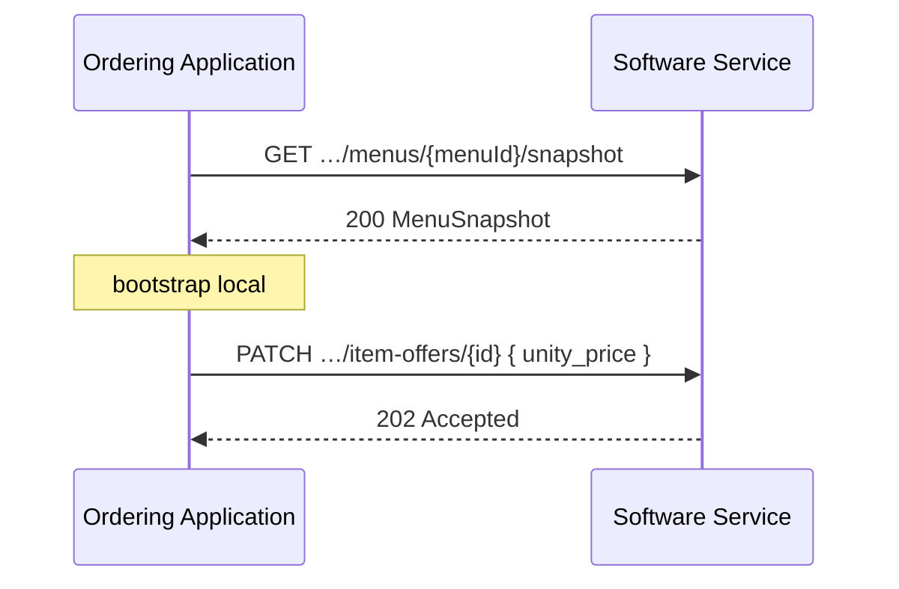

# Menus

<p class="od-meta">
 <span class="od-badge od-badge--core">Capability</span>
 <span class="od-badge od-badge--code">merchant</span>
 <span class="od-badge">Merchant · catálogo</span>
</p>

!!! note "Especificação da API"
    O contrato implementável está na **[especificação de Merchant](../reference/merchant.md)** — somente em inglês.

!!! note "Parte da capability Merchant"
    **Menus** e **[Dados da Loja](merchant-store.md)** compõem a capability `merchant` (ver [visão geral](merchant.md)). Não são extensões do Discovery.

Esta página cobre o **catálogo**: menus, categorias, item-offers, option-groups e opções. Services e pause: [Dados da Loja](merchant-store.md).

---

## Quebra V1 → V2 (cardápio)

!!! important "Fim do merchantUpdate monolítico"
    Na V1, atualização de cardápio era o webhook **`merchantUpdate` / `menuUpdated`** com payload completo. Na V2 o caminho normativo é **CRUD por entidade** + **`GET …/snapshot`** para bootstrap.

| Campo / modelo | V1 | V2 |
|---|---|---|
| Publicação | Webhook monolítico | CRUD + snapshot |
| `option_price` | Opcional | **Obrigatório** (0 se grátis) |
| `subtotal` em opções | Presente / confuso | **Removido** |
| `unity_price` | Implícito | **Explícito** |
| `quantity_available` | — | **Novo** (operacional) |

---

## Hierarquia

```
Merchant
├── Service (DELIVERY / TAKEOUT / INDOOR) → menuId
└── Menu
 └── Category
 └── ItemOffer
 └── OptionGroup (recursivo)
 └── Option → OptionGroup…
```

Um estabelecimento pode ter **múltiplos menus**. Cada [Service](merchant-store.md#serviço-service) pode referenciar o menu ativo via `menuId`.

---

## Snapshot vs CRUD

| Cenário | Abordagem | operationId |
|---|---|---|
| Carga inicial / reconciliação | Snapshot completo | `getMenuSnapshot` |
| Listar menus | Listagem | `listMenus` |
| Preço / nome / disponibilidade | PATCH/PUT da entidade | `updateItemOffer`, … |
| Novo item / categoria / opção | POST | `createItemOffer`, `createCategory`, `createOption` |
| Remoção | DELETE (async `202`) | `deleteItemOffer`, … |

```
GET /merchants/{merchantId}/menus/{menuId}/snapshot
```

O snapshot devolve a hierarquia (categorias → item-offers → option-groups → options). É o substituto prático do “cardápio completo” da V1 **para bootstrap**, não um retorno do webhook monolítico.



---

## ItemOffer e preços

| Campo | Obrigatório | Notas |
|---|---|---|
| `unity_price` | SIM | Preço base em unidades menores (centavos) |
| `quantity_available` | NÃO | Sinal **operacional** (ex.: 10 porções do prato do dia). **Não** é estoque multi-canal. `null`/omitido = sem limite declarado; `0` = indisponível |
| `status` | SIM | `AVAILABLE` / `UNAVAILABLE` |
| `externalCode` | NÃO | Código interno do PDV |

---

## OptionGroup e Option (recursivos)

OptionGroups podem aninhar (ex.: tamanho → ponto → molho). Uso real costuma ser 2–3 níveis.

!!! important "`option_price` obrigatório na V2"
    Todo `Option` DEVE ter `option_price`. Sem custo adicional: `0`. O campo `subtotal` de opções da V1 foi removido — no pedido, use `unity_price` + soma dos `option_price` (ver [Orders](orders.md)).

---

## Mapa de operações (catálogo)

| Objetivo | operationId |
|---|---|
| Listar menus | `listMenus` |
| Snapshot | `getMenuSnapshot` |
| Categorias | `listCategories` · `createCategory` · `replaceCategory` · `deleteCategory` |
| Item offers | `listItemOffers` · `createItemOffer` · `replaceItemOffer` · `updateItemOffer` · `deleteItemOffer` |
| Option groups | `listOptionGroups` · `createOptionGroup` · `replaceOptionGroup` · `deleteOptionGroup` |
| Options | `listOptions` · `createOption` · `replaceOption` · `deleteOption` |

---

## Sincronismo

Quem é **fonte da verdade** do catálogo (PDV vs originador) deve estar claro no Discovery e no contrato comercial. O protocolo:

- **Não** reintroduz `merchantUpdate` como caminho core V2  
- **Não** define webhook de delta de cardápio no MVP  
- Reconciliação: snapshot + CRUD  

Mutações assíncronas retornam **`202`**; creates síncronos podem retornar **`201`** com corpo.

---

## Checklists

!!! tip "Checklist — Ordering Application"
    - [ ] Bootstrap com snapshot  
    - [ ] Deltas via CRUD, não webhook monolítico  
    - [ ] `option_price` sempre presente no consumo  
    - [ ] `quantity_available` como dica, não garantia de estoque  

!!! tip "Checklist — Software Service"
    - [ ] Integridade referencial menu → … → options  
    - [ ] `202` em mutações assíncronas  
    - [ ] Sem `merchantType` / sem `subtotal` de opção V1  

---

## Fora do MVP

| Tema | Status |
|---|---|
| Webhook de notificação de delta de catálogo | Não normativo no core |
| Custom fields livres | Fora do MVP |
| Controle de estoque multi-canal | Fora de escopo |

---

<div class="od-related">
  <p class="od-related__label">Relacionado</p>
  <ul class="od-related__list">
    <li><a href="../reference/merchant.md">Especificação de Merchant</a></li>
    <li><a href="merchant-store.md">Dados da Loja</a></li>
    <li><a href="merchant.md">Merchant — visão geral</a></li>
    <li><a href="orders.md">Orders</a> — preços no pedido</li>
  </ul>
</div>
