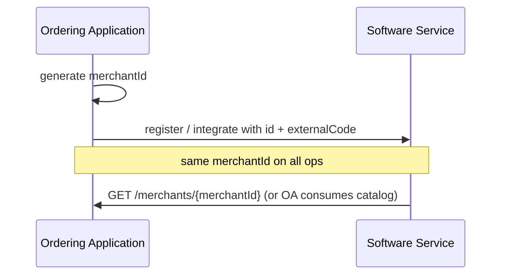
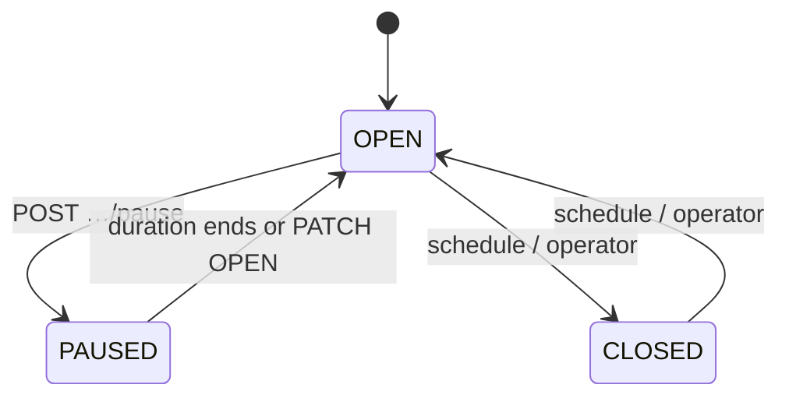
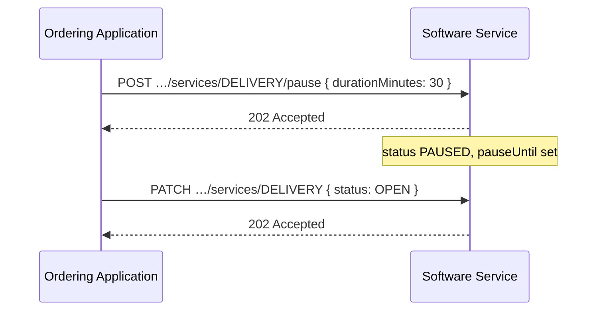

# Store data

<p class="od-meta">
 <span class="od-badge od-badge--core">Capability</span>
 <span class="od-badge od-badge--code">merchant</span>
 <span class="od-badge">Merchant · identity and services</span>
</p>

!!! note "API Spec"
    The implementable contract is in the **[Merchant API Spec](../reference/merchant.md)** — English only.

Part of the [Merchant](merchant.md) capability. **Catalog** is in [Menus](menu.md).

---

## Merchant ID — originator-generated

!!! important "Breaking change from V1"
    In V1, `merchantId` came from the Software Service (POS). In V2, `merchantId` is **generated by the Ordering Application** at onboarding. The POS keeps its own code in **`externalCode`**.



Rationale: no round-trip only to obtain an ID; deterministic reference from creation; simpler multi-platform reconciliation.

`merchantId` MUST be unique in the Ordering Application scope (UUID v4 recommended).

---

## Identity and basic info

Descriptive fields (name, address, contacts, logo, etc.) via:

| Goal | Operation |
|---|---|
| Read store | `GET /merchants/{merchantId}` |
| Partial update | `PATCH /merchants/{merchantId}` |
| List merchants for token | `GET /merchants` |

V1 `merchantType` **does not exist** in V2.

---

## Service {#serviço-service}

A merchant may have multiple services. The identifier is the **type** — no separate service id.

| Field | Required | Description |
|---|---|---|
| `type` | YES | `DELIVERY`, `TAKEOUT`, or `INDOOR` |
| `status` | YES | `OPEN`, `CLOSED`, or `PAUSED` |
| `operatingHours` | YES (when applicable) | Hours by day of week |
| `deliveryArea` | NO | Radius or polygon (`DELIVERY`) |
| `menuId` | NO | Active menu — see [Menus](menu.md) |
| `pauseUntil` | NO | Automatic resume if `PAUSED` |

```
GET|PUT|PATCH /merchants/{merchantId}/services/{serviceType}
```

### Status



| Status | Meaning |
|---|---|
| `OPEN` | Accepting orders for that service |
| `CLOSED` | Outside hours or offline for the service |
| `PAUSED` | Temporary operational pause |

### Pause

```
POST /merchants/{merchantId}/services/{serviceType}/pause
```

Body: `durationMinutes` (required), `reason` (optional). Response **`202`**.  
Does **not** rewrite `operatingHours`. Resume: expiry or `PATCH` with `status: OPEN`.



---

## Operations map (store)

| Goal | operationId |
|---|---|
| List merchants | `listMerchants` |
| Store detail | `getMerchant` |
| Update basic info | `updateMerchant` |
| Read service | `getService` |
| Replace service | `replaceService` |
| Update service | `updateService` |
| Pause | `pauseService` |

---

## Checklists

!!! tip "Checklist — Ordering Application"
    - [ ] Generates and keeps stable `merchantId`  
    - [ ] Correlates PDV via `externalCode`  
    - [ ] Consumes services by **type**  
    - [ ] Treats pause as distinct from operating hours  

!!! tip "Checklist — Software Service"
    - [ ] Hosts GET/PATCH for store and services  
    - [ ] Accepts originator-owned `merchantId`  
    - [ ] `POST …/pause` → `PAUSED` + `pauseUntil`  
    - [ ] Does not use `merchantType`  

---

<div class="od-related">
  <p class="od-related__label">Related</p>
  <ul class="od-related__list">
    <li><a href="../reference/merchant.md">Merchant API Spec</a></li>
    <li><a href="menu.md">Menus</a></li>
    <li><a href="merchant.md">Merchant overview</a></li>
    <li><a href="indoor.md">Indoor</a> — service type INDOOR + account (requires Orders)</li>
  </ul>
</div>
