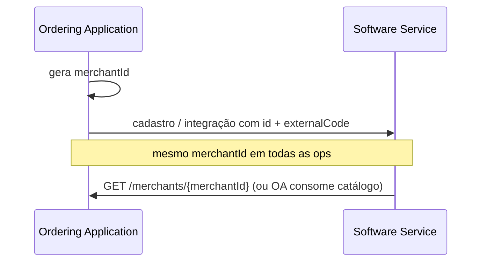
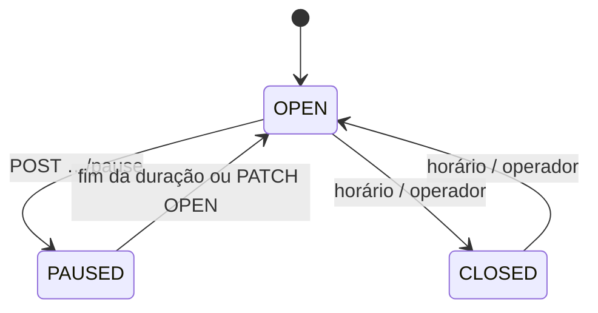
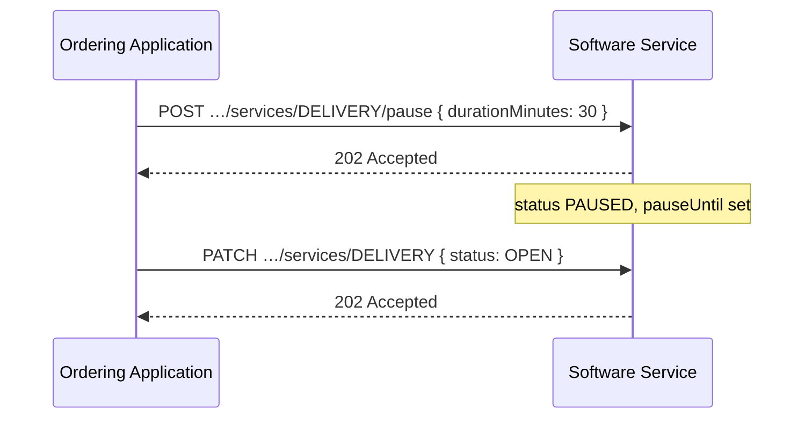

# Dados da Loja

<p class="od-meta">
 <span class="od-badge od-badge--core">Capability</span>
 <span class="od-badge od-badge--code">merchant</span>
 <span class="od-badge">Merchant · identidade e services</span>
</p>

!!! note "Especificação da API"
    O contrato implementável está na **[especificação de Merchant](../reference/merchant.md)** — somente em inglês.

Parte da capability [Merchant](merchant.md). O **cardápio** está em [Menus](menu.md).

---

## Merchant ID — gerado pelo originador

!!! important "Quebra em relação à V1"
    Na V1 o `merchantId` vinha do Software Service (PDV). Na V2 o `merchantId` é **gerado pela Ordering Application** no cadastro. O PDV guarda o próprio código em **`externalCode`**.



Motivos: eliminar round-trip só para obter ID; referência determinística desde a criação; reconciliação multi-plataforma mais simples.

O `merchantId` DEVE ser único no escopo da Ordering Application (UUID v4 recomendado).

---

## Identidade e basic info

Campos descritivos (nome, endereço, contatos, logo, etc.) via:

| Objetivo | Operação |
|---|---|
| Ler loja | `GET /merchants/{merchantId}` |
| Atualizar parcial | `PATCH /merchants/{merchantId}` |
| Listar lojas do token | `GET /merchants` |

`merchantType` da V1 **não existe** na V2.

---

## Serviço (`Service`) {#serviço-service}

Cada estabelecimento pode ter múltiplos services. O identificador é o **tipo** — não há service id separado.

| Campo | Obrigatório | Descrição |
|---|---|---|
| `type` | SIM | `DELIVERY`, `TAKEOUT` ou `INDOOR` |
| `status` | SIM | `OPEN`, `CLOSED` ou `PAUSED` |
| `operatingHours` | SIM (quando aplicável) | Horários por dia da semana |
| `deliveryArea` | NÃO | Raio ou polígono (`DELIVERY`) |
| `menuId` | NÃO | Menu ativo — ver [Menus](menu.md) |
| `pauseUntil` | NÃO | Retomada automática se `PAUSED` |

```
GET|PUT|PATCH /merchants/{merchantId}/services/{serviceType}
```

### Estados



| Status | Significado |
|---|---|
| `OPEN` | Aceitando pedidos naquele service |
| `CLOSED` | Fora de horário ou offline do service |
| `PAUSED` | Pausa operacional temporária |

### Pausa

```
POST /merchants/{merchantId}/services/{serviceType}/pause
```

Body: `durationMinutes` (obrigatório), `reason` (opcional). Resposta **`202`**.  
**Não** reescreve `operatingHours`. Retomada: expiração ou `PATCH` com `status: OPEN`.



---

## Mapa de operações (loja)

| Objetivo | operationId |
|---|---|
| Listar merchants | `listMerchants` |
| Detalhe da loja | `getMerchant` |
| Atualizar basic info | `updateMerchant` |
| Ler service | `getService` |
| Substituir service | `replaceService` |
| Atualizar service | `updateService` |
| Pausar | `pauseService` |

---

## Checklists

!!! tip "Checklist — Ordering Application"
    - [ ] Gera e mantém `merchantId` estável  
    - [ ] Correlação com PDV via `externalCode`  
    - [ ] Consome services por **tipo**  
    - [ ] Trata pause sem confundir com horário de funcionamento  

!!! tip "Checklist — Software Service"
    - [ ] Hospeda GET/PATCH de loja e services  
    - [ ] Aceita `merchantId` do originador  
    - [ ] `POST …/pause` → `PAUSED` + `pauseUntil`  
    - [ ] Não usa `merchantType`  

---

<div class="od-related">
  <p class="od-related__label">Relacionado</p>
  <ul class="od-related__list">
    <li><a href="../reference/merchant.md">Especificação de Merchant</a></li>
    <li><a href="menu.md">Menus</a></li>
    <li><a href="merchant.md">Merchant — visão geral</a></li>
    <li><a href="indoor.md">Indoor</a> — service type INDOOR + conta (exige Orders)</li>
  </ul>
</div>
