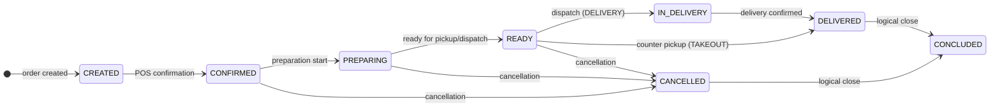

# Orders

<p class="od-meta">
  <span class="od-badge od-badge--code">orders</span>
</p>

<div class="od-api-callout">
  <p>Rules, status, and events on this page. HTTP contract is OpenAPI <strong>in English only</strong>.</p>
  <a href="../reference/orders/">Open OpenAPI reference →</a>
</div>

## Overview

The **Orders** capability defines interoperable coordination of the order lifecycle among the Ordering Application, the Software Service, and optionally the Delivery Platform.

Core concepts:

- **`status`** is the current business condition of the order and **MUST** be explicit and queryable at any time.
- **Events** are immutable lifecycle facts and **MUST NOT** be interpreted as commands.
- Profile-specific behavior (`DELIVERY`, `TAKEOUT`, `INDOOR`) exists; unsupported transitions for a profile **MUST** be rejected.
- Dine-in account behavior is handled by the [Indoor extension](indoor.md), not by this capability alone.

---

## Roles

| Role | Responsibility |
|---|---|
| **Ordering Application** | Creates the order and follows the lifecycle. Calls progression operations and consumes status updates. |
| **Software Service** | Operational source of truth for the order. Exposes lifecycle operations and emits status updates. |
| **Delivery Platform** (optional) | Provides delivery progression updates when logistics is externalized. |

---

## Data model (summary)

### Order (top level)

| Field | Type | Required | Description |
|---|---|---|---|
| `id` | string | YES | Unique order identifier |
| `displayId` | string | YES | Human-readable code shown to the customer |
| `status` | string (enum) | YES | Current order status |
| `createdAt` | string | YES | Creation timestamp (ISO 8601 date-time) |
| `orderTiming` | string | YES | `INSTANT` or `SCHEDULED` |
| `merchant` | object | YES | Merchant reference |
| `items` | array[object] | YES | Ordered items |
| `total` | object | YES | Order totals |
| `customer` | object | NO | Customer context |
| `payments` | array[object] | NO | Payment context |
| `delivery` | object | NO | Delivery context (`DELIVERY` profile) |
| `indoor` | object | NO | Dine-in context (`INDOOR` profile) |

### Order item

| Field | Type | Required | Description |
|---|---|---|---|
| `id` | string | YES | Item id on the order |
| `name` | string | YES | Item name |
| `quantity` | integer | YES | Quantity ordered |
| `unity_price` | object | YES | Unit price (value + currency) |
| `total_price` | object | YES | Item total without options |
| `options` | array[object] | NO | Selected options |

### Item option (recursive)

| Field | Type | Required | Description |
|---|---|---|---|
| `id` | string | YES | Option id |
| `name` | string | YES | Option name |
| `quantity` | integer | YES | Selected quantity |
| `option_price` | object | YES | Incremental option price |
| `options` | array[object] | NO | Nested options |

!!! info "Total calculation"
    Order total is derived from `unity_price` + sum of selected `option_price` values, multiplied by quantity. Field `subtotal` was removed in V2.

---

## Lifecycle — possible statuses {#ciclo-de-vida-status}



| Status | Meaning |
|---|---|
| `CREATED` | Registered, awaiting merchant confirmation |
| `CONFIRMED` | Merchant accepted the order |
| `PREPARING` | Preparation in progress |
| `READY` | Ready for pickup or dispatch |
| `IN_DELIVERY` | In transit (`DELIVERY`) |
| `DELIVERED` | Delivered or picked up by the customer |
| `CANCELLED` | Cancelled |
| `CONCLUDED` | Logical close (post-delivery or post-cancel) |

---

## Operations

Mutation operations return `202 Accepted` — processing is asynchronous. Current status is read via `GET /orders/{id}`.

| Operation | Endpoint | Profiles | Description |
|---|---|---|---|
| Confirm | `POST /orders/{id}/confirm` | All | POS accepts the order |
| Start preparation | `POST /orders/{id}/preparing` | All | Preparation started |
| Ready for pickup | `POST /orders/{id}/ready-for-pickup` | All | Order ready |
| Dispatch | `POST /orders/{id}/dispatch` | DELIVERY | Left for delivery |
| Deliver | `POST /orders/{id}/delivered` | All | Delivered or picked up |
| Cancel | `POST /orders/{id}/cancel` | All | Direct cancellation |
| Conclude | `POST /orders/{id}/conclude` | All | Logical close |

---

## Cancellation — simplified in V2

!!! important "Breaking change vs V1"
    In V1, cancellation used a bilateral handshake. In V2, cancellation is **direct and unilateral**:

    ```
    POST /orders/{id}/cancel
    ```

    There is no separate “cancellation request” step. The canceller executes cancel with a reason in the payload. The other party is notified via event when needed.

The cancel payload **MUST** include `reason` and `cancellationCode`. Both OA and Software Service may initiate cancel.

---

## Event matrices by profile {#matrizes-de-eventos-por-perfil}

Matrices define which events are mandatory (`MUST`), optional (`MAY`), or forbidden (`MUST NOT`) per order profile. **Status** is the truth on GET; **events** are notifications.

### Profile DELIVERY {#perfil-delivery}

| Event | Obligation | Resulting status |
|---|---|---|
| `CREATED` | MUST | `CREATED` |
| `CONFIRMED` | MUST | `CONFIRMED` |
| Intermediate logistics events | MAY | may leave status unchanged |
| `DELIVERED` | MUST | `DELIVERED` |
| `CANCELLED` | MUST | `CANCELLED` |
| `CONCLUDED` | MUST | `CONCLUDED` |

### Profile TAKEOUT {#perfil-takeout}

| Event | Obligation | Notes |
|---|---|---|
| `CREATED` / `CONFIRMED` | MUST | Base lifecycle |
| `READY_FOR_PICKUP` | MUST | Waiting at counter |
| Rider/logistics events | MUST NOT | Reject with `422` |
| `DELIVERED` | MUST | Customer picked up |

### Profile INDOOR {#perfil-indoor}

| Event | Obligation | Notes |
|---|---|---|
| `CREATED` / `CONFIRMED` | MUST | Base lifecycle |
| Rider/logistics events | MUST NOT | No external logistics |
| `DELIVERED` | MAY | Served at table |
| Account lifecycle | — | See [Indoor](indoor.md) |

Full field-level matrices and schemas: [OpenAPI Orders](../reference/orders.md) (English). Event and status **identifiers** are always English.

!!! note "MUST NOT and Discovery"
    Events marked `MUST NOT` for a profile **MUST** be rejected with `422 Unprocessable Entity`. Intermediate event obligations may also be refined in Discovery.

---

## Discovery

Implementations that expose Orders **MUST** declare `orders` in the well-known document.

```json
"capabilities": {
  "orders": {
    "baseUrl": "https://api.example.com",
    "interactionMode": "push",
    "extensions": ["indoor"]
  }
}
```

Order interactions **MUST** start only after validating the counterpart’s discovery metadata.

---

## Authorization

All Orders operations require Bearer authentication (OAuth 2.0) with application credentials and appropriate scopes (`od.orders` / `od.all`).

---

<div class="od-next-step">
  <div class="od-next-step__label">Next step</div>
  <div class="od-next-step__links">
    <a href="../reference/orders/">OpenAPI Orders (EN)</a>
    <a href="indoor/">Indoor extension</a>
    <a href="../guide/migration-v1-v2/">Migration V1→V2</a>
  </div>
</div>
