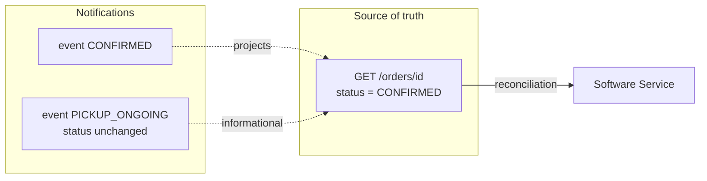
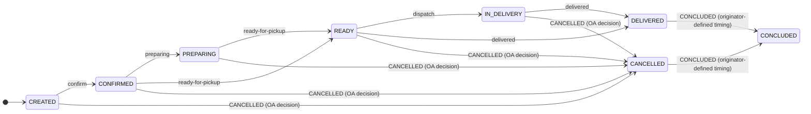
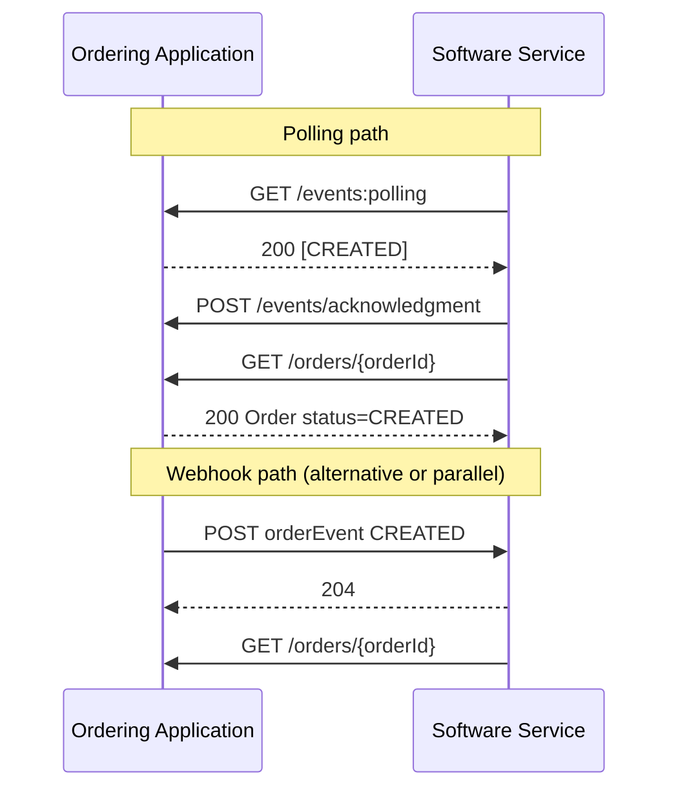
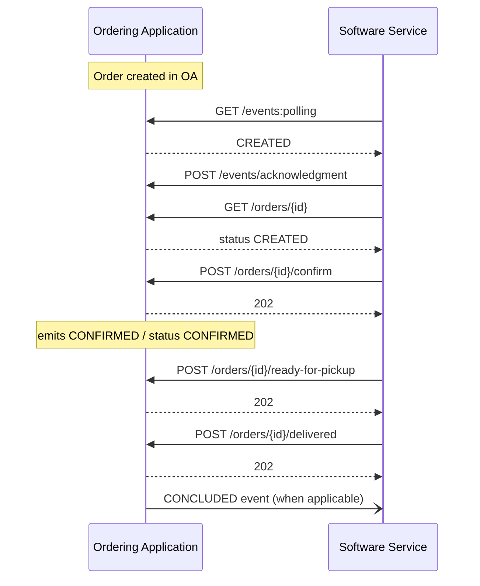
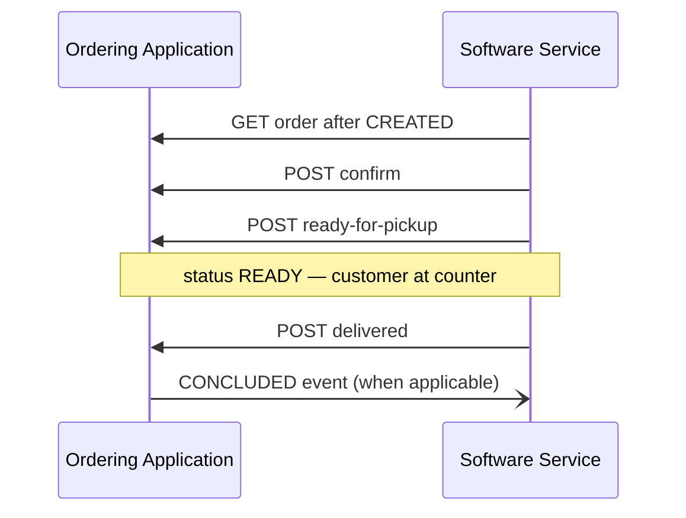
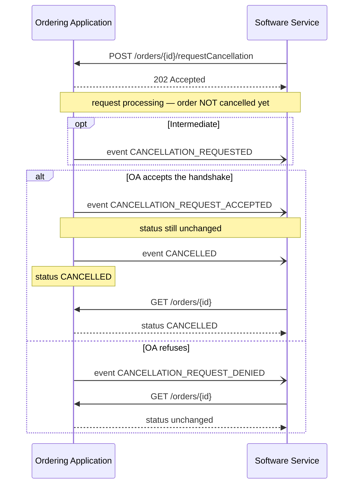
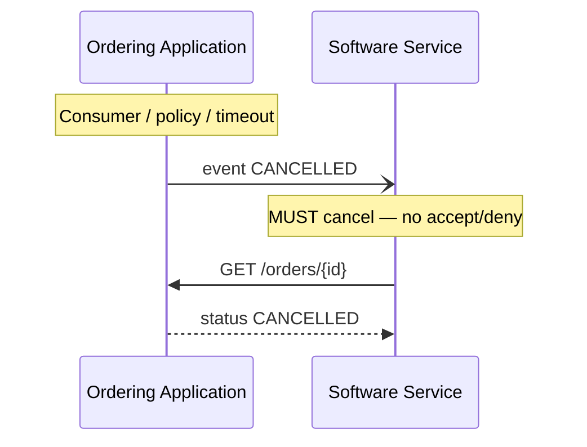
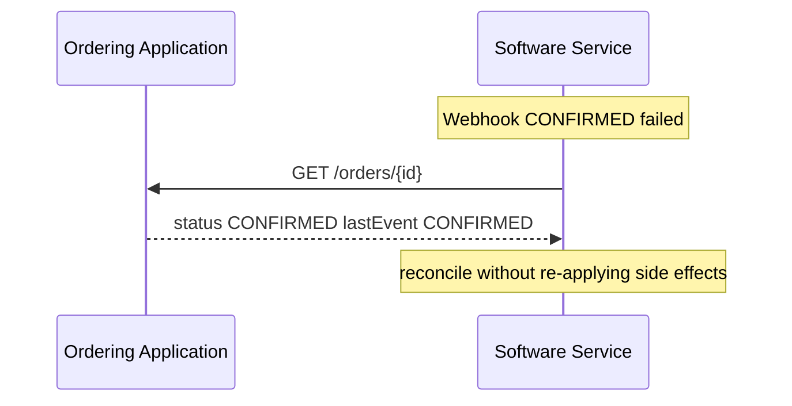

# Orders

<p class="od-meta">
 <span class="od-badge od-badge--core">Capability</span>
 <span class="od-badge od-badge--code">orders</span>
</p>

!!! note "API Spec"
    The implementable contract (endpoints, fields, errors, and examples) is in the **[Orders API Spec](../reference/orders.md)** — English only.

This page is the **reading guide**: concepts, roles, status vs events, flows, and checklists. Field-level contracts live in the API Spec (note above).

!!! note "Repeated lifecycle calls"
    If the operation **was already applied** (e.g. confirm while the order is already `CONFIRMED`), the host **returns `202`** — not `409`/`422` only because of duplication. See [Conventions](../reference/conventions.md#duplicate-lifecycle-operations) and the [Orders API Spec](../reference/orders.md).

---

## What it is for

Orders is the **most used** Open Delivery capability in V1 and remains the axis of the order lifecycle in V2: how the **Ordering Application** (marketplace, app, kiosk) and the **Software Service** (POS / restaurant systems) coordinate creation, confirmation, preparation, delivery/pickup, cancellation, and closure — interoperably, without point-to-point integrations.

Without a standard, platforms mixed events and “status”, cancellation became a confusing handshake, POS stacks broke on double confirmation, and logistics/dine-in redefined order state incompatibly.

Orders defines **queryable status**, **immutable events**, **profiles** (`DELIVERY`, `TAKEOUT`, `INDOOR`), and async progression operations.

### Relationship to other capabilities

| Capability | Needs Orders? |
|---|---|
| **Indoor** | **Yes — mandatory.** Indoor is an Orders extension; the account is born from an order with `fulfillment.orderType: INDOOR`. |
| **Merchant** | No. Stands alone (menu, store). Best scenario: together with Orders. |
| **Logistics** | No. Stands alone (quote, dispatch, tracking). Logistics events **must not** redefine order status. |
| **Customer** | No. Stands alone (customer data; CRM software consumes). Exposes **its own** endpoints for relationship-context order exchange/ingestion; the **order data shape is the same** as this capability. |

---

## What changes from V1 to V2

!!! important "Breaking — read before migrating"
    Highest-impact changes for existing V1 Orders implementations. See also [Migration V1→V2](../guide/migration-v1-v2.md).

| Topic | V1 | V2 |
|---|---|---|
| **Cancellation (originator → SS)** | Optional handshake: `ORDER_CANCELLATION_REQUEST` + accept/deny **or** mandatory cancel | **Mandatory only:** OA emits `CANCELLED` (no accept/deny) |
| **Cancellation (SS → OA)** | `requestCancellation` → outcomes via events | **Kept** + `CANCELLATION_REQUEST_ACCEPTED` then `CANCELLED` (or denied) |
| **`PICKED_UP` event** | Ambiguous (customer pickup vs courier collection) | **Removed** |
| **Status vs events** | Often confused | **Status** on GET is source of truth; **events** are notifications |
| **Duplicate confirm** | Many hosts returned `422` | **`202` if already in target state** (Keeta / committee 2026-03-26) |
| **Create HTTP** | No `POST /orders` | Still **no** create — entry via `CREATED` event + GET |
| **Merchant id** | Often PDV-generated | **Originator-owned** id + PDV `externalCode` |

There is **no** `POST /orders` to create an order in the protocol API — **including Indoor**. The order is originated in the Ordering Application and announced by **event**.

---

## Roles

| Role | Responsibility |
|---|---|
| **Ordering Application** | Originates the order. **Hosts** polling, `GET /orders/{id}`, and progression operations (marketplace model, same as V1). Emits events. |
| **Software Service** | Restaurant system. **Consumes** events (polling and/or webhook), loads the snapshot, calls confirm/preparing/…. Operational authority at the store. |
| **Delivery Platform** (optional) | Runs delivery. Emits **informational** tracking facts — without redefining `order.status`. See [Logistics](logistics.md). |

In the classic lifecycle model, the **Ordering Application is the host** and the Software Service is the client (as in V1).

---

## Discovery

Participants that expose Orders **MUST** declare `capabilities.orders` in the well-known document.
In the V2 model, declaration is role-based (`originator` and/or `receiver`), with
supported operations/events and delivery modes (`supportsWebhook` / `supportsPolling`).

```json
"capabilities": {
  "orders": {
    "version": "1.0.0",
    "supported": true,
    "receiver": {
      "supported": true,
      "supportedOperations": ["confirmOrder", "requestCancellation", "getOrder", "setOrderPreparing", "setOrderReadyForPickup", "dispatchOrder", "setOrderDelivered"],
      "unsupportedOperations": [],
      "supportsWebhook": true,
      "supportsPolling": true
    }
  }
}
```

### V1 (`sendXXX`) -> Discovery V2 mapping

| V1 (legacy) | How to declare in V2 (Discovery) |
|---|---|
| `sendPreparing` | `capabilities.orders.receiver.supportedOperations` includes `setOrderPreparing` |
| `sendReadyForPickup` | `supportedOperations` includes `setOrderReadyForPickup` |
| `sendDispatch` | `supportedOperations` includes `dispatchOrder` |
| `sendDelivered` | `supportedOperations` includes `setOrderDelivered` |
| `sendTracking` | `supportedOperations` includes `sendOrderTracking` |
| `sendPickedUp` | **Deprecated/removed** in V2; do not declare or expect it in integrations |

Besides `supportedOperations`, use `unsupportedOperations` to make gaps explicit.
For event production/consumption, also declare `supportedEvents`/`unsupportedEvents`
in the applicable role (`originator`/`receiver`).

Guide: [Discovery](discovery.md). Contract: [Discovery API Spec](../reference/discovery.md).

---

## Status vs events {#status-vs-eventos}

This is the integration point that causes the most errors.

### Definitions

| Concept | What it is | Source of truth |
|---|---|---|
| **Status** | **Current** business condition of the order | `status` on `GET /orders/{orderId}` |
| **Event** | **Immutable** notified fact (something happened) | Polling or webhook payload (`eventId`, `eventType`) |



**Rules:**

1. **Never** use the event sequence alone as final state — if an event was lost, GET corrects it.
2. **Never** treat progression `202 Accepted` as “status already changed”.
3. Events **may** project a status change (`CONFIRMED` → `status: CONFIRMED`) **or** be informational only (`PICKUP_ONGOING` keeps current status).
4. Events are **not** commands. Commands are lifecycle `POST`s.
5. Deduplicate by `eventId`. Do not assume strict delivery order.

### Anti-patterns (V1 issues fixed in V2)

| Anti-pattern | Why it breaks | Do this instead |
|---|---|---|
| Infer status only from events | Missed / reordered events | `GET /orders/{id}` |
| Treat second `confirm` as `422` | Dual-confirm POS flows stop | `202` if already `CONFIRMED` |
| Use `PICKED_UP` for takeout and logistics | Opposite meanings | Removed; use `DELIVERED` or Logistics events |
| Assume `requestCancellation` already cancelled | 202 ≠ cancelled | Only status/event `CANCELLED` counts |
| Expect accept/deny on originator cancel | OA handshake removed in V2 | OA emits mandatory `CANCELLED` |

---

## Lifecycle — status {#ciclo-de-vida-status}



| Status | Meaning |
|---|---|
| `CREATED` | Registered, awaiting confirmation |
| `CONFIRMED` | Merchant accepted |
| `PREPARING` | Preparation in progress |
| `READY` | Ready for collection / dispatch / service |
| `IN_DELIVERY` | In transit (`DELIVERY` only) |
| `DELIVERED` | Customer received / collected / was served |
| `CANCELLED` | Cancelled |
| `CONCLUDED` | Logical closure emitted by the originator (no dedicated endpoint) |

---

## How an order enters the protocol

**There is no `POST /orders`.** Canonical flow:

1. The Ordering Application creates the order in **its** system.
2. It emits a **`CREATED`** event (polling and/or webhook).
3. The Software Service ACKs (if polling) and calls **`GET /orders/{orderId}`**.
4. Progression continues with `POST …/confirm`, etc., on the Ordering Application host.
5. Each relevant fact emits a new event; `status` on GET remains reconciliation.

For **Indoor** (`fulfillment.orderType: INDOOR`): the same flow. When processing an INDOOR order, the Software Service **opens or feeds the dining account** (Indoor extension). Later items = new INDOOR orders on the same operational key — always via event + GET, never via create HTTP.

---

## Map: goal → operation in the API Spec

| Goal | Operation | Spec |
|---|---|---|
| Receive new facts | `GET /events:polling` | `pollingEvents` |
| ACK polling | `POST /events/acknowledgment` | `acknowledgeEvents` |
| Receive push | Webhook `orderEvent` | `receiveOrderEvent` |
| Snapshot / status | `GET /orders/{orderId}` | `getOrder` |
| Confirm | `POST …/confirm` | `confirmOrder` |
| Preparing | `POST …/preparing` | `setOrderPreparing` |
| Ready | `POST …/ready-for-pickup` | `setOrderReadyForPickup` |
| Dispatch | `POST …/dispatch` | `dispatchOrder` |
| Delivered | `POST …/delivered` | `setOrderDelivered` |
| Request cancel (merchant) | `POST …/requestCancellation` | `requestCancellation` |
| Mandatory cancel (originator) | Event `CANCELLED` (no accept/deny HTTP) | — |
| Logical closure | Event `CONCLUDED` emitted by the originator | — |

All links open the [Orders API Spec](../reference/orders.md).

---

## Event channels: polling and webhook

Both are valid; Discovery declares what the counterpart supports.

| Channel | Host | Caller |
|---|---|---|
| **Polling** | Ordering Application | Software Service |
| **Webhook** | Software Service | Ordering Application |



**Reconciliation:** if webhook fails or polling lags, use `GET /orders/{id}` and `lastEvent` when present.

---

## Event matrices by profile {#matrizes-de-eventos-por-perfil}

<div class="od-matrix__legend">
 <span><span class="od-badge od-badge--must">MUST</span> required</span>
 <span><span class="od-badge od-badge--may">MAY</span> optional</span>
 <span><span class="od-badge od-badge--mustnot">MUST NOT</span> forbidden — reject with 422</span>
</div>

### DELIVERY profile {#perfil-delivery}

<div class="od-matrix" markdown>
<div class="od-matrix__scroll" markdown>

| Event | Projected status | Obligation | Notes |
|---|---|---|---|
| `CREATED` | `CREATED` | <span class="od-badge od-badge--must">MUST</span> | Entry |
| `CONFIRMED` | `CONFIRMED` | <span class="od-badge od-badge--must">MUST</span> | After confirm |
| `PREPARATION_REQUESTED` | (unchanged) | <span class="od-badge od-badge--may">MAY</span> | Informational / on-demand |
| `PREPARING` | `PREPARING` | <span class="od-badge od-badge--may">MAY</span> | |
| `READY_FOR_PICKUP` | `READY` | <span class="od-badge od-badge--may">MAY</span> | Ready for courier |
| `PICKUP_ONGOING` | (unchanged) | <span class="od-badge od-badge--may">MAY</span> | Informational logistics |
| `RIDER_ARRIVED_AT_STORE` | (unchanged) | <span class="od-badge od-badge--may">MAY</span> | Informational logistics |
| `DISPATCHED` | `IN_DELIVERY` | <span class="od-badge od-badge--may">MAY</span> | Possible future deprecation |
| `ORDER_COLLECTED` | `IN_DELIVERY` | <span class="od-badge od-badge--may">MAY</span> | Full-service logistics |
| `DELIVERY_ONGOING` | (unchanged) | <span class="od-badge od-badge--may">MAY</span> | Informational |
| `ARRIVED_AT_CUSTOMER` | (unchanged) | <span class="od-badge od-badge--may">MAY</span> | Informational |
| `DELIVERED` | `DELIVERED` | <span class="od-badge od-badge--must">MUST</span> | Customer received |
| `CANCELLATION_REQUESTED` | (unchanged) | <span class="od-badge od-badge--may">MAY</span> | Merchant request in process |
| `CANCELLATION_REQUEST_ACCEPTED` | (unchanged) | <span class="od-badge od-badge--may">MAY</span> | Handshake accepted; **then** `CANCELLED` |
| `CANCELLATION_REQUEST_DENIED` | (unchanged) | <span class="od-badge od-badge--may">MAY</span> | Handshake denied |
| `CANCELLED` | `CANCELLED` | <span class="od-badge od-badge--must">MUST</span> | Final cancel |
| `CONCLUDED` | `CONCLUDED` | <span class="od-badge od-badge--may">MAY</span> | Originator-defined timing |

</div>
</div>

### TAKEOUT profile {#perfil-takeout}

<div class="od-matrix" markdown>
<div class="od-matrix__scroll" markdown>

| Event | Projected status | Obligation | Notes |
|---|---|---|---|
| `CREATED` | `CREATED` | <span class="od-badge od-badge--must">MUST</span> | |
| `CONFIRMED` | `CONFIRMED` | <span class="od-badge od-badge--must">MUST</span> | |
| `PREPARATION_REQUESTED` | (unchanged) | <span class="od-badge od-badge--may">MAY</span> | |
| `PREPARING` | `PREPARING` | <span class="od-badge od-badge--may">MAY</span> | |
| `READY_FOR_PICKUP` | `READY` | <span class="od-badge od-badge--must">MUST</span> | Waiting at counter |
| Courier / route events | — | <span class="od-badge od-badge--mustnot">MUST NOT</span> | No external logistics |
| `DELIVERED` | `DELIVERED` | <span class="od-badge od-badge--must">MUST</span> | Customer collected |
| `CANCELLATION_REQUESTED` | (unchanged) | <span class="od-badge od-badge--may">MAY</span> | |
| `CANCELLATION_REQUEST_ACCEPTED` | (unchanged) | <span class="od-badge od-badge--may">MAY</span> | Then `CANCELLED` |
| `CANCELLATION_REQUEST_DENIED` | (unchanged) | <span class="od-badge od-badge--may">MAY</span> | |
| `CANCELLED` | `CANCELLED` | <span class="od-badge od-badge--must">MUST</span> | |
| `CONCLUDED` | `CONCLUDED` | <span class="od-badge od-badge--may">MAY</span> | Originator-defined timing |

</div>
</div>

### INDOOR profile {#perfil-indoor}

<div class="od-matrix" markdown>
<div class="od-matrix__scroll" markdown>

| Event | Projected status | Obligation | Notes |
|---|---|---|---|
| `CREATED` | `CREATED` | <span class="od-badge od-badge--must">MUST</span> | Opens/feeds Indoor account on SS |
| `CONFIRMED` | `CONFIRMED` | <span class="od-badge od-badge--must">MUST</span> | |
| `PREPARING` / `READY_FOR_PICKUP` | per event | <span class="od-badge od-badge--may">MAY</span> | Dine-in is often simpler |
| Logistics events | — | <span class="od-badge od-badge--mustnot">MUST NOT</span> | |
| `DELIVERED` | `DELIVERED` | <span class="od-badge od-badge--may">MAY</span> | Served at table/counter |
| `CANCELLATION_REQUESTED` | (unchanged) | <span class="od-badge od-badge--may">MAY</span> | |
| `CANCELLATION_REQUEST_ACCEPTED` | (unchanged) | <span class="od-badge od-badge--may">MAY</span> | Then `CANCELLED` |
| `CANCELLATION_REQUEST_DENIED` | (unchanged) | <span class="od-badge od-badge--may">MAY</span> | |
| `CANCELLED` | `CANCELLED` | <span class="od-badge od-badge--must">MUST</span> | |
| `CONCLUDED` | `CONCLUDED` | <span class="od-badge od-badge--may">MAY</span> | Originator-defined timing |

</div>
</div>

!!! note "Indoor account ≠ order status"
    `ACCOUNT_*`, payment, and fiscal events live only in the [Indoor extension](indoor.md). The order keeps its own `status`.

---

## Cancellation — two paths (do not mix)

V1 has **two** cancellation directions. V2 **keeps the merchant handshake** and **removes the originator handshake**.

### A — Software Service initiates (merchant wants to cancel) — **handshake kept**

```
POST /orders/{id}/requestCancellation
```

Host: **Ordering Application**. Caller: **Software Service**.

| Body field | Description |
|---|---|
| `reason` | Free text |
| `code` | Machine reason (e.g. `UNAVAILABLE_ITEM`) |
| `mode` | `AUTO` or `MANUAL` |

HTTP `202` means the **cancellation request was accepted for processing** — **not** that the order is cancelled.

Outcomes via **event** (polling/webhook):

| Event | Meaning | Order status |
|---|---|---|
| `CANCELLATION_REQUESTED` | MAY — request registered | Unchanged |
| `CANCELLATION_REQUEST_ACCEPTED` | OA **accepted** the cancellation request | Unchanged |
| `CANCELLATION_REQUEST_DENIED` | OA refused the merchant request | Unchanged |
| `CANCELLED` | Order is actually cancelled | `CANCELLED` |

**When the handshake is accepted:** the Ordering Application **MUST** emit `CANCELLATION_REQUEST_ACCEPTED` and then **`CANCELLED`** (with `status: CANCELLED`). Accepting the request is **not** a substitute for the final event. The Software Service MUST treat the order as cancelled **only** on status/event **`CANCELLED`** — `CANCELLATION_REQUEST_ACCEPTED` alone does **not** close the lifecycle.

### B — Ordering Application initiates (originator) — **mandatory cancel only**

In V1 the originator could:

1. **Mandatory cancel** — emit `CANCELLED` directly (SS must cancel), or  
2. **Handshake** — event `ORDER_CANCELLATION_REQUEST` + `acceptCancellation` / `denyCancellation`.

In **V2 the originator handshake is removed**. Only **mandatory** cancel remains:

- OA **emits** event `CANCELLED` and sets `status: CANCELLED`.
- Software Service **MUST** cancel the order — **no** accept/deny.
- Endpoints `acceptCancellation` / `denyCancellation` and event `ORDER_CANCELLATION_REQUEST` are **out** of core.

Typical reasons: consumer cancel, platform policy, fraud, timeout, etc.

---

## Flows

### Delivery (happy path)



### Takeout



### Cancellation A — merchant requests (handshake)



### Cancellation B — originator (mandatory)



### Missed event → reconciliation



---

## Normative rules and checklists

**The host (Ordering Application) MUST:**

- Expose `GET /orders/{id}` with authoritative `status`
- Return `202` on mutations (and on already-applied duplicates)
- Emit events consistent with the profile matrix
- Keep `requestCancellation` handshake (`CANCELLATION_REQUEST_ACCEPTED` then `CANCELLED`, or `CANCELLATION_REQUEST_DENIED`)
- Originator cancel: mandatory only (`CANCELLED`); no `ORDER_CANCELLATION_REQUEST`
- Remove `PICKED_UP` from V2 core

**The Software Service MUST:**

- Deduplicate events by `eventId`
- ACK polling (including unused types)
- Not treat `202` from `requestCancellation` as cancelled
- Apply originator mandatory cancel without accept/deny
- For Indoor: process `fulfillment.orderType: INDOOR` and manage the account per [Indoor](indoor.md)
- Migrate legacy payload: do not use root `Order.type`; use `Order.fulfillment.orderType`

!!! tip "Checklist — Ordering Application"
    - [ ] Polling and/or webhook declared in Discovery  
    - [ ] `CREATED` includes a usable `orderURL`  
    - [ ] Duplicate confirm → `202`  
    - [ ] Handshake accepted → `CANCELLATION_REQUEST_ACCEPTED` **then** `CANCELLED`  
    - [ ] Handshake denied → `CANCELLATION_REQUEST_DENIED`  

    - [ ] Originator cancel = `CANCELLED` event/status only  
    - [ ] No `ORDER_CANCELLATION_REQUEST` / accept / deny  
    - [ ] No `PICKED_UP`  

!!! tip "Checklist — Software Service"
    - [ ] Consume `CREATED` → full GET  
    - [ ] Never infer status from events only  
    - [ ] `requestCancellation` 202 ≠ cancelled  
    - [ ] `CANCELLATION_REQUEST_ACCEPTED` ≠ final cancel  
    - [ ] Handle `CANCELLED` (handshake path or OA mandatory)  
    - [ ] Indoor only with Orders active  
    - [ ] Treat lifecycle `202` as async  

---

## Out of MVP (V2.1+)

| Topic | Status |
|---|---|
| Final deprecation of `DISPATCHED` | Under committee review |
| Partial line cancel on delivery (outside Indoor) | Indoor already has item cancel on the account |
| Free-form custom fields on the order | **Out of MVP** (committee) |
| Originator cancel handshake (`ORDER_CANCELLATION_REQUEST` + accept/deny) | Removed; OA mandatory cancel only |
| Fine-grained delivery tracking | [Logistics](logistics.md) capability |

---

<div class="od-related">
  <p class="od-related__label">Related</p>
  <ul class="od-related__list">
    <li><a href="../reference/orders.md">Orders API Spec</a> — endpoints, schemas, errors</li>
    <li><a href="indoor.md">Indoor</a> — dine-in extension (requires Orders)</li>
    <li><a href="logistics.md">Logistics</a> — tracking without redefining status</li>
    <li><a href="customer.md">Customer</a> — customer data; same order shape for relationship-context endpoints</li>
    <li><a href="../guide/migration-v1-v2.md">Migration V1→V2</a></li>
    <li><a href="../reference/conventions.md">General rules</a> — lifecycle duplicate default</li>
  </ul>
</div>
