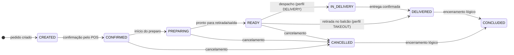

# Orders / Pedidos

<p class="od-meta">
  <span class="od-badge od-badge--core">Capability</span>
  <span class="od-badge od-badge--code">orders</span>
</p>

<div class="od-api-callout">
  <p>Regras, status e eventos nesta página. Contrato OpenAPI <strong>somente em inglês</strong>.</p>
  <a href="../reference/orders/">Abrir referência OpenAPI →</a>
</div>

## Visão Geral

A capability **Orders** define a coordenação interoperável do ciclo de vida de pedidos entre a Ordering Application, o Software Service e, opcionalmente, a Delivery Platform.

Conceitos fundamentais:

- **Status** é a condição de negócio atual do pedido e DEVE ser explícito e consultável a qualquer momento.
- **Eventos** são fatos imutáveis do ciclo de vida e NÃO DEVEM ser interpretados como comandos.
- Comportamentos específicos por perfil (DELIVERY, TAKEOUT, INDOOR) existem, mas transições não suportadas por um perfil DEVEM ser rejeitadas.
- Comportamento de conta em salão (INDOOR) é tratado pela [Extensão Indoor](indoor.md), não por esta capability.

---

## Papéis

| Papel | Responsabilidade |
|---|---|
| **Ordering Application** | Origina o pedido e acompanha o ciclo de vida. Chama operações de progressão e consome atualizações de status. |
| **Software Service** | Fonte de verdade operacional do pedido. Expõe as operações de ciclo de vida e emite atualizações de status. |
| **Delivery Platform** (opcional) | Fornece atualizações de progressão de entrega quando a logística é externalizada. |

---

## Modelo de dados

### Pedido (top level)

| Campo | Tipo | Obrigatório | Descrição |
|---|---|---|---|
| `id` | string | SIM | Identificador único do pedido |
| `displayId` | string | SIM | Código legível exibido ao cliente (ex.: "A123") |
| `status` | string (enum) | SIM | Status atual do pedido |
| `createdAt` | string | SIM | Timestamp de criação (ISO 8601 date-time) |
| `orderTiming` | string | SIM | `INSTANT` ou `SCHEDULED` |
| `merchant` | object | SIM | Referência ao estabelecimento |
| `items` | array[object] | SIM | Itens pedidos |
| `total` | object | SIM | Totais do pedido |
| `customer` | object | NÃO | Contexto do cliente |
| `payments` | array[object] | NÃO | Contexto de pagamento |
| `delivery` | object | NÃO | Contexto de entrega (perfil DELIVERY) |
| `indoor` | object | NÃO | Contexto de salão (perfil INDOOR) |

### Item do pedido

| Campo | Tipo | Obrigatório | Descrição |
|---|---|---|---|
| `id` | string | SIM | ID do item no pedido |
| `name` | string | SIM | Nome do item |
| `quantity` | integer | SIM | Quantidade pedida |
| `unity_price` | object | SIM | Preço unitário (valor + moeda) |
| `total_price` | object | SIM | Preço total do item sem opções |
| `options` | array[object] | NÃO | Opções selecionadas |

### Opção do item (recursiva)

| Campo | Tipo | Obrigatório | Descrição |
|---|---|---|---|
| `id` | string | SIM | ID da opção |
| `name` | string | SIM | Nome da opção |
| `quantity` | integer | SIM | Quantidade selecionada |
| `option_price` | object | SIM | Preço incremental da opção |
| `options` | array[object] | NÃO | Sub-opções (recursivo) |

!!! info "Cálculo do total"
    O total do pedido é calculado a partir de `unity_price` + soma dos `option_price` de todas as opções selecionadas, multiplicado pela quantidade. O campo `subtotal` foi removido na V2.

---

## Ciclo de vida — status possíveis {#ciclo-de-vida-status}



| Status | Significado |
|---|---|
| `CREATED` | Pedido registrado, aguardando confirmação do estabelecimento |
| `CONFIRMED` | Estabelecimento aceitou o pedido |
| `PREPARING` | Preparo em andamento |
| `READY` | Pedido pronto para retirada ou despacho |
| `IN_DELIVERY` | Em trânsito (perfil DELIVERY) |
| `DELIVERED` | Entregue ou retirado pelo cliente |
| `CANCELLED` | Pedido cancelado |
| `CONCLUDED` | Encerramento lógico (pós-entrega ou pós-cancelamento) |

---

## Operações

Todas as operações de mutação retornam `202 Accepted` — o processamento é assíncrono. O status atualizado é consultado via `GET /orders/{id}`.

| Operação | Endpoint | Perfis | Descrição |
|---|---|---|---|
| Confirmar pedido | `POST /orders/{id}/confirm` | Todos | POS aceita o pedido |
| Iniciar preparo | `POST /orders/{id}/preparing` | Todos | Preparo iniciado |
| Pronto para retirada | `POST /orders/{id}/ready-for-pickup` | Todos | Pedido pronto |
| Despachar | `POST /orders/{id}/dispatch` | DELIVERY | Saiu para entrega |
| Entregar | `POST /orders/{id}/delivered` | Todos | Entregue ou retirado |
| Cancelar | `POST /orders/{id}/cancel` | Todos | Cancelamento direto |
| Concluir | `POST /orders/{id}/conclude` | Todos | Encerramento lógico |

---

## Cancelamento — simplificado na V2

!!! important "Quebra de comportamento em relação à V1"
    Na V1, o cancelamento envolvia um handshake bilateral (solicitação + confirmação). Na V2, **o cancelamento é uma operação direta e unilateral**:

    ```
    POST /orders/{id}/cancel
    ```

    Não há etapa de "solicitação de cancelamento" separada. O canceller simplesmente executa o cancelamento com o motivo no payload. Se a outra parte precisar ser notificada, isso ocorre via evento.

O payload de cancelamento DEVE incluir o motivo (`reason`) e o código de cancelamento (`cancellationCode`). Ambas as partes (OA e Software Service) podem iniciar o cancelamento.

---

## Matrizes de eventos por perfil {#matrizes-de-eventos-por-perfil}

As matrizes abaixo definem quais eventos são obrigatórios, opcionais ou proibidos para cada perfil de pedido. **Status** é a verdade consultável no GET; **eventos** são notificações (podem ser informativos sem mudar status).

<div class="od-matrix__legend">
  <span><span class="od-badge od-badge--must">MUST</span> obrigatório</span>
  <span><span class="od-badge od-badge--may">MAY</span> opcional</span>
  <span><span class="od-badge od-badge--mustnot">MUST NOT</span> proibido — rejeitar com 422</span>
</div>

### Perfil DELIVERY {#perfil-delivery}

<div class="od-matrix" markdown>

<div class="od-matrix__scroll" markdown>

| Evento | Origem | Endpoint | Obrigatoriedade | Status | Observações |
|---|---|---|---|---|---|
| `CREATED` | ORIGINATOR | — | <span class="od-badge od-badge--must">MUST</span> | `CREATED` | Pedido criado pelo cliente |
| `CONFIRMED` | POS | `/confirm` | <span class="od-badge od-badge--must">MUST</span> | `CONFIRMED` | Estabelecimento aceita |
| `PREPARATION_REQUESTED` | ORIGINATOR | — | <span class="od-badge od-badge--may">MAY</span> | (inalterado) | Autoriza início do preparo |
| `PREPARING` | POS | `/preparing` | <span class="od-badge od-badge--may">MAY</span> | `PREPARING` | Preparo iniciado |
| `READY_FOR_PICKUP` | POS | `/ready-for-pickup` | <span class="od-badge od-badge--may">MAY</span> | `READY` | Pedido pronto |
| `PICKUP_ONGOING` | ORIGINATOR | — | <span class="od-badge od-badge--may">MAY</span> | `READY` | Entregador designado |
| `RIDER_ARRIVED_AT_STORE` | ORIGINATOR | — | <span class="od-badge od-badge--may">MAY</span> | `READY` | Entregador no local |
| `DISPATCHED` | POS | `/dispatch` | <span class="od-badge od-badge--may">MAY</span> | `IN_DELIVERY` | Pedido saiu |
| `ORDER_COLLECTED` | ORIGINATOR | — | <span class="od-badge od-badge--may">MAY</span> | `IN_DELIVERY` | Saiu da custódia do POS |
| `DELIVERY_ONGOING` | ORIGINATOR | — | <span class="od-badge od-badge--may">MAY</span> | `IN_DELIVERY` | Em trânsito |
| `ARRIVED_AT_CUSTOMER` | ORIGINATOR | — | <span class="od-badge od-badge--may">MAY</span> | `IN_DELIVERY` | Chegou ao endereço |
| `DELIVERED` | POS ou ORIGINATOR | `/delivered` | <span class="od-badge od-badge--must">MUST</span> | `DELIVERED` | Cliente recebeu |
| `CANCELLED` | ORIGINATOR | `/cancel` | <span class="od-badge od-badge--must">MUST</span> | `CANCELLED` | Cancelamento final |
| `CONCLUDED` | ORIGINATOR | `/conclude` | <span class="od-badge od-badge--must">MUST</span> | `CONCLUDED` | Encerramento |

</div>
</div>

### Perfil TAKEOUT {#perfil-takeout}

<div class="od-matrix" markdown>

<div class="od-matrix__scroll" markdown>

| Evento | Origem | Endpoint | Obrigatoriedade | Status | Observações |
|---|---|---|---|---|---|
| `CREATED` | ORIGINATOR | — | <span class="od-badge od-badge--must">MUST</span> | `CREATED` | Pedido criado |
| `CONFIRMED` | POS | `/confirm` | <span class="od-badge od-badge--must">MUST</span> | `CONFIRMED` | Estabelecimento aceita |
| `PREPARATION_REQUESTED` | ORIGINATOR | — | <span class="od-badge od-badge--may">MAY</span> | (inalterado) | Autoriza preparo |
| `PREPARING` | POS | `/preparing` | <span class="od-badge od-badge--may">MAY</span> | `PREPARING` | Opcional |
| `READY_FOR_PICKUP` | POS | `/ready-for-pickup` | <span class="od-badge od-badge--must">MUST</span> | `READY` | Aguardando retirada |
| `PICKUP_ONGOING` | — | — | <span class="od-badge od-badge--mustnot">MUST NOT</span> | — | Sem entregador |
| `RIDER_ARRIVED_AT_STORE` | — | — | <span class="od-badge od-badge--mustnot">MUST NOT</span> | — | Sem entregador |
| `ORDER_COLLECTED` | — | — | <span class="od-badge od-badge--mustnot">MUST NOT</span> | — | Sem coleta logística |
| `DELIVERED` | POS | `/delivered` | <span class="od-badge od-badge--must">MUST</span> | `DELIVERED` | Cliente retirou |
| `DELIVERY_ONGOING` | — | — | <span class="od-badge od-badge--mustnot">MUST NOT</span> | — | Sem etapa de entrega |
| `ARRIVED_AT_CUSTOMER` | — | — | <span class="od-badge od-badge--mustnot">MUST NOT</span> | — | Sem etapa de entrega |
| `CANCELLED` | ORIGINATOR | `/cancel` | <span class="od-badge od-badge--must">MUST</span> | `CANCELLED` | Cancelamento |
| `CONCLUDED` | ORIGINATOR | `/conclude` | <span class="od-badge od-badge--must">MUST</span> | `CONCLUDED` | Encerramento |

</div>
</div>

### Perfil INDOOR {#perfil-indoor}

<div class="od-matrix" markdown>

<div class="od-matrix__scroll" markdown>

| Evento | Origem | Endpoint | Obrigatoriedade | Status | Observações |
|---|---|---|---|---|---|
| `CREATED` | ORIGINATOR | — | <span class="od-badge od-badge--must">MUST</span> | `CREATED` | Totem, garçom, QR |
| `CONFIRMED` | POS | `/confirm` | <span class="od-badge od-badge--must">MUST</span> | `CONFIRMED` | Estabelecimento aceita |
| `PREPARATION_REQUESTED` | ORIGINATOR | — | <span class="od-badge od-badge--may">MAY</span> | (inalterado) | Fluxo sob demanda |
| `PREPARING` | POS | `/preparing` | <span class="od-badge od-badge--may">MAY</span> | `PREPARING` | Opcional |
| `READY_FOR_PICKUP` | POS | `/ready-for-pickup` | <span class="od-badge od-badge--may">MAY</span> | `READY` | Pronto para servir |
| `PICKUP_ONGOING` | — | — | <span class="od-badge od-badge--mustnot">MUST NOT</span> | — | Sem logística externa |
| `RIDER_ARRIVED_AT_STORE` | — | — | <span class="od-badge od-badge--mustnot">MUST NOT</span> | — | Sem logística externa |
| `ORDER_COLLECTED` | — | — | <span class="od-badge od-badge--mustnot">MUST NOT</span> | — | Sem coleta |
| `DELIVERED` | POS | `/delivered` | <span class="od-badge od-badge--may">MAY</span> | `DELIVERED` | Servido na mesa |
| `DELIVERY_ONGOING` | — | — | <span class="od-badge od-badge--mustnot">MUST NOT</span> | — | Sem etapa de entrega |
| `ARRIVED_AT_CUSTOMER` | — | — | <span class="od-badge od-badge--mustnot">MUST NOT</span> | — | Sem etapa de entrega |
| `CANCELLED` | ORIGINATOR | `/cancel` | <span class="od-badge od-badge--must">MUST</span> | `CANCELLED` | Cancelamento |
| `CONCLUDED` | ORIGINATOR | `/conclude` | <span class="od-badge od-badge--must">MUST</span> | `CONCLUDED` | Encerramento lógico |

</div>
</div>

!!! note "MUST NOT e manifesto"
    Eventos `MUST NOT` para o perfil **DEVEM** ser rejeitados com `422 Unprocessable Entity`. Obrigatoriedade fina de eventos intermediários também pode ser refinada no [Discovery](discovery.md) (must / may / must not por implementação).

---

## Discovery

Implementações que expõem a capability Orders DEVEM declarar `orders` no documento well-known.

```json
"capabilities": {
  "orders": {
    "baseUrl": "https://api.example.com",
    "interactionMode": "push",
    "extensions": ["indoor"]
  }
}
```

Interações de pedido DEVEM ser iniciadas somente após validação dos metadados de discovery da contraparte.

---

## Autorização

Todas as operações de Orders exigem autenticação Bearer (OAuth 2.0) com credenciais por aplicação.

| Escopo | Operações |
|---|---|
| `orders.read` | Consulta de pedidos e status |
| `orders.write` | Criação e progressão de pedidos |
| `orders.events.write` | Emissão de eventos de ciclo de vida |

---

## Regras normativas

**O Software Service DEVE:**

- Retornar `202 Accepted` para todas as operações de mutação
- Expor o status atual via `GET /orders/{id}` a qualquer momento
- Rejeitar eventos `MUST NOT` para o perfil declarado com `422`
- Preservar imutabilidade dos eventos — um evento emitido não pode ser revertido

**A Ordering Application DEVE:**

- Deduplicar eventos por identificador antes de processar
- Suportar entrega assíncrona — não assumir ordem de chegada dos eventos
- Incluir `cancellationCode` e `reason` no payload de cancelamento

**Ambos DEVEM:**

- Declarar a capability `orders` no discovery antes de iniciar operações
- Tratar o cancelamento como operação direta (sem handshake bilateral)

---

**Referência completa de campos e contratos REST:** [Referência da API — Pedidos →](../reference/orders.md)

---

<div class="od-next-step">
  <div class="od-next-step__label">Próximo passo</div>
  <div class="od-next-step__links">
    <a href="../reference/orders/">Abrir referência OpenAPI</a>
    <a href="indoor/">Extensão Indoor</a>
    <a href="../guide/migration-v1-v2/">Migração V1→V2</a>
  </div>
</div>
