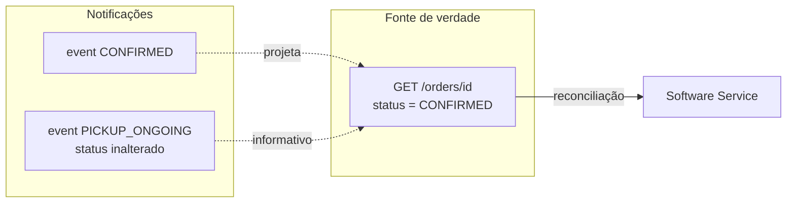
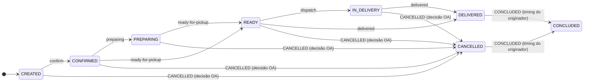
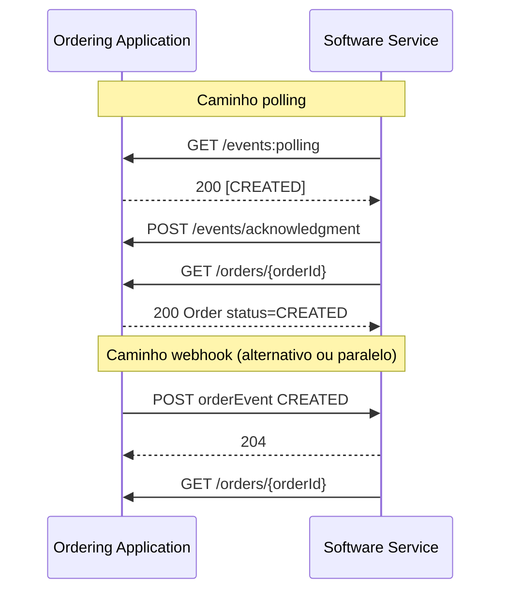
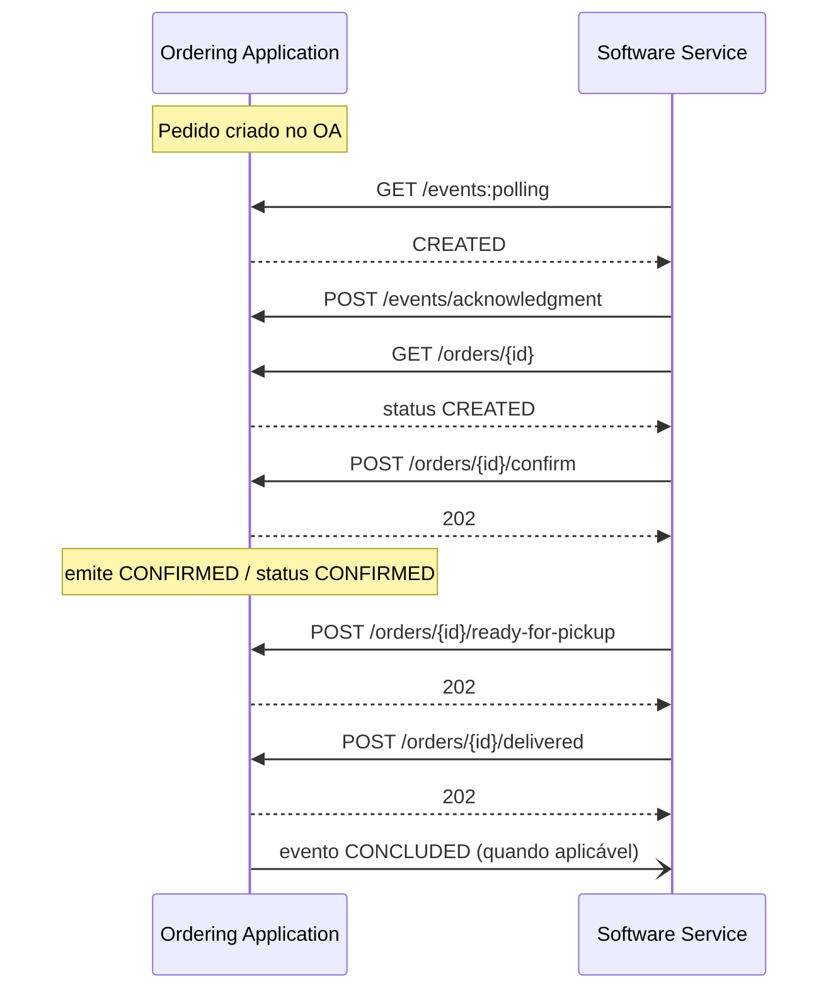
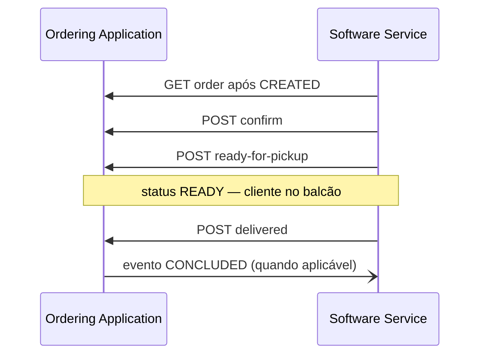
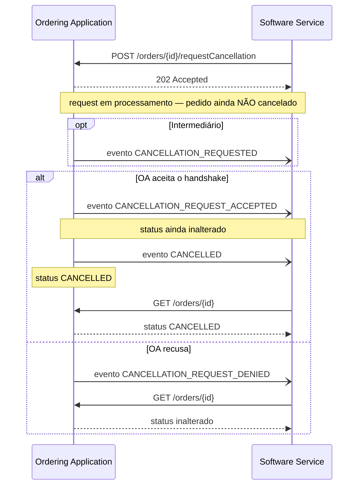
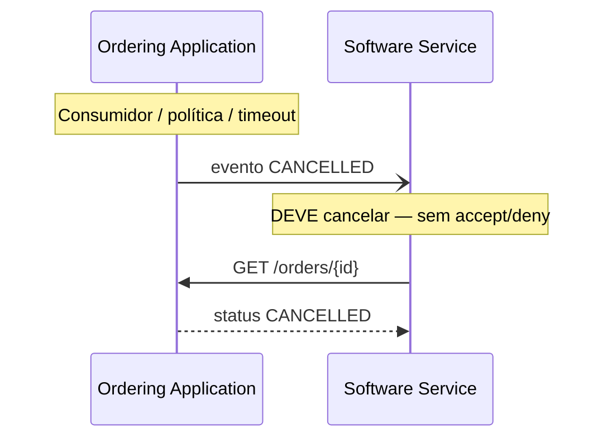
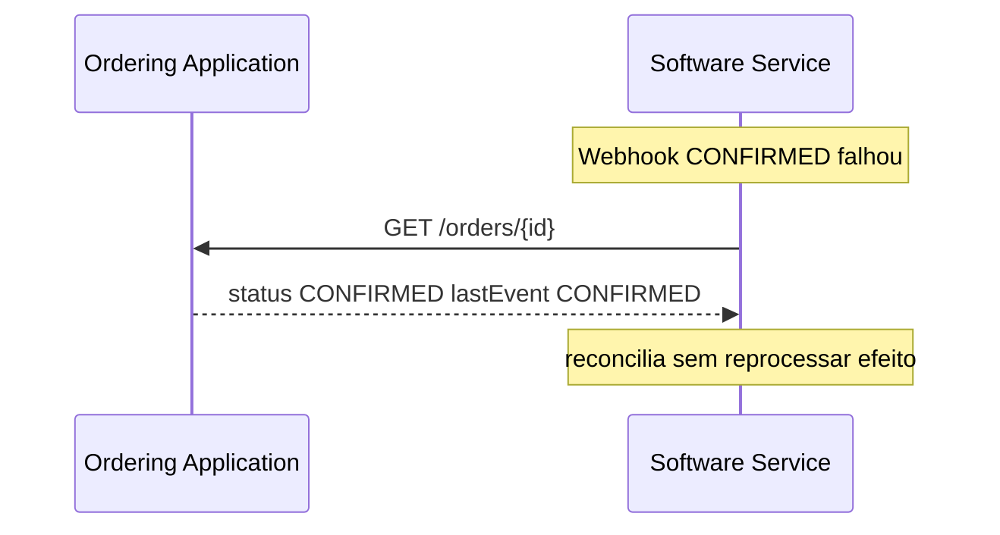

# Orders / Pedidos

<p class="od-meta">
 <span class="od-badge od-badge--core">Capability</span>
 <span class="od-badge od-badge--code">orders</span>
</p>

!!! note "Especificação da API"
    O contrato implementável (endpoints, campos, erros e exemplos) está na **[especificação de Orders](../reference/orders.md)** — somente em inglês.

Esta página é o **guia de leitura**: conceitos, papéis, status × eventos, fluxos e checklists. O contrato de campos e endpoints está na especificação da API (nota acima).

!!! note "Chamada repetida no ciclo de vida"
    Se a operação **já foi aplicada** (ex.: confirm com pedido já `CONFIRMED`), o host **retorna `202`** — não `409`/`422` só por duplicidade. Ver [Convenções](../reference/conventions.md#duplicidade-de-operacoes-de-ciclo-de-vida) e a [especificação Orders](../reference/orders.md).

---

## Para que serve

Orders é a capability **mais usada** do Open Delivery na V1 e continua sendo o eixo do ciclo de vida do pedido na V2: como a **Ordering Application** (marketplace, app, totem) e o **Software Service** (PDV / gestão) combinam criação, confirmação, preparo, entrega/retirada, cancelamento e encerramento — de forma interoperável, sem integração ponto a ponto.

Sem um padrão:

- cada plataforma inventava eventos e “status” misturados;
- cancelamento virava handshake confuso;
- PDVs quebravam em confirmação duplicada;
- logística e salão redefiniam o estado do pedido de formas incompatíveis.

Orders define **status consultável**, **eventos imutáveis**, **perfis** (`DELIVERY`, `TAKEOUT`, `INDOOR`) e operações de progressão assíncronas.

### Relação com outras capabilities

| Capability | Precisa de Orders? |
|---|---|
| **Indoor** | **Sim — obrigatório.** Indoor é extensão de Orders; a conta nasce a partir de pedido `fulfillment.orderType: INDOOR`. |
| **Merchant** | Não. Opera sozinha (cardápio, loja). Melhor cenário: junto com Orders. |
| **Logistics** | Não. Opera sozinha (cotação, despacho, tracking). Eventos logísticos **não** redefinem o status do pedido. |
| **Customer** | Não. Opera sozinha (dados do cliente; Software CRM consome). Tem **endpoints próprios** para troca/ingestão de pedidos no contexto de relacionamento; a **estrutura de dados do pedido é a mesma** desta capability. |

---

## O que muda da V1 para a V2

!!! important "Breaking — leia antes de migrar"
    Abaixo estão as mudanças que mais impactam quem já implementa Orders na V1. Detalhe de migração também em [Migração V1→V2](../guide/migration-v1-v2.md).

| Tema | V1 | V2 |
|---|---|---|
| **Cancelamento (originador → SS)** | Handshake opcional: `ORDER_CANCELLATION_REQUEST` + accept/deny **ou** cancel mandatório | **Só cancel mandatório:** OA emite `CANCELLED` (sem accept/deny) |
| **Cancelamento (SS → OA)** | `requestCancellation` → desfecho por eventos | **Mantido** + `CANCELLATION_REQUEST_ACCEPTED` → depois `CANCELLED` (ou denied) |
| **Evento `PICKED_UP`** | Ambíguo (retirada do cliente × coleta logística) | **Removido** |
| **Status × eventos** | Frequentemente confundidos | **Status** no GET é fonte de verdade; **eventos** são notificações |
| **Confirmação duplicada** | Muitos hosts respondiam `422` | **`202` se já estiver no estado alvo** (caso Keeta / comitê 26/03) |
| **Create HTTP** | Não havia `POST /orders` | Continua **sem** create — entrada por evento `CREATED` + GET |
| **Merchant id** | Muitas vezes gerado pelo PDV | Id do **originador** + `externalCode` do PDV |

Não existe `POST /orders` para “criar pedido” na API do protocolo — **nem no Indoor**. O pedido é originado no sistema da Ordering Application e anunciado por **evento**.

---

## Papéis

| Papel | Responsabilidade |
|---|---|
| **Ordering Application** | Origina o pedido. **Hospeda** polling, `GET /orders/{id}` e operações de progressão (modelo marketplace, igual à V1). Emite eventos. |
| **Software Service** | Sistema do restaurante. **Consome** eventos (polling e/ou webhook), busca o snapshot, chama confirm/preparing/… É a autoridade operacional na loja. |
| **Delivery Platform** (opcional) | Executa a entrega. Emite fatos de tracking **informativos** — sem redefinir `order.status`. Ver [Logistics](logistics.md). |

Em todas as operações de lifecycle do modelo clássico, a **Ordering Application é o host** e o Software Service é o cliente (como na V1).

---

## Discovery

Participantes que expõem Orders **DEVEM** declarar `capabilities.orders` no well-known.
No modelo V2, a declaração é feita por papel (`originator` e/ou `receiver`), com
operações/eventos suportados e modos de entrega (`supportsWebhook` / `supportsPolling`).

```json
"capabilities": {
  "orders": {
    "version": "1.0.0",
    "supported": true,
    "receiver": {
      "supported": true,
      "supportedOperations": ["confirmOrder", "requestCancellation", "getOrder", "setOrderPreparing", "setOrderReadyForPickup", "dispatchOrder", "setOrderDelivered"],
      "unsupportedOperations": [],
      "supportsWebhook": true,
      "supportsPolling": true
    }
  }
}
```

### Correlação V1 (`sendXXX`) → Discovery V2

| V1 (legado) | Como declarar na V2 (Discovery) |
|---|---|
| `sendPreparing` | `capabilities.orders.receiver.supportedOperations` contém `setOrderPreparing` |
| `sendReadyForPickup` | `supportedOperations` contém `setOrderReadyForPickup` |
| `sendDispatch` | `supportedOperations` contém `dispatchOrder` |
| `sendDelivered` | `supportedOperations` contém `setOrderDelivered` |
| `sendTracking` | `supportedOperations` contém `sendOrderTracking` |
| `sendPickedUp` | **Depreciado/removido** em V2; não declarar nem esperar em integração |

Além de `supportedOperations`, use `unsupportedOperations` para explicitar lacunas.
Para emissão/consumo de eventos, declare também `supportedEvents`/`unsupportedEvents`
no papel aplicável (`originator`/`receiver`).

Guia: [Discovery](discovery.md). Contrato: [especificação Discovery](../reference/discovery.md).

---

## Status vs eventos {#status-vs-eventos}

Este é o ponto que **mais gera erro de integração**. Vale ler com calma.

### Definições

| Conceito | O que é | Onde está a verdade |
|---|---|---|
| **Status** | Condição de negócio **atual** do pedido | Campo `status` em `GET /orders/{orderId}` |
| **Evento** | Fato **imutável** notificado (algo aconteceu) | Payload de polling ou webhook (`eventId`, `eventType`) |



**Regras:**

1. **Nunca** use a sequência de eventos sozinha como estado final — se um evento se perdeu, o GET corrige.
2. **Nunca** trate `202 Accepted` do POST de progressão como “já mudou o status”.
3. Eventos **podem** projetar mudança de status (`CONFIRMED` → `status: CONFIRMED`) **ou** ser só informativos (`PICKUP_ONGOING` mantém `READY` / `IN_DELIVERY`).
4. Eventos **não** são comandos. Comandos são os `POST` de lifecycle.
5. Deduplique por `eventId`. Não assuma ordem estrita de entrega.

### Anti-padrões (V1 que a V2 corrige)

| Anti-padrão | Por que quebra | Faça assim |
|---|---|---|
| Inferir status só pela lista de eventos | Evento perdido / reordenado | `GET /orders/{id}` |
| Tratar segundo `confirm` como erro `422` | PDVs com confirmação dupla param o fluxo | `202` se já `CONFIRMED` |
| Usar `PICKED_UP` para takeout e logística | Significados opostos | Removido; use `DELIVERED` ou eventos de Logistics |
| Achar que `requestCancellation` já cancelou | 202 ≠ cancelado | Só status/evento `CANCELLED` conta |
| Esperar accept/deny no cancel do originador | Handshake OA removido na V2 | OA emite `CANCELLED` mandatório |

---

## Ciclo de vida — status {#ciclo-de-vida-status}



| Status | Significado |
|---|---|
| `CREATED` | Pedido registrado, aguardando confirmação |
| `CONFIRMED` | Estabelecimento aceitou |
| `PREPARING` | Preparo em andamento |
| `READY` | Pronto para coleta/despacho/serviço |
| `IN_DELIVERY` | Em trânsito (perfil DELIVERY) |
| `DELIVERED` | Cliente recebeu / retirou / foi servido |
| `CANCELLED` | Cancelado |
| `CONCLUDED` | Encerramento lógico emitido pelo originador (sem endpoint dedicado) |

---

## Como o pedido entra no protocolo

**Não há `POST /orders`.** Fluxo canônico:

1. A Ordering Application cria o pedido no **seu** sistema.
2. Emite evento **`CREATED`** (polling e/ou webhook).
3. O Software Service faz ACK (se polling) e chama **`GET /orders/{orderId}`**.
4. A progressão segue com `POST …/confirm`, etc., no host da Ordering Application.
5. Cada fato relevante gera novo evento; o `status` no GET permanece a reconciliação.

Para **Indoor** (`fulfillment.orderType: INDOOR`): o mesmo fluxo. Ao processar o pedido INDOOR, o Software Service **abre ou alimenta a conta** de salão (extension Indoor). Itens seguintes = novos pedidos INDOOR na mesma chave operacional — sempre via evento + GET, nunca via create HTTP.

---

## Mapa: objetivo → operação na especificação

| Objetivo | Operação | Onde na spec |
|---|---|---|
| Receber fatos novos | `GET /events:polling` | `pollingEvents` |
| Confirmar leitura no polling | `POST /events/acknowledgment` | `acknowledgeEvents` |
| Receber push | Webhook `orderEvent` | `receiveOrderEvent` |
| Snapshot / status | `GET /orders/{orderId}` | `getOrder` |
| Confirmar | `POST …/confirm` | `confirmOrder` |
| Preparo | `POST …/preparing` | `setOrderPreparing` |
| Pronto | `POST …/ready-for-pickup` | `setOrderReadyForPickup` |
| Despacho | `POST …/dispatch` | `dispatchOrder` |
| Entregue | `POST …/delivered` | `setOrderDelivered` |
| Solicitar cancel (merchant) | `POST …/requestCancellation` | `requestCancellation` |
| Cancel mandatório (originador) | Evento `CANCELLED` (sem HTTP de accept/deny) | — |
| Encerrar logicamente | Evento `CONCLUDED` emitido pelo originador | — |

Todos os links abrem a [Especificação da API Orders](../reference/orders.md).

---

## Canais de eventos: polling e webhook

Ambos são válidos; o Discovery declara o que a contraparte suporta.

| Canal | Host | Quem chama |
|---|---|---|
| **Polling** | Ordering Application | Software Service (periodicamente) |
| **Webhook** | Software Service | Ordering Application (push) |



**Reconciliação:** se o webhook falhar ou o polling atrasar, use `GET /orders/{id}` e o campo `lastEvent` quando disponível.

---

## Matrizes de eventos por perfil {#matrizes-de-eventos-por-perfil}

<div class="od-matrix__legend">
 <span><span class="od-badge od-badge--must">MUST</span> obrigatório</span>
 <span><span class="od-badge od-badge--may">MAY</span> opcional</span>
 <span><span class="od-badge od-badge--mustnot">MUST NOT</span> proibido — rejeitar com 422</span>
</div>

### Perfil DELIVERY {#perfil-delivery}

<div class="od-matrix" markdown>
<div class="od-matrix__scroll" markdown>

| Evento | Status projetado | Obrigatoriedade | Observações |
|---|---|---|---|
| `CREATED` | `CREATED` | <span class="od-badge od-badge--must">MUST</span> | Entrada do pedido |
| `CONFIRMED` | `CONFIRMED` | <span class="od-badge od-badge--must">MUST</span> | Após confirm |
| `PREPARATION_REQUESTED` | (inalterado) | <span class="od-badge od-badge--may">MAY</span> | Informativo / on-demand |
| `PREPARING` | `PREPARING` | <span class="od-badge od-badge--may">MAY</span> | |
| `READY_FOR_PICKUP` | `READY` | <span class="od-badge od-badge--may">MAY</span> | Pronto para o courier |
| `PICKUP_ONGOING` | (inalterado) | <span class="od-badge od-badge--may">MAY</span> | Logística informativa |
| `RIDER_ARRIVED_AT_STORE` | (inalterado) | <span class="od-badge od-badge--may">MAY</span> | Logística informativa |
| `DISPATCHED` | `IN_DELIVERY` | <span class="od-badge od-badge--may">MAY</span> | Possível depreciação futura |
| `ORDER_COLLECTED` | `IN_DELIVERY` | <span class="od-badge od-badge--may">MAY</span> | Full-service logistics |
| `DELIVERY_ONGOING` | (inalterado) | <span class="od-badge od-badge--may">MAY</span> | Informativo |
| `ARRIVED_AT_CUSTOMER` | (inalterado) | <span class="od-badge od-badge--may">MAY</span> | Informativo |
| `DELIVERED` | `DELIVERED` | <span class="od-badge od-badge--must">MUST</span> | Cliente recebeu |
| `CANCELLATION_REQUESTED` | (inalterado) | <span class="od-badge od-badge--may">MAY</span> | Pedido do merchant em processamento |
| `CANCELLATION_REQUEST_ACCEPTED` | (inalterado) | <span class="od-badge od-badge--may">MAY</span> | Handshake aceito; **depois** `CANCELLED` |
| `CANCELLATION_REQUEST_DENIED` | (inalterado) | <span class="od-badge od-badge--may">MAY</span> | Handshake recusado |
| `CANCELLED` | `CANCELLED` | <span class="od-badge od-badge--must">MUST</span> | Cancelamento final |
| `CONCLUDED` | `CONCLUDED` | <span class="od-badge od-badge--may">MAY</span> | Timing definido pelo originador |

</div>
</div>

### Perfil TAKEOUT {#perfil-takeout}

<div class="od-matrix" markdown>
<div class="od-matrix__scroll" markdown>

| Evento | Status projetado | Obrigatoriedade | Observações |
|---|---|---|---|
| `CREATED` | `CREATED` | <span class="od-badge od-badge--must">MUST</span> | |
| `CONFIRMED` | `CONFIRMED` | <span class="od-badge od-badge--must">MUST</span> | |
| `PREPARATION_REQUESTED` | (inalterado) | <span class="od-badge od-badge--may">MAY</span> | |
| `PREPARING` | `PREPARING` | <span class="od-badge od-badge--may">MAY</span> | |
| `READY_FOR_PICKUP` | `READY` | <span class="od-badge od-badge--must">MUST</span> | Aguardando retirada |
| Eventos de courier / rota | — | <span class="od-badge od-badge--mustnot">MUST NOT</span> | Sem logística externa |
| `DELIVERED` | `DELIVERED` | <span class="od-badge od-badge--must">MUST</span> | Cliente retirou |
| `CANCELLATION_REQUESTED` | (inalterado) | <span class="od-badge od-badge--may">MAY</span> | |
| `CANCELLATION_REQUEST_ACCEPTED` | (inalterado) | <span class="od-badge od-badge--may">MAY</span> | Depois `CANCELLED` |
| `CANCELLATION_REQUEST_DENIED` | (inalterado) | <span class="od-badge od-badge--may">MAY</span> | |
| `CANCELLED` | `CANCELLED` | <span class="od-badge od-badge--must">MUST</span> | |
| `CONCLUDED` | `CONCLUDED` | <span class="od-badge od-badge--may">MAY</span> | Timing definido pelo originador |

</div>
</div>

### Perfil INDOOR {#perfil-indoor}

<div class="od-matrix" markdown>
<div class="od-matrix__scroll" markdown>

| Evento | Status projetado | Obrigatoriedade | Observações |
|---|---|---|---|
| `CREATED` | `CREATED` | <span class="od-badge od-badge--must">MUST</span> | Abre/alimenta conta Indoor no SS |
| `CONFIRMED` | `CONFIRMED` | <span class="od-badge od-badge--must">MUST</span> | |
| `PREPARING` / `READY_FOR_PICKUP` | conforme evento | <span class="od-badge od-badge--may">MAY</span> | Modelo de salão costuma ser mais simples |
| Eventos de logística | — | <span class="od-badge od-badge--mustnot">MUST NOT</span> | |
| `DELIVERED` | `DELIVERED` | <span class="od-badge od-badge--may">MAY</span> | Servido na mesa/balcão |
| `CANCELLATION_REQUESTED` | (inalterado) | <span class="od-badge od-badge--may">MAY</span> | |
| `CANCELLATION_REQUEST_ACCEPTED` | (inalterado) | <span class="od-badge od-badge--may">MAY</span> | Depois `CANCELLED` |
| `CANCELLATION_REQUEST_DENIED` | (inalterado) | <span class="od-badge od-badge--may">MAY</span> | |
| `CANCELLED` | `CANCELLED` | <span class="od-badge od-badge--must">MUST</span> | |
| `CONCLUDED` | `CONCLUDED` | <span class="od-badge od-badge--may">MAY</span> | Timing definido pelo originador |

</div>
</div>

!!! note "Conta Indoor ≠ status do pedido"
    Eventos `ACCOUNT_*`, pagamentos e fiscal estão só na [extensão Indoor](indoor.md). O pedido continua com seu próprio `status`.

---

## Cancelamento — dois caminhos (não misturar)

Na V1 existem **dois** fluxos de cancelamento. A V2 **mantém o handshake do merchant** e **elimina o handshake do originador**.

### A — Software Service inicia (merchant quer cancelar) — **handshake mantido**

```
POST /orders/{id}/requestCancellation
```

Host: **Ordering Application**. Quem chama: **Software Service**.

| Campo do body | Descrição |
|---|---|
| `reason` | Texto livre |
| `code` | Motivo máquina (ex.: `UNAVAILABLE_ITEM`) |
| `mode` | `AUTO` ou `MANUAL` |

O `202` significa que o **pedido de cancelamento foi aceito para processamento** — **não** que o pedido está cancelado.

Desfechos por **evento** (polling/webhook):

| Evento | Significado | Status do pedido |
|---|---|---|
| `CANCELLATION_REQUESTED` | MAY — solicitação registrada | Inalterado |
| `CANCELLATION_REQUEST_ACCEPTED` | OA **aceitou** o pedido de cancelamento | Inalterado |
| `CANCELLATION_REQUEST_DENIED` | OA recusou o pedido do merchant | Inalterado |
| `CANCELLED` | Pedido efetivamente cancelado | `CANCELLED` |

**Quando o handshake é aceito:** a Ordering Application **DEVE** emitir `CANCELLATION_REQUEST_ACCEPTED` e, em seguida, **`CANCELLED`** (com `status: CANCELLED`). Aceitar a solicitação **não** substitui o evento final. O Software Service **só** considera o pedido cancelado com status/evento **`CANCELLED`** — `CANCELLATION_REQUEST_ACCEPTED` sozinho **não** encerra o ciclo.

### B — Ordering Application inicia (originador) — **só cancel mandatório**

Na V1 o originador podia:

1. **Cancel mandatório** — emitir `CANCELLED` direto (SS obrigado a cancelar), ou  
2. **Handshake** — evento `ORDER_CANCELLATION_REQUEST` + `acceptCancellation` / `denyCancellation`.

Na **V2 o handshake do originador é removido**. Resta apenas o cancel **mandatório**:

- A OA **emite** o evento `CANCELLED` e define `status: CANCELLED`.
- O Software Service **DEVE** cancelar o pedido — **não** há accept/deny.
- Endpoints `acceptCancellation` / `denyCancellation` e o evento `ORDER_CANCELLATION_REQUEST` **saem** do core.

Motivos típicos: cancelamento do consumidor, política da plataforma, fraude, timeout, etc.

---

## Fluxos

### Delivery (caminho feliz)



### Takeout



### Cancelamento A — merchant solicita (handshake)



### Cancelamento B — originador (mandatório)



### Evento perdido → reconciliação



---

## Regras normativas e checklists

**O host (Ordering Application) DEVE:**

- Expor `GET /orders/{id}` com `status` autoritativo
- Retornar `202` em mutações (e em duplicidade já aplicada)
- Emitir eventos coerentes com a matriz do perfil
- Manter handshake de `requestCancellation` (`CANCELLATION_REQUEST_ACCEPTED` + `CANCELLED`, ou `CANCELLATION_REQUEST_DENIED`)
- No cancel do originador: só mandatório (`CANCELLED`); sem `ORDER_CANCELLATION_REQUEST`
- Remover `PICKED_UP` do core V2

**O Software Service DEVE:**

- Deduplicar eventos por `eventId`
- Fazer ACK no polling (inclusive de tipos que não usa)
- Não tratar `202` de `requestCancellation` como pedido cancelado
- Aplicar cancel mandatório do originador sem fluxo de accept/deny
- Para Indoor: processar `fulfillment.orderType: INDOOR` e gerir a conta conforme [Indoor](indoor.md)
- Migrar payload legado: não usar `Order.type` na raiz; usar `Order.fulfillment.orderType`

!!! tip "Checklist — Ordering Application"
    - [ ] Polling e/ou webhook declarados no Discovery  
    - [ ] `CREATED` emite com `orderURL` utilizável  
    - [ ] Confirm duplicado → `202`  
    - [ ] Handshake aceito → `CANCELLATION_REQUEST_ACCEPTED` **depois** `CANCELLED`  
    - [ ] Handshake recusado → `CANCELLATION_REQUEST_DENIED`  

    - [ ] Cancel do originador = só evento/status `CANCELLED`  
    - [ ] Sem `ORDER_CANCELLATION_REQUEST` / accept / deny  
    - [ ] Sem `PICKED_UP`  

!!! tip "Checklist — Software Service"
    - [ ] Consome `CREATED` → GET completo  
    - [ ] Nunca infere status só por eventos  
    - [ ] `requestCancellation` 202 ≠ cancelado  
    - [ ] `CANCELLATION_REQUEST_ACCEPTED` ≠ cancelado final  
    - [ ] Trata `CANCELLED` (handshake ou mandatório OA)  
    - [ ] Indoor só com Orders ativo  
    - [ ] Trata `202` de lifecycle como assíncrono  

---

## Fora do MVP (V2.1+)

| Tema | Status |
|---|---|
| Depreciação final de `DISPATCHED` | Em revisão no comitê |
| Cancelamento parcial de item no delivery (fora Indoor) | Indoor já tem cancel de item na conta |
| Custom fields / key-value livres no pedido | **Fora do MVP** (comitê) |
| Handshake do originador (`ORDER_CANCELLATION_REQUEST` + accept/deny) | Removido; só cancel mandatório da OA |
| Tracking fino de entrega | Capability [Logistics](logistics.md) |

---

<div class="od-related">
  <p class="od-related__label">Relacionado</p>
  <ul class="od-related__list">
    <li><a href="../reference/orders.md">Especificação de Orders</a> — endpoints, schemas e erros</li>
    <li><a href="indoor.md">Indoor</a> — extensão de salão (exige Orders)</li>
    <li><a href="logistics.md">Logistics</a> — tracking sem redefinir status</li>
    <li><a href="customer.md">Customer</a> — CRM; mesmo shape de pedido em endpoints futuros</li>
    <li><a href="../guide/migration-v1-v2.md">Migração V1→V2</a></li>
    <li><a href="../reference/conventions.md">Regras gerais</a> — duplicidade de ciclo de vida</li>
  </ul>
</div>
