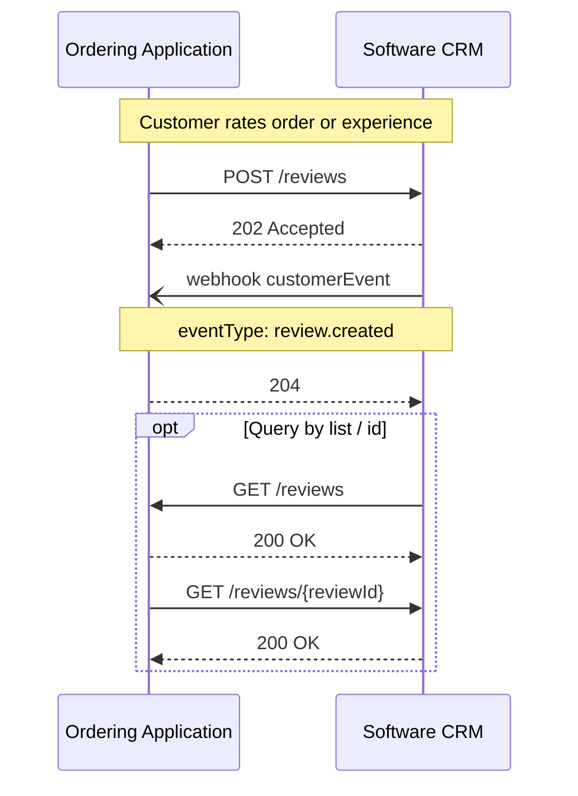

# Reviews

<p class="od-meta">
 <span class="od-badge od-badge--core">Module</span>
 <span class="od-badge od-badge--code">customer · reviews</span>
 <span class="od-badge">parent: Customer</span>
 <span class="od-badge od-badge--new">New in V2</span>
</p>

!!! note "API Spec"
    The implementable contract is in the **[Customer API Spec](../reference/customer.md)** (Reviews tag) — English only.

**Reviews** is a **module** of the [Customer](customer.md) capability — not a Discovery extension and not a separate capability.

Parties MAY implement **only** the review endpoints of this capability, without full leads/order sync or without Loyalty. In Discovery, declare those operations under `customer`.

---

## What it is for

Standardizes exchange and query of **customer reviews** between the Ordering Application and the Customer host (often **Software CRM** or a quality tool): scores, question categories, and free text — without imposing a single market questionnaire.

Without a standard, each integration negotiated scales (stars, NPS, thumbs), simple vs categorized reviews, and how to bind order, merchant, and customer.

!!! info "What Reviews does NOT standardize"
    Survey triggering (timing, channel, QR), editorial moderation, multi-channel aggregation (Google, marketplaces), and internal scoring — each implementation’s concern.

---

## Roles

| Role | Responsibility |
|---|---|
| **Ordering Application** | Origins or collects the review (app, kiosk, post-order, dining). **Sends** reviews to the host. |
| **Software CRM** (or reviews host) | **Consumes** reviews for quality/NPS; MAY **query** history. |

---

## Key concepts

### Review

| Aspect | V2 guidance |
|---|---|
| Scales | Stars, NPS (0–10), like/dislike — model accommodates all three |
| Overall | Optional overall score (or as a question type) |
| Categories / questions | **Open** vocabulary (string), not a closed protocol enum |
| Identifiers | `merchantId` often relevant; `orderId` frequently missing in the real world |
| Customer | Prefer binding when an identifier exists |

### Event

| Event | Trigger |
|---|---|
| `review.created` | Review submitted |

Events are **facts**, processed idempotently.

---

## Typical flow



Spec operations: `listReviews`, `createReviews`, `getReviewById`.

---

## Relation to other Customer modules

| Module | Role |
|---|---|
| **Customer data** (core) | Identity, leads, relationship-context orders |
| **Reviews** (this) | Ratings |
| **Loyalty** | Programs, balance, redemption, coupons |

All three are modules of the **same** `customer` capability. They MAY be adopted **independently** (reviews only, loyalty only, core only) via `supportedOperations`.

---

## Discovery

Declare Reviews operations under `customer` — **not** as a separate extension:

```json
"capabilities": {
  "customer": {
    "endpoint": "https://api.example.com/od/v2",
    "supportedOperations": ["listReviews", "createReviews", "getReviewById"]
  }
}
```

---

<div class="od-related">
  <p class="od-related__label">Related</p>
  <ul class="od-related__list">
    <li><a href="../reference/customer.md">Customer API Spec</a></li>
    <li><a href="customer.md">Customer</a> — overview</li>
    <li><a href="loyalty.md">Loyalty</a></li>
    <li><a href="discovery.md">Discovery</a></li>
  </ul>
</div>
