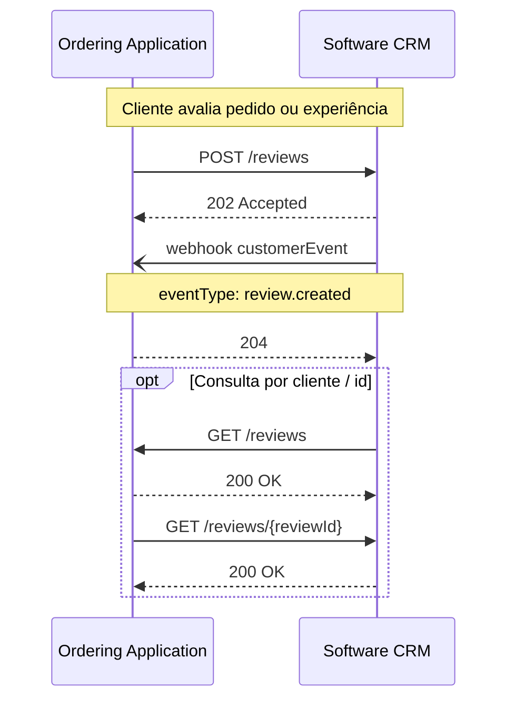

# Reviews

<p class="od-meta">
 <span class="od-badge od-badge--core">Módulo</span>
 <span class="od-badge od-badge--code">customer · reviews</span>
 <span class="od-badge">pai: Customer</span>
 <span class="od-badge od-badge--new">Novo na V2</span>
</p>

!!! note "Especificação da API"
    O contrato implementável está na **[especificação de Customer](../reference/customer.md)** (tag Reviews) — somente em inglês.

**Reviews** é um **módulo** da capability [Customer](customer.md) — não é extensão Discovery nem capability separada.

É permitido implementar **somente** os endpoints de avaliações desta capability, sem o núcleo completo de leads/pedidos ou sem Loyalty. No Discovery, declare as operações sob `customer`.

---

## Para que serve

Padroniza envio e consulta de **avaliações** entre a Ordering Application e o host de Customer (em geral um **Software CRM** ou ferramenta de qualidade): notas, categorias de pergunta e texto livre — sem impor um questionário único do mercado.

Sem um padrão, cada integração negociava escala (estrelas, NPS, like/dislike), se a avaliação é simples ou categorizada, e como amarrar pedido, merchant e cliente.

!!! info "O que Reviews NÃO padroniza"
    Disparo de pesquisa (timing, canal, QR), moderação editorial, agregação multi-canal (Google, marketplaces) e score interno — ficam a cargo de cada implementação.

---

## Papéis

| Papel | Responsabilidade |
|---|---|
| **Ordering Application** | Origina ou coleta a avaliação (app, totem, pós-pedido, salão). **Envia** avaliações ao host. |
| **Software CRM** (ou host de reviews) | **Consome** avaliações para qualidade/NPS; pode **consultar** histórico. |

---

## Conceitos-chave

### Avaliação (`Review`)

| Aspecto | Diretriz V2 |
|---|---|
| Escalas | Estrelas, NPS (0–10), like/dislike — o modelo acomoda os três |
| Overall | Nota geral opcional (ou como tipo de pergunta) |
| Categorias / perguntas | Vocabulário **aberto** (string), não enum fechado do protocolo |
| Identificadores | `merchantId` relevante na prática; `orderId` frequentemente ausente |
| Cliente | Preferir vínculo com o cliente quando houver identificador |

### Evento

| Evento | Gatilho |
|---|---|
| `review.created` | Avaliação submetida |

Eventos são **fatos**, processados de forma idempotente.

---

## Fluxo típico



Operações na spec: `listReviews`, `createReviews`, `getReviewById`.

---

## Relação com outros módulos de Customer

| Módulo | Papel |
|---|---|
| **Dados do cliente** (núcleo) | Identidade, leads, pedidos no contexto de relacionamento |
| **Reviews** (este) | Avaliações |
| **Loyalty** | Programas, saldo, resgate, cupons |

Os três são módulos da **mesma** capability `customer`. Podem ser adotados de forma **independente** (só reviews, só loyalty, só núcleo) conforme `supportedOperations`.

---

## Discovery

Declare operações de Reviews sob `customer` — **não** como extensão separada:

```json
"capabilities": {
  "customer": {
    "endpoint": "https://api.example.com/od/v2",
    "supportedOperations": ["listReviews", "createReviews", "getReviewById"]
  }
}
```

---

<div class="od-related">
  <p class="od-related__label">Relacionado</p>
  <ul class="od-related__list">
    <li><a href="../reference/customer.md">Especificação de Customer</a></li>
    <li><a href="customer.md">Customer</a> — visão geral</li>
    <li><a href="loyalty.md">Loyalty</a></li>
    <li><a href="discovery.md">Discovery</a></li>
  </ul>
</div>
