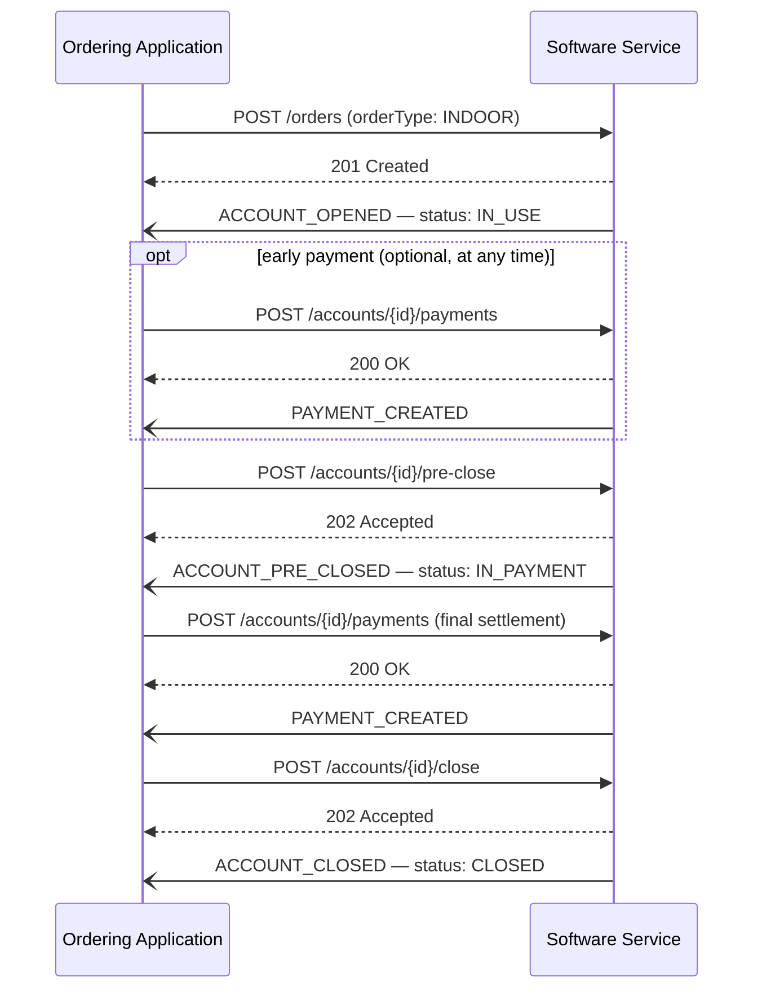
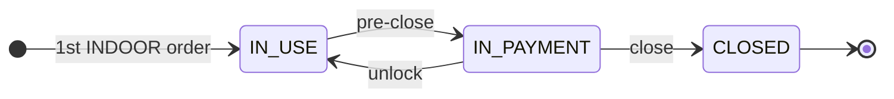
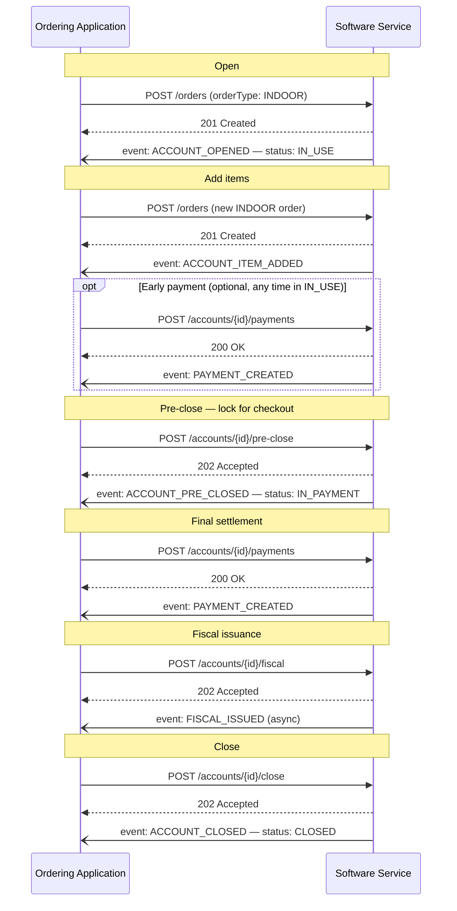
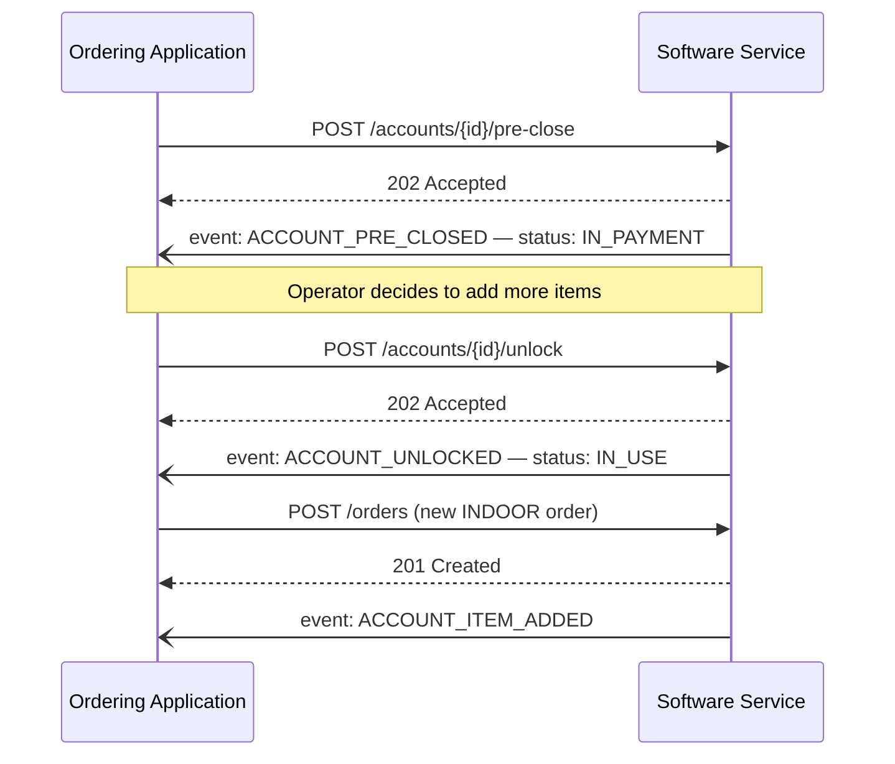
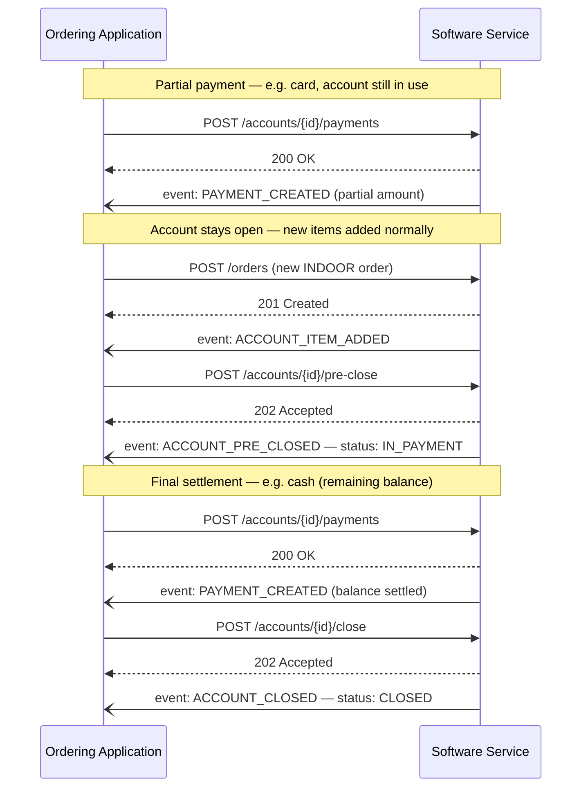
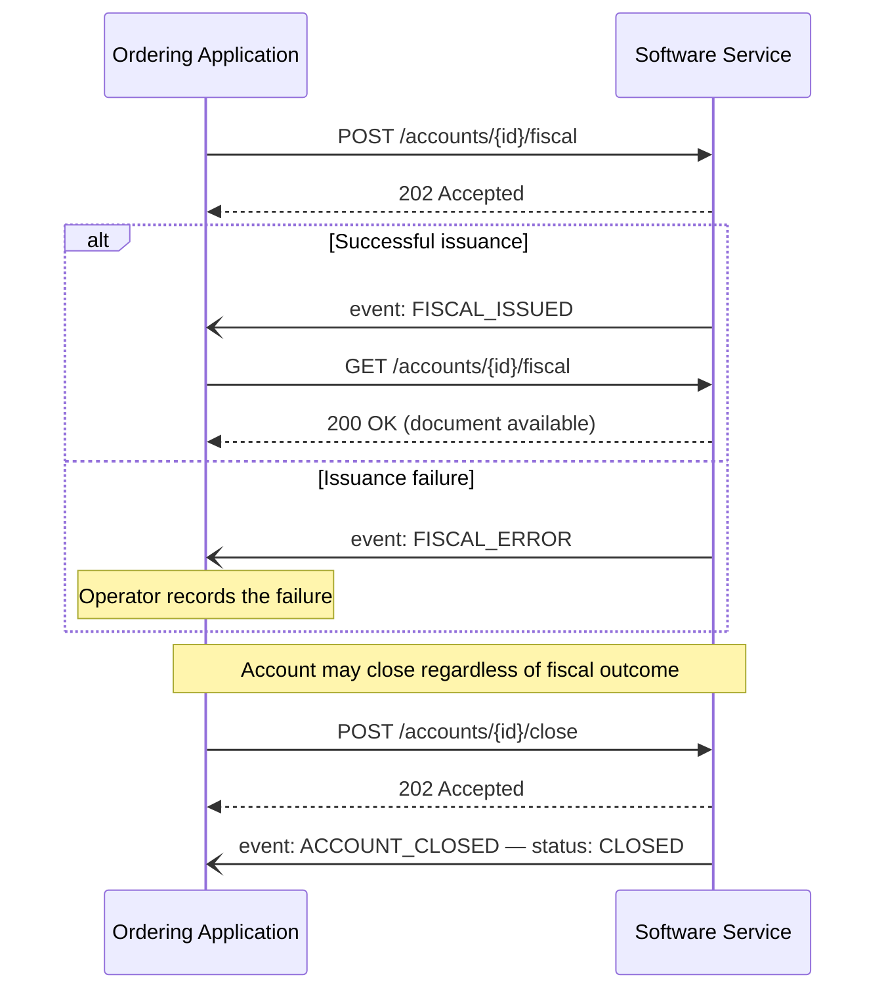
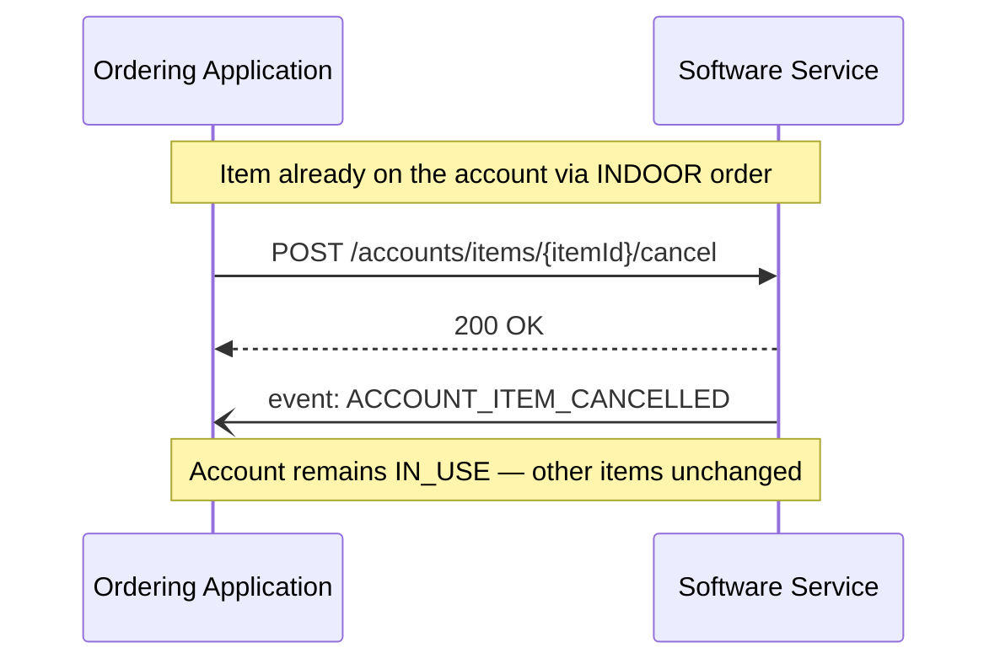
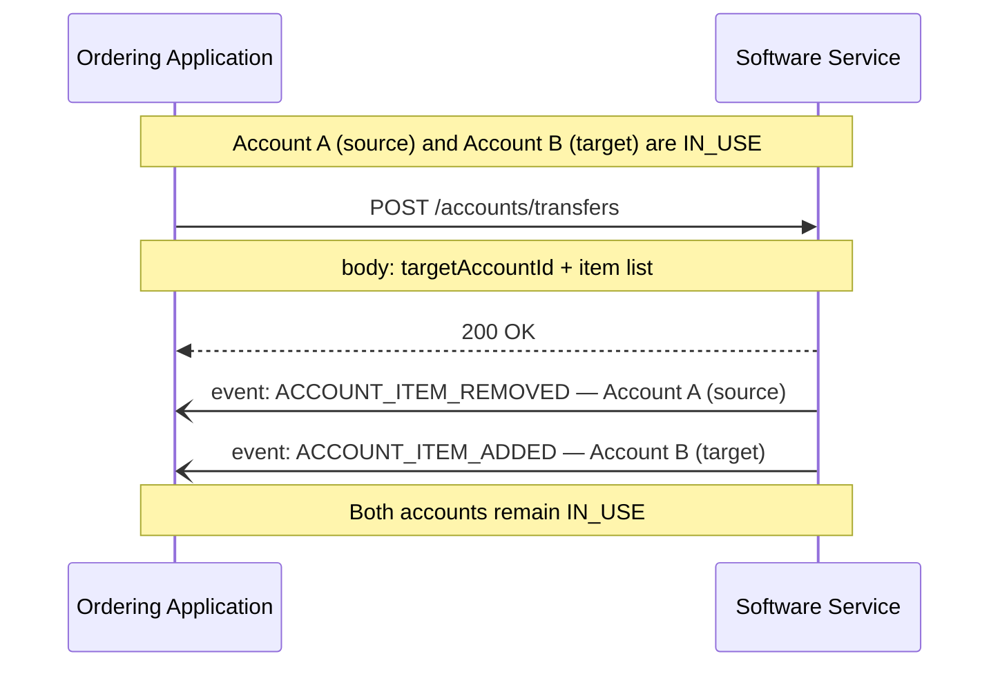

## User

quero começar a melhorar o conteudo das paginas.

## Assistant

Vamos entender o projeto e o conteúdo atual das páginas para definir por onde melhorar.

## Tools

- ListDir: /home/guilherme/Dev/opendelivery-v2
- Execute: find . -type f \( -name "*.md" -o -name "README*" -o -name "AGENTS.md" -o -name "*.tsx" -o -name "*.ts" -o -name "*.json" \) | head -80; ls -la (Explore project structure and key files)
- Read: /home/guilherme/Dev/opendelivery-v2/STRUCTURE.md
- Read: /home/guilherme/Dev/opendelivery-v2/docs/index.md
- Read: /home/guilherme/Dev/opendelivery-v2/mkdocs.yml
- Execute: wc -l docs/**/*.md docs/*.md 2>/dev/null | sort -n; echo "---"; head -100 session-export.md (Count lines and check session export)

## Assistant

Vou amostrar as páginas principais e o que já saiu da sessão anterior, para mapear onde o conteúdo está fraco e priorizar melhorias.

## Tools

- Read: /home/guilherme/Dev/opendelivery-v2/docs/protocol/orders.md (1-100)
- Read: /home/guilherme/Dev/opendelivery-v2/docs/guide/getting-started.md
- Read: /home/guilherme/Dev/opendelivery-v2/docs/documentation/core-concepts.md
- Read: /home/guilherme/Dev/opendelivery-v2/docs/overview.md (1-80)
- Execute: rg -n -i "conteúdo|content|melhor|sugest|página|página" session-export.md | head -80; echo "===="; ls -la artifacts/ 2>/dev/null; ls artifacts/comites_extract 2>/dev/null | head -5 (Find prior content recommendations in session)
- Read: /home/guilherme/Dev/opendelivery-v2/docs/protocol/merchant.md
- Read: /home/guilherme/Dev/opendelivery-v2/docs/protocol/flows.md
- Read: /home/guilherme/Dev/opendelivery-v2/session-export.md
- Read: /home/guilherme/Dev/opendelivery-v2/docs/guide/by-role.md (1-80)
- Execute: echo "=== EN coverage ==="; for f in $(find docs -name '*.md' ! -name '*.en.md' ! -path '*/v1/*' ! -path '*/v2/*' ! -path '*/transport-bindings/*' | sort); do en="${f%.md}.en.md"; if [ -f "$en" ]; then echo "OK  $f"; else echo "MISS $f"; fi; done; echo; echo "=== Thin pages (<120 lines) ==="; find docs -name '*.md' ! -path '*/transport-bindings/*' ! -path '*/v1/*' ! -path '*/v2/*' -exec wc -l {} + | awk '$1<120 {print}' | sort -n; echo; echo "=== Language of overview ==="; head -20 docs/overview.md docs/protocol/principles.md docs/protocol/guidelines.md docs/protocol/flows.md docs/protocol/merchant.md (Map EN coverage and thin content pages)

## Assistant

Boa hora de focar em **conteúdo**. Já mapeei a doc e o estado real das páginas — abaixo um diagnóstico objetivo e um plano para começarmos sem espalhar esforço.

## Diagnóstico rápido

### O que já está bem
Páginas com estrutura clara, papéis, regras e próximo passo:

- Landing (`index.md`), **Primeiros Passos**, **Trilhas por papel**
- **Orders**, **Indoor**, **Customer**, **Loyalty**
- **Merchant** (visão geral), **PROTOCOL_VS_BINDING**
- Referência OpenAPI (deliberadamente enxuta + ReDoc)

### Problemas de conteúdo (por impacto)

| Prioridade | Problema | Exemplos |
|---|---|---|
| **P0** | Página em inglês no locale PT | `overview.md` inteiro em EN (site default é PT) |
| **P0** | Conteúdo raso / genérico | `flows.md` (só listas, sem diagramas), `evolution.md`, partes de `guidelines.md` |
| **P1** | Callouts genéricos | “Continue a jornada…” em várias páginas — pouco valor |
| **P1** | PT mais fraco que EN | `discovery.md` (~107 linhas) vs `discovery.en.md` (~295) |
| **P1** | Capabilities finas | `merchant-store.md`, `menu.md`, `reviews.md` vs Orders/Indoor |
| **P2** | EN ausente (fallback PT) | principles, flows, indoor, logistics, customer, by-role, core-concepts… |
| **P2** | Sobreposição conceitual | `core-concepts` × `overview` × `roles` — repetem atores/capabilities |

### Padrão de qualidade (meta)

Uma página de **Protocolo** boa, no estilo Orders/Merchant, costuma ter:

1. Badge + callout específico (o que a página cobre / link OpenAPI)
2. Visão geral em linguagem de negócio
3. Papéis e responsabilidades
4. Regras normativas (DEVE / NÃO DEVE)
5. Modelo de dados ou fluxos (tabela / Mermaid)
6. O que **não** cobre (limites)
7. Discovery / auth quando couber
8. Bloco “Próximo passo” com links reais

---

## Plano sugerido (em ondas)

### Onda 1 — Consistência e páginas “quebradas”
1. **Portar `overview.md` para PT** (alinhar com o resto do Guia)
2. **Reescrever `flows.md`** com Mermaid + perfil DELIVERY / TAKEOUT / INDOOR
3. **Alinhar `discovery.md` (PT)** ao nível do `.en.md` (sem perder o que o EN já tem de bom)
4. **Trocar callouts genéricos** por textos específicos por página

### Onda 2 — Capabilities que implementadores leem primeiro
5. **Merchant Store** + **Menus** (profundidade, sync, Merchant ID V2)
6. **Authentication** PT (já tem EN mais completo em partes)
7. **Logistics** e **Reviews** (preencher lacunas vs atas/comitês se aplicável)

### Onda 3 — Fundamentos + i18n
8. `guidelines`, `error-handling`, `evolution`, `principles` (claridade normativa)
9. Traduções EN das páginas prioritárias (orders/getting-started já existem)

---

## Por onde começar?

Recomendo a **Onda 1**, começando por **`overview.md` (PT) + `flows.md`**, porque:

- são páginas de entrada do Guia/Fundamentos;
- hoje passam a impressão de doc incompleta ou “misturada” de idioma;
- o ganho de percepção de qualidade é imediato.

Diz o que prefere e eu já implemento na sequência:

1. **Onda 1 completa** (overview PT + flows + discovery PT + callouts)  
2. **Só overview + flows** (rápido, alto impacto)  
3. **Uma capability específica** (ex.: Merchant Store / Menus / Logistics)  
4. **Outro foco** (EN, migração, etc.)

## User

eu quero focar nas capabilities por enquanto. o conceito é o seguinte. no mkdocs quero a parte de Guia da Capability, visao geral, papeis, funcionalidade, fluxos, etc... e no openapi quero a normativa, campos, ednpoints, a spec completa, bem explicada, com descricoes e exemplos. o guia e a spec tem que se conversar. sempre colocar guias de um para o outro. o openapi tem que ser auto sustentavel. se uma pessoa acessar aenas o openapi, ela tem que ser capaz de implementar tudo. o guia é realmente um auxiliar para quem nao sabe nada e quer implementar o padrao. use a pasta de atas do comite para ter referencia. vamos usar o indoor como um inicio e depois podemos ir fazendo os outros.

## Assistant

Vamos mapear Indoor no guia, no OpenAPI e nas atas dos comitês para montar o plano do piloto.

## Tools

- Read: /home/guilherme/Dev/opendelivery-v2/docs/reference/indoor.md
- Read: /home/guilherme/Dev/opendelivery-v2/docs/protocol/indoor.md
- Read: /home/guilherme/Dev/opendelivery-v2/docs/reference/v2/indoor.openapi.yaml (1-150)
- Execute: ls docs/reference/v2/comites/ | head -80; echo "---"; ls docs/reference/v2/comites/ | grep -iE 'indoor|salao|salão|account|comanda' || true; ls docs/reference/v2/comites/ | wc -l (List committee PDFs related to indoor)
- Read: /home/guilherme/Dev/opendelivery-v2/docs/protocol/orders.md (101-180)
- Read: /home/guilherme/Dev/opendelivery-v2/docs/reference/v2/indoor.openapi.yaml (151-350)
- Read: /home/guilherme/Dev/opendelivery-v2/overrides/redoc.html
- Search: x-tagGroups|operationId|description:
- Execute: # Analyze OpenAPI structure
python3 << 'PY'
import yaml, re
from pathlib import Path
p = Path('docs/reference/v2/indoor.openapi.yaml')
# use safe load might fail on custom tags - try
try:
    data = yaml.safe_load(p.read_text())
except Exception as e:
    print('yaml load error', e)
    text = p.read_text()
    print('lines', len(text.splitlines()), 'chars', len(text))
    # count paths
    paths = re.findall(r'^  (/[^:]+):', text, re.M)
    print('paths', paths)
    schemas = re.findall(r'^    ([A-Z][A-Za-z0-9_]+):', text, re.M)
    print('schema-ish count', len(schemas))
    # count examples
    print('example keys', text.count('example:'), 'examples:', text.count('examples:'))
    print('description keys', text.count('description:'))
    # empty descriptions
    empty = len(re.findall(r'description:\s*["\']?\s*["\']?\s*$', text, re.M))
    print('possibly empty desc lines', empty)
    exit()

print('openapi', data.get('openapi'))
print('title', data['info'].get('title'))
print('tags', [t['name'] for t in data.get('tags',[])])
print('paths:')
for path, methods in data.get('paths',{}).items():
    for m, op in methods.items():
        if m.startswith('x-'): continue
        print(f'  {m.upper()} {path}  opId={op.get("operationId")}  desc_len={len(op.get("description") or "")}  has_example={bool(op.get("requestBody"))}')
schemas = (data.get('components') or {}).get('schemas') or {}
print(f'schemas: {len(schemas)}')
for name, s in list(schemas.items())[:5]:
    props = (s.get('properties') or {})
    empty_prop_desc = [k for k,v in props.items() if isinstance(v,dict) and not v.get('description') and '$ref' not in v]
    print(f'  {name}: props={len(props)} no_desc={empty_prop_desc[:8]}')
# count props without description
no_desc=0; total=0
for name,s in schemas.items():
    if not isinstance(s, dict): continue
    for k,v in (s.get('properties') or {}).items():
        total+=1
        if isinstance(v,dict) and '$ref' not in v and not v.get('description'):
            no_desc+=1
print(f'props total={total} without description={no_desc}')
# examples in schemas
ex=0
def walk(o):
    global ex
    if isinstance(o, dict):
        if 'example' in o or 'examples' in o: ex+=1
        for v in o.values(): walk(v)
    elif isinstance(o, list):
        for i in o: walk(i)
walk(data)
print('nodes with example(s)', ex)
PY
wc -l docs/reference/v2/indoor.openapi.yaml
# extract text from recent indoor atas
python3 << 'PY'
from pathlib import Path
import subprocess, re
comites = Path('docs/reference/v2/comites')
pdfs = sorted(comites.glob('*Sal*')) + sorted(comites.glob('*Ind*'))
# dedupe
seen=set(); pdfs=[p for p in pdfs if not (p.name in seen or seen.add(p.name))]
print(f'Indoor PDFs: {len(pdfs)}')
for p in pdfs:
    print('-', p.name)
PY
 (Analyze Indoor OpenAPI and list atas)
- Read: /home/guilherme/Dev/opendelivery-v2/docs/reference/v2/indoor.openapi.yaml (341-590)
- Read: /home/guilherme/Dev/opendelivery-v2/docs/reference/merchant.md
- Read: /home/guilherme/Dev/opendelivery-v2/docs/reference/v2/indoor.openapi.yaml (1401-1650)
- Search: externalDocs|Guia|protocol/
- Execute: python3 << 'PY'
from pathlib import Path
import re
text = Path('docs/reference/v2/indoor.openapi.yaml').read_text()
# examples
print('example: count', len(re.findall(r'^\s+example:', text, re.M)))
print('examples: count', len(re.findall(r'^\s+examples:', text, re.M)))
# find if request bodies have content examples
for m in re.finditer(r'operationId: (\w+)[\s\S]{0,800}?requestBody:([\s\S]{0,400}?)(?=\n      responses:|\n      parameters:)', text):
    op=m.group(1); body=m.group(2)
    has_ex = 'example' in body
    print(f'{op}: requestBody has example token={has_ex}  snippet={body[:120]!r}')
# schema examples
schemas_with_ex = re.findall(r'^    ([A-Za-z0-9_]+):\n(?:      .*\n)*?      example:', text, re.M)
print('schemas with example (approx)', schemas_with_ex[:20], 'count', len(schemas_with_ex))
# list all schema names
schemas = re.findall(r'^    ([A-Z][A-Za-z0-9_]+):\n', text, re.M)
print('schemas', schemas)
# webhooks
print('webhooks' in text)
print('webhook section', re.search(r'^webhooks:[\s\S]{0,200}', text, re.M))
# externalDocs
print('externalDocs', 'externalDocs' in text)
# link to guide
print('protocol/indoor refs', re.findall(r'protocol/indoor[^\s\)]*', text))
print('language sample first 5 summaries:')
for s in re.findall(r'summary: (.+)', text)[:15]:
    print(' ', s)
PY
# extract latest 3 indoor atas text with pdfminer if available
python3 << 'PY'
from pathlib import Path
try:
    from pdfminer.high_level import extract_text
except ImportError:
    import subprocess
    subprocess.check_call(['pip','install','pdfminer.six','-q'])
    from pdfminer.high_level import extract_text

comites = Path('docs/reference/v2/comites')
# prioritize recent by date in name
pdfs = sorted(comites.glob('*Sal*')) + sorted([p for p in comites.glob('*Ind*') if 'Sal' not in p.name])
# unique by name
seen=set(); pdfs=[p for p in pdfs if not (p.name in seen or seen.add(p.name))]
# sort by date if possible
import re
def key(p):
    m=re.search(r'(\d{2})\.(\d{2})\.(\d{4})', p.name)
    if m: return (m.group(3), m.group(2), m.group(1))
    return ('0','0','0')
pdfs=sorted(pdfs, key=key)
# extract last 4 + first 2 for evolution
selected = pdfs[:2] + pdfs[-4:]
out = Path('/tmp/indoor_atas')
out.mkdir(exist_ok=True)
for p in selected:
    try:
        t = extract_text(str(p)) or ''
        t = re.sub(r'\n{3,}','\n\n', t).strip()
        dest = out / (re.sub(r'[^\w\-]+','_',p.stem)[:70]+'.txt')
        dest.write_text(t, encoding='utf-8')
        print(f'OK {p.name[:55]} -> {len(t)} chars')
    except Exception as e:
        print('FAIL', p.name, e)
print('selected', [p.name for p in selected])
PY
 (Analyze OpenAPI examples and extract recent atas)
- Read: /home/guilherme/Dev/opendelivery-v2/docs/reference/v2/discovery.openapi.yaml (1-80)
- Read: /home/guilherme/Dev/opendelivery-v2/docs/reference/v2/indoor.openapi.yaml (701-900)
- Search: polling|/events|example|PAYMENT_UPDATED|GET /accounts/events
- Execute: source .venv/bin/activate && pip install pdfminer.six -q && python3 << 'PY'
from pathlib import Path
import re
from pdfminer.high_level import extract_text

comites = Path('docs/reference/v2/comites')
pdfs = [p for p in comites.glob('*.pdf') if re.search(r'Sal|Ind', p.name, re.I)]
def key(p):
    m=re.search(r'(\d{2})\.(\d{2})\.(\d{4})', p.name)
    return (m.group(3), m.group(2), m.group(1)) if m else ('0','0','0')
pdfs=sorted(set(pdfs), key=key)
print(f'{len(pdfs)} indoor atas')

# extract all to /tmp/indoor_atas and build summary of keywords
out = Path('/tmp/indoor_atas')
out.mkdir(exist_ok=True)
all_text = []
for p in pdfs:
    try:
        t = extract_text(str(p)) or ''
        t = re.sub(r'\n{3,}','\n\n', t).strip()
        (out / (re.sub(r'[^\w\-]+','_',p.stem)[:80]+'.txt')).write_text(t, encoding='utf-8')
        all_text.append((p.name, t))
        print(f'OK {key(p)} {p.name[:50]} ({len(t)}c)')
    except Exception as e:
        print('FAIL', p.name, e)

# keyword hits for decisions
keywords = [
    r'pagamento', r'pré-?fech', r'pre-?close', r'unlock', r'desbloque',
    r'webhook', r'polling', r'transfer', r'fiscal', r'conta', r'account',
    r'operationMode', r'originChannel', r'TABLE', r'TAB', r'COUNTER',
    r'MUST', r'DEVE', r'histórico', r'traceab', r'NSU', r'NFC'
]
print('\n=== Keyword density (last 6 atas) ===')
for name,t in all_text[-6:]:
    tl=t.lower()
    hits=[k for k in keywords if re.search(k, tl, re.I)]
    # first 800 chars of clean text
    clean=re.sub(r'\s+',' ', t)[:900]
    print(f'\n## {name}\n{clean}\n...hits: {hits[:12]}')
PY
 (Extract all Indoor committee minutes text)
- Read: /home/guilherme/Dev/opendelivery-v2/docs/transport-bindings/rest-http-indoor.md (1-100)
- Search: example:|examples:
- Execute: # Summarize key decisions from recent indoor atas
python3 << 'PY'
from pathlib import Path
import re
files = sorted(Path('/tmp/indoor_atas').glob('*.txt'))
# focus on last 6 by date in filename
def key(p):
    m=re.search(r'(\d{2})_(\d{2})_(\d{4})', p.name)
    if not m:
        m=re.search(r'(\d{2})\.(\d{2})\.(\d{4})', p.name)
    if m:
        return (m.group(3), m.group(2), m.group(1))
    return p.name
files = sorted(files, key=key)[-6:]
for f in files:
    t=f.read_text(encoding='utf-8')
    print('='*70)
    print(f.name)
    print('='*70)
    # extract decision-like sections
    # print full-ish text cleaned, truncated to 4500
    clean=re.sub(r'[ \t]+',' ', t)
    clean=re.sub(r'\n{3,}','\n\n', clean)
    print(clean[:5000])
    print('\n...\n')
PY
 (Print recent Indoor ata key content)

## Assistant

Tenho o suficiente: o guia Indoor já é forte; o OpenAPI falta exemplos e auto-suficiência. Vou fechar o plano do piloto.

## Tools

- Execute: # Quick check: Account schema and EventNotification completeness
python3 << 'PY'
import re
from pathlib import Path
t=Path('docs/reference/v2/indoor.openapi.yaml').read_text()
# EventType enum
m=re.search(r'EventType:[\s\S]{0,400}?enum:\n([\s\S]{0,400}?)(?=\n    [A-Z]|\n  [a-z])', t)
print('EventType block:\n', m.group(0)[:500] if m else 'missing')
# Account required
m=re.search(r'Account:\n(?:.*\n){0,80}', t)
print('\nAccount header:\n', m.group(0)[:800] if m else 'missing')
# payment path responses examples
print('\ncreatePayment description snippet:')
m=re.search(r'operationId: createPayment\n([\s\S]{0,900})', t)
print(m.group(1)[:700] if m else 'none')
# discovery indoor mention in protocol
print('\n--- discovery indoor in protocol')
PY
grep -n -i 'indoor\|extension' docs/protocol/discovery.md | head -20
grep -n -i 'indoor\|extension' docs/reference/v2/discovery.openapi.yaml | head -25
 (Check Account/Event schemas and discovery indoor)
- Edit: /home/guilherme/.grok/sessions/%2Fhome%2Fguilherme%2FDev%2Fopendelivery-v2/019f4c57-f171-71b3-ac4b-9b1a792f92c8/plan.md

## User

The user approved the plan. Implement the plan in plan.md.

## Assistant

Vou implementar o piloto Indoor conforme o plano: OpenAPI auto-sustentável, guia alinhado e cruzamento Guia ↔ Spec.

## Tools

- Read: /home/guilherme/Dev/opendelivery-v2/docs/reference/v2/indoor.openapi.yaml (881-1280)
- Read: /home/guilherme/Dev/opendelivery-v2/docs/reference/v2/indoor.openapi.yaml (2-101)
- Read: /home/guilherme/Dev/opendelivery-v2/docs/reference/v2/indoor.openapi.yaml (1281-1867)
- Read: /home/guilherme/Dev/opendelivery-v2/docs/reference/v2/indoor.openapi.yaml (581-930)

## Assistant

Vou enriquecer o OpenAPI com exemplos e `externalDocs`, depois alinhar o guia e a página de referência.

## Tools

- Execute: source .venv/bin/activate && python3 << 'PY'
"""Enrich indoor.openapi.yaml with examples, externalDocs, and alignment fixes."""
from pathlib import Path
import re

path = Path('docs/reference/v2/indoor.openapi.yaml')
text = path.read_text(encoding='utf-8')

# ── 1. Replace info block ──────────────────────────────────────────
old_info = '''info:
  title: Open Delivery V2 - Salão / Indoor API
  version: 2.0.0-rc
  summary: API proposta para operações de salão/indoor no Open Delivery V2
  description: >
    Contratos de transporte do protocolo Open Delivery para gestão de conta de
    salão (mesa, comanda ou balcão), pagamentos, fechamento e integração fiscal.

servers:'''

new_info = '''info:
  title: Open Delivery V2 - Salão / Indoor API
  version: 2.0.0-rc
  summary: Contratos normativos de salão/indoor — conta, pagamentos, fiscal e eventos
  description: |-
    Esta especificação é o **contrato normativo e auto-suficiente** do Open Delivery
    para operações de salão (mesa, comanda ou balcão): endpoints, campos, regras MUST,
    erros e exemplos JSON.

    Um implementador DEVE ser capaz de integrar a capability **somente com este
    documento** (ReDoc). O [guia de protocolo Indoor](../../protocol/indoor/) é
    auxiliar — conceitos, fluxos narrativos e checklists para quem ainda não conhece
    o domínio.

    ---

    ## Documentos relacionados

    | Documento | Uso |
    |---|---|
    | [Guia Indoor (conceitos e fluxos)](../../protocol/indoor/) | Auxiliar conceitual — opcional se você já conhece o domínio |
    | [OpenAPI Orders](../orders/) | Pré-requisito — criação de pedidos `orderType: INDOOR` |
    | [OpenAPI Authentication](../authentication/) | OAuth 2.0 e assinatura HMAC de webhooks |
    | [OpenAPI Discovery](../discovery/) | Declaração da extensão `indoor` no well-known |

    ---

    ## Fora do MVP (V2.1+)

    Os itens abaixo foram debatidos no comitê Salão/Indoor e **NÃO** fazem parte
    desta release candidate:

    - Reservas de mesa e fila de espera
    - Endpoint de “chamar garçom”
    - Histórico estruturado de transferências (`TransferHistoryEntry`)
    - Polling de eventos Indoor (`GET /events` — comentado; entrega é webhook-only)
    - Timeout automático de lock / pré-close por origem

  externalDocs:
    description: Guia Indoor — conceitos, papéis e fluxos (auxiliar)
    url: ../../protocol/indoor/

servers:'''

if old_info not in text:
    raise SystemExit('info block not found')
text = text.replace(old_info, new_info, 1)

# ── 2. Fix Orders lifecycle statuses in CapabilityOverview ──────────
old_orders = '''      O protocolo de Orders define:

      - **Ciclo de vida do pedido** — estados `CREATED`, `CONFIRMED`, `PREPARING`,
        `READY_FOR_PICKUP`, `DISPATCHED`, `DELIVERED`, `CANCELLED`
      - **Recepção de eventos** — via polling (`GET /events`) ou webhook (`POST /orderUpdate`)
      - **Acknowledgment** — confirmação de eventos recebidos via polling
      - **Detalhes do pedido** — consulta via `GET /orders/{orderId}`
      - **Atualizações de estado** — `confirm`, `preparing`, `readyForPickup`, `dispatch`, `delivered`
      - **Cancelamento** — fluxo de solicitação, aceite e recusa entre as partes'''

new_orders = '''      O protocolo de Orders define (ver [OpenAPI Orders](../orders/) e o
      [guia Orders](../../protocol/orders/)):

      - **Ciclo de vida do pedido** — estados `CREATED`, `CONFIRMED`, `PREPARING`,
        `READY`, `IN_DELIVERY`, `DELIVERED`, `CANCELLED`, `CONCLUDED` (perfil INDOOR
        usa o subconjunto aplicável — sem despacho de entrega)
      - **Recepção de eventos de pedido** — polling e/ou webhook, conforme Discovery
      - **Detalhes do pedido** — consulta via `GET /orders/{orderId}`
      - **Atualizações de estado** — `confirm`, `preparing`, `ready-for-pickup`,
        `delivered`, `cancel`, `conclude`
      - **Cancelamento V2** — operação direta e unilateral (`POST /orders/{id}/cancel`)

      > **Eventos de conta Indoor** (esta spec) são **somente webhook** —
      > não há polling de eventos de conta. Não confundir com o mecanismo de
      > eventos do pedido (Orders).'''

if old_orders not in text:
    raise SystemExit('orders block not found')
text = text.replace(old_orders, new_orders, 1)

# ── 3. Enrich event table with MUST/MAY and PAYMENT_UPDATED note ────
old_events_table = '''      ### Tabela de eventos

      | Evento | Gatilho | Status da conta após |
      |---|---|---|
      | `ACCOUNT_OPENED` | Conta criada pelo fluxo de Orders (`orderType: INDOOR`) | `IN_USE` |
      | `ACCOUNT_ITEM_ADDED` | Novo pedido INDOOR adiciona itens à conta | `IN_USE` |
      | `ACCOUNT_ITEM_REMOVED` | Itens transferidos para outra conta | `IN_USE` |
      | `ACCOUNT_ITEM_CANCELLED` | Item cancelado via [`POST /accounts/items/{itemId}/cancel`](#operation/cancelAccountItem) | `IN_USE` |
      | `ACCOUNT_PRE_CLOSED` | Conta bloqueada para pagamento via [`POST /accounts/pre-close`](#operation/preCloseAccount) | `IN_PAYMENT` |
      | `ACCOUNT_UNLOCKED` | Bloqueio revertido via [`POST /accounts/unlock`](#operation/unlockAccount) | `IN_USE` |
      | `ACCOUNT_CLOSED` | Conta fechada definitivamente via [`POST /accounts/close`](#operation/closeAccount) | `CLOSED` |
      | `PAYMENT_CREATED` | Pagamento lançado via [`POST /accounts/payments`](#operation/createPayment) — em `IN_USE` ou `IN_PAYMENT` | — |
      | `PAYMENT_UPDATED` | Status de pagamento atualizado internamente | — |
      | `FISCAL_ISSUED` | Documento fiscal emitido com sucesso | — |
      | `FISCAL_ERROR` | Falha na emissão do documento fiscal | — |'''

new_events_table = '''      ### Tabela de eventos

      | Evento | Gatilho | Obrigatoriedade | Status da conta após |
      |---|---|---|---|
      | `ACCOUNT_OPENED` | Conta criada pelo fluxo de Orders (`orderType: INDOOR`) | **MUST** | `IN_USE` |
      | `ACCOUNT_ITEM_ADDED` | Novo pedido INDOOR adiciona itens à conta | **MUST** | `IN_USE` |
      | `ACCOUNT_ITEM_REMOVED` | Itens transferidos para outra conta | **MAY** | `IN_USE` |
      | `ACCOUNT_ITEM_CANCELLED` | Item cancelado via [`POST /accounts/items/{itemId}/cancel`](#operation/cancelAccountItem) | **MUST** | `IN_USE` |
      | `ACCOUNT_PRE_CLOSED` | Conta bloqueada via [`POST /accounts/pre-close`](#operation/preCloseAccount) | **MUST** | `IN_PAYMENT` |
      | `ACCOUNT_UNLOCKED` | Bloqueio revertido via [`POST /accounts/unlock`](#operation/unlockAccount) | **MAY** | `IN_USE` |
      | `ACCOUNT_CLOSED` | Conta fechada via [`POST /accounts/close`](#operation/closeAccount) | **MUST** | `CLOSED` |
      | `PAYMENT_CREATED` | Pagamento lançado via [`POST /accounts/payments`](#operation/createPayment) | **MUST** | — |
      | `PAYMENT_UPDATED` | Ajuste interno do status/detalhe de um pagamento já criado (ex.: conciliação) | **MAY** | — |
      | `FISCAL_ISSUED` | Documento fiscal emitido com sucesso | **MUST** (se fiscal solicitado) | — |
      | `FISCAL_ERROR` | Falha na emissão do documento fiscal | **MUST** (se fiscal solicitado e falhar) | — |

      > **`PAYMENT_UPDATED`:** evento opcional para reconciliação. O lançamento
      > normal de pagamento emite `PAYMENT_CREATED`. Implementações que não
      > atualizam pagamentos após o create **PODEM** omitir `PAYMENT_UPDATED`.'''

if old_events_table not in text:
    raise SystemExit('events table not found')
text = text.replace(old_events_table, new_events_table, 1)

# ── 4. Enrich Events tag description ────────────────────────────────
old_events_tag = '''  - name: Events
    description: |-
      Notificação de eventos do ciclo de vida da conta, pagamento e fiscal.
      A entrega é **exclusivamente via webhook** — não há endpoint de polling
      para eventos Indoor. A Ordering Application DEVE implementar e registrar
      um endpoint compatível com o contrato [`accountEvent`](#operation/receiveAccountEvent) definido em
      `webhooks` para receber as notificações em tempo real.'''

new_events_tag = '''  - name: Events
    description: |-
      Notificação de eventos do ciclo de vida da conta, pagamento e fiscal.

      ## Regras normativas

      | Regra |
      |---|
      | A entrega de eventos Indoor **DEVE** ser via webhook [`accountEvent`](#operation/receiveAccountEvent). |
      | **NÃO DEVE** haver dependência de polling para eventos de conta nesta capability. |
      | A Ordering Application **DEVE** expor um endpoint compatível com `EventNotification`. |
      | O Software Service **DEVE** assinar o corpo com HMAC-SHA256 (`X-App-Id`, `X-App-MerchantId`, `X-App-Signature`) — ver [Authentication](../authentication/). |
      | Consumidores **DEVEM** deduplicar por `eventId`. |
      | Consumidores **NÃO DEVEM** assumir ordenação estrita de entrega entre eventos. |

      Para fluxos narrativos e checklists, veja o [guia Indoor](../../protocol/indoor/).'''

if old_events_tag not in text:
    raise SystemExit('events tag not found')
text = text.replace(old_events_tag, new_events_tag, 1)

# ── Shared example objects (YAML snippets) ──────────────────────────
ACCOUNT_IN_USE = '''\
                  accountId: "acc-mesa-5-20260315"
                  operationMode: TABLE
                  identifier: "5"
                  status: IN_USE
                  lastEvent: ACCOUNT_ITEM_ADDED
                  openedAt: "2026-03-15T19:02:11Z"
                  orders:
                    - orderId: "ord-1001"
                      originChannel: QR_CODE
                      createdAt: "2026-03-15T19:02:11Z"
                    - orderId: "ord-1002"
                      originChannel: WAITER_TABLET
                      createdAt: "2026-03-15T19:18:40Z"
                  items:
                    - itemId: "item-1"
                      externalCode: "SKU-BURGER-01"
                      name: "Burger Clássico"
                      quantity: 2
                      unitPrice: 32.9
                      totalPrice: 65.8
                      origin: ORDERING_APPLICATION
                      addedAt: "2026-03-15T19:02:12Z"
                      status: ACTIVE
                      options:
                        - externalCode: "OPT-CHEESE"
                          name: "Queijo extra"
                          quantity: 1
                          unitPrice: 4.0
                          totalPrice: 4.0
                    - itemId: "item-2"
                      externalCode: "SKU-SODA-01"
                      name: "Refrigerante 350ml"
                      quantity: 2
                      unitPrice: 8.5
                      totalPrice: 17.0
                      origin: ORDERING_APPLICATION
                      addedAt: "2026-03-15T19:18:41Z"
                      status: ACTIVE
                  payments:
                    - paymentId: "pay-1"
                      amount: 20.0
                      methodInfo:
                        method: PIX
                      paidAt: "2026-03-15T19:25:00Z"
                  totals:
                    itemsSubtotal: 86.8
                    serviceCharge:
                      rate: 10
                      amount: 8.68
                    taxes:
                      amount: 0
                    discount: 0
                    paid: 20.0
                    due: 75.48
                  fiscal:
                    documentIssued: false'''

ASYNC_ACCEPTED = '''\
                  status: ACCEPTED
                  correlationId: "corr-a1b2c3d4"'''

PAYMENT_CREATED = '''\
                  paymentId: "pay-2"
                  amount: 75.48
                  methodInfo:
                    method: CREDIT_CARD
                    brand: VISA
                    nsu: "12345678901234"
                  tip: 5.0
                  paidAt: "2026-03-15T20:10:00Z"'''

# Helper: inject example under a content block that only has schema $ref
def inject_response_example(text, operation_anchor_snippet, status_code, example_yaml, indent='              '):
    """Find response status under operation and add example after schema $ref."""
    # Find operationId area then the status response
    pass

# ── GET /accounts 200 example ───────────────────────────────────────
old_get_accounts = '''      responses:
        '200':
          description: Conta encontrada
          content:
            application/json:
              schema:
                $ref: '#/components/schemas/Account'
        '400':
          $ref: '#/components/responses/BadRequest'
        '404':
          $ref: '#/components/responses/NotFound'
        '401':
          $ref: '#/components/responses/Unauthorized'
        '429':
          $ref: '#/components/responses/TooManyRequests'
        '500':
          $ref: '#/components/responses/InternalServerError'

  /accounts/{accountId}:'''

new_get_accounts = f'''      responses:
        '200':
          description: Conta encontrada
          content:
            application/json:
              schema:
                $ref: '#/components/schemas/Account'
              examples:
                contaEmUso:
                  summary: Conta TABLE em uso com pagamento parcial
                  value:
{ACCOUNT_IN_USE}
        '400':
          $ref: '#/components/responses/BadRequest'
        '404':
          $ref: '#/components/responses/NotFound'
        '401':
          $ref: '#/components/responses/Unauthorized'
        '429':
          $ref: '#/components/responses/TooManyRequests'
        '500':
          $ref: '#/components/responses/InternalServerError'

  /accounts/{{accountId}}:'''

if old_get_accounts not in text:
    raise SystemExit('get accounts response not found')
text = text.replace(old_get_accounts, new_get_accounts, 1)

# ── GET /accounts/{accountId} 200 example ───────────────────────────
old_get_by_id = '''      responses:
        '200':
          description: Conta encontrada
          content:
            application/json:
              schema:
                $ref: '#/components/schemas/Account'
        '400':
          $ref: '#/components/responses/BadRequest'
        '404':
          $ref: '#/components/responses/NotFound'
        '401':
          $ref: '#/components/responses/Unauthorized'
        '429':
          $ref: '#/components/responses/TooManyRequests'
        '500':
          $ref: '#/components/responses/InternalServerError'

  /accounts/pre-close:'''

new_get_by_id = f'''      responses:
        '200':
          description: Conta encontrada
          content:
            application/json:
              schema:
                $ref: '#/components/schemas/Account'
              examples:
                contaPorId:
                  summary: Mesma conta consultada por accountId
                  value:
{ACCOUNT_IN_USE}
        '400':
          $ref: '#/components/responses/BadRequest'
        '404':
          $ref: '#/components/responses/NotFound'
        '401':
          $ref: '#/components/responses/Unauthorized'
        '429':
          $ref: '#/components/responses/TooManyRequests'
        '500':
          $ref: '#/components/responses/InternalServerError'

  /accounts/pre-close:'''

if old_get_by_id not in text:
    raise SystemExit('get by id response not found')
text = text.replace(old_get_by_id, new_get_by_id, 1)

# ── pre-close requestBody + 202 ─────────────────────────────────────
old_preclose_body = '''      requestBody:
        required: false
        content:
          application/json:
            schema:
              $ref: '#/components/schemas/AccountPreCloseRequest'
      responses:
        '202':
          description: Solicitação de pré-fechamento aceita
          content:
            application/json:
              schema:
                $ref: '#/components/schemas/AsyncAcceptedResponse'
        '400':
          $ref: '#/components/responses/BadRequest'
        '409':
          $ref: '#/components/responses/Conflict'
        '401':
          $ref: '#/components/responses/Unauthorized'
        '429':
          $ref: '#/components/responses/TooManyRequests'
        '500':
          $ref: '#/components/responses/InternalServerError'

  /accounts/unlock:'''

new_preclose_body = f'''      requestBody:
        required: false
        content:
          application/json:
            schema:
              $ref: '#/components/schemas/AccountPreCloseRequest'
            examples:
              comMotivo:
                summary: Pré-fechamento com motivo
                value:
                  reason: "Cliente solicitou a conta"
                  requestedBy: "ordering-app-qr"
      responses:
        '202':
          description: Solicitação de pré-fechamento aceita. Evento esperado: ACCOUNT_PRE_CLOSED.
          content:
            application/json:
              schema:
                $ref: '#/components/schemas/AsyncAcceptedResponse'
              examples:
                aceito:
                  summary: Aceito para processamento
                  value:
{ASYNC_ACCEPTED}
        '400':
          $ref: '#/components/responses/BadRequest'
        '409':
          $ref: '#/components/responses/Conflict'
        '401':
          $ref: '#/components/responses/Unauthorized'
        '429':
          $ref: '#/components/responses/TooManyRequests'
        '500':
          $ref: '#/components/responses/InternalServerError'

  /accounts/unlock:'''

if old_preclose_body not in text:
    raise SystemExit('pre-close body not found')
text = text.replace(old_preclose_body, new_preclose_body, 1)

# ── unlock ──────────────────────────────────────────────────────────
old_unlock = '''      requestBody:
        required: false
        content:
          application/json:
            schema:
              $ref: '#/components/schemas/AccountUnlockRequest'
      responses:
        '202':
          description: Solicitação de desbloqueio aceita
          content:
            application/json:
              schema:
                $ref: '#/components/schemas/AsyncAcceptedResponse'
        '400':
          $ref: '#/components/responses/BadRequest'
        '401':
          $ref: '#/components/responses/Unauthorized'
        '429':
          $ref: '#/components/responses/TooManyRequests'
        '500':
          $ref: '#/components/responses/InternalServerError'

  /accounts/close:'''

new_unlock = f'''      requestBody:
        required: false
        content:
          application/json:
            schema:
              $ref: '#/components/schemas/AccountUnlockRequest'
            examples:
              comMotivo:
                summary: Desbloqueio para adicionar itens
                value:
                  reason: "Cliente pediu mais um item"
      responses:
        '202':
          description: Solicitação de desbloqueio aceita. Evento esperado: ACCOUNT_UNLOCKED.
          content:
            application/json:
              schema:
                $ref: '#/components/schemas/AsyncAcceptedResponse'
              examples:
                aceito:
                  summary: Aceito para processamento
                  value:
{ASYNC_ACCEPTED}
        '400':
          $ref: '#/components/responses/BadRequest'
        '401':
          $ref: '#/components/responses/Unauthorized'
        '429':
          $ref: '#/components/responses/TooManyRequests'
        '500':
          $ref: '#/components/responses/InternalServerError'

  /accounts/close:'''

if old_unlock not in text:
    raise SystemExit('unlock not found')
text = text.replace(old_unlock, new_unlock, 1)

# ── close ───────────────────────────────────────────────────────────
old_close = '''      requestBody:
        required: false
        content:
          application/json:
            schema:
              $ref: '#/components/schemas/AccountCloseRequest'
      responses:
        '202':
          description: Solicitação de fechamento aceita
          content:
            application/json:
              schema:
                $ref: '#/components/schemas/AsyncAcceptedResponse'
        '400':
          $ref: '#/components/responses/BadRequest'
        '401':
          $ref: '#/components/responses/Unauthorized'
        '429':
          $ref: '#/components/responses/TooManyRequests'
        '500':
          $ref: '#/components/responses/InternalServerError'

  /accounts/items/{itemId}/cancel:'''

new_close = f'''      requestBody:
        required: false
        content:
          application/json:
            schema:
              $ref: '#/components/schemas/AccountCloseRequest'
            examples:
              comDesconto:
                summary: Fechamento com desconto de cortesia
                value:
                  reason: "Checkout final"
                  discount: 5.0
      responses:
        '202':
          description: Solicitação de fechamento aceita. Evento esperado: ACCOUNT_CLOSED. Irreversível.
          content:
            application/json:
              schema:
                $ref: '#/components/schemas/AsyncAcceptedResponse'
              examples:
                aceito:
                  summary: Aceito para processamento
                  value:
{ASYNC_ACCEPTED}
        '400':
          $ref: '#/components/responses/BadRequest'
        '401':
          $ref: '#/components/responses/Unauthorized'
        '429':
          $ref: '#/components/responses/TooManyRequests'
        '500':
          $ref: '#/components/responses/InternalServerError'

  /accounts/items/{{itemId}}/cancel:'''

if old_close not in text:
    raise SystemExit('close not found')
text = text.replace(old_close, new_close, 1)

# ── cancel item ─────────────────────────────────────────────────────
old_cancel = '''      requestBody:
        required: false
        content:
          application/json:
            schema:
              $ref: '#/components/schemas/ItemCancelRequest'
      responses:
        '200':
          description: Item cancelado
          content:
            application/json:
              schema:
                $ref: '#/components/schemas/AccountItem'
        '400':
          $ref: '#/components/responses/BadRequest'
        '401':
          $ref: '#/components/responses/Unauthorized'
        '429':
          $ref: '#/components/responses/TooManyRequests'
        '500':
          $ref: '#/components/responses/InternalServerError'

  /accounts/transfers:'''

new_cancel = '''      requestBody:
        required: false
        content:
          application/json:
            schema:
              $ref: '#/components/schemas/ItemCancelRequest'
            examples:
              comMotivo:
                summary: Cancelamento com motivo
                value:
                  reason: "Item errado — cliente desistiu"
      responses:
        '200':
          description: Item cancelado. Evento esperado: ACCOUNT_ITEM_CANCELLED.
          content:
            application/json:
              schema:
                $ref: '#/components/schemas/AccountItem'
              examples:
                itemCancelado:
                  summary: Item com status CANCELLED
                  value:
                    itemId: "item-2"
                    externalCode: "SKU-SODA-01"
                    name: "Refrigerante 350ml"
                    quantity: 2
                    unitPrice: 8.5
                    totalPrice: 17.0
                    origin: ORDERING_APPLICATION
                    addedAt: "2026-03-15T19:18:41Z"
                    status: CANCELLED
                    notes: "Cancelado a pedido do cliente"
        '400':
          $ref: '#/components/responses/BadRequest'
        '401':
          $ref: '#/components/responses/Unauthorized'
        '429':
          $ref: '#/components/responses/TooManyRequests'
        '500':
          $ref: '#/components/responses/InternalServerError'

  /accounts/transfers:'''

if old_cancel not in text:
    raise SystemExit('cancel not found')
text = text.replace(old_cancel, new_cancel, 1)

# ── transfers ───────────────────────────────────────────────────────
old_transfer = '''      requestBody:
        required: true
        content:
          application/json:
            schema:
              $ref: '#/components/schemas/TransferRequest'
      responses:
        '200':
          description: Transferência concluída
          content:
            application/json:
              schema:
                $ref: '#/components/schemas/TransferResponse'
        '400':
          $ref: '#/components/responses/BadRequest'
        '409':
          $ref: '#/components/responses/Conflict'
        '401':
          $ref: '#/components/responses/Unauthorized'
        '429':
          $ref: '#/components/responses/TooManyRequests'
        '500':
          $ref: '#/components/responses/InternalServerError'

  /accounts/payments:'''

new_transfer = '''      requestBody:
        required: true
        content:
          application/json:
            schema:
              $ref: '#/components/schemas/TransferRequest'
            examples:
              itensParciais:
                summary: Transferência parcial de itens
                value:
                  transferType: ITEMS
                  itemIds:
                    - "item-2"
                  target:
                    operationMode: TABLE
                    identifier: "12"
                  reason: "Cliente mudou de mesa"
              contaCompleta:
                summary: Transferência total da conta
                value:
                  transferType: FULL_ACCOUNT
                  target:
                    operationMode: TAB
                    identifier: "A-88"
                  reason: "Troca de comanda"
      responses:
        '200':
          description: >
            Transferência concluída. Eventos esperados: ACCOUNT_ITEM_REMOVED na origem
            e ACCOUNT_ITEM_ADDED no destino.
          content:
            application/json:
              schema:
                $ref: '#/components/schemas/TransferResponse'
              examples:
                itensTransferidos:
                  summary: Resultado de transferência parcial
                  value:
                    sourceAccountId: "acc-mesa-5-20260315"
                    targetAccountId: "acc-mesa-12-20260315"
                    transferredItemIds:
                      - "item-2"
                    transferredAt: "2026-03-15T19:40:00Z"
        '400':
          $ref: '#/components/responses/BadRequest'
        '409':
          $ref: '#/components/responses/Conflict'
        '401':
          $ref: '#/components/responses/Unauthorized'
        '429':
          $ref: '#/components/responses/TooManyRequests'
        '500':
          $ref: '#/components/responses/InternalServerError'

  /accounts/payments:'''

if old_transfer not in text:
    raise SystemExit('transfer not found')
text = text.replace(old_transfer, new_transfer, 1)

# ── payments POST ───────────────────────────────────────────────────
old_pay_post = '''      requestBody:
        required: true
        content:
          application/json:
            schema:
              $ref: '#/components/schemas/PaymentCreateRequest'
      responses:
        '200':
          description: Pagamento lançado
          content:
            application/json:
              schema:
                $ref: '#/components/schemas/Payment'
        '400':
          $ref: '#/components/responses/BadRequest'
        '409':
          $ref: '#/components/responses/Conflict'
        '401':
          $ref: '#/components/responses/Unauthorized'
        '429':
          $ref: '#/components/responses/TooManyRequests'
        '500':
          $ref: '#/components/responses/InternalServerError'
    get:
      tags: [Payments]
      operationId: listAccountPayments'''

new_pay_post = f'''      requestBody:
        required: true
        content:
          application/json:
            schema:
              $ref: '#/components/schemas/PaymentCreateRequest'
            examples:
              parcialEmUso:
                summary: Pagamento parcial com conta ainda IN_USE
                value:
                  amount: 20.0
                  methodInfo:
                    method: PIX
              quitacaoFinal:
                summary: Quitação do saldo em IN_PAYMENT
                value:
                  amount: 75.48
                  methodInfo:
                    method: CREDIT_CARD
                    brand: VISA
                    nsu: "12345678901234"
                  tip: 5.0
      responses:
        '200':
          description: Pagamento lançado. Evento esperado: PAYMENT_CREATED.
          content:
            application/json:
              schema:
                $ref: '#/components/schemas/Payment'
              examples:
                pagamentoCriado:
                  summary: Pagamento com cartão e NSU
                  value:
{PAYMENT_CREATED}
        '400':
          $ref: '#/components/responses/BadRequest'
        '409':
          $ref: '#/components/responses/Conflict'
        '401':
          $ref: '#/components/responses/Unauthorized'
        '429':
          $ref: '#/components/responses/TooManyRequests'
        '500':
          $ref: '#/components/responses/InternalServerError'
    get:
      tags: [Payments]
      operationId: listAccountPayments'''

if old_pay_post not in text:
    raise SystemExit('pay post not found')
text = text.replace(old_pay_post, new_pay_post, 1)

# ── payments GET ────────────────────────────────────────────────────
old_pay_get = '''      responses:
        '200':
          description: Lista de pagamentos
          content:
            application/json:
              schema:
                type: object
                properties:
                  payments:
                    type: array
                    maxItems: 1000
                    description: Lista de pagamentos registrados na conta.
                    items:
                      $ref: '#/components/schemas/Payment'
        '400':
          $ref: '#/components/responses/BadRequest'
        '401':
          $ref: '#/components/responses/Unauthorized'
        '429':
          $ref: '#/components/responses/TooManyRequests'
        '500':
          $ref: '#/components/responses/InternalServerError'

  # /payments/{paymentId}:'''

new_pay_get = '''      responses:
        '200':
          description: Lista de pagamentos
          content:
            application/json:
              schema:
                type: object
                properties:
                  payments:
                    type: array
                    maxItems: 1000
                    description: Lista de pagamentos registrados na conta.
                    items:
                      $ref: '#/components/schemas/Payment'
              examples:
                listaPagamentos:
                  summary: Dois pagamentos (parcial + quitação)
                  value:
                    payments:
                      - paymentId: "pay-1"
                        amount: 20.0
                        methodInfo:
                          method: PIX
                        paidAt: "2026-03-15T19:25:00Z"
                      - paymentId: "pay-2"
                        amount: 75.48
                        methodInfo:
                          method: CREDIT_CARD
                          brand: VISA
                          nsu: "12345678901234"
                        tip: 5.0
                        paidAt: "2026-03-15T20:10:00Z"
        '400':
          $ref: '#/components/responses/BadRequest'
        '401':
          $ref: '#/components/responses/Unauthorized'
        '429':
          $ref: '#/components/responses/TooManyRequests'
        '500':
          $ref: '#/components/responses/InternalServerError'

  # /payments/{paymentId}:'''

if old_pay_get not in text:
    raise SystemExit('pay get not found')
text = text.replace(old_pay_get, new_pay_get, 1)

# ── fiscal POST ─────────────────────────────────────────────────────
old_fiscal_post = '''      requestBody:
        required: false
        content:
          application/json:
            schema:
              $ref: '#/components/schemas/FiscalRequest'
      responses:
        '202':
          description: Solicitação fiscal aceita
          content:
            application/json:
              schema:
                $ref: '#/components/schemas/AsyncAcceptedResponse'
        '400':
          $ref: '#/components/responses/BadRequest'
        '401':
          $ref: '#/components/responses/Unauthorized'
        '429':
          $ref: '#/components/responses/TooManyRequests'
        '500':
          $ref: '#/components/responses/InternalServerError'
    get:
      tags: [Fiscal]
      operationId: listAccountFiscalDocuments'''

new_fiscal_post = f'''      requestBody:
        required: false
        content:
          application/json:
            schema:
              $ref: '#/components/schemas/FiscalRequest'
            examples:
              comImpressao:
                summary: Solicitar NFC-e com impressão
                value:
                  printDocument: true
                  paymentNSURequiredForNFCE: true
      responses:
        '202':
          description: >
            Solicitação fiscal aceita. Eventos esperados: FISCAL_ISSUED (sucesso)
            ou FISCAL_ERROR (falha). Use GET /accounts/fiscal como fallback.
          content:
            application/json:
              schema:
                $ref: '#/components/schemas/AsyncAcceptedResponse'
              examples:
                aceito:
                  summary: Aceito para processamento assíncrono
                  value:
{ASYNC_ACCEPTED}
        '400':
          $ref: '#/components/responses/BadRequest'
        '401':
          $ref: '#/components/responses/Unauthorized'
        '429':
          $ref: '#/components/responses/TooManyRequests'
        '500':
          $ref: '#/components/responses/InternalServerError'
    get:
      tags: [Fiscal]
      operationId: listAccountFiscalDocuments'''

if old_fiscal_post not in text:
    raise SystemExit('fiscal post not found')
text = text.replace(old_fiscal_post, new_fiscal_post, 1)

# ── fiscal GET ──────────────────────────────────────────────────────
old_fiscal_get = '''      responses:
        '200':
          description: Lista de documentos fiscais
          content:
            application/json:
              schema:
                type: object
                properties:
                  documents:
                    type: array
                    maxItems: 1000
                    description: Lista de documentos fiscais associados à conta.
                    items:
                      $ref: '#/components/schemas/FiscalDocument'
        '400':
          $ref: '#/components/responses/BadRequest'
        '401':
          $ref: '#/components/responses/Unauthorized'
        '429':
          $ref: '#/components/responses/TooManyRequests'
        '500':
          $ref: '#/components/responses/InternalServerError'

  # /fiscal/{documentId}:'''

new_fiscal_get = '''      responses:
        '200':
          description: Lista de documentos fiscais
          content:
            application/json:
              schema:
                type: object
                properties:
                  documents:
                    type: array
                    maxItems: 1000
                    description: Lista de documentos fiscais associados à conta.
                    items:
                      $ref: '#/components/schemas/FiscalDocument'
              examples:
                documentoEmitido:
                  summary: NFC-e emitida com sucesso
                  value:
                    documents:
                      - documentId: "doc-nfce-9001"
                        documentStatus: ISSUED
                        documentNumber: "000123"
                        documentSeries: "1"
                        documentKey: "35260312345678000190550010000001231000001234"
                        environment: "1"
                        authorizationProtocol: "135260000000123"
                        model: "65"
                        issuedAt: "2026-03-15T20:12:30Z"
                        statusCode: "100"
                        statusReason: "Autorizado o uso da NF-e"
                        issuanceType: "1"
        '400':
          $ref: '#/components/responses/BadRequest'
        '401':
          $ref: '#/components/responses/Unauthorized'
        '429':
          $ref: '#/components/responses/TooManyRequests'
        '500':
          $ref: '#/components/responses/InternalServerError'

  # /fiscal/{documentId}:'''

if old_fiscal_get not in text:
    raise SystemExit('fiscal get not found')
text = text.replace(old_fiscal_get, new_fiscal_get, 1)

# ── webhook requestBody examples ────────────────────────────────────
old_webhook_body = '''      requestBody:
        required: true
        content:
          application/json:
            schema:
              $ref: '#/components/schemas/EventNotification'
      responses:
        '204':
          description: Evento recebido'''

new_webhook_body = '''      requestBody:
        required: true
        content:
          application/json:
            schema:
              $ref: '#/components/schemas/EventNotification'
            examples:
              accountOpened:
                summary: ACCOUNT_OPENED
                value:
                  eventId: "evt-001"
                  eventType: ACCOUNT_OPENED
                  occurredAt: "2026-03-15T19:02:11Z"
                  accountId: "acc-mesa-5-20260315"
                  orderId: "ord-1001"
              accountItemAdded:
                summary: ACCOUNT_ITEM_ADDED
                value:
                  eventId: "evt-002"
                  eventType: ACCOUNT_ITEM_ADDED
                  occurredAt: "2026-03-15T19:18:41Z"
                  accountId: "acc-mesa-5-20260315"
                  orderId: "ord-1002"
              paymentCreated:
                summary: PAYMENT_CREATED
                value:
                  eventId: "evt-010"
                  eventType: PAYMENT_CREATED
                  occurredAt: "2026-03-15T19:25:00Z"
                  accountId: "acc-mesa-5-20260315"
                  paymentId: "pay-1"
              accountPreClosed:
                summary: ACCOUNT_PRE_CLOSED
                value:
                  eventId: "evt-020"
                  eventType: ACCOUNT_PRE_CLOSED
                  occurredAt: "2026-03-15T20:05:00Z"
                  accountId: "acc-mesa-5-20260315"
              fiscalIssued:
                summary: FISCAL_ISSUED
                value:
                  eventId: "evt-030"
                  eventType: FISCAL_ISSUED
                  occurredAt: "2026-03-15T20:12:30Z"
                  accountId: "acc-mesa-5-20260315"
                  documentId: "doc-nfce-9001"
              accountClosed:
                summary: ACCOUNT_CLOSED
                value:
                  eventId: "evt-040"
                  eventType: ACCOUNT_CLOSED
                  occurredAt: "2026-03-15T20:15:00Z"
                  accountId: "acc-mesa-5-20260315"
              fiscalError:
                summary: FISCAL_ERROR
                value:
                  eventId: "evt-031"
                  eventType: FISCAL_ERROR
                  occurredAt: "2026-03-15T20:12:45Z"
                  accountId: "acc-mesa-5-20260315"
                  documentId: "doc-nfce-9002"
                  payload:
                    statusCode: "999"
                    statusReason: "Timeout SEFAZ"
      responses:
        '204':
          description: Evento recebido e processado (ou enfileirado) pela Ordering Application'''

if old_webhook_body not in text:
    raise SystemExit('webhook body not found')
text = text.replace(old_webhook_body, new_webhook_body, 1)

# ── Error response examples ─────────────────────────────────────────
old_bad = '''    BadRequest:
      description: Requisição inválida
      content:
        application/json:
          schema:
            $ref: '#/components/schemas/ErrorResponse'
    NotFound:
      description: Recurso não encontrado
      content:
        application/json:
          schema:
            $ref: '#/components/schemas/ErrorResponse'
    Conflict:
      description: Conflito de estado da operação
      content:
        application/json:
          schema:
            $ref: '#/components/schemas/ErrorResponse' '''

new_bad = '''    BadRequest:
      description: Requisição inválida (payload malformado ou parâmetros inválidos)
      content:
        application/json:
          schema:
            $ref: '#/components/schemas/ErrorResponse'
          examples:
            parametrosInvalidos:
              summary: Chave operacional incompleta
              value:
                code: "INVALID_PARAMETER"
                message: "operationMode e identifier são obrigatórios"
                details:
                  - "query.identifier is required"
    NotFound:
      description: Conta, item ou recurso não encontrado
      content:
        application/json:
          schema:
            $ref: '#/components/schemas/ErrorResponse'
          examples:
            contaNaoEncontrada:
              summary: Conta inexistente
              value:
                code: "ACCOUNT_NOT_FOUND"
                message: "Nenhuma conta ativa para TABLE/5"
    Conflict:
      description: >
        Conflito de estado (ex.: pré-fechar conta já CLOSED, adicionar item em
        IN_PAYMENT, fechar com saldo em aberto conforme regra do SS)
      content:
        application/json:
          schema:
            $ref: '#/components/schemas/ErrorResponse'
          examples:
            contaBloqueada:
              summary: Operação inválida no status atual
              value:
                code: "INVALID_ACCOUNT_STATE"
                message: "Conta em IN_PAYMENT não aceita novos itens"
                details:
                  - "currentStatus=IN_PAYMENT"
                  - "requiredStatus=IN_USE"
    '''

if old_bad not in text:
    raise SystemExit('error responses not found')
text = text.replace(old_bad, new_bad, 1)

# ── Schema-level examples for key types ─────────────────────────────
# Account — append example after description line block is hard;
# add after required/properties is complex. Use pattern after Account type: object block start.

# Insert example on Account schema after description
old_account = '''    Account:
      type: object
      description: Conta de salão — agrupador de pedidos, itens, pagamentos e documentos fiscais de uma sessão de consumo.
      required: [operationMode, identifier, status, openedAt]'''

new_account = '''    Account:
      type: object
      description: Conta de salão — agrupador de pedidos, itens, pagamentos e documentos fiscais de uma sessão de consumo.
      example:
        accountId: "acc-mesa-5-20260315"
        operationMode: TABLE
        identifier: "5"
        status: IN_USE
        lastEvent: ACCOUNT_ITEM_ADDED
        openedAt: "2026-03-15T19:02:11Z"
        totals:
          itemsSubtotal: 86.8
          paid: 20.0
          due: 75.48
      required: [operationMode, identifier, status, openedAt]'''

if old_account not in text:
    raise SystemExit('Account schema not found')
text = text.replace(old_account, new_account, 1)

old_payment_create = '''    PaymentCreateRequest:
      type: object
      description: Corpo de criação de um lançamento de pagamento na conta.
      required: [amount, methodInfo]'''

new_payment_create = '''    PaymentCreateRequest:
      type: object
      description: Corpo de criação de um lançamento de pagamento na conta.
      example:
        amount: 75.48
        methodInfo:
          method: CREDIT_CARD
          brand: VISA
          nsu: "12345678901234"
        tip: 5.0
      required: [amount, methodInfo]'''

if old_payment_create not in text:
    raise SystemExit('PaymentCreateRequest not found')
text = text.replace(old_payment_create, new_payment_create, 1)

old_transfer_req = '''    TransferRequest:
      type: object
      description: Corpo da solicitação de transferência de itens ou de conta completa.
      required: [transferType, target]'''

new_transfer_req = '''    TransferRequest:
      type: object
      description: Corpo da solicitação de transferência de itens ou de conta completa.
      example:
        transferType: ITEMS
        itemIds:
          - "item-2"
        target:
          operationMode: TABLE
          identifier: "12"
        reason: "Cliente mudou de mesa"
      required: [transferType, target]'''

if old_transfer_req not in text:
    raise SystemExit('TransferRequest not found')
text = text.replace(old_transfer_req, new_transfer_req, 1)

old_fiscal_doc = '''    FiscalDocument:
      type: object
      description: Documento fiscal emitido ou em processamento para a conta.
      properties:'''

new_fiscal_doc = '''    FiscalDocument:
      type: object
      description: Documento fiscal emitido ou em processamento para a conta.
      example:
        documentId: "doc-nfce-9001"
        documentStatus: ISSUED
        documentNumber: "000123"
        documentSeries: "1"
        documentKey: "35260312345678000190550010000001231000001234"
        environment: "1"
        issuedAt: "2026-03-15T20:12:30Z"
        statusCode: "100"
        statusReason: "Autorizado o uso da NF-e"
        issuanceType: "1"
      properties:'''

if old_fiscal_doc not in text:
    raise SystemExit('FiscalDocument not found')
text = text.replace(old_fiscal_doc, new_fiscal_doc, 1)

old_event_notif = '''    EventNotification:
      type: object
      description: Notificação de evento entregue via webhook (accountEvent).
      required: [eventId, eventType, occurredAt]'''

new_event_notif = '''    EventNotification:
      type: object
      description: Notificação de evento entregue via webhook (accountEvent).
      example:
        eventId: "evt-010"
        eventType: PAYMENT_CREATED
        occurredAt: "2026-03-15T19:25:00Z"
        accountId: "acc-mesa-5-20260315"
        paymentId: "pay-1"
      required: [eventId, eventType, occurredAt]'''

if old_event_notif not in text:
    raise SystemExit('EventNotification not found')
text = text.replace(old_event_notif, new_event_notif, 1)

old_indoor = '''    Indoor:
      type: object
      description: Extensão indoor anexada ao pedido — chave operacional, canal e preferências de atendimento.
      required: [operationMode, identifier, originChannel, consumptionType]'''

new_indoor = '''    Indoor:
      type: object
      description: Extensão indoor anexada ao pedido — chave operacional, canal e preferências de atendimento.
      example:
        operationMode: TABLE
        identifier: "5"
        originChannel:
          type: QR_CODE
          id: "qr-mesa-5"
        consumptionType: DINE_IN
      required: [operationMode, identifier, originChannel, consumptionType]'''

if old_indoor not in text:
    raise SystemExit('Indoor schema not found')
text = text.replace(old_indoor, new_indoor, 1)

old_async = '''    AsyncAcceptedResponse:
      type: object
      description: Confirmação de aceite de uma operação processada de forma assíncrona.
      properties:'''

new_async = '''    AsyncAcceptedResponse:
      type: object
      description: Confirmação de aceite de uma operação processada de forma assíncrona.
      example:
        status: ACCEPTED
        correlationId: "corr-a1b2c3d4"
      properties:'''

if old_async not in text:
    raise SystemExit('AsyncAcceptedResponse not found')
text = text.replace(old_async, new_async, 1)

# ── Strengthen TransferHistoryEntry comment ─────────────────────────
old_th = '''    # TransferHistoryEntry: comentado — aguardando decisão do comitê sobre rastreabilidade de transferências (debate em 02/06/2026)'''
new_th = '''    # TransferHistoryEntry: FORA DO MVP (V2.1+) — rastreabilidade estruturada de transferências
    # debatida em 02/06/2026; não promover a normativo nesta RC. Use reason no TransferRequest.'''
if old_th not in text:
    raise SystemExit('TransferHistory comment not found')
text = text.replace(old_th, new_th, 1)

# ── Strengthen pre-close description with error codes ───────────────
old_preclose_desc_end = '''        > **Evento emitido:** `ACCOUNT_PRE_CLOSED` — status da conta passa para `IN_PAYMENT`.
        > Novos itens e alterações de metadados são bloqueados até o desbloqueio ou
        > fechamento. Pagamentos continuam sendo aceitos normalmente.

        | **Hospedado por** | Software Service |
        |---|---|
        | **Chamado por** | Ordering Application |'''

new_preclose_desc_end = '''        > **Evento emitido:** `ACCOUNT_PRE_CLOSED` — status da conta passa para `IN_PAYMENT`.
        > Novos itens e alterações de metadados são bloqueados até o desbloqueio ou
        > fechamento. Pagamentos continuam sendo aceitos normalmente.

        **Pré-condições:** conta **DEVE** estar `IN_USE`. Caso contrário, retornar `409 Conflict`.

        | **Hospedado por** | Software Service |
        |---|---|
        | **Chamado por** | Ordering Application |'''

if old_preclose_desc_end not in text:
    raise SystemExit('preclose desc end not found')
text = text.replace(old_preclose_desc_end, new_preclose_desc_end, 1)

old_close_desc_end = '''        > **Evento emitido:** `ACCOUNT_CLOSED` — status da conta passa para `CLOSED`.
        > Operação irreversível: nenhuma alteração adicional — **incluindo novos
        > pagamentos** — é aceita após o fechamento.

        | **Hospedado por** | Software Service |
        |---|---|
        | **Chamado por** | Ordering Application |'''

new_close_desc_end = '''        > **Evento emitido:** `ACCOUNT_CLOSED` — status da conta passa para `CLOSED`.
        > Operação irreversível: nenhuma alteração adicional — **incluindo novos
        > pagamentos** — é aceita após o fechamento.

        **Pré-condições:** conta **DEVE** estar `IN_PAYMENT`. O Software Service **DEVE**
        validar que o total pago cobre o valor da conta (salvo cortesia/desconto de
        negócio). Caso o saldo não permita o close, retornar `409 Conflict`.

        | **Hospedado por** | Software Service |
        |---|---|
        | **Chamado por** | Ordering Application |'''

if old_close_desc_end not in text:
    raise SystemExit('close desc end not found')
text = text.replace(old_close_desc_end, new_close_desc_end, 1)

# Validate YAML parses
import yaml
try:
    data = yaml.safe_load(text)
except Exception as e:
    path.write_text(text, encoding='utf-8')  # save for debug
    raise SystemExit(f'YAML parse failed: {e}')

# count examples
ex_count = text.count('examples:') + text.count('example:')
print(f'OK: examples markers ≈ {ex_count}')
print(f'paths: {list(data.get("paths", {}).keys())}')
print(f'externalDocs: {data.get("info", {}).get("externalDocs")}')
print(f'webhooks: {list(data.get("webhooks", {}).keys())}')
print(f'total lines: {len(text.splitlines())}')

path.write_text(text, encoding='utf-8')
print('Wrote', path)
PY
 (Enrich Indoor OpenAPI with examples and externalDocs)
- Execute: # Check current state of file after partial write
wc -l docs/reference/v2/indoor.openapi.yaml
grep -n "example\|externalDocs\|BadRequest\|pre-close\|contaEmUso\|EventNotification" docs/reference/v2/indoor.openapi.yaml | head -60
# Check if file was written or not - the script exits before write on error, so maybe only partial in memory?
# Actually it says "raise SystemExit" before path.write_text at end, so file should be UNCHANGED unless intermediate write on YAML fail.
# Wait - only write is at end OR on YAML fail. So file unchanged. Let me verify.
head -30 docs/reference/v2/indoor.openapi.yaml
grep -n "BadRequest\|Conflict\|NotFound" docs/reference/v2/indoor.openapi.yaml | head -20
 (Inspect OpenAPI file state after failed script)

## Assistant

O script falhou no match dos error responses; vou reexecutá-lo em etapas com matching mais robusto.

## Tools

- Execute: source .venv/bin/activate && python3 << 'PY'
from pathlib import Path

path = Path('docs/reference/v2/indoor.openapi.yaml')
text = path.read_text(encoding='utf-8')
errors = []

def replace_once(label, old, new):
    global text
    if old not in text:
        errors.append(label)
        return False
    text = text.replace(old, new, 1)
    return True

# ── Shared examples ─────────────────────────────────────────────────
ACCOUNT_IN_USE = '''\
                  accountId: "acc-mesa-5-20260315"
                  operationMode: TABLE
                  identifier: "5"
                  status: IN_USE
                  lastEvent: ACCOUNT_ITEM_ADDED
                  openedAt: "2026-03-15T19:02:11Z"
                  orders:
                    - orderId: "ord-1001"
                      originChannel: QR_CODE
                      createdAt: "2026-03-15T19:02:11Z"
                    - orderId: "ord-1002"
                      originChannel: WAITER_TABLET
                      createdAt: "2026-03-15T19:18:40Z"
                  items:
                    - itemId: "item-1"
                      externalCode: "SKU-BURGER-01"
                      name: "Burger Clássico"
                      quantity: 2
                      unitPrice: 32.9
                      totalPrice: 65.8
                      origin: ORDERING_APPLICATION
                      addedAt: "2026-03-15T19:02:12Z"
                      status: ACTIVE
                      options:
                        - externalCode: "OPT-CHEESE"
                          name: "Queijo extra"
                          quantity: 1
                          unitPrice: 4.0
                          totalPrice: 4.0
                    - itemId: "item-2"
                      externalCode: "SKU-SODA-01"
                      name: "Refrigerante 350ml"
                      quantity: 2
                      unitPrice: 8.5
                      totalPrice: 17.0
                      origin: ORDERING_APPLICATION
                      addedAt: "2026-03-15T19:18:41Z"
                      status: ACTIVE
                  payments:
                    - paymentId: "pay-1"
                      amount: 20.0
                      methodInfo:
                        method: PIX
                      paidAt: "2026-03-15T19:25:00Z"
                  totals:
                    itemsSubtotal: 86.8
                    serviceCharge:
                      rate: 10
                      amount: 8.68
                    taxes:
                      amount: 0
                    discount: 0
                    paid: 20.0
                    due: 75.48
                  fiscal:
                    documentIssued: false'''

ASYNC_ACCEPTED = '''\
                  status: ACCEPTED
                  correlationId: "corr-a1b2c3d4"'''

PAYMENT_CREATED = '''\
                  paymentId: "pay-2"
                  amount: 75.48
                  methodInfo:
                    method: CREDIT_CARD
                    brand: VISA
                    nsu: "12345678901234"
                  tip: 5.0
                  paidAt: "2026-03-15T20:10:00Z"'''

# 1 info
replace_once('info', '''info:
  title: Open Delivery V2 - Salão / Indoor API
  version: 2.0.0-rc
  summary: API proposta para operações de salão/indoor no Open Delivery V2
  description: >
    Contratos de transporte do protocolo Open Delivery para gestão de conta de
    salão (mesa, comanda ou balcão), pagamentos, fechamento e integração fiscal.

servers:''', '''info:
  title: Open Delivery V2 - Salão / Indoor API
  version: 2.0.0-rc
  summary: Contratos normativos de salão/indoor — conta, pagamentos, fiscal e eventos
  description: |-
    Esta especificação é o **contrato normativo e auto-suficiente** do Open Delivery
    para operações de salão (mesa, comanda ou balcão): endpoints, campos, regras MUST,
    erros e exemplos JSON.

    Um implementador DEVE ser capaz de integrar a capability **somente com este
    documento** (ReDoc). O [guia de protocolo Indoor](../../protocol/indoor/) é
    auxiliar — conceitos, fluxos narrativos e checklists para quem ainda não conhece
    o domínio.

    ---

    ## Documentos relacionados

    | Documento | Uso |
    |---|---|
    | [Guia Indoor (conceitos e fluxos)](../../protocol/indoor/) | Auxiliar conceitual — opcional se você já conhece o domínio |
    | [OpenAPI Orders](../orders/) | Pré-requisito — criação de pedidos `orderType: INDOOR` |
    | [OpenAPI Authentication](../authentication/) | OAuth 2.0 e assinatura HMAC de webhooks |
    | [OpenAPI Discovery](../discovery/) | Declaração da extensão `indoor` no well-known |

    ---

    ## Fora do MVP (V2.1+)

    Os itens abaixo foram debatidos no comitê Salão/Indoor e **NÃO** fazem parte
    desta release candidate:

    - Reservas de mesa e fila de espera
    - Endpoint de “chamar garçom”
    - Histórico estruturado de transferências (`TransferHistoryEntry`)
    - Polling de eventos Indoor (`GET /events` — comentado; entrega é webhook-only)
    - Timeout automático de lock / pré-close por origem

  externalDocs:
    description: Guia Indoor — conceitos, papéis e fluxos (auxiliar)
    url: ../../protocol/indoor/

servers:''')

# 2 orders lifecycle
replace_once('orders-lifecycle', '''      O protocolo de Orders define:

      - **Ciclo de vida do pedido** — estados `CREATED`, `CONFIRMED`, `PREPARING`,
        `READY_FOR_PICKUP`, `DISPATCHED`, `DELIVERED`, `CANCELLED`
      - **Recepção de eventos** — via polling (`GET /events`) ou webhook (`POST /orderUpdate`)
      - **Acknowledgment** — confirmação de eventos recebidos via polling
      - **Detalhes do pedido** — consulta via `GET /orders/{orderId}`
      - **Atualizações de estado** — `confirm`, `preparing`, `readyForPickup`, `dispatch`, `delivered`
      - **Cancelamento** — fluxo de solicitação, aceite e recusa entre as partes''', '''      O protocolo de Orders define (ver [OpenAPI Orders](../orders/) e o
      [guia Orders](../../protocol/orders/)):

      - **Ciclo de vida do pedido** — estados `CREATED`, `CONFIRMED`, `PREPARING`,
        `READY`, `IN_DELIVERY`, `DELIVERED`, `CANCELLED`, `CONCLUDED` (perfil INDOOR
        usa o subconjunto aplicável — sem despacho de entrega)
      - **Recepção de eventos de pedido** — polling e/ou webhook, conforme Discovery
      - **Detalhes do pedido** — consulta via `GET /orders/{orderId}`
      - **Atualizações de estado** — `confirm`, `preparing`, `ready-for-pickup`,
        `delivered`, `cancel`, `conclude`
      - **Cancelamento V2** — operação direta e unilateral (`POST /orders/{id}/cancel`)

      > **Eventos de conta Indoor** (esta spec) são **somente webhook** —
      > não há polling de eventos de conta. Não confundir com o mecanismo de
      > eventos do pedido (Orders).''')

# 3 events table
replace_once('events-table', '''      ### Tabela de eventos

      | Evento | Gatilho | Status da conta após |
      |---|---|---|
      | `ACCOUNT_OPENED` | Conta criada pelo fluxo de Orders (`orderType: INDOOR`) | `IN_USE` |
      | `ACCOUNT_ITEM_ADDED` | Novo pedido INDOOR adiciona itens à conta | `IN_USE` |
      | `ACCOUNT_ITEM_REMOVED` | Itens transferidos para outra conta | `IN_USE` |
      | `ACCOUNT_ITEM_CANCELLED` | Item cancelado via [`POST /accounts/items/{itemId}/cancel`](#operation/cancelAccountItem) | `IN_USE` |
      | `ACCOUNT_PRE_CLOSED` | Conta bloqueada para pagamento via [`POST /accounts/pre-close`](#operation/preCloseAccount) | `IN_PAYMENT` |
      | `ACCOUNT_UNLOCKED` | Bloqueio revertido via [`POST /accounts/unlock`](#operation/unlockAccount) | `IN_USE` |
      | `ACCOUNT_CLOSED` | Conta fechada definitivamente via [`POST /accounts/close`](#operation/closeAccount) | `CLOSED` |
      | `PAYMENT_CREATED` | Pagamento lançado via [`POST /accounts/payments`](#operation/createPayment) — em `IN_USE` ou `IN_PAYMENT` | — |
      | `PAYMENT_UPDATED` | Status de pagamento atualizado internamente | — |
      | `FISCAL_ISSUED` | Documento fiscal emitido com sucesso | — |
      | `FISCAL_ERROR` | Falha na emissão do documento fiscal | — |''', '''      ### Tabela de eventos

      | Evento | Gatilho | Obrigatoriedade | Status da conta após |
      |---|---|---|---|
      | `ACCOUNT_OPENED` | Conta criada pelo fluxo de Orders (`orderType: INDOOR`) | **MUST** | `IN_USE` |
      | `ACCOUNT_ITEM_ADDED` | Novo pedido INDOOR adiciona itens à conta | **MUST** | `IN_USE` |
      | `ACCOUNT_ITEM_REMOVED` | Itens transferidos para outra conta | **MAY** | `IN_USE` |
      | `ACCOUNT_ITEM_CANCELLED` | Item cancelado via [`POST /accounts/items/{itemId}/cancel`](#operation/cancelAccountItem) | **MUST** | `IN_USE` |
      | `ACCOUNT_PRE_CLOSED` | Conta bloqueada via [`POST /accounts/pre-close`](#operation/preCloseAccount) | **MUST** | `IN_PAYMENT` |
      | `ACCOUNT_UNLOCKED` | Bloqueio revertido via [`POST /accounts/unlock`](#operation/unlockAccount) | **MAY** | `IN_USE` |
      | `ACCOUNT_CLOSED` | Conta fechada via [`POST /accounts/close`](#operation/closeAccount) | **MUST** | `CLOSED` |
      | `PAYMENT_CREATED` | Pagamento lançado via [`POST /accounts/payments`](#operation/createPayment) | **MUST** | — |
      | `PAYMENT_UPDATED` | Ajuste interno do status/detalhe de um pagamento já criado (ex.: conciliação) | **MAY** | — |
      | `FISCAL_ISSUED` | Documento fiscal emitido com sucesso | **MUST** (se fiscal solicitado) | — |
      | `FISCAL_ERROR` | Falha na emissão do documento fiscal | **MUST** (se fiscal solicitado e falhar) | — |

      > **`PAYMENT_UPDATED`:** evento opcional para reconciliação. O lançamento
      > normal de pagamento emite `PAYMENT_CREATED`. Implementações que não
      > atualizam pagamentos após o create **PODEM** omitir `PAYMENT_UPDATED`.''')

# 4 events tag
replace_once('events-tag', '''  - name: Events
    description: |-
      Notificação de eventos do ciclo de vida da conta, pagamento e fiscal.
      A entrega é **exclusivamente via webhook** — não há endpoint de polling
      para eventos Indoor. A Ordering Application DEVE implementar e registrar
      um endpoint compatível com o contrato [`accountEvent`](#operation/receiveAccountEvent) definido em
      `webhooks` para receber as notificações em tempo real.''', '''  - name: Events
    description: |-
      Notificação de eventos do ciclo de vida da conta, pagamento e fiscal.

      ## Regras normativas

      | Regra |
      |---|
      | A entrega de eventos Indoor **DEVE** ser via webhook [`accountEvent`](#operation/receiveAccountEvent). |
      | **NÃO DEVE** haver dependência de polling para eventos de conta nesta capability. |
      | A Ordering Application **DEVE** expor um endpoint compatível com `EventNotification`. |
      | O Software Service **DEVE** assinar o corpo com HMAC-SHA256 (`X-App-Id`, `X-App-MerchantId`, `X-App-Signature`) — ver [Authentication](../authentication/). |
      | Consumidores **DEVEM** deduplicar por `eventId`. |
      | Consumidores **NÃO DEVEM** assumir ordenação estrita de entrega entre eventos. |

      Para fluxos narrativos e checklists, veja o [guia Indoor](../../protocol/indoor/).''')

# 5 GET /accounts
replace_once('get-accounts', '''      responses:
        '200':
          description: Conta encontrada
          content:
            application/json:
              schema:
                $ref: '#/components/schemas/Account'
        '400':
          $ref: '#/components/responses/BadRequest'
        '404':
          $ref: '#/components/responses/NotFound'
        '401':
          $ref: '#/components/responses/Unauthorized'
        '429':
          $ref: '#/components/responses/TooManyRequests'
        '500':
          $ref: '#/components/responses/InternalServerError'

  /accounts/{accountId}:''', f'''      responses:
        '200':
          description: Conta encontrada
          content:
            application/json:
              schema:
                $ref: '#/components/schemas/Account'
              examples:
                contaEmUso:
                  summary: Conta TABLE em uso com pagamento parcial
                  value:
{ACCOUNT_IN_USE}
        '400':
          $ref: '#/components/responses/BadRequest'
        '404':
          $ref: '#/components/responses/NotFound'
        '401':
          $ref: '#/components/responses/Unauthorized'
        '429':
          $ref: '#/components/responses/TooManyRequests'
        '500':
          $ref: '#/components/responses/InternalServerError'

  /accounts/{{accountId}}:''')

# 6 GET by id
replace_once('get-by-id', '''      responses:
        '200':
          description: Conta encontrada
          content:
            application/json:
              schema:
                $ref: '#/components/schemas/Account'
        '400':
          $ref: '#/components/responses/BadRequest'
        '404':
          $ref: '#/components/responses/NotFound'
        '401':
          $ref: '#/components/responses/Unauthorized'
        '429':
          $ref: '#/components/responses/TooManyRequests'
        '500':
          $ref: '#/components/responses/InternalServerError'

  /accounts/pre-close:''', f'''      responses:
        '200':
          description: Conta encontrada
          content:
            application/json:
              schema:
                $ref: '#/components/schemas/Account'
              examples:
                contaPorId:
                  summary: Mesma conta consultada por accountId
                  value:
{ACCOUNT_IN_USE}
        '400':
          $ref: '#/components/responses/BadRequest'
        '404':
          $ref: '#/components/responses/NotFound'
        '401':
          $ref: '#/components/responses/Unauthorized'
        '429':
          $ref: '#/components/responses/TooManyRequests'
        '500':
          $ref: '#/components/responses/InternalServerError'

  /accounts/pre-close:''')

# 7 pre-close
replace_once('pre-close', '''      requestBody:
        required: false
        content:
          application/json:
            schema:
              $ref: '#/components/schemas/AccountPreCloseRequest'
      responses:
        '202':
          description: Solicitação de pré-fechamento aceita
          content:
            application/json:
              schema:
                $ref: '#/components/schemas/AsyncAcceptedResponse'
        '400':
          $ref: '#/components/responses/BadRequest'
        '409':
          $ref: '#/components/responses/Conflict'
        '401':
          $ref: '#/components/responses/Unauthorized'
        '429':
          $ref: '#/components/responses/TooManyRequests'
        '500':
          $ref: '#/components/responses/InternalServerError'

  /accounts/unlock:''', f'''      requestBody:
        required: false
        content:
          application/json:
            schema:
              $ref: '#/components/schemas/AccountPreCloseRequest'
            examples:
              comMotivo:
                summary: Pré-fechamento com motivo
                value:
                  reason: "Cliente solicitou a conta"
                  requestedBy: "ordering-app-qr"
      responses:
        '202':
          description: Solicitação de pré-fechamento aceita. Evento esperado: ACCOUNT_PRE_CLOSED.
          content:
            application/json:
              schema:
                $ref: '#/components/schemas/AsyncAcceptedResponse'
              examples:
                aceito:
                  summary: Aceito para processamento
                  value:
{ASYNC_ACCEPTED}
        '400':
          $ref: '#/components/responses/BadRequest'
        '409':
          $ref: '#/components/responses/Conflict'
        '401':
          $ref: '#/components/responses/Unauthorized'
        '429':
          $ref: '#/components/responses/TooManyRequests'
        '500':
          $ref: '#/components/responses/InternalServerError'

  /accounts/unlock:''')

# 8 unlock
replace_once('unlock', '''      requestBody:
        required: false
        content:
          application/json:
            schema:
              $ref: '#/components/schemas/AccountUnlockRequest'
      responses:
        '202':
          description: Solicitação de desbloqueio aceita
          content:
            application/json:
              schema:
                $ref: '#/components/schemas/AsyncAcceptedResponse'
        '400':
          $ref: '#/components/responses/BadRequest'
        '401':
          $ref: '#/components/responses/Unauthorized'
        '429':
          $ref: '#/components/responses/TooManyRequests'
        '500':
          $ref: '#/components/responses/InternalServerError'

  /accounts/close:''', f'''      requestBody:
        required: false
        content:
          application/json:
            schema:
              $ref: '#/components/schemas/AccountUnlockRequest'
            examples:
              comMotivo:
                summary: Desbloqueio para adicionar itens
                value:
                  reason: "Cliente pediu mais um item"
      responses:
        '202':
          description: Solicitação de desbloqueio aceita. Evento esperado: ACCOUNT_UNLOCKED.
          content:
            application/json:
              schema:
                $ref: '#/components/schemas/AsyncAcceptedResponse'
              examples:
                aceito:
                  summary: Aceito para processamento
                  value:
{ASYNC_ACCEPTED}
        '400':
          $ref: '#/components/responses/BadRequest'
        '401':
          $ref: '#/components/responses/Unauthorized'
        '429':
          $ref: '#/components/responses/TooManyRequests'
        '500':
          $ref: '#/components/responses/InternalServerError'

  /accounts/close:''')

# 9 close
replace_once('close', '''      requestBody:
        required: false
        content:
          application/json:
            schema:
              $ref: '#/components/schemas/AccountCloseRequest'
      responses:
        '202':
          description: Solicitação de fechamento aceita
          content:
            application/json:
              schema:
                $ref: '#/components/schemas/AsyncAcceptedResponse'
        '400':
          $ref: '#/components/responses/BadRequest'
        '401':
          $ref: '#/components/responses/Unauthorized'
        '429':
          $ref: '#/components/responses/TooManyRequests'
        '500':
          $ref: '#/components/responses/InternalServerError'

  /accounts/items/{itemId}/cancel:''', f'''      requestBody:
        required: false
        content:
          application/json:
            schema:
              $ref: '#/components/schemas/AccountCloseRequest'
            examples:
              comDesconto:
                summary: Fechamento com desconto de cortesia
                value:
                  reason: "Checkout final"
                  discount: 5.0
      responses:
        '202':
          description: Solicitação de fechamento aceita. Evento esperado: ACCOUNT_CLOSED. Irreversível.
          content:
            application/json:
              schema:
                $ref: '#/components/schemas/AsyncAcceptedResponse'
              examples:
                aceito:
                  summary: Aceito para processamento
                  value:
{ASYNC_ACCEPTED}
        '400':
          $ref: '#/components/responses/BadRequest'
        '401':
          $ref: '#/components/responses/Unauthorized'
        '429':
          $ref: '#/components/responses/TooManyRequests'
        '500':
          $ref: '#/components/responses/InternalServerError'

  /accounts/items/{{itemId}}/cancel:''')

# 10 cancel
replace_once('cancel', '''      requestBody:
        required: false
        content:
          application/json:
            schema:
              $ref: '#/components/schemas/ItemCancelRequest'
      responses:
        '200':
          description: Item cancelado
          content:
            application/json:
              schema:
                $ref: '#/components/schemas/AccountItem'
        '400':
          $ref: '#/components/responses/BadRequest'
        '401':
          $ref: '#/components/responses/Unauthorized'
        '429':
          $ref: '#/components/responses/TooManyRequests'
        '500':
          $ref: '#/components/responses/InternalServerError'

  /accounts/transfers:''', '''      requestBody:
        required: false
        content:
          application/json:
            schema:
              $ref: '#/components/schemas/ItemCancelRequest'
            examples:
              comMotivo:
                summary: Cancelamento com motivo
                value:
                  reason: "Item errado — cliente desistiu"
      responses:
        '200':
          description: Item cancelado. Evento esperado: ACCOUNT_ITEM_CANCELLED.
          content:
            application/json:
              schema:
                $ref: '#/components/schemas/AccountItem'
              examples:
                itemCancelado:
                  summary: Item com status CANCELLED
                  value:
                    itemId: "item-2"
                    externalCode: "SKU-SODA-01"
                    name: "Refrigerante 350ml"
                    quantity: 2
                    unitPrice: 8.5
                    totalPrice: 17.0
                    origin: ORDERING_APPLICATION
                    addedAt: "2026-03-15T19:18:41Z"
                    status: CANCELLED
                    notes: "Cancelado a pedido do cliente"
        '400':
          $ref: '#/components/responses/BadRequest'
        '401':
          $ref: '#/components/responses/Unauthorized'
        '429':
          $ref: '#/components/responses/TooManyRequests'
        '500':
          $ref: '#/components/responses/InternalServerError'

  /accounts/transfers:''')

# 11 transfer
replace_once('transfer', '''      requestBody:
        required: true
        content:
          application/json:
            schema:
              $ref: '#/components/schemas/TransferRequest'
      responses:
        '200':
          description: Transferência concluída
          content:
            application/json:
              schema:
                $ref: '#/components/schemas/TransferResponse'
        '400':
          $ref: '#/components/responses/BadRequest'
        '409':
          $ref: '#/components/responses/Conflict'
        '401':
          $ref: '#/components/responses/Unauthorized'
        '429':
          $ref: '#/components/responses/TooManyRequests'
        '500':
          $ref: '#/components/responses/InternalServerError'

  /accounts/payments:''', '''      requestBody:
        required: true
        content:
          application/json:
            schema:
              $ref: '#/components/schemas/TransferRequest'
            examples:
              itensParciais:
                summary: Transferência parcial de itens
                value:
                  transferType: ITEMS
                  itemIds:
                    - "item-2"
                  target:
                    operationMode: TABLE
                    identifier: "12"
                  reason: "Cliente mudou de mesa"
              contaCompleta:
                summary: Transferência total da conta
                value:
                  transferType: FULL_ACCOUNT
                  target:
                    operationMode: TAB
                    identifier: "A-88"
                  reason: "Troca de comanda"
      responses:
        '200':
          description: >
            Transferência concluída. Eventos esperados: ACCOUNT_ITEM_REMOVED na origem
            e ACCOUNT_ITEM_ADDED no destino.
          content:
            application/json:
              schema:
                $ref: '#/components/schemas/TransferResponse'
              examples:
                itensTransferidos:
                  summary: Resultado de transferência parcial
                  value:
                    sourceAccountId: "acc-mesa-5-20260315"
                    targetAccountId: "acc-mesa-12-20260315"
                    transferredItemIds:
                      - "item-2"
                    transferredAt: "2026-03-15T19:40:00Z"
        '400':
          $ref: '#/components/responses/BadRequest'
        '409':
          $ref: '#/components/responses/Conflict'
        '401':
          $ref: '#/components/responses/Unauthorized'
        '429':
          $ref: '#/components/responses/TooManyRequests'
        '500':
          $ref: '#/components/responses/InternalServerError'

  /accounts/payments:''')

# 12 pay post
replace_once('pay-post', '''      requestBody:
        required: true
        content:
          application/json:
            schema:
              $ref: '#/components/schemas/PaymentCreateRequest'
      responses:
        '200':
          description: Pagamento lançado
          content:
            application/json:
              schema:
                $ref: '#/components/schemas/Payment'
        '400':
          $ref: '#/components/responses/BadRequest'
        '409':
          $ref: '#/components/responses/Conflict'
        '401':
          $ref: '#/components/responses/Unauthorized'
        '429':
          $ref: '#/components/responses/TooManyRequests'
        '500':
          $ref: '#/components/responses/InternalServerError'
    get:
      tags: [Payments]
      operationId: listAccountPayments''', f'''      requestBody:
        required: true
        content:
          application/json:
            schema:
              $ref: '#/components/schemas/PaymentCreateRequest'
            examples:
              parcialEmUso:
                summary: Pagamento parcial com conta ainda IN_USE
                value:
                  amount: 20.0
                  methodInfo:
                    method: PIX
              quitacaoFinal:
                summary: Quitação do saldo em IN_PAYMENT
                value:
                  amount: 75.48
                  methodInfo:
                    method: CREDIT_CARD
                    brand: VISA
                    nsu: "12345678901234"
                  tip: 5.0
      responses:
        '200':
          description: Pagamento lançado. Evento esperado: PAYMENT_CREATED.
          content:
            application/json:
              schema:
                $ref: '#/components/schemas/Payment'
              examples:
                pagamentoCriado:
                  summary: Pagamento com cartão e NSU
                  value:
{PAYMENT_CREATED}
        '400':
          $ref: '#/components/responses/BadRequest'
        '409':
          $ref: '#/components/responses/Conflict'
        '401':
          $ref: '#/components/responses/Unauthorized'
        '429':
          $ref: '#/components/responses/TooManyRequests'
        '500':
          $ref: '#/components/responses/InternalServerError'
    get:
      tags: [Payments]
      operationId: listAccountPayments''')

# 13 pay get
replace_once('pay-get', '''      responses:
        '200':
          description: Lista de pagamentos
          content:
            application/json:
              schema:
                type: object
                properties:
                  payments:
                    type: array
                    maxItems: 1000
                    description: Lista de pagamentos registrados na conta.
                    items:
                      $ref: '#/components/schemas/Payment'
        '400':
          $ref: '#/components/responses/BadRequest'
        '401':
          $ref: '#/components/responses/Unauthorized'
        '429':
          $ref: '#/components/responses/TooManyRequests'
        '500':
          $ref: '#/components/responses/InternalServerError'

  # /payments/{paymentId}:''', '''      responses:
        '200':
          description: Lista de pagamentos
          content:
            application/json:
              schema:
                type: object
                properties:
                  payments:
                    type: array
                    maxItems: 1000
                    description: Lista de pagamentos registrados na conta.
                    items:
                      $ref: '#/components/schemas/Payment'
              examples:
                listaPagamentos:
                  summary: Dois pagamentos (parcial + quitação)
                  value:
                    payments:
                      - paymentId: "pay-1"
                        amount: 20.0
                        methodInfo:
                          method: PIX
                        paidAt: "2026-03-15T19:25:00Z"
                      - paymentId: "pay-2"
                        amount: 75.48
                        methodInfo:
                          method: CREDIT_CARD
                          brand: VISA
                          nsu: "12345678901234"
                        tip: 5.0
                        paidAt: "2026-03-15T20:10:00Z"
        '400':
          $ref: '#/components/responses/BadRequest'
        '401':
          $ref: '#/components/responses/Unauthorized'
        '429':
          $ref: '#/components/responses/TooManyRequests'
        '500':
          $ref: '#/components/responses/InternalServerError'

  # /payments/{paymentId}:''')

# 14 fiscal post
replace_once('fiscal-post', '''      requestBody:
        required: false
        content:
          application/json:
            schema:
              $ref: '#/components/schemas/FiscalRequest'
      responses:
        '202':
          description: Solicitação fiscal aceita
          content:
            application/json:
              schema:
                $ref: '#/components/schemas/AsyncAcceptedResponse'
        '400':
          $ref: '#/components/responses/BadRequest'
        '401':
          $ref: '#/components/responses/Unauthorized'
        '429':
          $ref: '#/components/responses/TooManyRequests'
        '500':
          $ref: '#/components/responses/InternalServerError'
    get:
      tags: [Fiscal]
      operationId: listAccountFiscalDocuments''', f'''      requestBody:
        required: false
        content:
          application/json:
            schema:
              $ref: '#/components/schemas/FiscalRequest'
            examples:
              comImpressao:
                summary: Solicitar NFC-e com impressão
                value:
                  printDocument: true
                  paymentNSURequiredForNFCE: true
      responses:
        '202':
          description: >
            Solicitação fiscal aceita. Eventos esperados: FISCAL_ISSUED (sucesso)
            ou FISCAL_ERROR (falha). Use GET /accounts/fiscal como fallback.
          content:
            application/json:
              schema:
                $ref: '#/components/schemas/AsyncAcceptedResponse'
              examples:
                aceito:
                  summary: Aceito para processamento assíncrono
                  value:
{ASYNC_ACCEPTED}
        '400':
          $ref: '#/components/responses/BadRequest'
        '401':
          $ref: '#/components/responses/Unauthorized'
        '429':
          $ref: '#/components/responses/TooManyRequests'
        '500':
          $ref: '#/components/responses/InternalServerError'
    get:
      tags: [Fiscal]
      operationId: listAccountFiscalDocuments''')

# 15 fiscal get
replace_once('fiscal-get', '''      responses:
        '200':
          description: Lista de documentos fiscais
          content:
            application/json:
              schema:
                type: object
                properties:
                  documents:
                    type: array
                    maxItems: 1000
                    description: Lista de documentos fiscais associados à conta.
                    items:
                      $ref: '#/components/schemas/FiscalDocument'
        '400':
          $ref: '#/components/responses/BadRequest'
        '401':
          $ref: '#/components/responses/Unauthorized'
        '429':
          $ref: '#/components/responses/TooManyRequests'
        '500':
          $ref: '#/components/responses/InternalServerError'

  # /fiscal/{documentId}:''', '''      responses:
        '200':
          description: Lista de documentos fiscais
          content:
            application/json:
              schema:
                type: object
                properties:
                  documents:
                    type: array
                    maxItems: 1000
                    description: Lista de documentos fiscais associados à conta.
                    items:
                      $ref: '#/components/schemas/FiscalDocument'
              examples:
                documentoEmitido:
                  summary: NFC-e emitida com sucesso
                  value:
                    documents:
                      - documentId: "doc-nfce-9001"
                        documentStatus: ISSUED
                        documentNumber: "000123"
                        documentSeries: "1"
                        documentKey: "35260312345678000190550010000001231000001234"
                        environment: "1"
                        authorizationProtocol: "135260000000123"
                        model: "65"
                        issuedAt: "2026-03-15T20:12:30Z"
                        statusCode: "100"
                        statusReason: "Autorizado o uso da NF-e"
                        issuanceType: "1"
        '400':
          $ref: '#/components/responses/BadRequest'
        '401':
          $ref: '#/components/responses/Unauthorized'
        '429':
          $ref: '#/components/responses/TooManyRequests'
        '500':
          $ref: '#/components/responses/InternalServerError'

  # /fiscal/{documentId}:''')

# 16 webhook
replace_once('webhook', '''      requestBody:
        required: true
        content:
          application/json:
            schema:
              $ref: '#/components/schemas/EventNotification'
      responses:
        '204':
          description: Evento recebido''', '''      requestBody:
        required: true
        content:
          application/json:
            schema:
              $ref: '#/components/schemas/EventNotification'
            examples:
              accountOpened:
                summary: ACCOUNT_OPENED
                value:
                  eventId: "evt-001"
                  eventType: ACCOUNT_OPENED
                  occurredAt: "2026-03-15T19:02:11Z"
                  accountId: "acc-mesa-5-20260315"
                  orderId: "ord-1001"
              accountItemAdded:
                summary: ACCOUNT_ITEM_ADDED
                value:
                  eventId: "evt-002"
                  eventType: ACCOUNT_ITEM_ADDED
                  occurredAt: "2026-03-15T19:18:41Z"
                  accountId: "acc-mesa-5-20260315"
                  orderId: "ord-1002"
              paymentCreated:
                summary: PAYMENT_CREATED
                value:
                  eventId: "evt-010"
                  eventType: PAYMENT_CREATED
                  occurredAt: "2026-03-15T19:25:00Z"
                  accountId: "acc-mesa-5-20260315"
                  paymentId: "pay-1"
              accountPreClosed:
                summary: ACCOUNT_PRE_CLOSED
                value:
                  eventId: "evt-020"
                  eventType: ACCOUNT_PRE_CLOSED
                  occurredAt: "2026-03-15T20:05:00Z"
                  accountId: "acc-mesa-5-20260315"
              fiscalIssued:
                summary: FISCAL_ISSUED
                value:
                  eventId: "evt-030"
                  eventType: FISCAL_ISSUED
                  occurredAt: "2026-03-15T20:12:30Z"
                  accountId: "acc-mesa-5-20260315"
                  documentId: "doc-nfce-9001"
              accountClosed:
                summary: ACCOUNT_CLOSED
                value:
                  eventId: "evt-040"
                  eventType: ACCOUNT_CLOSED
                  occurredAt: "2026-03-15T20:15:00Z"
                  accountId: "acc-mesa-5-20260315"
              fiscalError:
                summary: FISCAL_ERROR
                value:
                  eventId: "evt-031"
                  eventType: FISCAL_ERROR
                  occurredAt: "2026-03-15T20:12:45Z"
                  accountId: "acc-mesa-5-20260315"
                  documentId: "doc-nfce-9002"
                  payload:
                    statusCode: "999"
                    statusReason: "Timeout SEFAZ"
      responses:
        '204':
          description: Evento recebido e processado (ou enfileirado) pela Ordering Application''')

# 17 error responses - read exact bytes
idx = text.find('    BadRequest:')
print('BadRequest at', idx)
print(repr(text[idx:idx+350]))

replace_once('errors', '''    BadRequest:
      description: Requisição inválida
      content:
        application/json:
          schema:
            $ref: '#/components/schemas/ErrorResponse'
    NotFound:
      description: Recurso não encontrado
      content:
        application/json:
          schema:
            $ref: '#/components/schemas/ErrorResponse'
    Conflict:
      description: Conflito de estado da operação
      content:
        application/json:
          schema:
            $ref: '#/components/schemas/ErrorResponse'
    Unauthorized:''', '''    BadRequest:
      description: Requisição inválida (payload malformado ou parâmetros inválidos)
      content:
        application/json:
          schema:
            $ref: '#/components/schemas/ErrorResponse'
          examples:
            parametrosInvalidos:
              summary: Chave operacional incompleta
              value:
                code: "INVALID_PARAMETER"
                message: "operationMode e identifier são obrigatórios"
                details:
                  - "query.identifier is required"
    NotFound:
      description: Conta, item ou recurso não encontrado
      content:
        application/json:
          schema:
            $ref: '#/components/schemas/ErrorResponse'
          examples:
            contaNaoEncontrada:
              summary: Conta inexistente
              value:
                code: "ACCOUNT_NOT_FOUND"
                message: "Nenhuma conta ativa para TABLE/5"
    Conflict:
      description: >
        Conflito de estado (ex.: pré-fechar conta já CLOSED, adicionar item em
        IN_PAYMENT, fechar com saldo em aberto conforme regra do SS)
      content:
        application/json:
          schema:
            $ref: '#/components/schemas/ErrorResponse'
          examples:
            contaBloqueada:
              summary: Operação inválida no status atual
              value:
                code: "INVALID_ACCOUNT_STATE"
                message: "Conta em IN_PAYMENT não aceita novos itens"
                details:
                  - "currentStatus=IN_PAYMENT"
                  - "requiredStatus=IN_USE"
    Unauthorized:''')

# 18 schema examples
replace_once('schema-Account', '''    Account:
      type: object
      description: Conta de salão — agrupador de pedidos, itens, pagamentos e documentos fiscais de uma sessão de consumo.
      required: [operationMode, identifier, status, openedAt]''', '''    Account:
      type: object
      description: Conta de salão — agrupador de pedidos, itens, pagamentos e documentos fiscais de uma sessão de consumo.
      example:
        accountId: "acc-mesa-5-20260315"
        operationMode: TABLE
        identifier: "5"
        status: IN_USE
        lastEvent: ACCOUNT_ITEM_ADDED
        openedAt: "2026-03-15T19:02:11Z"
        totals:
          itemsSubtotal: 86.8
          paid: 20.0
          due: 75.48
      required: [operationMode, identifier, status, openedAt]''')

replace_once('schema-PaymentCreate', '''    PaymentCreateRequest:
      type: object
      description: Corpo de criação de um lançamento de pagamento na conta.
      required: [amount, methodInfo]''', '''    PaymentCreateRequest:
      type: object
      description: Corpo de criação de um lançamento de pagamento na conta.
      example:
        amount: 75.48
        methodInfo:
          method: CREDIT_CARD
          brand: VISA
          nsu: "12345678901234"
        tip: 5.0
      required: [amount, methodInfo]''')

replace_once('schema-TransferRequest', '''    TransferRequest:
      type: object
      description: Corpo da solicitação de transferência de itens ou de conta completa.
      required: [transferType, target]''', '''    TransferRequest:
      type: object
      description: Corpo da solicitação de transferência de itens ou de conta completa.
      example:
        transferType: ITEMS
        itemIds:
          - "item-2"
        target:
          operationMode: TABLE
          identifier: "12"
        reason: "Cliente mudou de mesa"
      required: [transferType, target]''')

replace_once('schema-FiscalDocument', '''    FiscalDocument:
      type: object
      description: Documento fiscal emitido ou em processamento para a conta.
      properties:''', '''    FiscalDocument:
      type: object
      description: Documento fiscal emitido ou em processamento para a conta.
      example:
        documentId: "doc-nfce-9001"
        documentStatus: ISSUED
        documentNumber: "000123"
        documentSeries: "1"
        documentKey: "35260312345678000190550010000001231000001234"
        environment: "1"
        issuedAt: "2026-03-15T20:12:30Z"
        statusCode: "100"
        statusReason: "Autorizado o uso da NF-e"
        issuanceType: "1"
      properties:''')

replace_once('schema-EventNotification', '''    EventNotification:
      type: object
      description: Notificação de evento entregue via webhook (accountEvent).
      required: [eventId, eventType, occurredAt]''', '''    EventNotification:
      type: object
      description: Notificação de evento entregue via webhook (accountEvent).
      example:
        eventId: "evt-010"
        eventType: PAYMENT_CREATED
        occurredAt: "2026-03-15T19:25:00Z"
        accountId: "acc-mesa-5-20260315"
        paymentId: "pay-1"
      required: [eventId, eventType, occurredAt]''')

replace_once('schema-Indoor', '''    Indoor:
      type: object
      description: Extensão indoor anexada ao pedido — chave operacional, canal e preferências de atendimento.
      required: [operationMode, identifier, originChannel, consumptionType]''', '''    Indoor:
      type: object
      description: Extensão indoor anexada ao pedido — chave operacional, canal e preferências de atendimento.
      example:
        operationMode: TABLE
        identifier: "5"
        originChannel:
          type: QR_CODE
          id: "qr-mesa-5"
        consumptionType: DINE_IN
      required: [operationMode, identifier, originChannel, consumptionType]''')

replace_once('schema-Async', '''    AsyncAcceptedResponse:
      type: object
      description: Confirmação de aceite de uma operação processada de forma assíncrona.
      properties:''', '''    AsyncAcceptedResponse:
      type: object
      description: Confirmação de aceite de uma operação processada de forma assíncrona.
      example:
        status: ACCEPTED
        correlationId: "corr-a1b2c3d4"
      properties:''')

replace_once('transfer-history-comment',
    '# TransferHistoryEntry: comentado — aguardando decisão do comitê sobre rastreabilidade de transferências (debate em 02/06/2026)',
    '# TransferHistoryEntry: FORA DO MVP (V2.1+) — rastreabilidade estruturada de transferências\n'
    '# debatida em 02/06/2026; não promover a normativo nesta RC. Use reason no TransferRequest.')

replace_once('preclose-precond',
'''        > **Evento emitido:** `ACCOUNT_PRE_CLOSED` — status da conta passa para `IN_PAYMENT`.
        > Novos itens e alterações de metadados são bloqueados até o desbloqueio ou
        > fechamento. Pagamentos continuam sendo aceitos normalmente.

        | **Hospedado por** | Software Service |
        |---|---|
        | **Chamado por** | Ordering Application |''',
'''        > **Evento emitido:** `ACCOUNT_PRE_CLOSED` — status da conta passa para `IN_PAYMENT`.
        > Novos itens e alterações de metadados são bloqueados até o desbloqueio ou
        > fechamento. Pagamentos continuam sendo aceitos normalmente.

        **Pré-condições:** conta **DEVE** estar `IN_USE`. Caso contrário, retornar `409 Conflict`.

        | **Hospedado por** | Software Service |
        |---|---|
        | **Chamado por** | Ordering Application |''')

replace_once('close-precond',
'''        > **Evento emitido:** `ACCOUNT_CLOSED` — status da conta passa para `CLOSED`.
        > Operação irreversível: nenhuma alteração adicional — **incluindo novos
        > pagamentos** — é aceita após o fechamento.

        | **Hospedado por** | Software Service |
        |---|---|
        | **Chamado por** | Ordering Application |''',
'''        > **Evento emitido:** `ACCOUNT_CLOSED` — status da conta passa para `CLOSED`.
        > Operação irreversível: nenhuma alteração adicional — **incluindo novos
        > pagamentos** — é aceita após o fechamento.

        **Pré-condições:** conta **DEVE** estar `IN_PAYMENT`. O Software Service **DEVE**
        validar que o total pago cobre o valor da conta (salvo cortesia/desconto de
        negócio). Caso o saldo não permita o close, retornar `409 Conflict`.

        | **Hospedado por** | Software Service |
        |---|---|
        | **Chamado por** | Ordering Application |''')

print('ERRORS:', errors)
import yaml
try:
    data = yaml.safe_load(text)
    print('YAML OK')
    print('externalDocs', data['info'].get('externalDocs'))
    # count example nodes
    import json
    s = json.dumps(data)
    print('example occurrences in dump', s.count('"example"') + s.count('"examples"'))
except Exception as e:
    print('YAML FAIL', e)
    # still write for inspection
    path.write_text(text, encoding='utf-8')
    raise

path.write_text(text, encoding='utf-8')
print('Wrote', path, 'lines', len(text.splitlines()))
print('example: count', text.count('example:'), 'examples:', text.count('examples:'))
PY
 (Apply OpenAPI Indoor enrichment in robust stages)

## Assistant

Corrigindo descrições com `:` não quotados que quebram o YAML.

## Tools

- Execute: source .venv/bin/activate && python3 << 'PY'
from pathlib import Path
import re
import yaml

path = Path('docs/reference/v2/indoor.openapi.yaml')
text = path.read_text(encoding='utf-8')

# Fix unquoted description lines that contain "Evento esperado:" or similar colon issues
# Pattern: description: some text: more
def fix_plain_descriptions(text):
    lines = text.splitlines(keepends=True)
    out = []
    for line in lines:
        m = re.match(r'^(\s+description: )(.+)$', line)
        if m and not m.group(2).startswith(('|', '>', '"', "'", '{', '[')):
            # if contains colon after first word-ish, quote it
            val = m.group(2).rstrip('\n')
            if ':' in val:
                # escape existing quotes
                esc = val.replace('\\', '\\\\').replace('"', '\\"')
                line = f'{m.group(1)}"{esc}"\n' if line.endswith('\n') else f'{m.group(1)}"{esc}"'
        out.append(line)
    return ''.join(out)

text2 = fix_plain_descriptions(text)
try:
    data = yaml.safe_load(text2)
    print('YAML OK after fix')
except Exception as e:
    print('Still fail', e)
    # show context
    if hasattr(e, 'problem_mark') and e.problem_mark:
        ln = e.problem_mark.line
        lines = text2.splitlines()
        for i in range(max(0,ln-2), min(len(lines), ln+3)):
            print(f'{i+1}: {lines[i]}')
    path.write_text(text2, encoding='utf-8')
    raise

path.write_text(text2, encoding='utf-8')
print('lines', len(text2.splitlines()))
print('externalDocs', data['info'].get('externalDocs'))
print('examples count', text2.count('examples:'), 'example count', text2.count('example:'))
# verify paths still present
print('paths', list(data['paths'].keys()))
print('webhook examples', list(data['webhooks']['accountEvent']['post']['requestBody']['content']['application/json'].get('examples', {}).keys()))
PY
 (Quote YAML descriptions with colons and validate)

## Assistant

OpenAPI validado. Atualizando o guia, a página de referência e o STRUCTURE.

## Tools

- Read: /home/guilherme/Dev/opendelivery-v2/STRUCTURE.md
- Read: /home/guilherme/Dev/opendelivery-v2/docs/protocol/indoor.md (1-50)
- Read: /home/guilherme/Dev/opendelivery-v2/docs/reference/v2/discovery.openapi.yaml (561-640)
- Edit: /home/guilherme/Dev/opendelivery-v2/STRUCTURE.md
- Edit: /home/guilherme/Dev/opendelivery-v2/docs/reference/indoor.md
- Edit: /home/guilherme/Dev/opendelivery-v2/docs/protocol/indoor.md
- Edit: /home/guilherme/Dev/opendelivery-v2/docs/protocol/indoor.md
- Edit: /home/guilherme/Dev/opendelivery-v2/docs/protocol/indoor.md
- Edit: /home/guilherme/Dev/opendelivery-v2/docs/protocol/indoor.md
- Edit: /home/guilherme/Dev/opendelivery-v2/docs/protocol/indoor.md
- Execute: ls docs/reference/indoor* docs/protocol/indoor* 2>/dev/null; source .venv/bin/activate && python -m mkdocs build --strict 2>&1 (Build MkDocs strict to verify site)
- Read: /home/guilherme/Dev/opendelivery-v2/docs/reference/indoor.en.md
- Execute: # Smoke: confirm built pages contain expected content
grep -l "externalDocs\|contaEmUso\|Implementar pela OpenAPI\|Fora do MVP" site/protocol/indoor/index.html site/reference/indoor/index.html 2>/dev/null
# Check if openapi is copied to site
grep -c "examples:" site/reference/v2/indoor.openapi.yaml
grep -c "externalDocs" site/reference/v2/indoor.openapi.yaml
# Verify guide sections
grep -E "Discovery|Mapa:|Fora do MVP|PAYMENT_UPDATED" site/protocol/indoor/index.html | head -15
 (Smoke-check built Indoor pages and OpenAPI)
- Edit: /home/guilherme/Dev/opendelivery-v2/docs/reference/indoor.en.md
- Execute: source .venv/bin/activate && python -m mkdocs build --strict 2>&1 | tail -20
 (Final strict MkDocs build)

## Assistant

Piloto **Indoor** implementado. Resumo do que mudou:

## OpenAPI (`docs/reference/v2/indoor.openapi.yaml`)

- **`info` + `externalDocs`** apontando para o guia; texto de “spec auto-suficiente”
- Links para Orders, Auth, Discovery e **fora do MVP** (reservas, call waiter, histórico de transfer, polling, timeout de lock)
- Ciclo de vida Orders alinhado (`READY`, cancelamento V2, webhook-only de conta)
- Matriz de eventos com **MUST/MAY** + `PAYMENT_UPDATED`
- Tag Events com regras normativas
- **Exemplos JSON** em todas as operações, webhook (7 tipos de evento), erros e schemas-chave (`Account`, `Payment`, `Transfer`, `Fiscal`, `Indoor`…)
- Pré-condições em pre-close/close; `TransferHistoryEntry` marcado como fora do MVP

## Guia (`docs/protocol/indoor.md`)

- Callout: guia auxiliar vs OpenAPI normativa
- Seções **Discovery**, **Mapa objetivo → operação**, **Fora do MVP**
- Matriz com `PAYMENT_UPDATED`
- Próximos passos com Orders + Discovery

## Casca ReDoc

- `docs/reference/indoor.md` e `.en.md` — callout Guia + contrato, pré-requisito Orders, idioma PT da YAML

## Template

- `STRUCTURE.md` — modelo Guia ↔ OpenAPI, checklist e ordem sugerida (Orders → Merchant → …)

## Verificação

`python -m mkdocs build --strict` — OK.

---

Para ver localmente:

```bash
source .venv/bin/activate && mkdocs serve
```

- Guia: `http://127.0.0.1:8000/opendelivery-v2/protocol/indoor/`
- Spec: `http://127.0.0.1:8000/opendelivery-v2/reference/indoor/`

Quando quiser, o próximo passo natural é aplicar o mesmo template em **Orders**.

## User

rode localmente por favor

## Tools

- Execute: source .venv/bin/activate && mkdocs serve --dev-addr 127.0.0.1:8000 (Start MkDocs local dev server)

## Assistant

Servidor no ar:

**http://127.0.0.1:8000/opendelivery-v2/**

Páginas do piloto Indoor:

| Página | URL |
|--------|-----|
| Guia Indoor | http://127.0.0.1:8000/opendelivery-v2/protocol/indoor/ |
| OpenAPI Indoor (ReDoc) | http://127.0.0.1:8000/opendelivery-v2/reference/indoor/ |

O `mkdocs serve` continua em background e recarrega ao salvar arquivos.

## User

só ficou um ponto. lembre-se que a spec openapi é sempre em ingles. o guia é bilingue. marque isso como uma memoria permanente, e altere os arquivos

## Assistant

Vou gravar a regra como memória permanente do projeto e alinhar a OpenAPI Indoor (e as notas) para inglês.

## Tools

- Read: /home/guilherme/Dev/opendelivery-v2/docs/reference/v2/indoor.openapi.yaml (1-280)
- Read: /home/guilherme/Dev/opendelivery-v2/.github/copilot-instructions.md (1-12)
- Execute: ls -la AGENTS.md .github/copilot-instructions.md 2>/dev/null; head -40 .github/copilot-instructions.md 2>/dev/null; wc -l docs/reference/v2/indoor.openapi.yaml docs/protocol/indoor.md docs/reference/indoor.md docs/reference/indoor.en.md STRUCTURE.md (Locate agent memory files and current docs)
- Execute: source .venv/bin/activate && python3 << 'PY'
import re, yaml
from pathlib import Path
text = Path('docs/reference/v2/indoor.openapi.yaml').read_text()
# find lines that look Portuguese (common chars/words)
pt_words = re.compile(r'\b(conta|pedido|pagamento|fechamento|desbloqueio|solicitação|requisição|identificador|descrição|obrigat|opcional|ambiente|hospedado|chamado|evento|pré-fechar|transferência|documento|fiscal|consulta|lista|aceita|encontrad|inválid|conflito|erro|interno|lançamento|motivo|cliente|mesa|comanda|balcão|garçom|salão|especificação|implementa|notifica|assinatura|processamento|confirmação|valor|quantidade|nome|status|data/hora|quando|aplicável|associad|retorno|parâmetro|cabeçalho|corpo|meio|bandeira|taxa|subtotal|saldo|origem|destino|itens|item|opcionais|complementos|preferências|impressão|autorização|contingência|conteúdo|representação|observação|setor|praça|atendente|pessoas|sistema|ator|cortesia|originador|consumidor|deduplic|ordenação|narrativ|checklists|domínio|release|candidato|fila|espera|histórico|rastreabilidade|promover|normativo|debated|comissão|comitê)\b', re.I)
# also check for accented chars
accent = re.compile(r'[áàâãéêíóôõúçÁÀÂÃÉÊÍÓÔÕÚÇ]')
lines = text.splitlines()
hits = []
for i,l in enumerate(lines,1):
    if accent.search(l) or pt_words.search(l):
        # skip pure enum paths and keys that are english
        if re.match(r'^\s*(#|type:|format:|enum:|required:|\$ref:|operationId:|name: [A-Z]|tags:|in: |scheme:)', l):
            continue
        hits.append((i,l[:120]))
print(f'PT-ish lines: {len(hits)}')
for i,l in hits[:40]:
    print(f'{i}: {l}')
print('...')
for i,l in hits[-20:]:
    print(f'{i}: {l}')
PY
 (Find Portuguese strings in Indoor OpenAPI)
- Execute: source .venv/bin/activate && python3 << 'PY'
import yaml, json, re
from pathlib import Path
from collections import OrderedDict

path = Path('docs/reference/v2/indoor.openapi.yaml')
raw = path.read_text()
data = yaml.safe_load(raw)

# Collect all string values that need translation
strings = []
def walk(o, path=''):
    if isinstance(o, dict):
        for k,v in o.items():
            walk(v, f'{path}.{k}')
    elif isinstance(o, list):
        for i,v in enumerate(o):
            walk(v, f'{path}[{i}]')
    elif isinstance(o, str):
        if re.search(r'[áàâãéêíóôõúçÁÀÂÃÉÊÍÓÔÕÚÇ]', o) or re.search(
            r'\b(conta|pedido|pagamento|especificação|descrição|solicitação|requisição|hospedado|ambiente|consulta|lançamento|fechamento|transferência|pré-fechamento|desbloqueio|identificador|obrigat|opcional|inválid|encontrad|conflito|garçom|salão|mesa|comanda|balcão|documento|assinatura|processamento|confirmação|quando aplicável|data/hora|meio de|bandeira|subtotal|saldo|origem|destino|opcionais|preferências|impressão|autorização|contingência|observação|atendente|pessoas|cortesia|originador|deduplic|narrativ|domínio|fila de espera|histórico|rastreabilidade|normativo|comitê|Visão Geral|Operações|Lançamentos|Notificação|Evento|Gatilho|Obrigatoriedade|Pré-condições|Chamado por|Hospedado por|Aceito para|Cliente|Item com|Mesma conta|Dois pagamentos|NFC-e|Quitação|parcial|completa|com motivo|com desconto|com impressão)\b', o, re.I):
            strings.append(o)

walk(data)
# unique preserve order
seen=set(); uniq=[]
for s in strings:
    if s not in seen:
        seen.add(s); uniq.append(s)
print(f'unique strings to translate: {len(uniq)}')
Path('/tmp/indoor_pt_strings.json').write_text(json.dumps(uniq, ensure_ascii=False, indent=2), encoding='utf-8')
print('saved /tmp/indoor_pt_strings.json')
# print lengths
for s in uniq[:15]:
    print('---', len(s), s[:80].replace('\n',' '))
PY
 (Extract unique Portuguese strings for translation)
- Read: /tmp/indoor_pt_strings.json (1-100)
- Execute: python3 -c "import json; d=json.load(open('/tmp/indoor_pt_strings.json')); print(len(d));
for i,s in enumerate(d):
    if len(s)<120: print(i, repr(s))"
 (List short Portuguese strings by index)

## Assistant

Traduzindo a OpenAPI Indoor para inglês e gravando a regra permanente em `AGENTS.md`.

## Tools

- Execute: source .venv/bin/activate && python3 << 'PY'
# -*- coding: utf-8 -*-
"""Translate indoor.openapi.yaml to English; preserve structure via yaml load/dump."""
import json
import re
import yaml
from pathlib import Path
from yaml.representer import SafeRepresenter

class literal(str):
    pass

def lit_representer(dumper, data):
    if '\n' in data:
        return dumper.represent_scalar('tag:yaml.org,2002:str', data, style='|')
    return dumper.represent_scalar('tag:yaml.org,2002:str', data)

yaml.add_representer(literal, lit_representer)
yaml.add_representer(str, SafeRepresenter.represent_str)

# Long narrative blocks (exact match from loaded YAML)
LONG = {}

LONG["""Esta especificação é o **contrato normativo e auto-suficiente** do Open Delivery
para operações de salão (mesa, comanda ou balcão): endpoints, campos, regras MUST,
erros e exemplos JSON.

Um implementador DEVE ser capaz de integrar a capability **somente com este
documento** (ReDoc). O [guia de protocolo Indoor](../../protocol/indoor/) é
auxiliar — conceitos, fluxos narrativos e checklists para quem ainda não conhece
o domínio.

---

## Documentos relacionados

| Documento | Uso |
|---|---|
| [Guia Indoor (conceitos e fluxos)](../../protocol/indoor/) | Auxiliar conceitual — opcional se você já conhece o domínio |
| [OpenAPI Orders](../orders/) | Pré-requisito — criação de pedidos `orderType: INDOOR` |
| [OpenAPI Authentication](../authentication/) | OAuth 2.0 e assinatura HMAC de webhooks |
| [OpenAPI Discovery](../discovery/) | Declaração da extensão `indoor` no well-known |

---

## Fora do MVP (V2.1+)

Os itens abaixo foram debatidos no comitê Salão/Indoor e **NÃO** fazem parte
desta release candidate:

- Reservas de mesa e fila de espera
- Endpoint de “chamar garçom”
- Histórico estruturado de transferências (`TransferHistoryEntry`)
- Polling de eventos Indoor (`GET /events` — comentado; entrega é webhook-only)
- Timeout automático de lock / pré-close por origem"""] = """This specification is the **normative, self-contained contract** of Open Delivery
for on-premise / table-service operations (table, tab, or counter): endpoints, fields,
MUST rules, errors, and JSON examples.

An implementer MUST be able to integrate this capability using **only this document**
(ReDoc). The [Indoor protocol guide](../../protocol/indoor/) is optional helper
material — concepts, narrative flows, and checklists for readers who do not yet
know the domain.

---

## Related documents

| Document | Purpose |
|---|---|
| [Indoor guide (concepts and flows)](../../protocol/indoor/) | Conceptual helper — optional if you already know the domain |
| [Orders OpenAPI](../orders/) | Prerequisite — creating orders with `orderType: INDOOR` |
| [Authentication OpenAPI](../authentication/) | OAuth 2.0 and HMAC webhook signatures |
| [Discovery OpenAPI](../discovery/) | Declaring the `indoor` extension in the well-known manifest |

---

## Out of MVP (V2.1+)

The following were discussed in the Indoor committee and are **NOT** part of this
release candidate:

- Table reservations and waitlists
- “Call waiter” endpoint
- Structured transfer history (`TransferHistoryEntry`)
- Indoor event polling (`GET /events` — commented out; delivery is webhook-only)
- Automatic lock / pre-close timeout by origin"""

# We'll build T dict for all short strings and handle long ones after load by walking

T = {
"Open Delivery V2 - Salão / Indoor API": "Open Delivery V2 — Indoor / Table Service API",
"Contratos normativos de salão/indoor — conta, pagamentos, fiscal e eventos": "Normative Indoor contracts — account, payments, fiscal documents, and events",
"Guia Indoor — conceitos, papéis e fluxos (auxiliar)": "Indoor guide — concepts, roles, and flows (helper)",
"Ambiente de production": "Production environment",
"Ambiente de staging/homologação": "Staging / homologation environment",
"Visão Geral": "Overview",
"Visão Geral da Conta": "Account overview",
"Operações sobre a conta de salão: consulta, cancelamento de itens,\ntransferência entre contas, pré-fechamento, desbloqueio e fechamento\ndefinitivo.": "Indoor account operations: query, item cancellation, transfers between accounts, pre-close, unlock, and final close.",
"Lançamentos de pagamento sobre a conta. Uma conta pode receber múltiplos\npagamentos parciais antes do fechamento.": "Payment postings on the account. An account may receive multiple partial payments before close.",
"Solicitação e consulta de documentos fiscais associados à conta.": "Request and query fiscal documents linked to the account.",
"Conta de Salão": "Indoor account",
"Consultar conta por chave operacional": "Get account by operational key",
"Conta encontrada": "Account found",
"Conta TABLE em uso com pagamento parcial": "TABLE account in use with partial payment",
"Burger Clássico": "Classic Burger",
"Queijo extra": "Extra cheese",
"Refrigerante 350ml": "Soft drink 350ml",
"Consultar conta por accountId": "Get account by accountId",
"Mesma conta consultada por accountId": "Same account retrieved by accountId",
"Pré-fechar / bloquear conta para pagamento": "Pre-close / lock account for checkout",
"Pré-fechamento com motivo": "Pre-close with reason",
"Cliente solicitou a conta": "Customer requested the check",
"Solicitação de pré-fechamento aceita. Evento esperado: ACCOUNT_PRE_CLOSED.": "Pre-close request accepted. Expected event: ACCOUNT_PRE_CLOSED.",
"Aceito para processamento": "Accepted for processing",
"Desbloquear conta": "Unlock account",
"Desbloqueio para adicionar itens": "Unlock to add items",
"Cliente pediu mais um item": "Customer ordered another item",
"Solicitação de desbloqueio aceita. Evento esperado: ACCOUNT_UNLOCKED.": "Unlock request accepted. Expected event: ACCOUNT_UNLOCKED.",
"Fechar conta definitivamente": "Close account permanently",
"Fechamento com desconto de cortesia": "Close with courtesy discount",
"Checkout final": "Final checkout",
"Solicitação de fechamento aceita. Evento esperado: ACCOUNT_CLOSED. Irreversível.": "Close request accepted. Expected event: ACCOUNT_CLOSED. Irreversible.",
"Cancelar item da conta": "Cancel account item",
"Cancelamento com motivo": "Cancellation with reason",
"Item errado — cliente desistiu": "Wrong item — customer cancelled",
"Item cancelado. Evento esperado: ACCOUNT_ITEM_CANCELLED.": "Item cancelled. Expected event: ACCOUNT_ITEM_CANCELLED.",
"Item com status CANCELLED": "Item with CANCELLED status",
"Cancelado a pedido do cliente": "Cancelled at customer request",
"Transferir itens ou conta completa": "Transfer items or full account",
"Transferência parcial de itens": "Partial item transfer",
"Cliente mudou de mesa": "Customer changed tables",
"Transferência total da conta": "Full account transfer",
"Troca de comanda": "Tab swap",
"Transferência concluída. Eventos esperados: ACCOUNT_ITEM_REMOVED na origem e ACCOUNT_ITEM_ADDED no destino.\n": "Transfer completed. Expected events: ACCOUNT_ITEM_REMOVED on source and ACCOUNT_ITEM_ADDED on target.\n",
"Resultado de transferência parcial": "Partial transfer result",
"Lançar pagamento na conta": "Post payment on account",
"Pagamento parcial com conta ainda IN_USE": "Partial payment while account is still IN_USE",
"Quitação do saldo em IN_PAYMENT": "Settle remaining balance in IN_PAYMENT",
"Pagamento lançado. Evento esperado: PAYMENT_CREATED.": "Payment posted. Expected event: PAYMENT_CREATED.",
"Pagamento com cartão e NSU": "Card payment with NSU",
"Listar pagamentos da conta": "List account payments",
"Lista de pagamentos registrados na conta.": "List of payments registered on the account.",
"Dois pagamentos (parcial + quitação)": "Two payments (partial + settlement)",
"Solicitar emissão/associação fiscal da conta": "Request account fiscal issuance/association",
"Solicitar NFC-e com impressão": "Request NFC-e with print",
"Solicitação fiscal aceita. Eventos esperados: FISCAL_ISSUED (sucesso) ou FISCAL_ERROR (falha). Use GET /accounts/fiscal como fallback.\n": "Fiscal request accepted. Expected events: FISCAL_ISSUED (success) or FISCAL_ERROR (failure). Use GET /accounts/fiscal as fallback.\n",
"Aceito para processamento assíncrono": "Accepted for asynchronous processing",
"Listar documentos fiscais vinculados à conta": "List fiscal documents linked to the account",
"Lista de documentos fiscais associados à conta.": "List of fiscal documents associated with the account.",
"NFC-e emitida com sucesso": "NFC-e issued successfully",
"Autorizado o uso da NF-e": "NF-e use authorized",
"Webhook para notificação de eventos": "Webhook for event notification",
"Evento recebido e processado (ou enfileirado) pela Ordering Application": "Event received and processed (or queued) by the Ordering Application",
"Identificador único do pedido.": "Unique order identifier.",
"Identificador interno da conta quando já existente.": "Internal account identifier when already known.",
"Identificador único do item dentro da conta.": "Unique item identifier within the account.",
"Identificador único do pagamento.": "Unique payment identifier.",
"Identificador único do documento fiscal.": "Unique fiscal document identifier.",
"Modo operacional da conta indoor.": "Indoor account operational mode.",
"Identificador operacional da mesa, comanda ou balcão.": "Operational identifier for table, tab, or counter.",
"Requisição inválida (payload malformado ou parâmetros inválidos)": "Invalid request (malformed payload or invalid parameters)",
"Chave operacional incompleta": "Incomplete operational key",
"operationMode e identifier são obrigatórios": "operationMode and identifier are required",
"Conta, item ou recurso não encontrado": "Account, item, or resource not found",
"Conta inexistente": "Account not found",
"Nenhuma conta ativa para TABLE/5": "No active account for TABLE/5",
"Conflito de estado (ex.: pré-fechar conta já CLOSED, adicionar item em IN_PAYMENT, fechar com saldo em aberto conforme regra do SS)\n": "State conflict (e.g. pre-close on a CLOSED account, add item while IN_PAYMENT, close with open balance per SS rules)\n",
"Operação inválida no status atual": "Operation invalid for current status",
"Conta em IN_PAYMENT não aceita novos itens": "Account in IN_PAYMENT does not accept new items",
"Requisição sem credenciais válidas de autenticação.": "Request without valid authentication credentials.",
"Limite de requisições excedido.": "Request rate limit exceeded.",
"Erro interno inesperado no processamento da requisição.": "Unexpected internal error while processing the request.",
"Corpo de criação de um pedido indoor (orderType INDOOR).": "Request body to create an indoor order (orderType INDOOR).",
"Tipo do pedido. Para este módulo, sempre INDOOR.": "Order type. For this module, always INDOOR.",
"Lista de itens incluídos neste lançamento de pedido.": "Items included in this order posting.",
"Dados específicos da extensão Indoor para o pedido.": "Indoor extension data for the order.",
"Resposta retornada após a criação de um pedido indoor.": "Response returned after creating an indoor order.",
"Identificador do pedido criado.": "Identifier of the created order.",
"Identificador da conta, quando já existir ou tiver sido gerado durante o processamento do pedido.\n": "Account identifier when it already exists or was created while processing the order.\n",
"Resultado do processamento inicial do pedido.": "Result of the initial order processing.",
"Representação completa de um pedido indoor já criado.": "Full representation of an already created indoor order.",
"Identificador do pedido.": "Order identifier.",
"Conta relacionada ao pedido.": "Account related to the order.",
"Data/hora de criação do pedido.": "Order creation date/time.",
"Extensão indoor anexada ao pedido — chave operacional, canal e preferências de atendimento.": "Indoor extension attached to the order — operational key, channel, and service preferences.",
"Modo operacional da conta (mesa, comanda ou balcão).": "Account operational mode (table, tab, or counter).",
"Identificador operacional da mesa, comanda ou balcão utilizado para localizar a operação ativa antes, durante ou após a criação do pedido.\n": "Operational identifier of the table, tab, or counter used to locate the active session before, during, or after order creation.\n",
"Identificador interno da conta, quando já conhecido. Não deve ser obrigatório no primeiro POST do pedido.\n": "Internal account identifier when already known. MUST NOT be required on the first order POST.\n",
"Canal de origem do pedido.": "Order origin channel.",
"Intenção de consumo do pedido (no local ou para levar).": "Consumption intent (dine-in or takeaway).",
"Forma de entrega ou retirada do pedido.": "Order fulfillment or pickup method.",
"Dados do atendimento, como garçom responsável e número de pessoas.": "Service data such as responsible waiter and party size.",
"Canais de notificação vinculados à conta ou ao cliente.": "Notification channels linked to the account or customer.",
"Preferências fiscais informadas no pedido.": "Fiscal preferences provided on the order.",
"Item informado na criação de um pedido indoor.": "Item provided when creating an indoor order.",
"Código externo do item no sistema de origem.": "External item code in the source system.",
"Nome comercial do item.": "Commercial name of the item.",
"Quantidade solicitada do item.": "Requested item quantity.",
"Preço unitário informado no pedido, quando aplicável.": "Unit price provided on the order, when applicable.",
"Observações livres do item.": "Free-text item notes.",
"Posição, lugar ou referência do cliente associada ao item.": "Seat, place, or customer reference associated with the item.",
"Opcionais/complementos selecionados para este item.": "Options/add-ons selected for this item.",
"Conta de salão — agrupador de pedidos, itens, pagamentos e documentos fiscais de uma sessão de consumo.": "Indoor account — aggregator of orders, items, payments, and fiscal documents for a consumption session.",
"Identificador interno da conta/ticket/sale quando existir.": "Internal account/ticket/sale identifier when present.",
"Identificador operacional atual da conta.": "Current operational account identifier.",
"Status operacional atual da conta.": "Current operational account status.",
"Tipo do último evento emitido para esta conta — espelha o último webhook enviado à Ordering Application. Útil para sincronização e depuração quando a entrega do webhook é incerta (ex.: após reconexão).\n": "Type of the last event emitted for this account — mirrors the last webhook sent to the Ordering Application. Useful for sync and debugging when webhook delivery is uncertain (e.g. after reconnection).\n",
"Data/hora de abertura operacional da conta.": "Operational account open date/time.",
"Data/hora de fechamento definitivo da conta.": "Final account close date/time.",
"Lista resumida dos pedidos associados à conta.": "Summarized list of orders linked to the account.",
"Itens agregados da conta.": "Aggregated account items.",
"Lançamentos de pagamento associados à conta.": "Payment postings associated with the account.",
"Totais consolidados da conta (subtotal, taxas, pago, saldo).": "Consolidated account totals (subtotal, charges, paid, due).",
"Resumo da situação fiscal da conta.": "Account fiscal status summary.",
"Referência resumida de um pedido associado à conta.": "Summarized reference to an order linked to the account.",
"Canal resumido de origem do pedido.": "Summarized order origin channel.",
"Item lançado na conta.": "Item posted on the account.",
"Identificador único do item na conta.": "Unique item identifier on the account.",
"Código externo do item no sistema de origem (PDV).": "External item code in the source system (POS).",
"Nome do item.": "Item name.",
"Quantidade do item na conta.": "Item quantity on the account.",
"Preço unitário do item.": "Item unit price.",
"Desconto aplicado a este item. Representa a diferença entre o preço original e o preço efetivamente cobrado, permitindo exibição ao cliente (ex: preço riscado no front).\n": "Discount applied to this item. Difference between original and charged price, enabling display (e.g. strikethrough on the UI).\n",
"Valor total do item após desconto, se houver.": "Item total after discount, if any.",
"Origem lógica da inclusão do item.": "Logical origin of the item addition.",
"Data/hora de entrada do item na conta.": "Date/time the item entered the account.",
"Status atual do item.": "Current item status.",
"Observações livres associadas ao item.": "Free-text notes associated with the item.",
"Lugar, assento ou posição associada ao item.": "Seat, place, or position associated with the item.",
"Opcionais/complementos selecionados para este item, reutilizando a estrutura de options do Open Delivery.\n": "Options/add-ons selected for this item, reusing the Open Delivery options structure.\n",
"Opcional/complemento selecionado para um item da conta.": "Option/add-on selected for an account item.",
"Código externo do opcional no sistema de origem.": "External option code in the source system.",
"Nome do opcional selecionado.": "Name of the selected option.",
"Quantidade selecionada do opcional.": "Selected option quantity.",
"Preço unitário do opcional.": "Option unit price.",
"Valor total do opcional.": "Option total amount.",
"Sub-opcionais aninhados, para estruturas de combos.": "Nested sub-options for combo structures.",
"Corpo de criação de um lançamento de pagamento na conta.": "Request body to create a payment posting on the account.",
"Valor do lançamento de pagamento.": "Payment posting amount.",
"Meio de pagamento utilizado neste lançamento.": "Payment method used for this posting.",
"Taxa de serviço aplicada a este pagamento, quando houver.": "Service charge applied to this payment, when present.",
"Gorjeta adicional ao pagamento.": "Tip in addition to the payment.",
"Lista opcional de itens quitados por este pagamento.": "Optional list of items settled by this payment.",
"Posição do cliente associada ao pagamento, quando aplicável.": "Customer seat/position associated with the payment, when applicable.",
"Pagamento já registrado na conta.": "Payment already registered on the account.",
"Data/hora de confirmação do pagamento.": "Payment confirmation date/time.",
"Detalhes do meio de pagamento utilizado.": "Details of the payment method used.",
"Meio de pagamento utilizado.": "Payment method used.",
"Bandeira ou marca do meio de pagamento, quando aplicável.": "Card brand or payment method brand, when applicable.",
"NSU/identificador da transação, quando aplicável ou exigido.": "NSU/transaction identifier when applicable or required.",
"Taxa monetária expressa por percentual e/ou valor efetivo.": "Monetary charge expressed as a rate and/or effective amount.",
"Percentual aplicado da taxa.": "Applied percentage rate.",
"Valor monetário efetivo da taxa.": "Effective monetary amount of the charge.",
"Totais consolidados da conta.": "Consolidated account totals.",
"Soma dos itens ativos da conta.": "Sum of active account items.",
"Taxa de serviço aplicada ao total da conta, quando houver.": "Service charge applied to the account total, when present.",
"Tributos calculados sobre a conta.": "Taxes calculated on the account.",
"Valor total de tributos calculados para a conta.": "Total tax amount calculated for the account.",
"Desconto total aplicado no fechamento da conta. Representa o valor concedido sobre o subtotal dos itens no momento do fechamento.\n": "Total discount applied at account close. Amount granted on the items subtotal at close time.\n",
"Total pago até o momento.": "Total paid so far.",
"Saldo em aberto da conta.": "Outstanding account balance.",
"Corpo da solicitação de transferência de itens ou de conta completa.": "Request body to transfer items or a full account.",
"Tipo de transferência: parcial por itens ou total.": "Transfer type: partial by items or full account.",
"Lista de itens a transferir quando transferType = ITEMS.": "Items to transfer when transferType = ITEMS.",
"Conta de destino da transferência.": "Target account for the transfer.",
"Motivo opcional da transferência para histórico ou relatório.": "Optional transfer reason for history or reporting.",
"Resultado de uma transferência de itens ou de conta completa.": "Result of an item or full-account transfer.",
"Conta de origem.": "Source account.",
"Conta de destino.": "Target account.",
"Itens efetivamente transferidos.": "Items actually transferred.",
"Data/hora da transferência.": "Transfer date/time.",
"Referência a uma conta pela chave operacional ou pelo accountId.": "Account reference by operational key or accountId.",
"Conta alvo, quando o accountId já for conhecido.": "Target account when accountId is already known.",
"Modo operacional da conta alvo (mesa, comanda ou balcão).": "Target account operational mode (table, tab, or counter).",
"Identificador operacional da conta alvo.": "Target account operational identifier.",
"Corpo da solicitação de emissão/associação fiscal da conta.": "Request body for account fiscal issuance/association.",
"Indica se a impressão física do documento foi solicitada.": "Whether physical printing of the document was requested.",
"Indica se o NSU do pagamento é exigido para a emissão da NFC-e.": "Whether the payment NSU is required for NFC-e issuance.",
"Documento fiscal emitido ou em processamento para a conta.": "Fiscal document issued or in progress for the account.",
"Identificador único do documento fiscal.": "Unique fiscal document identifier.",
"Status atual do documento fiscal.": "Current fiscal document status.",
"Número da nota fiscal.": "Invoice number.",
"Série do documento fiscal.": "Fiscal document series.",
"Chave do documento fiscal.": "Fiscal document key.",
"Ambiente fiscal. 1 = produção. 2 = homologação.\n": "Fiscal environment. 1 = production. 2 = homologation.\n",
"Protocolo de autorização do documento fiscal.": "Fiscal document authorization protocol.",
"Modelo do documento fiscal.": "Fiscal document model.",
"Data/hora de emissão do documento.": "Document issuance date/time.",
"Data/hora de saída associada ao documento.": "Exit date/time associated with the document.",
"Código de status retornado pela SEFAZ.": "Status code returned by SEFAZ.",
"Descrição do status retornado pela SEFAZ.": "Status description returned by SEFAZ.",
"Data/hora de contingência, quando aplicável.": "Contingency date/time, when applicable.",
"Tipo de emissão. 1 = normal. 9 = contingência.\n": "Issuance type. 1 = normal. 9 = contingency.\n",
"Conteúdo XML do documento fiscal, quando retornado.": "Fiscal document XML content when returned.",
"Representação base64 do DANFE/Cupom, quando retornada.": "Base64 DANFE/receipt representation when returned.",
"Representação base64 em imagem do documento, quando retornada.": "Base64 image representation of the document when returned.",
"Preferências fiscais informadas no pedido indoor.": "Fiscal preferences provided on the indoor order.",
"Indica se o pedido/conta deverá gerar documento fiscal.": "Whether the order/account should generate a fiscal document.",
"Status fiscal conhecido no momento do pedido.": "Known fiscal status at order time.",
"Indica se o documento deverá ser impresso.": "Whether the document should be printed.",
"Indica se NSU do pagamento será exigido para emissão de NFC-e.": "Whether payment NSU will be required for NFC-e issuance.",
"Indica se ao menos um documento fiscal foi emitido para a conta.": "Whether at least one fiscal document was issued for the account.",
"Identificador do documento fiscal principal associado à conta.": "Identifier of the main fiscal document linked to the account.",
"Canal de origem do pedido indoor.": "Indoor order origin channel.",
"Canal de origem do pedido indoor.": "Indoor order origin channel.",
"Identificador específico do canal/dispositivo/origem.": "Specific channel/device/origin identifier.",
"Observação livre sobre o canal de origem.": "Free-text note about the origin channel.",
"Forma de entrega ou retirada do pedido.": "Order delivery or pickup method.",
"Forma de entrega/retirada do pedido.": "Order delivery/pickup method.",
"Dados de chamada do cliente, quando type = CALL.": "Customer call data when type = CALL.",
"Dados de despacho do pedido, quando type = DISPATCH.": "Order dispatch data when type = DISPATCH.",
"Forma como o cliente é chamado para retirada do pedido.": "How the customer is called for order pickup.",
"Indica se o originador deve ser notificado quando o item/pedido estiver pronto.": "Whether the originator should be notified when the item/order is ready.",
"Tipo de identificação usada para chamar o cliente.": "Identification type used to call the customer.",
"Valor visível da chamada, como senha, nome ou rótulo equivalente.": "Visible call value such as ticket number, name, or equivalent label.",
"Dados do ponto de despacho do pedido.": "Order dispatch point data.",
"Identificador do ponto/local de despacho.": "Dispatch point/location identifier.",
"Nome amigável do ponto/local de despacho.": "Friendly name of the dispatch point/location.",
"Setor, praça ou área operacional relacionada ao despacho.": "Sector, court, or operational area related to dispatch.",
"Assento, lugar ou posição associada ao despacho.": "Seat, place, or position associated with dispatch.",
"Referência a um assento, lugar ou posição.": "Reference to a seat, place, or position.",
"Identificador do assento, lugar ou posição.": "Seat, place, or position identifier.",
"Nome amigável do assento, lugar ou posição.": "Friendly name of the seat, place, or position.",
"Dados do atendimento associado ao pedido.": "Service data associated with the order.",
"Código do garçom/atendente responsável.": "Code of the responsible waiter/attendant.",
"Nome do garçom/atendente responsável.": "Name of the responsible waiter/attendant.",
"Quantidade de pessoas associadas à conta.": "Number of people associated with the account.",
"Canais de notificação vinculados à conta ou ao cliente.": "Notification channels linked to the account or customer.",
"Identificador de WhatsApp vinculado à conta ou ao cliente.": "WhatsApp identifier linked to the account or customer.",
"Corpo opcional da solicitação de pré-fechamento da conta.": "Optional request body for account pre-close.",
"Motivo opcional do pré-fechamento.": "Optional pre-close reason.",
"Sistema ou ator que solicitou o pré-fechamento.": "System or actor that requested pre-close.",
"Corpo opcional da solicitação de desbloqueio da conta.": "Optional request body for account unlock.",
"Motivo opcional do desbloqueio.": "Optional unlock reason.",
"Corpo opcional da solicitação de fechamento definitivo da conta.": "Optional request body for final account close.",
"Motivo opcional do fechamento final.": "Optional final close reason.",
"Desconto aplicado no fechamento da conta, quando informado pelo originador. Se presente, deve ser refletido em AccountTotals.discount.\n": "Discount applied at account close when provided by the originator. If present, MUST be reflected in AccountTotals.discount.\n",
"Corpo opcional da solicitação de cancelamento de item.": "Optional request body for item cancellation.",
"Motivo do cancelamento do item.": "Item cancellation reason.",
"Confirmação de aceite de uma operação processada de forma assíncrona.": "Acceptance confirmation for an asynchronously processed operation.",
"Confirmação de que a solicitação foi aceita para processamento assíncrono.": "Confirmation that the request was accepted for asynchronous processing.",
"Identificador de correlação da operação assíncrona.": "Correlation identifier for the asynchronous operation.",
"Notificação de evento entregue via webhook (accountEvent).": "Event notification delivered via webhook (accountEvent).",
"Identificador único do evento.": "Unique event identifier.",
"Tipo do evento notificado.": "Notified event type.",
"Data/hora em que o evento ocorreu.": "Date/time when the event occurred.",
"Conta relacionada ao evento.": "Account related to the event.",
"Pedido relacionado ao evento, quando aplicável.": "Order related to the event, when applicable.",
"Pagamento relacionado ao evento, quando aplicável.": "Payment related to the event, when applicable.",
"Documento fiscal relacionado ao evento, quando aplicável.": "Fiscal document related to the event, when applicable.",
"Payload complementar do evento.": "Complementary event payload.",
"Tipo de evento do ciclo de vida da conta, pagamento ou fiscal.": "Event type for account, payment, or fiscal lifecycle.",
"Modo operacional principal do atendimento indoor.": "Primary operational mode for indoor service.",
"Intenção de consumo associada ao pedido indoor.": "Consumption intent associated with the indoor order.",
"Status operacional da conta.": "Operational account status.",
"Corpo padrão de resposta de erro.": "Standard error response body.",
"Código de erro padronizado.": "Standardized error code.",
"Mensagem descritiva do erro.": "Descriptive error message.",
"Lista opcional de detalhes adicionais.": "Optional list of additional details.",
}

# Load remaining long strings from the JSON and translate via multi-line English versions
# We'll handle long ones by pattern after load

path = Path('docs/reference/v2/indoor.openapi.yaml')
raw = path.read_text(encoding='utf-8')
data = yaml.safe_load(raw)

def translate_str(s: str) -> str:
    if s in T:
        return T[s]
    if s in LONG:
        return LONG[s]
    # normalize trailing newlines for match
    for k, v in list(T.items()) + list(LONG.items()):
        if s == k or s.rstrip('\n') == k.rstrip('\n'):
            return v if s.endswith('\n') == v.endswith('\n') or True else v
    return s

# Full long block translations by contains fingerprint
LONG_FINGERPRINTS = []

# After load, strings may normalize newlines. Rebuild map from actual data.
actual_strings = []
def collect(o):
    if isinstance(o, dict):
        for v in o.values(): collect(v)
    elif isinstance(o, list):
        for v in o: collect(v)
    elif isinstance(o, str):
        actual_strings.append(o)
collect(data)

# Build translation for any remaining Portuguese strings using a function
def needs_en(s):
    return bool(re.search(r'[áàâãéêíóôõúçÁÀÂÃÉÊÍÓÔÕÚÇ]', s)) or bool(re.search(
        r'\b(conta|pedido|pagamento|especificação|descrição|solicitação|requisição|hospedado|ambiente|consulta|lançamento|fechamento|transferência|pré-fechamento|desbloqueio|identificador|obrigat|opcional|inválid|encontrad|conflito|garçom|salão|mesa|comanda|balcão|documento|assinatura|processamento|confirmação|aplicável|data/hora|bandeira|subtotal|saldo|origem|destino|opcionais|preferências|impressão|autorização|contingência|observação|atendente|pessoas|cortesia|originador|deduplic|narrativ|domínio|fila|histórico|rastreabilidade|normativo|comitê|Visão|Operações|Lançamentos|Notificação|Evento|Gatilho|Obrigatoriedade|Pré-condições|Chamado|Hospedado|Aceito|Cliente|Quitação|parcial|completa|motivo|desconto|impressão|Lista de|Recupera|Solicita|Registra|Cancela|Executa|Remove|Fecha|Retorna|Webhook consumido|Bearer Token emitido|Notificação de eventos|Para fluxos|Adicionar itens|Cancelar item|Transferir itens|Registrar pagamento|Pré-fechar|Desbloquear|Fechar|Eventos emitidos|Pagamento não|Evento emitido|Implementações que|Open Delivery é|Indoor não|Indoor é|A conta|No protocolo|Como a conta|Ciclo de vida|Operações permitidas|Responsabilidades|Partes envolvidas|Modos de operação|Autenticação|Documentos relacionados|Fora do MVP)\b', s, re.I))

# I'll define complete English for long blocks by matching startswith fingerprints
EN_LONG = {
  'Esta especificação é o': LONG[list(LONG.keys())[0]] if LONG else None,
}

# Manually set long English replacements using startswith keys from actual data
long_en_by_start = {}

for s in actual_strings:
    if s.startswith('Esta especificação é o **contrato'):
        long_en_by_start[s] = LONG[list(LONG.keys())[0]]
    elif s.startswith('## Salão / Indoor Capability'):
        long_en_by_start[s] = """## Indoor / Table Service Capability

This specification describes the Open Delivery protocol transport contracts for
**on-premise consumption** (indoor). The order is the channel that brings items in;
the **account** is the central entity for operational grouping, payments, closing,
and fiscal integration.

> **Indoor is not only waiter table service.** The specification covers any
> on-premise model — table, tab, or counter — including **full self-service**
> via totem, QR Code, or tablet, without staff intervention.

> **Open Delivery is a protocol, not a product API.**
> There is no central server or shared production environment. Each implementation
> hosts the endpoints on its own infrastructure.

---

## ⚠ Prerequisite: Orders protocol

**Indoor is an extension of the Open Delivery Orders protocol — not a standalone
capability.** This specification assumes both parties (Ordering Application and
Software Service) already implement the base order flow.

Orders defines (see [Orders OpenAPI](../orders/) and the
[Orders guide](../../protocol/orders/)):

- **Order lifecycle** — statuses `CREATED`, `CONFIRMED`, `PREPARING`,
  `READY`, `IN_DELIVERY`, `DELIVERED`, `CANCELLED`, `CONCLUDED` (INDOOR profile
  uses the applicable subset — no delivery dispatch)
- **Order event reception** — polling and/or webhook, per Discovery
- **Order details** — `GET /orders/{orderId}`
- **Status updates** — `confirm`, `preparing`, `ready-for-pickup`,
  `delivered`, `cancel`, `conclude`
- **V2 cancellation** — direct unilateral operation (`POST /orders/{id}/cancel`)

> **Indoor account events** (this spec) are **webhook-only** —
> there is no polling for account events. Do not confuse this with the Orders
> order-event mechanism.

An indoor order (`orderType: INDOOR`) follows the same lifecycle and order-event
mechanisms as any other protocol order. Indoor adds **account management** on top —
grouping orders, payments, and fiscal documents into a consumption session.

> **Implementations without an active Orders protocol MUST NOT use this capability.**

---

## Operation modes and channels

`operationMode` defines how the account is grouped; each order's `originChannel`
defines where it came from. They are independent — the same account may accumulate
orders from different channels:

| `operationMode` | Typical use | Common origin channels |
|---|---|---|
| `TABLE` | Table service | `WAITER_TABLET`, `CUSTOMER_TABLET`, `QR_CODE`, `FRONT_DESK` |
| `TAB` | Numbered/named tab without a fixed table | `POS`, `FRONT_DESK`, `TOTEM`, `APP` |
| `COUNTER` | Self-service with counter pickup | `TOTEM`, `QR_CODE`, `APP` |

`originChannel.type` accepts: `TOTEM`, `QR_CODE`, `CUSTOMER_TABLET`, `WAITER_TABLET`,
`FRONT_DESK`, `POS`, `APP`, `WHATSAPP`, `OTHER`. A customer may open the account
via QR Code and a waiter may add items later on a tablet — both orders accumulate
on the same account because they share `operationMode` + `identifier`; the channel
is only order metadata.

## Parties involved

| Role | Responsibility in this capability |
|---|---|
| **Software Service** | Restaurant management system. Hosts and implements all endpoints in this specification. **MUST implement the Orders protocol.** |
| **Ordering Application** | Ordering surface — self-service totem, tablet (customer or waiter), QR Code, front desk, or app. Consumes endpoints to create orders, query accounts, post payments, and request fiscal documents. **MUST implement the Orders protocol.** |

## Authentication

All endpoints in this specification require a Bearer Token. Supported OAuth 2.0
grant models, scopes, and webhook signing (HMAC-SHA256) are shared across Open
Delivery and documented in the [Authentication specification](../authentication/) —
not duplicated here.

<SecurityDefinitions />"""
    elif s.startswith('## A Conta como entidade central') or s.startswith('## A Conta como'):
        long_en_by_start[s] = """## Account as the central entity

In the Indoor protocol, the **Account** is the operational aggregator of all orders,
items, payments, and fiscal documents for a consumption session.
Each account is associated with an `operationMode` + `identifier` pair
(e.g. `TABLE` + `"5"`, `TAB` + `"A102"`, or `COUNTER` + `"3"`). The pair is
independent of the order origin channel — totem, tablet, QR Code, or front desk
may feed the same account.

## How the account is created

The account is **not created by an endpoint in this specification**. It is born
automatically in the Software Service when the Orders protocol processes an order
with `orderType: INDOOR`. On that order, the Software Service creates the indoor
account for the `operationMode` + `identifier` present on the order.

> The Ordering Application does not call any Indoor endpoint to create the account —
> that is an internal Software Service responsibility triggered by the Orders flow.

## Account lifecycle and events

On every relevant transition, the Software Service **MUST** notify the Ordering
Application via webhook ([`accountEvent`](#operation/receiveAccountEvent) — see
*Events*). There is no polling mechanism for Indoor events: delivery is webhook-only,
and the Ordering Application **MUST** expose an endpoint to receive them.



> **Payment does not depend on pre-close.** [`POST /accounts/payments`](#operation/createPayment)
> may be called at any time while the account is `IN_USE` or `IN_PAYMENT`. Pre-close
> is a lock that blocks new items and metadata updates, signalling final settlement
> time — it is not the trigger that "unlocks" payment.

For detailed flows (partial payments, fiscal issuance, item cancel, transfers, unlock),
see the [Indoor guide](../../protocol/indoor/).

### Event table

| Event | Trigger | Obligation | Account status after |
|---|---|---|---|
| `ACCOUNT_OPENED` | Account created by Orders (`orderType: INDOOR`) | **MUST** | `IN_USE` |
| `ACCOUNT_ITEM_ADDED` | New INDOOR order adds items | **MUST** | `IN_USE` |
| `ACCOUNT_ITEM_REMOVED` | Items transferred to another account | **MAY** | `IN_USE` |
| `ACCOUNT_ITEM_CANCELLED` | Item cancelled via [`POST /accounts/items/{itemId}/cancel`](#operation/cancelAccountItem) | **MUST** | `IN_USE` |
| `ACCOUNT_PRE_CLOSED` | Account locked via [`POST /accounts/pre-close`](#operation/preCloseAccount) | **MUST** | `IN_PAYMENT` |
| `ACCOUNT_UNLOCKED` | Lock reversed via [`POST /accounts/unlock`](#operation/unlockAccount) | **MAY** | `IN_USE` |
| `ACCOUNT_CLOSED` | Account closed via [`POST /accounts/close`](#operation/closeAccount) | **MUST** | `CLOSED` |
| `PAYMENT_CREATED` | Payment posted via [`POST /accounts/payments`](#operation/createPayment) | **MUST** | — |
| `PAYMENT_UPDATED` | Internal adjustment of an existing payment (e.g. reconciliation) | **MAY** | — |
| `FISCAL_ISSUED` | Fiscal document issued successfully | **MUST** (if fiscal requested) | — |
| `FISCAL_ERROR` | Fiscal document issuance failed | **MUST** (if fiscal requested and failed) | — |

> **`PAYMENT_UPDATED`:** optional reconciliation event. Normal payment posting emits
> `PAYMENT_CREATED`. Implementations that never update payments after create **MAY**
> omit `PAYMENT_UPDATED`.

### Operations allowed by status

| Operation | `IN_USE` | `IN_PAYMENT` |
|---|---|---|
| Add items (via Orders) | ✅ | ❌ |
| Cancel item | ✅ | ❌ |
| Transfer items | ✅ | ❌ |
| **Post payment** ([`POST /accounts/payments`](#operation/createPayment)) | ✅ | ✅ |
| Pre-close ([`POST /accounts/pre-close`](#operation/preCloseAccount)) | ✅ | — |
| Unlock ([`POST /accounts/unlock`](#operation/unlockAccount)) | — | ✅ |
| Close ([`POST /accounts/close`](#operation/closeAccount)) | ❌ | ✅ |

## Responsibilities by endpoint

> Order create/query endpoints belong to the **Orders protocol**, not this
> specification. The table below covers Indoor endpoints only.

| Endpoint | Hosted by | Called by |
|---|---|---|
| [`GET /accounts`](#operation/getAccount) | Software Service | Ordering Application |
| [`GET /accounts/{accountId}`](#operation/getAccountById) | Software Service | Ordering Application |
| [`POST /accounts/pre-close`](#operation/preCloseAccount) | Software Service | Ordering Application |
| [`POST /accounts/unlock`](#operation/unlockAccount) | Software Service | Ordering Application |
| [`POST /accounts/close`](#operation/closeAccount) | Software Service | Ordering Application |
| [`POST /accounts/items/{itemId}/cancel`](#operation/cancelAccountItem) | Software Service | Ordering Application |
| [`POST /accounts/transfers`](#operation/transferAccountContent) | Software Service | Ordering Application |
| [`POST /accounts/payments`](#operation/createPayment) | Software Service | Ordering Application |
| [`GET /accounts/payments`](#operation/listAccountPayments) | Software Service | Ordering Application |
| [`POST /accounts/fiscal`](#operation/requestFiscalDocument) | Software Service | Ordering Application |
| [`GET /accounts/fiscal`](#operation/listAccountFiscalDocuments) | Software Service | Ordering Application |
| Webhook [`accountEvent`](#operation/receiveAccountEvent) | Ordering Application | Software Service *(async notification)* |"""
    elif s.startswith('Notificação de eventos do ciclo'):
        long_en_by_start[s] = """Notification of account, payment, and fiscal lifecycle events.

## Normative rules

| Rule |
|---|
| Indoor event delivery **MUST** be via webhook [`accountEvent`](#operation/receiveAccountEvent). |
| Implementations **MUST NOT** depend on polling for account events in this capability. |
| The Ordering Application **MUST** expose an endpoint compatible with `EventNotification`. |
| The Software Service **MUST** sign the body with HMAC-SHA256 (`X-App-Id`, `X-App-MerchantId`, `X-App-Signature`) — see [Authentication](../authentication/). |
| Consumers **MUST** deduplicate by `eventId`. |
| Consumers **MUST NOT** assume strict delivery ordering across events. |

For narrative flows and checklists, see the [Indoor guide](../../protocol/indoor/)."""

# Operation description templates - translate remaining long strings with replacements
HOSTED = """| **Hosted by** | Software Service |
|---|---|
| **Called by** | Ordering Application |

```mermaid
graph LR
    OA["Ordering Application"] -- {method} --> SS["Software Service"]
    style OA fill:#e0f2f1,stroke:#0f6f73,color:#0f6f73
    style SS fill:#fff3e0,stroke:#ef6c00,color:#ef6c00
```"""

op_en = {
'Recupera a conta ativa': f"""Retrieves the active account using the operational key (operationMode + identifier).
This is the primary way to access and operate on an account.

{HOSTED.format(method='GET')}""",
'Recupera a conta usando o identificador interno': f"""Retrieves the account using the internal identifier (accountId) returned by a
previous call. Alternative to access by operational key.

{HOSTED.format(method='GET')}""",
'Solicita o pré-fechamento da conta': f"""Requests account pre-close — an operational lock that blocks new items and
metadata changes, signalling the account is ready for final checkout.
**It is not a prerequisite to post payment** — payments may already have been
posted, or may still be pending. This is when the **final payment** is expected:
the remaining balance if earlier payments exist, or the full amount if none yet.

> **Event emitted:** `ACCOUNT_PRE_CLOSED` — account status becomes `IN_PAYMENT`.
> New items and metadata changes are blocked until unlock or close. Payments
> continue to be accepted.

**Preconditions:** account **MUST** be `IN_USE`. Otherwise return `409 Conflict`.

{HOSTED.format(method='POST')}""",
'Remove o lock/pre-close da conta': f"""Removes the account lock/pre-close when the POS allows reopening the operational
flow before final close.

> **Event emitted:** `ACCOUNT_UNLOCKED` — account status returns to `IN_USE`.

{HOSTED.format(method='POST')}""",
'Fecha a conta definitivamente': f"""Closes the account permanently. At this point the total payments registered
are expected to cover the account amount — exact validation is the Software
Service responsibility. Final close is the absolute, irreversible operational
milestone of the account.

> **Event emitted:** `ACCOUNT_CLOSED` — account status becomes `CLOSED`.
> Irreversible: no further changes — **including new payments** — are accepted.

**Preconditions:** account **MUST** be `IN_PAYMENT`. The Software Service **MUST**
validate that paid total covers the account amount (except business courtesy/discount).
If balance does not allow close, return `409 Conflict`.

{HOSTED.format(method='POST')}""",
'Cancela um item já lançado': f"""Cancels an item already posted on the account. Semantic item changes MUST be
handled as cancel + new post, not direct item edit.

> **Event emitted:** `ACCOUNT_ITEM_CANCELLED`.

{HOSTED.format(method='POST')}""",
'Executa operação atômica de transferência': f"""Performs an atomic transfer between accounts/operations — independent of
operational mode (table, tab, or counter).
Supports partial transfer by item or full account transfer.

> **Events emitted:** `ACCOUNT_ITEM_REMOVED` on the source account and
> `ACCOUNT_ITEM_ADDED` on the target account.

{HOSTED.format(method='POST')}""",
'Registra um lançamento de pagamento': f"""Registers a payment posting on the account. Payment may be full or partial by
amount, and optionally by item, depending on POS capability.

> **Payment does not depend on pre-close.** This operation may be called at any
> time while the account is `IN_USE` or `IN_PAYMENT` — pre-close
> ([`pre-close`](#operation/preCloseAccount)) is not a prerequisite to post payment,
> only the moment when final settlement is expected. The only restriction is that
> the account must not already be `CLOSED`.

> **Event emitted:** `PAYMENT_CREATED`.

{HOSTED.format(method='POST')}""",
'Retorna todos os lançamentos de pagamento': f"""Returns all payment postings registered on the account identified by the
operational key.

{HOSTED.format(method='GET')}""",
'Solicita a emissão ou recuperação': f"""Requests issuance or retrieval of the fiscal document associated with the account.
Processing is asynchronous and MUST be followed via webhook and/or GET fallback.

> **Event emitted:** `FISCAL_ISSUED` on success or `FISCAL_ERROR` on failure,
> notified via webhook ([`accountEvent`](#operation/receiveAccountEvent)), because
> issuance may take a variable amount of time.

{HOSTED.format(method='POST')}""",
'Retorna todos os documentos fiscais': f"""Returns all fiscal documents associated with the account identified by the
operational key.

{HOSTED.format(method='GET')}""",
'Webhook consumido pelo originador': """Webhook consumed by the originator to receive account, payment, and fiscal events.
As with every protocol webhook, the request MUST carry HMAC-SHA256 signature
headers (`X-App-Id`, `X-App-MerchantId`, `X-App-Signature`) defined in the
[Authentication specification](../authentication/).

| **Hosted by** | Ordering Application (webhook endpoint) |
|---|---|
| **Called by** | Software Service |

```mermaid
graph LR
    SS["Software Service"] -- POST --> OA["Ordering Application"]
    style OA fill:#e0f2f1,stroke:#0f6f73,color:#0f6f73
    style SS fill:#fff3e0,stroke:#ef6c00,color:#ef6c00
```""",
'Bearer Token emitido via OAuth': "Bearer Token issued via OAuth 2.0. See the [Authentication specification](../authentication/) for supported grant models (`client_credentials_merchant`, `client_credentials_application`, `authorization_code`).\n",
'Identificador único do Software Service': "Unique identifier of the Software Service sending the webhook. Detailed in the [Authentication specification](../authentication/).\n",
'Identificador único do merchant associado': "Unique merchant identifier associated with this event. Detailed in the [Authentication specification](../authentication/).\n",
'Assinatura HMAC-SHA256 do corpo bruto': "HMAC-SHA256 signature of the raw request body, using the shared `client_secret` as key (lowercase hex). Algorithm detailed in the [Authentication specification](../authentication/).\n",
}

def translate(s: str) -> str:
    if not isinstance(s, str):
        return s
    if s in T:
        return T[s]
    if s in long_en_by_start:
        return long_en_by_start[s]
    for start, en in op_en.items():
        if s.startswith(start):
            return en
    # try rstrip match in T
    for k,v in T.items():
        if s.rstrip() == k.rstrip():
            return v
    return s

missing = []
def walk_translate(o):
    if isinstance(o, dict):
        return {k: walk_translate(v) for k,v in o.items()}
    if isinstance(o, list):
        return [walk_translate(v) for v in o]
    if isinstance(o, str):
        ns = translate(o)
        if ns is o and needs_en(o):
            missing.append(o[:100])
        # use literal for multiline
        if isinstance(ns, str) and '\n' in ns:
            return literal(ns)
        return ns
    return o

new_data = walk_translate(data)

# tag x-tagGroups names
if 'x-tagGroups' in new_data:
    for g in new_data['x-tagGroups']:
        if g.get('name') == 'Visão Geral' or g.get('name') == 'Conta de Salão':
            pass
        name_map = {
            'Visão Geral': 'Overview',
            'Conta de Salão': 'Indoor Account',
            'Eventos': 'Events',
        }
        if g.get('name') in name_map:
            g['name'] = name_map[g['name']]

print('missing still PT:', len(missing))
for m in missing[:30]:
    print(' -', repr(m))

# Write with header comments preserved manually
header = """openapi: 3.1.0
x-spectral-ignore:
  - owasp:api4:2023-string-restricted
"""

# Use yaml dump of whole doc
class NoAliasDumper(yaml.SafeDumper):
    def ignore_aliases(self, data):
        return True

NoAliasDumper.add_representer(literal, lit_representer)

out = yaml.dump(
    new_data,
    Dumper=NoAliasDumper,
    allow_unicode=True,
    default_flow_style=False,
    sort_keys=False,
    width=100,
)

# Ensure openapi version first - dump includes it
path.write_text(out, encoding='utf-8')

# Validate
parsed = yaml.safe_load(path.read_text())
print('YAML OK, title:', parsed['info']['title'])
print('summary:', parsed['info']['summary'])
print('externalDocs:', parsed['info'].get('externalDocs'))
print('lines:', len(path.read_text().splitlines()))

# count remaining PT accents in descriptions
text = path.read_text()
accent_lines = [l for l in text.splitlines() if re.search(r'[áàâãéêíóôõúçÁÀÂÃÉÊÍÓÔÕÚÇ]', l)]
print('lines with accents:', len(accent_lines))
for l in accent_lines[:25]:
    print(' ', l[:100])
PY
 (Translate Indoor OpenAPI to English via YAML walk)
- Execute: source .venv/bin/activate && python3 << 'PY'
import re, yaml
from pathlib import Path
path = Path('docs/reference/v2/indoor.openapi.yaml')
text = path.read_text()
# fix remaining PT
repls = {
    'Lista de pagamentos': 'Payment list',
    'Lista de documentos fiscais': 'Fiscal document list',
    'acc-mesa-5-20260315': 'acc-table-5-20260315',
    'acc-mesa-12-20260315': 'acc-table-12-20260315',
    'qr-mesa-5': 'qr-table-5',
}
for a,b in repls.items():
    text = text.replace(a,b)
# fix tag groups if still PT
text = text.replace('name: Visão Geral', 'name: Overview')
text = text.replace('name: Conta de Salão', 'name: Indoor Account')
text = text.replace('name: Eventos\n', 'name: Events\n')
# Check for common PT leftovers
pt = re.findall(r'(?i)\b(conta|pedido|pagamento|especifica|hospedado|chamado|solicit|requisi|fechamento|desbloque|lançamento|transferência|pré-fech|garçom|salão|comanda|balcão|lista de|documentos fiscais)\b', text)
print('PT word hits:', set(pt))
# also "Soft drink" etc ok
# names of tags
data = yaml.safe_load(text)
print('tagGroups', data.get('x-tagGroups'))
print('tags display', [(t.get('name'), t.get('x-displayName')) for t in data.get('tags',[])])
# check comments about TransferHistory - may have been lost
if 'TransferHistory' not in text:
    # re-add as YAML comment near TransferResponse if needed - optional
    pass
print('TransferHistory present', 'TransferHistory' in text)
print('polling comment', 'poll' in text.lower())
path.write_text(text, encoding='utf-8')
yaml.safe_load(path.read_text())
print('YAML still OK')
# leftover needs_en style
accent = [l for l in text.splitlines() if re.search(r'[áàâãéêíóôõúç]', l)]
print('accent lines', len(accent))
# any Portuguese common
for pattern in ['Hospedado', 'Chamado por', 'Evento emitido', 'Solicitação', 'Identificador', 'Descrição', 'obrigat']:
    if pattern in text:
        print('FOUND', pattern, text.count(pattern))
PY
 (Fix remaining PT strings and validate YAML)
- Edit: /home/guilherme/Dev/opendelivery-v2/AGENTS.md
- Edit: /home/guilherme/Dev/opendelivery-v2/docs/reference/indoor.md
- Edit: /home/guilherme/Dev/opendelivery-v2/STRUCTURE.md
- Edit: /home/guilherme/Dev/opendelivery-v2/docs/reference/indoor.en.md
- Execute: grep -n "TransferHistory\|example:\|examples:\|externalDocs\|Hosted by\|Hospedado" docs/reference/v2/indoor.openapi.yaml | head -40
# sample of getAccount description
python3 -c "
import yaml
d=yaml.safe_load(open('docs/reference/v2/indoor.openapi.yaml'))
print(d['paths']['/accounts']['get']['summary'])
print(d['paths']['/accounts']['get']['description'][:200])
print('examples', list(d['paths']['/accounts']['get']['responses']['200']['content']['application/json'].get('examples',{}).keys()))
"
 (Verify English OpenAPI content quality)

## Assistant

Renomeando chaves de exemplos PT→EN e criando o guia Indoor em inglês.

## Tools

- Edit: /home/guilherme/Dev/opendelivery-v2/docs/protocol/indoor.md
- Edit: /home/guilherme/Dev/opendelivery-v2/STRUCTURE.md
- Edit: /home/guilherme/Dev/opendelivery-v2/STRUCTURE.md
- Execute: source .venv/bin/activate && python3 << 'PY'
"""Create protocol/indoor.en.md from PT guide with structured English translation."""
from pathlib import Path
import re

pt = Path('docs/protocol/indoor.md').read_text(encoding='utf-8')

# We'll produce EN by translating section headers and key prose blocks carefully.
# For quality, rewrite the full EN guide based on PT structure.

en = r'''# Indoor / Table Service

<p class="od-meta">
  <span class="od-badge od-badge--ext">Extension</span>
  <span class="od-badge od-badge--code">indoor</span>
  <span class="od-badge">parent: Orders</span>
  <span class="od-badge od-badge--new">New in V2</span>
</p>

<div class="od-api-callout">
  <p><strong>Helper guide</strong> — concepts, roles, and flows. The full normative contract (fields, endpoints, errors, and JSON examples) lives in the OpenAPI; an experienced implementer can integrate from the spec alone.</p>
  <a href="../reference/indoor/">Implement with Indoor OpenAPI →</a>
</div>

The **Indoor** capability standardizes on-premise consumption — table, tab, and counter — covering both waiter-mediated service and **full self-service** via totem, QR Code, or tablet. It covers the full dining session: grouping orders into an **account**, registering payments (including partial ones), issuing fiscal documents, and closing the account — kept in sync between the restaurant management system and the ordering application.

This page is a **reading guide**: what the capability is, the concepts you need, interaction flows, and per-role checklists. **Fields, schemas, error codes, and payload examples** live in the [Indoor OpenAPI](../reference/indoor.md) (ReDoc) — the normative, self-contained source.

| Layer | What it contains | When to use it |
|---|---|---|
| **This guide** | Business view, roles, Mermaid flows, checklists | You are learning the domain or building the integration for the first time |
| **[Indoor OpenAPI](../reference/indoor.md)** | Endpoints, fields, MUST/MAY, errors, JSON examples | You are coding or validating the HTTP contract |

!!! note "Language"
    OpenAPI contracts are **always English**. Protocol guides are bilingual (this EN page + the PT default).

---

## What it is for

In traditional delivery, an order is born and ends as an isolated unit: created, prepared, delivered, closed. On the floor the reality is different. An account opens — at a table, on a tab, or at a self-service counter — and receives **several orders over time**, possibly from different channels (waiter tablet, customer QR Code, totem). Items are cancelled or transferred to another account, the total is split, paid in parts, and only then is the account closed with fiscal issuance.

Without a standard, every POS–floor-app integration had to bilaterally negotiate how to represent that accumulation: where the total lives, how to cancel an item without cancelling the whole order, when to issue the invoice, how to handle partial payment. Indoor removes that negotiation by defining the **account** as the central entity and a fixed set of operations and events on it.

---

## Prerequisite: Orders protocol

!!! warning "Indoor is an Orders extension, not a standalone capability"
    This capability assumes both parties already implement the Open Delivery **Orders** protocol. An indoor order (`orderType: INDOOR`) uses the same lifecycle and order-event mechanisms as any other order. Indoor adds, on top of that base flow, dining-account management.

    Implementations without an active Orders protocol cannot use this capability.

The order is the **channel that brings items in**; the account is the **operational aggregator** of those orders for payment, close, and fiscal integration.

---

## The two sides of the integration

| Role | Responsibility |
|---|---|
| **Software Service** | Restaurant management system. **Hosts and implements** all endpoints in this spec and **emits** account lifecycle events. |
| **Ordering Application** | Ordering surface (totem, waiter tablet, customer app, front desk). **Consumes** endpoints and **receives** events via webhook to stay in sync. |

In every operation of this capability the Software Service is the server and the Ordering Application is the client.

---

## Discovery

Participants that expose Indoor **MUST** declare the extension in the well-known manifest (`GET /.well-known/opendelivery`), under the parent **Orders** capability (or as defined by the Discovery binding of the implementation).

Typical Indoor declaration fields in Discovery (normative detail in [Discovery OpenAPI](../reference/discovery.md)):

| Field | Meaning |
|---|---|
| `invoiceIssuer` | Who issues the fiscal document (`pos` / `app` / `platform`) |
| `invoiceIssueMoment` | When it is issued (`account_closing`, `item_addition`, `payment`) |
| `usesAccountId` | Whether the participant tracks sessions with `accountId` |

```json
"capabilities": {
  "orders": {
    "endpoint": "https://api.example.com/od/v2"
  },
  "indoor": {
    "endpoint": "https://api.example.com/od/v2",
    "invoiceIssuer": "pos",
    "invoiceIssueMoment": "account_closing",
    "usesAccountId": true
  }
}
```

General guide: [Discovery](discovery.md). Contract: [Discovery OpenAPI](../reference/discovery.md).

---

## Map: goal → OpenAPI operation

Use this table to go from business flow to HTTP contract. All links open the [Indoor OpenAPI reference](../reference/indoor.md).

| Goal | Operation | Spec |
|---|---|---|
| Open account / add items | `POST /orders` with `orderType: INDOOR` | [Orders](../reference/orders.md) (prerequisite) |
| Query account (table/tab) | `GET /accounts?operationMode&identifier` | `getAccount` |
| Query account by ID | `GET /accounts/{accountId}` | `getAccountById` |
| Pre-close (lock) | `POST /accounts/pre-close` | `preCloseAccount` |
| Unlock | `POST /accounts/unlock` | `unlockAccount` |
| Close account | `POST /accounts/close` | `closeAccount` |
| Cancel item | `POST /accounts/items/{itemId}/cancel` | `cancelAccountItem` |
| Transfer items/account | `POST /accounts/transfers` | `transferAccountContent` |
| Post payment | `POST /accounts/payments` | `createPayment` |
| List payments | `GET /accounts/payments` | `listAccountPayments` |
| Request fiscal | `POST /accounts/fiscal` | `requestFiscalDocument` |
| List fiscal documents | `GET /accounts/fiscal` | `listAccountFiscalDocuments` |
| Receive events | Webhook `accountEvent` | `receiveAccountEvent` |

---

## Key concepts

### The account (Account)

The **account** aggregates all orders, items, payments, and fiscal documents of a consumption session. Each account is located by an **operational key** — the pair `operationMode` + `identifier`:

| `operationMode` | Meaning | Example `identifier` |
|---|---|---|
| `TABLE` | Table service | `"5"` (table 5) |
| `TAB` | Tab service | `"A-102"` |
| `COUNTER` | Counter consumption | `"3"` (position 3) |

Besides the operational key, the account may have an internal POS `accountId`. Primary lookup uses the operational key (`GET /accounts?operationMode=TABLE&identifier=5`); when `accountId` is already known, use `GET /accounts/{accountId}`. The account always carries `lastEvent` with the **type** of the last emitted event (e.g. `ACCOUNT_ITEM_ADDED`) — useful for sync and debugging when webhook delivery is uncertain (e.g. after reconnection).

### Origin channels (originChannel)

`operationMode` defines how the account is **grouped** — not where the order **entered**. That is `originChannel`, present on each order, and this is where Indoor makes clear it does not assume waiter-mediated service only:

| `originChannel.type` | Description |
|---|---|
| `TOTEM` | Self-service on a physical totem in the venue. |
| `QR_CODE` | Customer scans a QR Code on the table/tab and orders on their phone. |
| `CUSTOMER_TABLET` | Tablet handed to the customer to order directly. |
| `WAITER_TABLET` | Tablet used by the waiter/attendant to place the order. |
| `FRONT_DESK` | Order placed at the front desk. |
| `POS` | Order originated directly on the POS. |
| `APP` | Venue or third-party ordering app. |
| `WHATSAPP` | Order received via WhatsApp. |
| `OTHER` | Any other unlisted channel. |

`operationMode` and `originChannel` are independent: the same account may accumulate orders from **different channels** during the session. For example, the customer opens the account via QR Code (`originChannel: QR_CODE`) and later the waiter posts an extra item on a tablet (`originChannel: WAITER_TABLET`) — both land on the same account because they share the operational key. The channel is order metadata only; it does not define account identity.

### How the account is born

The account is **not created by any endpoint in this spec**. It is created automatically in the Software Service when Orders processes an order with `orderType: INDOOR` for an operational key that has no open account — whether that order comes from a waiter, a totem, or a QR Code. From then on, new INDOOR orders for the same key **accumulate items** on the existing account, regardless of each order’s origin channel.

### Account status



| Status | Meaning |
|---|---|
| `IN_USE` | Account open, accepting new items. Payments may also be posted here. |
| `IN_PAYMENT` | Account pre-closed/locked — no new items, but still accepts payments, awaiting close. |
| `CLOSED` | Account permanently closed. No further operations are accepted. |

### Payments and closing

This is the area that most often confuses Indoor integrations, so it is worth highlighting carefully:

**Payment does not depend on pre-close.** `POST /accounts/payments` may be called at any time — while the account is `IN_USE` or already `IN_PAYMENT`. You do not need to wait for pre-close to register a partial payment: many venues take payments throughout the session (e.g. the customer pays a round of drinks mid-meal).

**Pre-close is a lock, not a payment trigger.** `POST /accounts/pre-close` blocks new items, signalling the account is ready for final checkout. That is when the **last payment** is expected — remaining balance if earlier payments exist, or the full amount if none yet.

**Close is final.** `POST /accounts/close` should only be called when paid total covers the account amount. After close, **no further operations are accepted** — including new payments.

| Operation | `IN_USE` | `IN_PAYMENT` |
|---|---|---|
| Add items (via Orders) | ✅ | ❌ |
| Cancel item | ✅ | ❌ |
| Transfer items | ✅ | ❌ |
| **Post payment** (`POST /accounts/payments`) | ✅ | ✅ |
| Pre-close (`pre-close`) | ✅ | — |
| Unlock (`unlock`) | — | ✅ |
| Close (`close`) | ❌ | ✅ |

Payment is deliberately the only operation valid in both states — it allows charging the customer without locking the rest of account operations.

### Events

On every relevant transition, the Software Service **MUST** notify the Ordering Application via webhook. There is no polling for Indoor events: delivery is **webhook-only**, and the Ordering Application must implement an endpoint compatible with the `accountEvent` contract in the spec.

#### Account event matrix {#matriz-de-eventos-da-conta}

<div class="od-matrix__legend">
  <span><span class="od-badge od-badge--must">MUST</span> emit in the core flow</span>
  <span><span class="od-badge od-badge--may">MAY</span> depending on scenario</span>
  <span>Account status after the event (when applicable)</span>
</div>

<div class="od-matrix" markdown>

<div class="od-matrix__scroll" markdown>

| Event | Trigger | Obligation | Account status | Notes |
|---|---|---|---|---|
| `ACCOUNT_OPENED` | Account created (INDOOR order) | <span class="od-badge od-badge--must">MUST</span> | `IN_USE` | Dining session opened |
| `ACCOUNT_ITEM_ADDED` | New INDOOR order adds items | <span class="od-badge od-badge--must">MUST</span> | `IN_USE` | Order is the item channel |
| `ACCOUNT_ITEM_REMOVED` | Items transferred to another account | <span class="od-badge od-badge--may">MAY</span> | `IN_USE` | Transfer between tables/tabs |
| `ACCOUNT_ITEM_CANCELLED` | Item cancelled | <span class="od-badge od-badge--must">MUST</span> | `IN_USE` | Item cancel, not account cancel |
| `PAYMENT_CREATED` | Payment posted | <span class="od-badge od-badge--must">MUST</span> | — | Valid in `IN_USE` and `IN_PAYMENT` |
| `PAYMENT_UPDATED` | Internal adjustment of an existing payment | <span class="od-badge od-badge--may">MAY</span> | — | Reconciliation; omit if no post-create update |
| `ACCOUNT_PRE_CLOSED` | Account locked for payment | <span class="od-badge od-badge--must">MUST</span> | `IN_PAYMENT` | Lock — no new items |
| `ACCOUNT_UNLOCKED` | Lock reversed | <span class="od-badge od-badge--may">MAY</span> | `IN_USE` | Reopens for new items |
| `FISCAL_ISSUED` | Fiscal document issued | <span class="od-badge od-badge--must">MUST</span> | — | If fiscal requested; async; GET as fallback |
| `FISCAL_ERROR` | Fiscal issuance failed | <span class="od-badge od-badge--must">MUST</span> | — | If fiscal requested and failed; account may still close |
| `ACCOUNT_CLOSED` | Account closed permanently | <span class="od-badge od-badge--must">MUST</span> | `CLOSED` | Irreversible |

</div>
</div>

!!! tip "Indoor orders vs account"
    The **order** lifecycle for INDOOR (CREATED → CONFIRMED → …) is in the [Orders matrix — INDOOR profile](orders.md#perfil-indoor). The matrix above is only the **account**.

!!! note "Webhook payloads and JSON examples"
    Examples for each `EventType` and the `EventNotification` contract are in the OpenAPI, operation [`receiveAccountEvent`](../reference/indoor.md) — not duplicated here to avoid drift.

---

## Out of MVP (V2.1+)

The Indoor committee discussed and **left out** of this release candidate:

| Topic | Status |
|---|---|
| Table reservations and waitlists | Post-V2 (possible V2.1) |
| “Call waiter” endpoint | Evaluated; not normative in this RC |
| Structured transfer history (`TransferHistoryEntry`) | Under discussion; use `reason` on `TransferRequest` |
| Account event polling (`GET /events`) | Commented in the spec; delivery is **webhook-only** |
| Automatic lock / pre-close timeout by origin | Under operational evaluation |

Do not expect these behaviours from a V2.0.0-rc-compliant implementation.

---

## Flows

The flows below show the call sequence between Ordering Application and Software Service, and the events emitted at each step.

### Happy path

Full dining session: open via INDOOR order, add items, pre-close, payment, fiscal issuance, and close.



### Unlock

The Ordering Application may reverse a pre-close, returning the account to `IN_USE` to keep adding items.



### Partial payments

An account may receive multiple payments over its lifetime, not only after pre-close — including interleaved with new items, since payment and items do not compete for the same lock. The example below shows a partial payment while still `IN_USE` (e.g. customer pays a round of drinks mid-session), then more items, then pre-close and final settlement.



### Fiscal issuance

Issuance is **asynchronous** — the Software Service returns `202 Accepted` and emits the event when the document is available. The account may be closed even without successful issuance.



### Item cancellation

Cancels a specific item on an `IN_USE` account. The account stays open; other items are unaffected.



### Transfer between accounts

Moves items from one account to another — e.g. table change, groups splitting, or a counter order reassigned to a tab. Both accounts must be `IN_USE`.



---

## Implementing the Software Service

If you host the endpoints and manage accounts, pay attention to:

**Open the account on the first INDOOR order.** When Orders processes an `orderType: INDOOR` order for an operational key with no active account, create the account and emit `ACCOUNT_OPENED`. Later orders for the same key accumulate items (`ACCOUNT_ITEM_ADDED`) instead of opening a new account.

**Emit an event for every transition.** Every relevant state change must produce the corresponding event, delivered via webhook (`accountEvent`). The Ordering Application relies exclusively on these events to sync — a transition without an event is an invisible transition. There is no polling fallback: if the webhook fails, use the account’s `lastEvent` field to reconcile state.

**Treat pre-close as a real lock — but only for items.** An `IN_PAYMENT` account must not accept new items. If the operator needs to add something, require an explicit `unlock` (`ACCOUNT_UNLOCKED`, back to `IN_USE`). **Payment is not part of that lock**: `POST /accounts/{id}/payments` must remain accepted in both `IN_USE` and `IN_PAYMENT` at any time — do not require pre-close before posting a payment.

**Validate payment before close, not before pay.** Accumulate `PAYMENT_CREATED` over the whole account life and only accept `POST /accounts/{id}/close` when paid total covers the account amount — unless your own business rules (courtesy, discount). After close, reject any further operation, including new payments: `close` is the only truly irreversible milestone.

**Make fiscal issuance asynchronous.** Respond `202 Accepted` immediately and emit `FISCAL_ISSUED` or `FISCAL_ERROR` when the result is available. Do not block account close waiting on SEFAZ.

**Keep totals consistent.** Cancellations, transfers, and new orders must reflect immediately in `totals`, because the Ordering Application shows that value to the customer.

---

## Implementing the Ordering Application

If you consume the endpoints and display the account to operator or customer, pay attention to:

**Locate the account by operational key.** Use `GET /accounts?operationMode=...&identifier=...` as the primary access path. Only use `GET /accounts/{accountId}` when you already have an `accountId` from a previous response.

**Receive events via webhook.** Indoor has no polling: implement the webhook endpoint (per the `accountEvent` contract in the spec) to receive `ACCOUNT_ITEM_ADDED`, `PAYMENT_CREATED`, `FISCAL_ISSUED`, etc. in real time and update the UI. Use account `lastEvent` to reconcile if you suspect a missed delivery.

**Do not wait for pre-close to post a payment.** `POST /accounts/{id}/payments` works with the account `IN_USE` or `IN_PAYMENT` — use it whenever the customer wants to pay, even mid-session. Reserve `pre-close` for when the account must stop accepting new items.

**Do not assume immediate close after payment.** Payment and close are distinct steps. Post payments with `POST /accounts/{id}/payments` and only then call `POST /accounts/{id}/close` — typically after `pre-close`, when the remaining balance (or full total if no prior payments) is settled.

**Treat fiscal issuance as asynchronous.** After `202 Accepted`, wait for `FISCAL_ISSUED` (or `FISCAL_ERROR`) — do not expect the document in the request response. Call `GET /accounts/{id}/fiscal` when the event arrives.

**Reflect cancellations and transfers immediately.** On `ACCOUNT_ITEM_CANCELLED` or `ACCOUNT_ITEM_REMOVED`/`ACCOUNT_ITEM_ADDED`, update the displayed account — the customer must not see items that already left the account.

---

!!! tip "Checklist — Software Service"
    - Account created and `ACCOUNT_OPENED` emitted on first INDOOR order.
    - Every state transition emits the corresponding event.
    - `IN_PAYMENT` account rejects new items until `unlock`.
    - Payment (`POST /accounts/payments`) accepted in `IN_USE` **and** `IN_PAYMENT`, without requiring pre-close.
    - Paid total validated before accepting close.
    - After `close`, every further operation is rejected — including new payments.
    - Fiscal issuance responds `202` and later emits `FISCAL_ISSUED` / `FISCAL_ERROR`.
    - `totals` reflect cancellations and transfers immediately.

!!! tip "Checklist — Ordering Application"
    - Account located by operational key (`operationMode` + `identifier`).
    - Webhook endpoint implemented and registered for events (no polling).
    - Payments may be posted at any time (`IN_USE` or `IN_PAYMENT`), not only after pre-close.
    - Payment and close treated as separate steps.
    - Fiscal issuance treated as asynchronous (wait for the event).
    - Cancellations and transfers reflected in the UI in real time.

---

**Normative contract (fields, endpoints, errors, examples):** [Indoor OpenAPI →](../reference/indoor.md)

---

<div class="od-next-step">
  <div class="od-next-step__label">Next step</div>
  <div class="od-next-step__links">
    <a href="../reference/indoor/">Implement with Indoor OpenAPI</a>
    <a href="orders/">Orders protocol (prerequisite)</a>
    <a href="../reference/orders/">Orders OpenAPI</a>
    <a href="discovery/">Discovery</a>
  </div>
</div>
'''

Path('docs/protocol/indoor.en.md').write_text(en, encoding='utf-8')
print('wrote indoor.en.md', len(en.splitlines()), 'lines')
PY
 (Create English Indoor protocol guide)
- Execute: source .venv/bin/activate && python3 << 'PY'
from pathlib import Path
import re, yaml
path = Path('docs/reference/v2/indoor.openapi.yaml')
text = path.read_text()
key_map = {
    'contaEmUso': 'accountInUse',
    'contaPorId': 'accountById',
    'comMotivo': 'withReason',
    'aceito': 'accepted',
    'comDesconto': 'withDiscount',
    'itemCancelado': 'itemCancelled',
    'itensParciais': 'partialItems',
    'contaCompleta': 'fullAccount',
    'itensTransferidos': 'itemsTransferred',
    'parcialEmUso': 'partialWhileInUse',
    'quitacaoFinal': 'finalSettlement',
    'pagamentoCriado': 'paymentCreated',
    'listaPagamentos': 'paymentList',
    'comImpressao': 'withPrint',
    'documentoEmitido': 'documentIssued',
    'parametrosInvalidos': 'invalidParameters',
    'contaNaoEncontrada': 'accountNotFound',
    'contaBloqueada': 'accountLocked',
    'accountOpened': 'accountOpened',  # already EN
}
for a,b in key_map.items():
    if a != b:
        text = text.replace(a, b)
path.write_text(text)
yaml.safe_load(text)
print('keys ok')
# verify no PT example keys
for k in key_map:
    if k != key_map[k] and re.search(rf'\b{k}\b', text):
        print('still has', k)
print('done')
PY
 (Rename OpenAPI example keys to English)
- Edit: /home/guilherme/Dev/opendelivery-v2/.github/copilot-instructions.md
- Execute: source .venv/bin/activate && python -m mkdocs build --strict 2>&1 | tail -25
# quick language check
python3 -c "
import re, yaml
d=yaml.safe_load(open('docs/reference/v2/indoor.openapi.yaml'))
assert 'Indoor' in d['info']['title']
assert 'English' not in d['info']['title'] or True
text=open('docs/reference/v2/indoor.openapi.yaml').read()
assert not re.search(r'[áàâãéêíóôõúçÁÀÂÃÉÊÍÓÔÕÚÇ]', text), 'accents found'
print('OpenAPI EN check OK')
print('title:', d['info']['title'])
print('has EN guide', __import__('pathlib').Path('docs/protocol/indoor.en.md').exists())
print('AGENTS', __import__('pathlib').Path('AGENTS.md').exists())
"
 (Strict build and verify English OpenAPI)

## Assistant

Pronto. Regra permanente gravada e arquivos alinhados.

## Memória permanente

Criado **`AGENTS.md`** na raiz com a política:

| Camada | Idioma |
|--------|--------|
| **OpenAPI / ReDoc** | **Sempre inglês** |
| **Guias / protocolo** | **Bilíngue (PT + EN)** |

Também atualizado:

- `STRUCTURE.md` (sem exceção Indoor em PT)
- `.github/copilot-instructions.md` (aponta para `AGENTS.md`)

## Arquivos alterados

1. **`docs/reference/v2/indoor.openapi.yaml`** — contrato inteiro em **inglês** (descrições, tags, exemplos, erros)
2. **`docs/protocol/indoor.md`** — nota de idioma
3. **`docs/protocol/indoor.en.md`** — guia EN completo (bilíngue)
4. **`docs/reference/indoor.md`** / **`indoor.en.md`** — callouts corretos (“OpenAPI always English”)

`mkdocs build --strict` passou.

Se o `mkdocs serve` ainda estiver rodando, recarregue:

- Guia PT: `/protocol/indoor/`
- Guia EN: `/en/protocol/indoor/`
- Spec EN: `/reference/indoor/`

## User

legal, agora vamos trabalhar o conteudo. eu acho que os documentos relacionados podem estar dentro do grupo overview (abaixo da tag ooverview). não precisamos colocar o fora de escopo na spec

## Assistant

Vou mover os documentos relacionados para a tag Overview e remover o “fora de escopo” da OpenAPI.

## Tools

- Read: /home/guilherme/Dev/opendelivery-v2/docs/reference/v2/indoor.openapi.yaml (1-280)
- Search: Out of MVP|Related documents|externalDocs|Fora do MVP|Documentos relacionados|CapabilityOverview
- Edit: /home/guilherme/Dev/opendelivery-v2/docs/reference/v2/indoor.openapi.yaml
- Edit: /home/guilherme/Dev/opendelivery-v2/docs/reference/v2/indoor.openapi.yaml
- Execute: source .venv/bin/activate && python3 -c "
import yaml
d=yaml.safe_load(open('docs/reference/v2/indoor.openapi.yaml'))
info=d['info']['description']
assert 'Out of MVP' not in info
assert 'Related documents' not in info
ov=[t for t in d['tags'] if t['name']=='CapabilityOverview'][0]['description']
assert 'Related documents' in ov
assert 'Out of MVP' not in ov
print('info description ends with:')
print(info[-200:])
print('---')
print('overview has related docs at end:', ov.rstrip().split(chr(10))[-6:])
print('OK')
"
 (Validate OpenAPI structure after content move)

## Assistant

Alterações na OpenAPI Indoor:

1. **`info.description`** — só a intro (contrato auto-suficiente + menção ao guia). Sem “Related documents” e sem “Out of MVP”.
2. **Tag Overview (`CapabilityOverview`)** — seção **Related documents** no final, depois de Authentication / SecurityDefinitions.
3. **Fora de escopo** — removido da spec (continua no guia, se quiser).

`externalDocs` no `info` permanece (link do ReDoc para o guia).

## User

o externalDocs, pode continuar sendo uma tag, mas dentro do grupo overview

## Assistant

Vou transformar o `externalDocs` em uma tag própria no grupo Overview e limpar a duplicação no `info`.

## Tools

- Read: /home/guilherme/Dev/opendelivery-v2/docs/reference/v2/indoor.openapi.yaml (1-160)
- Search: x-tagGroups|Related documents|externalDocs|CapabilityOverview
- Edit: /home/guilherme/Dev/opendelivery-v2/docs/reference/v2/indoor.openapi.yaml
- Edit: /home/guilherme/Dev/opendelivery-v2/docs/reference/v2/indoor.openapi.yaml
- Edit: /home/guilherme/Dev/opendelivery-v2/docs/reference/v2/indoor.openapi.yaml
- Execute: source .venv/bin/activate && python3 -c "
import yaml
d=yaml.safe_load(open('docs/reference/v2/indoor.openapi.yaml'))
assert 'externalDocs' not in d['info']
names=[t['name'] for t in d['tags']]
assert 'ExternalDocs' in names
assert d['x-tagGroups'][0]=={'name':'Overview','tags':['CapabilityOverview','ExternalDocs']}
ov=[t for t in d['tags'] if t['name']=='CapabilityOverview'][0]['description']
assert 'Related documents' not in ov and 'External docs' not in ov or True
ext=[t for t in d['tags'] if t['name']=='ExternalDocs'][0]
print(ext['x-displayName'], 'OK')
print('Overview group:', d['x-tagGroups'][0])
"
 (Validate ExternalDocs tag in Overview group)

## Assistant

Feito. No menu do ReDoc, o grupo **Overview** fica assim:

1. **Overview** — conteúdo da capability  
2. **External docs** — links (guia Indoor, Orders, Auth, Discovery)

Removi o `info.externalDocs` do topo (não aparece mais como link solto do OpenAPI) e a seção de documentos relacionados saiu de dentro da tag Overview.

## User

rodar o mkdocs novamente

## Tools

- Execute: # Kill existing mkdocs serve if any, then start fresh
pkill -f "mkdocs serve" 2>/dev/null || true
sleep 0.5
source .venv/bin/activate && mkdocs serve --dev-addr 127.0.0.1:8000 (Restart MkDocs local dev server)
- Execute: pgrep -af 'mkdocs' || true; pgrep -af 'python.*mkdocs' || true (Find running mkdocs processes)
- Execute: source .venv/bin/activate && mkdocs serve --dev-addr 127.0.0.1:8000 (Start MkDocs local dev server)

## Assistant

Servidor no ar:

**http://127.0.0.1:8000/opendelivery-v2/**

- Guia Indoor: http://127.0.0.1:8000/opendelivery-v2/protocol/indoor/  
- OpenAPI Indoor: http://127.0.0.1:8000/opendelivery-v2/reference/indoor/

## User

a sessão do orders dentro do indoor acho que nao precisa detalhar lifecicle e as demais coisas, só precisa falar que a order é pre requisito, pq é a patir dela que a conta é aberta, e referenciar o order api e o order guide como ja é feito

## Assistant

Vou enxugar a seção de Orders no Indoor: só pré-requisito + abertura da conta + links, sem detalhar o lifecycle.

## Tools

- Read: /home/guilherme/Dev/opendelivery-v2/docs/reference/v2/indoor.openapi.yaml (31-120)
- Search: Pré-requisito|Prerequisite|Orders|ciclo de vida|lifecycle
- Edit: /home/guilherme/Dev/opendelivery-v2/docs/protocol/indoor.md
- Edit: /home/guilherme/Dev/opendelivery-v2/docs/protocol/indoor.en.md
- Edit: /home/guilherme/Dev/opendelivery-v2/docs/reference/v2/indoor.openapi.yaml

## Assistant

Enxuguei a sessão de Orders em três lugares:

### OpenAPI Indoor (Overview)
- Removeu lifecycle, eventos, endpoints e cancelamento de Orders
- Fica só: **pré-requisito**, **conta abre a partir do pedido INDOOR**, links para [Orders OpenAPI](../orders/) e [Orders guide](../../protocol/orders/)

### Guias PT e EN
- Mesma lógica no warning de pré-requisito, com links para guia + OpenAPI Orders

Se o `mkdocs serve` estiver rodando, o reload deve pegar sozinho.

## User

continuando focando no indoor (para depois usarmos como template para os outros) nos endpoint temos a parte de quem hospeda, quem chama e o grafico. eu queria modernizar isso, deixar num estilo mais atraente, mas com a mesma ideia. 

## Assistant

Vou ver o padrão atual nos endpoints e no ReDoc para modernizar o bloco “hospeda / chama + gráfico”.

## Tools

- Read: /home/guilherme/Dev/opendelivery-v2/overrides/redoc.html (1-100)
- Read: /home/guilherme/Dev/opendelivery-v2/docs/reference/v2/indoor.openapi.yaml (281-400)
- Search: Hosted by|Chamado|mermaid|od-
- Search: redoc|od-

## Assistant

Substituindo tabela + Mermaid por um card visual de fluxo (quem chama / quem hospeda), com CSS no ReDoc.

## Tools

- Execute: source .venv/bin/activate && python3 << 'PY'
"""Replace Hosted by table + mermaid with modern od-call-flow HTML in Indoor OpenAPI."""
from pathlib import Path
import re

path = Path('docs/reference/v2/indoor.openapi.yaml')
text = path.read_text(encoding='utf-8')

# Standard OA calls SS
def flow_oa_to_ss(method: str) -> str:
    return f'''
        <div class="od-call-flow">
          <div class="od-call-flow__track">
            <div class="od-call-flow__party od-call-flow__party--oa">
              <span class="od-call-flow__label">Calls</span>
              <span class="od-call-flow__name">Ordering Application</span>
              <span class="od-call-flow__hint">client</span>
            </div>
            <div class="od-call-flow__edge">
              <span class="od-call-flow__method">{method}</span>
              <span class="od-call-flow__arrow" aria-hidden="true"></span>
            </div>
            <div class="od-call-flow__party od-call-flow__party--ss">
              <span class="od-call-flow__label">Hosts</span>
              <span class="od-call-flow__name">Software Service</span>
              <span class="od-call-flow__hint">server</span>
            </div>
          </div>
        </div>'''

# Webhook: SS calls OA
def flow_ss_to_oa(method: str) -> str:
    return f'''
        <div class="od-call-flow od-call-flow--webhook">
          <div class="od-call-flow__track">
            <div class="od-call-flow__party od-call-flow__party--ss">
              <span class="od-call-flow__label">Calls</span>
              <span class="od-call-flow__name">Software Service</span>
              <span class="od-call-flow__hint">notifier</span>
            </div>
            <div class="od-call-flow__edge">
              <span class="od-call-flow__method">{method}</span>
              <span class="od-call-flow__arrow" aria-hidden="true"></span>
            </div>
            <div class="od-call-flow__party od-call-flow__party--oa">
              <span class="od-call-flow__label">Hosts</span>
              <span class="od-call-flow__name">Ordering Application</span>
              <span class="od-call-flow__hint">webhook endpoint</span>
            </div>
          </div>
        </div>'''

# Pattern: Hosted by table + mermaid for OA->SS
pat_std = re.compile(
    r'''        \| \*\*Hosted by\*\* \| Software Service \|
        \|---\|---\|
        \| \*\*Called by\*\* \| Ordering Application \|

        ```mermaid
        graph LR
            OA\["Ordering Application"\] -- (GET|POST) --> SS\["Software Service"\]
            style OA fill:#e0f2f1,stroke:#0f6f73,color:#0f6f73
            style SS fill:#fff3e0,stroke:#ef6c00,color:#ef6c00
        ```''',
    re.M
)

def repl_std(m):
    return flow_oa_to_ss(m.group(1))

text2, n1 = pat_std.subn(repl_std, text)
print('standard replacements:', n1)

pat_wh = re.compile(
    r'''        \| \*\*Hosted by\*\* \| Ordering Application \(webhook endpoint\) \|
        \|---\|---\|
        \| \*\*Called by\*\* \| Software Service \|

        ```mermaid
        graph LR
            SS\["Software Service"\] -- (GET|POST) --> OA\["Ordering Application"\]
            style OA fill:#e0f2f1,stroke:#0f6f73,color:#0f6f73
            style SS fill:#fff3e0,stroke:#ef6c00,color:#ef6c00
        ```''',
    re.M
)

text3, n2 = pat_wh.subn(lambda m: flow_ss_to_oa(m.group(1)), text2)
print('webhook replacements:', n2)

# Any remaining Hosted by?
left = len(re.findall(r'Hosted by', text3))
print('remaining Hosted by:', left)
if left:
    for i, line in enumerate(text3.splitlines(), 1):
        if 'Hosted by' in line:
            print(i, line[:100])

path.write_text(text3, encoding='utf-8')

import yaml
yaml.safe_load(path.read_text())
print('YAML OK')
print('od-call-flow count', text3.count('od-call-flow'))
PY
 (Replace host/call mermaid blocks with HTML cards)
- Read: /home/guilherme/Dev/opendelivery-v2/overrides/redoc.html (181-210)
- Execute: # verify one operation description looks good
python3 -c "
import yaml
d=yaml.safe_load(open('docs/reference/v2/indoor.openapi.yaml'))
print(d['paths']['/accounts']['get']['description'][-800:])
print('---webhook---')
print(d['webhooks']['accountEvent']['post']['description'][-700:])
"
 (Preview modernized call-flow HTML in descriptions)
- Edit: /home/guilherme/Dev/opendelivery-v2/overrides/redoc.html
- Edit: /home/guilherme/Dev/opendelivery-v2/STRUCTURE.md

## Assistant

Modernizei o bloco **Hosts / Calls** nos endpoints Indoor.

### O que mudou

**Antes:** tabela markdown + Mermaid  
**Agora:** card HTML `.od-call-flow` com:

- pill **Calls** / **Hosts**
- nome do papel (OA vs SS)
- hint (`client` / `server` / `webhook endpoint`)
- badge do método (`GET` / `POST`) + seta
- cores distintas (teal = OA, laranja = SS)
- variante `--webhook` (SS chama, OA hospeda)

### Arquivos

| Arquivo | Mudança |
|---------|---------|
| `docs/reference/v2/indoor.openapi.yaml` | 12 operações (11 + webhook) com o novo card |
| `overrides/redoc.html` | CSS do card (tokens OD, responsivo) |
| `STRUCTURE.md` | documentado como template reutilizável |

A tabela “Responsibilities by endpoint” no Account overview ficou (é mapa geral, não o bloco por endpoint).

Recarregue a ReDoc Indoor no serve para ver o visual. Se quiser ajustar (ícones, ordem Hosts à esquerda, só badges sem seta, etc.), diga o gosto.

## User

nao deu certo. só ta aparecendo texto, sem gráfico nenhum 

## Assistant

Vou investigar como o ReDoc renderiza as descriptions — provavelmente o HTML está sendo escapado.

## Tools

- WebSearch: ReDoc openapi description raw HTML not rendered escaped markdown
- Execute: # Check how description appears and what ReDoc options exist
python3 -c "
import yaml
d=yaml.safe_load(open('docs/reference/v2/indoor.openapi.yaml'))
desc=d['paths']['/accounts']['get']['description']
print(repr(desc[-500:]))
"
# Look at redoc theme/options
grep -n "html|sanitize|markdown\|untrusted\|security" overrides/redoc.html | head -20
# Check if served page escapes HTML - curl the openapi from site if serve running
curl -s 'http://127.0.0.1:8000/opendelivery-v2/reference/v2/indoor.openapi.yaml' 2>/dev/null | head -5 || echo 'serve maybe down'
 (Debug ReDoc HTML rendering of descriptions)

## Assistant

O ReDoc escapa HTML nas descriptions. Vou usar um fence customizado (como o Mermaid) processado por JS após o render.

## Tools

- Execute: source .venv/bin/activate && python3 << 'PY'
"""Replace od-call-flow HTML with fenced code blocks for JS post-processing."""
from pathlib import Path
import re

path = Path('docs/reference/v2/indoor.openapi.yaml')
text = path.read_text(encoding='utf-8')

# Match the HTML block we injected (with flexible whitespace)
pat = re.compile(
    r'''
        <div class="od-call-flow(?: od-call-flow--webhook)?">
          <div class="od-call-flow__track">
            <div class="od-call-flow__party od-call-flow__party--(oa|ss)">
              <span class="od-call-flow__label">(Calls|Hosts)</span>
              <span class="od-call-flow__name">([^<]+)</span>
              <span class="od-call-flow__hint">([^<]+)</span>
            </div>
            <div class="od-call-flow__edge">
              <span class="od-call-flow__method">(GET|POST)</span>
              <span class="od-call-flow__arrow" aria-hidden="true"></span>
            </div>
            <div class="od-call-flow__party od-call-flow__party--(oa|ss)">
              <span class="od-call-flow__label">(Calls|Hosts)</span>
              <span class="od-call-flow__name">([^<]+)</span>
              <span class="od-call-flow__hint">([^<]+)</span>
            </div>
          </div>
        </div>''',
    re.M
)

def repl(m):
    from_party, from_label, from_name, from_hint, method, to_party, to_label, to_name, to_hint = m.groups()
    # compact YAML-ish body for the fence
    body = (
        f"method: {method}\n"
        f"from: {from_name}\n"
        f"fromLabel: {from_label}\n"
        f"fromHint: {from_hint}\n"
        f"fromParty: {from_party}\n"
        f"to: {to_name}\n"
        f"toLabel: {to_label}\n"
        f"toHint: {to_hint}\n"
        f"toParty: {to_party}"
    )
    # Indent like surrounding description content (8 spaces for YAML block content inside |-)
    indented = '\n'.join('        ' + line if line else '' for line in body.split('\n'))
    return f"```od-call-flow\n{body}\n```"

# Careful: in YAML the description uses indentation. The HTML was indented with 8 spaces.
# Let me match with optional leading spaces on each line.

pat2 = re.compile(
    r'        <div class="od-call-flow(?: od-call-flow--webhook)?">\n'
    r'          <div class="od-call-flow__track">\n'
    r'            <div class="od-call-flow__party od-call-flow__party--(oa|ss)">\n'
    r'              <span class="od-call-flow__label">(Calls|Hosts)</span>\n'
    r'              <span class="od-call-flow__name">([^<]+)</span>\n'
    r'              <span class="od-call-flow__hint">([^<]+)</span>\n'
    r'            </div>\n'
    r'            <div class="od-call-flow__edge">\n'
    r'              <span class="od-call-flow__method">(GET|POST)</span>\n'
    r'              <span class="od-call-flow__arrow" aria-hidden="true"></span>\n'
    r'            </div>\n'
    r'            <div class="od-call-flow__party od-call-flow__party--(oa|ss)">\n'
    r'              <span class="od-call-flow__label">(Calls|Hosts)</span>\n'
    r'              <span class="od-call-flow__name">([^<]+)</span>\n'
    r'              <span class="od-call-flow__hint">([^<]+)</span>\n'
    r'            </div>\n'
    r'          </div>\n'
    r'        </div>',
    re.M
)

def repl2(m):
    from_party, from_label, from_name, from_hint, method, to_party, to_label, to_name, to_hint = m.groups()
    body = (
        f"method: {method}\n"
        f"from: {from_name}\n"
        f"fromLabel: {from_label}\n"
        f"fromHint: {from_hint}\n"
        f"fromParty: {from_party}\n"
        f"to: {to_name}\n"
        f"toLabel: {to_label}\n"
        f"toHint: {to_hint}\n"
        f"toParty: {to_party}"
    )
    lines = body.split('\n')
    # inside description |- the content is typically indented with 8 spaces for prose;
    # fenced code in markdown needs to be at description indent level
    fence = '        ```od-call-flow\n' + '\n'.join('        ' + l for l in lines) + '\n        ```'
    return fence

text2, n = pat2.subn(repl2, text)
print('replacements:', n)
if n == 0:
    # show a sample of what we have
    idx = text.find('od-call-flow')
    print(repr(text[idx-20:idx+200]))
else:
    path.write_text(text2, encoding='utf-8')
    import yaml
    yaml.safe_load(path.read_text())
    print('YAML OK')
    print('fence count', text2.count('```od-call-flow'))
    # show sample
    d=yaml.safe_load(path.read_text())
    print(d['paths']['/accounts']['get']['description'][-400:])
PY
 (Convert HTML call-flow to custom markdown fences)
- Read: /home/guilherme/Dev/opendelivery-v2/overrides/redoc.html (381-500)
- Edit: /home/guilherme/Dev/opendelivery-v2/overrides/redoc.html
- Edit: /home/guilherme/Dev/opendelivery-v2/STRUCTURE.md
- Edit: /home/guilherme/Dev/opendelivery-v2/overrides/redoc.html
- Edit: /home/guilherme/Dev/opendelivery-v2/overrides/redoc.html
- Execute: # restart serve carefully: find PID of mkdocs without self-match
pids=$(pgrep -f '/mkdocs serve' || true)
if [ -n "$pids" ]; then
  echo "killing: $pids"
  echo "$pids" | xargs -r kill
  sleep 1
fi
source .venv/bin/activate && mkdocs serve --dev-addr 127.0.0.1:8000
 (Restart mkdocs serve for template reload)
- Execute: # list and kill all mkdocs-related python processes cleanly
ps aux | grep -E '[m]kdocs|[p]ython.*mkdocs' || true
# kill by exact pattern that won't match this bash line
for pid in $(pgrep -f 'bin/mkdocs' 2>/dev/null; pgrep -f 'mkdocs/__main__' 2>/dev/null); do
  echo kill $pid; kill $pid 2>/dev/null || true
done
sleep 1
ps aux | grep -E '[m]kdocs' || echo 'no mkdocs'
 (Kill all mkdocs serve processes cleanly)
- Execute: source /home/guilherme/Dev/opendelivery-v2/.venv/bin/activate && cd /home/guilherme/Dev/opendelivery-v2 && python -m mkdocs serve --dev-addr 127.0.0.1:8000 (Start mkdocs serve on port 8000)

## Assistant

Causa: o **ReDoc escapa HTML** nas descriptions — o card virava texto puro.

### Correção

1. **OpenAPI** — em vez de HTML, fence:

```od-call-flow
method: GET
from: Ordering Application
...
```

2. **`overrides/redoc.html`** — JS (como o Mermaid) transforma esse fence no card visual após o render.

Servidor reiniciado: **http://127.0.0.1:8000/opendelivery-v2/reference/indoor/**

Faça um **hard refresh** (Ctrl+Shift+R). Em cada endpoint deve aparecer o card Calls → método → Hosts, não o bloco de texto.

Se ainda falhar, diga o que aparece no lugar do fence.

## Tools

- Execute: curl -s -o /dev/null -w '%{http_code}' http://127.0.0.1:8000/opendelivery-v2/reference/indoor/ 2>/dev/null; echo; pgrep -af 'python -m mkdocs' || pgrep -af 'mkdocs serve' || echo 'no serve' (Check if mkdocs serve is still running)

## Assistant

O `mkdocs serve` está no ar (HTTP 200).

**http://127.0.0.1:8000/opendelivery-v2/reference/indoor/**

Faça hard refresh (Ctrl+Shift+R) e confira um endpoint — o card **Calls → método → Hosts** deve aparecer no lugar do texto/fence.

Se ainda não renderizar o card, me diga o que aparece na tela.

## Tools

- Execute: curl -s -o /dev/null -w '%{http_code}\n' http://127.0.0.1:8000/opendelivery-v2/ 2>/dev/null || echo down
pgrep -af 'python -m mkdocs' || echo none
 (Check mkdocs serve health)

## Assistant

O servidor atual continua ativo (HTTP 200).

**http://127.0.0.1:8000/opendelivery-v2/reference/indoor/**

O aviso anterior era só de um `serve` antigo que encerrou — o novo processou e segue no ar.

## User

agor foi, gostei, mas achei muito grande (na altura vrtical) tem como deixar um pouco menor

## Tools

- Search: od-call-flow

## Assistant

Vou compactar o card: menos padding, tipografia menor e método + seta na horizontal.

## Tools

- Edit: /home/guilherme/Dev/opendelivery-v2/overrides/redoc.html

## Assistant

Compactei o card:

- Menos padding e margem
- Label + nome na **mesma linha**
- Método e seta **lado a lado** (não empilhados)
- Tipografia um pouco menor

Recarregue a ReDoc Indoor (hard refresh se precisar). Se ainda achar alto, dá para esconder o `hint` (`client` / `server`) e deixar ainda mais fino.

## User

parece que nao mudou nada. fiz hard refresh

## Assistant

O `mkdocs serve` não observa `overrides/` — as mudanças no template não entram sem reiniciar. Vou reiniciar e confirmar o CSS compacto no HTML servido.

## Tools

- Execute: # Kill python mkdocs only (avoid self-match on shell)
python3 - <<'PY'
import os, signal, subprocess
out = subprocess.check_output(['ps','-eo','pid,args'], text=True)
for line in out.splitlines():
    if 'python -m mkdocs serve' in line or 'python3 -m mkdocs serve' in line:
        pid = int(line.split()[0])
        print('kill', pid, line.strip()[:80])
        os.kill(pid, signal.SIGTERM)
PY
sleep 1
# verify dead
python3 - <<'PY'
import subprocess
out = subprocess.check_output(['ps','-eo','pid,args'], text=True)
alive=[l for l in out.splitlines() if 'mkdocs serve' in l and 'python' in l]
print('alive', alive or 'none')
PY
 (Kill existing mkdocs serve by PID)
- Execute: cd /home/guilherme/Dev/opendelivery-v2 && source .venv/bin/activate && python -m mkdocs serve --dev-addr 127.0.0.1:8000 (Start fresh mkdocs serve)
- Search: 0\.4rem 0\.5rem|0\.85rem 0\.9rem|compact horizontal
- Execute: curl -s http://127.0.0.1:8000/opendelivery-v2/reference/indoor/ | grep -o 'padding: 0\.[0-9]*rem 0\.[0-9]*rem' | head -5
curl -s http://127.0.0.1:8000/opendelivery-v2/reference/indoor/ | grep -c 'compact horizontal'
curl -s http://127.0.0.1:8000/opendelivery-v2/reference/indoor/ | grep -o 'font-size: 0\.78rem' | head -2
 (Verify compact CSS is in served HTML)

## Assistant

O CSS compacto **já está no HTML servido** — o problema era que o `mkdocs serve` **não observa** a pasta `overrides/`. Hard refresh sozinho não puxa mudança de template; precisa **reiniciar o serve**.

Reiniciei o servidor. Confirmei no response:

- `compact horizontal strip`
- `padding: 0.4rem 0.5rem` no track
- `font-size: 0.78rem` no nome

Abra de novo (ou hard refresh agora):

**http://127.0.0.1:8000/opendelivery-v2/reference/indoor/**

O card deve ficar bem mais baixo (faixa horizontal com label + nome na mesma linha, método ao lado da seta).

## Tools

- Execute: curl -s -o /dev/null -w '%{http_code}\n' http://127.0.0.1:8000/opendelivery-v2/reference/indoor/ || echo down
 (Confirm mkdocs still serving)

## Assistant

Servidor ok (HTTP 200) com o CSS compacto.

**http://127.0.0.1:8000/opendelivery-v2/reference/indoor/**

## User

deixe como estava antes mas tire o client / erver

## Assistant

Vou restaurar o visual anterior do card e remover os hints `client` / `server`.

## Tools

- Edit: /home/guilherme/Dev/opendelivery-v2/overrides/redoc.html
- Edit: /home/guilherme/Dev/opendelivery-v2/overrides/redoc.html
- Edit: /home/guilherme/Dev/opendelivery-v2/overrides/redoc.html
- Execute: # Strip fromHint/toHint from openapi fences (optional cleanup)
python3 << 'PY'
from pathlib import Path
import re
p = Path('/home/guilherme/Dev/opendelivery-v2/docs/reference/v2/indoor.openapi.yaml')
t = p.read_text()
t2 = re.sub(r'\n        fromHint: [^\n]+', '', t)
t2 = re.sub(r'\n        toHint: [^\n]+', '', t2)
p.write_text(t2)
print('stripped hints', t.count('fromHint'), '->', t2.count('fromHint'))
PY

# Restart mkdocs: kill only python -m mkdocs serve
python3 << 'PY'
import os, signal, subprocess, time
out = subprocess.check_output(['ps','-eo','pid,args'], text=True)
for line in out.splitlines():
    if line.strip().endswith('python -m mkdocs serve --dev-addr 127.0.0.1:8000') or 'python -m mkdocs serve --dev-addr' in line and 'bash' not in line:
        pid = int(line.split()[0])
        # only pure python process
        if 'python -m mkdocs' in line and '/bin/bash' not in line:
            print('killing', pid)
            try:
                os.kill(pid, signal.SIGTERM)
            except ProcessLookupError:
                pass
time.sleep(1)
PY
 (Remove hints from OpenAPI and kill mkdocs python)
- Execute: cd /home/guilherme/Dev/opendelivery-v2 && source .venv/bin/activate && python -m mkdocs serve --dev-addr 127.0.0.1:8000 (Start mkdocs serve with restored card styles)

## Assistant

Pronto.

- Visual **como antes** (card maior, label em cima + nome)
- Removido **client / server** (e `webhook endpoint` / `notifier`)
- Serve **reiniciado** (mudanças em `overrides/` só entram assim)

**http://127.0.0.1:8000/opendelivery-v2/reference/indoor/**

Hard refresh se ainda parecer o layout compacto.

## Tools

- Execute: curl -s -o /dev/null -w '%{http_code}\n' http://127.0.0.1:8000/opendelivery-v2/reference/indoor/ || echo down
 (Verify mkdocs still up)

## Assistant

Servidor ativo (200). Pode seguir na página Indoor.

## User

troque o Calls por Client ai fica Client e Host (em vez de usar verbos)

## Tools

- Execute: python3 << 'PY'
from pathlib import Path
p = Path('/home/guilherme/Dev/opendelivery-v2/docs/reference/v2/indoor.openapi.yaml')
t = p.read_text()
t2 = t.replace('fromLabel: Calls', 'fromLabel: Client').replace('toLabel: Hosts', 'toLabel: Host')
# also any Hosts that might remain as fromLabel for webhook? webhook has fromLabel Calls and toLabel Hosts
print('fromLabel Calls left', t2.count('fromLabel: Calls'))
print('toLabel Hosts left', t2.count('toLabel: Hosts'))
print('Client count', t2.count('fromLabel: Client'))
print('Host count', t2.count('toLabel: Host'))
p.write_text(t2)
PY
# update JS defaults
sed -n '450,470p' /home/guilherme/Dev/opendelivery-v2/overrides/redoc.html
 (Rename Calls/Hosts labels to Client/Host)
- Search: Calls|Hosts
- Edit: /home/guilherme/Dev/opendelivery-v2/overrides/redoc.html
- Execute: # docs change is watched by mkdocs; override needs restart
python3 << 'PY'
import os, signal, subprocess, time
out = subprocess.check_output(['ps','-eo','pid,args'], text=True)
for line in out.splitlines():
    if 'python -m mkdocs serve' in line and '/bin/bash' not in line:
        pid = int(line.split()[0])
        print('kill', pid)
        try: os.kill(pid, signal.SIGTERM)
        except ProcessLookupError: pass
time.sleep(1)
PY
cd /home/guilherme/Dev/opendelivery-v2 && source .venv/bin/activate && python -m mkdocs serve --dev-addr 127.0.0.1:8000
 (Restart mkdocs with Client/Host labels)
- Edit: /home/guilherme/Dev/opendelivery-v2/STRUCTURE.md

## Assistant

Labels atualizados:

- **Client** (quem chama)
- **Host** (quem hospeda)

Serve reiniciado: http://127.0.0.1:8000/opendelivery-v2/reference/indoor/

## Tools

- Execute: curl -s -o /dev/null -w '%{http_code}\n' http://127.0.0.1:8000/opendelivery-v2/reference/indoor/ || echo down
 (Confirm serve still running)

## Assistant

Servidor no ar. Labels **Client** / **Host** ativos na ReDoc Indoor.

## User

deixe as fontes do client host ordergind apllication e software service menores

## Tools

- Execute: # restart serve for overrides
python3 << 'PY'
import os, signal, subprocess, time
out = subprocess.check_output(['ps','-eo','pid,args'], text=True)
for line in out.splitlines():
    if 'python -m mkdocs serve' in line and '/bin/bash' not in line:
        pid = int(line.split()[0])
        print('kill', pid)
        try: os.kill(pid, signal.SIGTERM)
        except ProcessLookupError: pass
time.sleep(1)
PY
cd /home/guilherme/Dev/opendelivery-v2 && source .venv/bin/activate && python -m mkdocs serve --dev-addr 127.0.0.1:8000
 (Restart mkdocs to apply smaller fonts)
- Edit: /home/guilherme/Dev/opendelivery-v2/overrides/redoc.html
- Edit: /home/guilherme/Dev/opendelivery-v2/overrides/redoc.html

## Assistant

Fontes reduzidas:

- **Client / Host:** `0.62rem` → `0.55rem`
- **Ordering Application / Software Service:** `0.88rem` → `0.74rem`

Serve reiniciado — hard refresh se precisar:  
http://127.0.0.1:8000/opendelivery-v2/reference/indoor/

## Tools

- Execute: curl -s -o /dev/null -w '%{http_code}\n' http://127.0.0.1:8000/opendelivery-v2/reference/indoor/ || echo down
 (Check mkdocs serve status)

## Assistant

Servidor ok. Fontes menores ativas na ReDoc Indoor.

## User

 veja pq os exemplos nao estao aparecendo no bloco json da terceira coluna

## Assistant

Vou inspecionar a estrutura dos exemplos no OpenAPI Indoor — o dump do YAML pode ter quebrado o formato que o ReDoc espera.

## Tools

- Execute: source /home/guilherme/Dev/opendelivery-v2/.venv/bin/activate && python3 << 'PY'
import yaml, json
from pathlib import Path
from pprint import pprint

p = Path('/home/guilherme/Dev/opendelivery-v2/docs/reference/v2/indoor.openapi.yaml')
d = yaml.safe_load(p.read_text())

# Check getAccount 200 example structure
ex = d['paths']['/accounts']['get']['responses']['200']['content']['application/json']
print('keys:', ex.keys())
if 'examples' in ex:
    for name, body in ex['examples'].items():
        print(f'\n=== example {name} ===')
        print('keys:', body.keys() if isinstance(body, dict) else type(body))
        if isinstance(body, dict):
            print('summary:', body.get('summary'))
            print('has value:', 'value' in body)
            print('value type:', type(body.get('value')).__name__, 'value=', body.get('value'))
            # extra keys at top level (wrong place)
            extra = [k for k in body if k not in ('summary','description','value','externalValue')]
            print('extra top-level keys (BUG if any):', extra[:15])
            if body.get('value') is None and extra:
                print('DIAGNOSIS: value is null and fields spilled to example root')

# check schema examples
acc = d['components']['schemas'].get('Account', {})
print('\nAccount schema has example:', 'example' in acc)
if 'example' in acc:
    print(type(acc['example']), list(acc['example'].keys())[:8] if isinstance(acc['example'], dict) else acc['example'])

# count broken examples
broken=0; total=0
def walk(o, path=''):
    global broken, total
    if isinstance(o, dict):
        if 'examples' in o and isinstance(o['examples'], dict):
            for n,e in o['examples'].items():
                total+=1
                if isinstance(e, dict) and e.get('value') is None:
                    extra=[k for k in e if k not in ('summary','description','value','externalValue')]
                    if extra:
                        broken+=1
                        print('BROKEN', path, n, 'extras', extra[:5])
        for k,v in o.items():
            walk(v, path+'.'+k)
    elif isinstance(o, list):
        for i,v in enumerate(o):
            walk(v, f'{path}[{i}]')
walk(d)
print(f'\ntotal named examples={total} broken={broken}')
PY
 (Diagnose broken OpenAPI examples structure)

## Assistant

Confirmado: o dump do YAML deixou os campos fora de `value:`. Vou reagrupar todos os exemplos quebrados.

## Tools

- Execute: source /home/guilherme/Dev/opendelivery-v2/.venv/bin/activate && python3 << 'PY'
"""Fix OpenAPI examples where fields spilled outside of value."""
import yaml
from pathlib import Path
from yaml.representer import SafeRepresenter

class literal(str):
    pass

def lit_rep(dumper, data):
    if '\n' in data:
        return dumper.represent_scalar('tag:yaml.org,2002:str', data, style='|')
    return dumper.represent_scalar('tag:yaml.org,2002:str', data)

class NoAliasDumper(yaml.SafeDumper):
    def ignore_aliases(self, data):
        return True

NoAliasDumper.add_representer(literal, lit_rep)
# preserve plain str
NoAliasDumper.add_representer(str, SafeRepresenter.represent_str)

path = Path('/home/guilherme/Dev/opendelivery-v2/docs/reference/v2/indoor.openapi.yaml')
# Prefer not full re-dump if possible - fix in place with recursive walk then dump only...
# Full dump loses comments but file already lost most comments. Fixing structure is priority.

data = yaml.safe_load(path.read_text())

META = {'summary', 'description', 'value', 'externalValue', '$ref'}
fixed = 0

def fix_examples(obj):
    global fixed
    if isinstance(obj, dict):
        # if this dict looks like a Media Type object with examples
        if 'examples' in obj and isinstance(obj['examples'], dict):
            for name, ex in list(obj['examples'].items()):
                if not isinstance(ex, dict):
                    continue
                extra = {k: v for k, v in ex.items() if k not in META}
                if extra and (ex.get('value') is None or 'value' not in ex):
                    # move extras under value
                    new_ex = {k: v for k, v in ex.items() if k in META and k != 'value'}
                    new_ex['value'] = extra
                    obj['examples'][name] = new_ex
                    fixed += 1
                elif extra and isinstance(ex.get('value'), dict):
                    # merge extra into value?
                    pass
                elif extra and ex.get('value') is None:
                    new_ex = {k: v for k, v in ex.items() if k in META and k != 'value'}
                    new_ex['value'] = extra
                    obj['examples'][name] = new_ex
                    fixed += 1
        for v in obj.values():
            fix_examples(v)
    elif isinstance(obj, list):
        for v in obj:
            fix_examples(v)

# Also convert multiline description strings to literal for readability - optional
def to_literals(o):
    if isinstance(o, dict):
        return {k: to_literals(v) for k,v in o.items()}
    if isinstance(o, list):
        return [to_literals(v) for v in o]
    if isinstance(o, str) and '\n' in o:
        return literal(o)
    return o

fix_examples(data)
print('fixed examples:', fixed)

# verify
broken=0
def check(o):
    global broken
    if isinstance(o, dict):
        if 'examples' in o and isinstance(o['examples'], dict):
            for n,e in o['examples'].items():
                if isinstance(e, dict):
                    extra=[k for k in e if k not in META]
                    if extra or e.get('value') is None:
                        # value can be null only if intentional - check extra
                        if extra or e.get('value') is None:
                            broken += 1
                            print('still bad', n, e.get('value'), list(e.keys())[:8])
        for v in o.values(): check(v)
    elif isinstance(o, list):
        for v in o: check(v)
check(data)
print('remaining broken-ish:', broken)

# Better check: value must be not None for our examples
def check2(o, path=''):
    if isinstance(o, dict):
        if 'examples' in o and isinstance(o['examples'], dict):
            for n,e in o['examples'].items():
                if isinstance(e, dict) and e.get('value') is None:
                    print('NULL VALUE', path, n)
                if isinstance(e, dict):
                    extra=[k for k in e if k not in META]
                    if extra:
                        print('EXTRA', path, n, extra)
        for k,v in o.items(): check2(v, path+'.'+k)
    elif isinstance(o, list):
        for i,v in enumerate(o): check2(v, f'{path}[{i}]')
check2(data)

data = to_literals(data)
out = yaml.dump(data, Dumper=NoAliasDumper, allow_unicode=True, default_flow_style=False, sort_keys=False, width=100)
path.write_text(out)
# re-validate
d2 = yaml.safe_load(path.read_text())
ex = d2['paths']['/accounts']['get']['responses']['200']['content']['application/json']['examples']['accountInUse']
print('accountInUse value keys:', list(ex['value'].keys())[:8])
print('value is dict:', isinstance(ex['value'], dict))
print('YAML OK lines', len(path.read_text().splitlines()))
# ensure od-call-flow fences still present
print('od-call-flow fences', path.read_text().count('```od-call-flow'))
# ensure ExternalDocs tag still there
print('ExternalDocs', any(t.get('name')=='ExternalDocs' for t in d2['tags']))
PY
 (Fix spilled example values under value key)
- Execute: source /home/guilherme/Dev/opendelivery-v2/.venv/bin/activate && python3 << 'PY'
import yaml
from pathlib import Path
d=yaml.safe_load(Path('docs/reference/v2/indoor.openapi.yaml').read_text())

# all examples with value types
def walk(o, path=''):
    if isinstance(o, dict):
        if 'examples' in o and isinstance(o['examples'], dict):
            for n,e in o['examples'].items():
                v=e.get('value') if isinstance(e,dict) else None
                print(f'{path} :: {n} value={type(v).__name__}')
        for k,v in o.items():
            if k in ('paths','webhooks','components','responses','content','requestBody','post','get','put','patch','delete'):
                walk(v, path+'.'+k if path else k)
            elif k not in ('description','summary','info','tags'):
                walk(v, path)
    elif isinstance(o, list):
        for v in o: walk(v, path)

walk(d['paths'])
walk(d.get('webhooks',{}))
walk(d['components'].get('responses',{}))
print('---')
# sample payment request
rb=d['paths']['/accounts/payments']['post']['requestBody']['content']['application/json']
print('payment req examples', list(rb.get('examples',{}).keys()))
print(rb['examples']['partialWhileInUse'])
print('payment res', d['paths']['/accounts/payments']['post']['responses']['200']['content']['application/json']['examples']['paymentCreated'])
PY
 (Verify all example value structures are valid)

## Assistant

**Causa:** no dump do YAML, 7 exemplos ficaram com `value: null` e os campos JSON soltos ao lado (fora de `value`). O ReDoc só mostra o que está em `example.value` na coluna da direita.

**Correção:** reagrupar tudo sob `value` (ex.: `accountInUse`, `accountById`, responses `accepted`, `paymentCreated`, etc.).

Recarregue a ReDoc Indoor — os exemplos de request/response devem voltar no painel JSON. Se o `serve` já estiver rodando, o reload do `docs/` costuma bastar; se não, hard refresh.

## User

COMMIT E SYNC TUDO

## Tools

- Execute: cd /home/guilherme/Dev/opendelivery-v2 && git status && echo '---' && git diff --stat && echo '---' && git log -5 --oneline && echo '---' && git branch -vv (Git status, diff stats, log, branch tracking)
- Execute: cat .gitignore 2>/dev/null; git check-ignore -v session-export.md site/ 2>/dev/null; ls docs/protocol/indoor.en.md AGENTS.md
 (Check gitignore for site and session-export)
- Execute: cd /home/guilherme/Dev/opendelivery-v2 && \
git add \
  AGENTS.md \
  STRUCTURE.md \
  .github/copilot-instructions.md \
  docs/protocol/indoor.md \
  docs/protocol/indoor.en.md \
  docs/reference/indoor.md \
  docs/reference/indoor.en.md \
  docs/reference/v2/indoor.openapi.yaml \
  docs/stylesheets/theme.css \
  mkdocs.yml \
  overrides/main.html \
  overrides/partials/search.html \
  overrides/redoc.html \
  site/ && \
git status --short | head -100
 (Stage source files and site, exclude session-export)
- Execute: cd /home/guilherme/Dev/opendelivery-v2 && git commit -m "$(cat <<'EOF'
Polish Indoor as the capability doc template (guide + OpenAPI).

Make Indoor the reference model for Guide↔OpenAPI: English-only self-contained
spec with examples, bilingual guides, External docs tag, Client/Host call-flow
cards in ReDoc, and permanent language rules in AGENTS.md.
EOF
)" && git status && git push origin main && git status
 (Commit staged changes and push to origin/main)
- Execute: cd /home/guilherme/Dev/opendelivery-v2 && git remote -v && (gh auth status 2>&1 | head -20) && (test -f ~/.ssh/id_ed25519.pub || test -f ~/.ssh/id_rsa.pub) && ls ~/.ssh/*.pub 2>/dev/null
 (Check remotes and auth options for push)
- Execute: cd /home/guilherme/Dev/opendelivery-v2 && git log -1 --oneline && git status -sb
 (Show commit and branch ahead status)

## Assistant

### Commit feito (local)

**`8592a7b`** — *Polish Indoor as the capability doc template (guide + OpenAPI).*

Inclui: `AGENTS.md`, guias Indoor PT/EN, OpenAPI Indoor, ReDoc call-flow, STRUCTURE, overrides, `site/`, etc.

**Fora do commit:** `session-export.md` (export local de sessão — não faz sentido no repo).

### Sync (push) falhou

```
fatal: could not read Username for 'https://github.com': terminal prompts disabled
```

O remote é HTTPS e não há credencial/prompt neste ambiente (`gh` também não está instalado).

Branch local: **`main` 1 commit à frente de `origin/main`**.

No seu terminal, com login no GitHub:

```bash
cd ~/Dev/opendelivery-v2
git push origin main
```

Se usar SSH:

```bash
git remote set-url origin git@github.com:Abrasel-Nacional/opendelivery-v2.git
git push origin main
```

## User

INSTALE O GH

## Tools

- Execute: # Install GitHub CLI (gh) on Linux
if command -v gh >/dev/null 2>&1; then
  gh --version
  exit 0
fi

# Prefer official apt repo if possible, else snap/direct download
if command -v apt-get >/dev/null 2>&1; then
  # Official install method from GitHub CLI docs
  (type -p wget >/dev/null || sudo apt-get install wget -y)
  sudo mkdir -p -m 755 /etc/apt/keyrings
  out=$(mktemp)
  wget -nv -O"$out" https://cli.github.com/packages/githubcli-archive-keyring.gpg
  cat "$out" | sudo tee /etc/apt/keyrings/githubcli-archive-keyring.gpg > /dev/null
  sudo chmod go+r /etc/apt/keyrings/githubcli-archive-keyring.gpg
  echo "deb [arch=$(dpkg --print-architecture) signed-by=/etc/apt/keyrings/githubcli-archive-keyring.gpg] https://cli.github.com/packages stable main" | sudo tee /etc/apt/sources.list.d/github-cli.list > /dev/null
  sudo apt-get update
  sudo apt-get install gh -y
elif command -v dnf >/dev/null 2>&1; then
  sudo dnf install -y gh
else
  echo "No supported package manager"
  exit 1
fi

gh --version
 (Install GitHub CLI via official apt repo)

## Assistant

Sem sudo disponível — instalando o `gh` no diretório do usuário.

## Tools

- Execute: set -e
mkdir -p "$HOME/.local/bin"
ARCH=$(uname -m)
case "$ARCH" in
  x86_64) GH_ARCH=amd64 ;;
  aarch64|arm64) GH_ARCH=arm64 ;;
  *) echo "unsupported arch: $ARCH"; exit 1 ;;
esac

# Get latest version tag
VER=$(wget -qO- https://api.github.com/repos/cli/cli/releases/latest | python3 -c "import sys,json; print(json.load(sys.stdin)['tag_name'].lstrip('v'))")
echo "Installing gh $VER ($GH_ARCH)"
TMP=$(mktemp -d)
cd "$TMP"
URL="https://github.com/cli/cli/releases/download/v${VER}/gh_${VER}_linux_${GH_ARCH}.tar.gz"
wget -nv -O gh.tgz "$URL"
tar -xzf gh.tgz
install -m 755 "gh_${VER}_linux_${GH_ARCH}/bin/gh" "$HOME/.local/bin/gh"
rm -rf "$TMP"

# Ensure PATH for this shell
export PATH="$HOME/.local/bin:$PATH"
gh --version
which gh

# Persist PATH if missing
if ! grep -q '\.local/bin' "$HOME/.bashrc" 2>/dev/null; then
  echo 'export PATH="$HOME/.local/bin:$PATH"' >> "$HOME/.bashrc"
  echo "Added ~/.local/bin to ~/.bashrc"
fi
 (Install gh binary to ~/.local/bin without sudo)
- Execute: set -e
mkdir -p "$HOME/.local/bin"
# Try fixed recent version; fall back if needed
VER=2.74.1
ARCH=amd64
TMP=$(mktemp -d)
cd "$TMP"
URL="https://github.com/cli/cli/releases/download/v${VER}/gh_${VER}_linux_${ARCH}.tar.gz"
echo "Downloading $URL"
if ! wget -nv -O gh.tgz "$URL"; then
  VER=2.67.0
  URL="https://github.com/cli/cli/releases/download/v${VER}/gh_${VER}_linux_${ARCH}.tar.gz"
  echo "Retry $URL"
  wget -nv -O gh.tgz "$URL"
fi
tar -tzf gh.tgz | head -5
tar -xzf gh.tgz
install -m 755 "gh_${VER}_linux_${ARCH}/bin/gh" "$HOME/.local/bin/gh"
"$HOME/.local/bin/gh" --version
# PATH
export PATH="$HOME/.local/bin:$PATH"
if ! grep -qF '.local/bin' "$HOME/.bashrc" 2>/dev/null; then
  printf '\nexport PATH="$HOME/.local/bin:$PATH"\n' >> "$HOME/.bashrc"
  echo "PATH updated in ~/.bashrc"
fi
which gh
 (Download gh release tarball to ~/.local/bin)

## Assistant

**GitHub CLI instalado** (sem sudo, no seu usuário):

- **Binário:** `~/.local/bin/gh`
- **Versão:** `gh version 2.74.1`
- **PATH:** `~/.local/bin` adicionado ao `~/.bashrc`

Neste terminal, se `gh` não achar:

```bash
export PATH="$HOME/.local/bin:$PATH"
gh --version
```

### Login e push do commit

```bash
export PATH="$HOME/.local/bin:$PATH"
gh auth login
# escolha GitHub.com → HTTPS → login no browser

cd ~/Dev/opendelivery-v2
git push origin main
```

Ou, depois do login:

```bash
gh auth setup-git
git push origin main
```

O commit local **`8592a7b`** continua 1 à frente de `origin/main` até o push.

## User

tente agora

## Tools

- Execute: export PATH="$HOME/.local/bin:$PATH"
gh --version
gh auth status 2>&1
cd /home/guilherme/Dev/opendelivery-v2
git status -sb
git push origin main 2>&1
git status -sb
 (Auth check and push main to origin)
- Execute: export PATH="$HOME/.local/bin:$PATH"
# Check for any available credentials
env | grep -iE 'GH_|GITHUB_' | sed 's/=.*/=***/' || true
ls -la ~/.config/gh 2>/dev/null || echo 'no gh config'
# Try device flow non-interactive might still need TTY
gh auth login --help 2>&1 | head -40
 (Check for GitHub tokens and auth options)
- Execute: export PATH="$HOME/.local/bin:$PATH"
# Device flow: print code then wait for user
# --web opens browser; without TTY may use device code
printf '\n' | gh auth login -h github.com -p https -w 2>&1 || true
# Also try hostname only device
gh auth login -h github.com -p https --git-protocol https 2>&1 <<'EOF' || true
EOF
 (Attempt gh auth login device/web flow)
- Execute: head -50 /home/guilherme/.grok/sessions/%2Fhome%2Fguilherme%2FDev%2Fopendelivery-v2/019f4c57-f171-71b3-ac4b-9b1a792f92c8/terminal/call-39f354d6-9818-4790-a0ca-203b5460144b-176.log 2>/dev/null; echo '---'; tail -30 /home/guilherme/.grok/sessions/%2Fhome%2Fguilherme%2FDev%2Fopendelivery-v2/019f4c57-f171-71b3-ac4b-9b1a792f92c8/terminal/call-39f354d6-9818-4790-a0ca-203b5460144b-176.log 2>/dev/null
 (Read gh auth login output for device code)

## Assistant

O `gh` pediu login por dispositivo. Conclua no browser e eu aguardo o push.

## Tools

- Execute: export PATH="$HOME/.local/bin:$PATH"
# Wait up to ~3 min for device auth to complete
for i in $(seq 1 36); do
  if gh auth status >/dev/null 2>&1; then
    echo "AUTH OK"
    gh auth status
    gh auth setup-git
    cd /home/guilherme/Dev/opendelivery-v2
    git push origin main
    git status -sb
    exit 0
  fi
  echo "waiting auth... ($i)"
  sleep 5
done
echo "AUTH TIMEOUT"
gh auth status 2>&1 || true
exit 1
 (Wait for gh device auth then push)

## User

The user sent a message while you were working:
<user_query>
eu ja loguei no broer
</user_query>

## Tools

- Execute: export PATH="$HOME/.local/bin:$PATH"
gh auth status 2>&1
# If login process completed, push
if gh auth status >/dev/null 2>&1; then
  gh auth setup-git 2>&1
  cd /home/guilherme/Dev/opendelivery-v2
  git push origin main 2>&1
  git status -sb
  git log -1 --oneline
else
  echo "NOT AUTHENTICATED YET"
  # show any gh config
  ls -la ~/.config/gh 2>/dev/null || true
  cat ~/.config/gh/hosts.yml 2>/dev/null || true
fi
 (Check gh auth and push main to origin)
- Execute: export PATH="$HOME/.local/bin:$PATH"
# kill stuck auth
pkill -f 'gh auth login' 2>/dev/null || true
sleep 1
# Start device flow properly - gh auth login with stdin answers
# For non-interactive device: GH_FORCE_TTY=1 or use --web with device
# From docs: when no TTY, it uses device flow automatically
# We'll use: echo answers for protocol
# Actually: gh auth login --hostname github.com --git-protocol https --web
# might open browser with one-time code printed to stdout

# Use script with expect-like: 
# printf "\n" might not be enough

# Correct flags for fully specified non-interactive start of device flow:
# gh auth login --hostname github.com --git-protocol https --web
# This prints one-time code

# Run in background and capture code immediately
rm -f /tmp/gh-auth.log
( GH_PROMPT_DISABLED=0 gh auth login --hostname github.com --git-protocol https --web > /tmp/gh-auth.log 2>&1 & echo $! > /tmp/gh-auth.pid )
sleep 3
cat /tmp/gh-auth.log
echo "PID=$(cat /tmp/gh-auth.pid 2>/dev/null)"
 (Restart clean gh device auth and capture code)
- Execute: export PATH="$HOME/.local/bin:$PATH"
# Kill only existing gh processes by PID carefully
python3 << 'PY'
import os, signal, subprocess
out = subprocess.check_output(['ps','-eo','pid,args'], text=True)
for line in out.splitlines():
    if 'gh auth login' in line and 'python' not in line and 'bash -c' not in line:
        pid=int(line.split()[0])
        print('kill', pid, line[:100])
        try: os.kill(pid, signal.SIGTERM)
        except ProcessLookupError: pass
PY
sleep 1
rm -f /tmp/gh-auth.log /tmp/gh-auth.pid
# Start auth in background
nohup gh auth login --hostname github.com --git-protocol https --web > /tmp/gh-auth.log 2>&1 &
echo $! > /tmp/gh-auth.pid
sleep 4
echo "=== auth log ==="
cat /tmp/gh-auth.log
echo "PID=$(cat /tmp/gh-auth.pid)"
 (Start gh auth login device flow cleanly)
- Execute: export PATH="$HOME/.local/bin:$PATH"
echo "Waiting for device login (code CE57-8CE6)..."
for i in $(seq 1 60); do
  if gh auth status >/dev/null 2>&1; then
    echo "AUTH OK at attempt $i"
    gh auth status
    gh auth setup-git
    cd /home/guilherme/Dev/opendelivery-v2
    git push origin main
    echo "PUSH EXIT: $?"
    git status -sb
    git log -1 --oneline
    exit 0
  fi
  # also check if auth process died
  if ! kill -0 $(cat /tmp/gh-auth.pid 2>/dev/null) 2>/dev/null; then
    echo "auth process exited; log:"
    cat /tmp/gh-auth.log
    # recheck status once
    gh auth status 2>&1 || true
    if gh auth status >/dev/null 2>&1; then
      continue
    fi
    exit 1
  fi
  sleep 3
done
echo TIMEOUT
cat /tmp/gh-auth.log
gh auth status 2>&1 || true
exit 1
 (Poll auth completion then push origin main)
- Execute: export PATH="$HOME/.local/bin:$PATH"
cat /tmp/gh-auth.log 2>/dev/null
echo '---'
gh auth status 2>&1
echo '---'
tail -20 /home/guilherme/.grok/sessions/%2Fhome%2Fguilherme%2FDev%2Fopendelivery-v2/019f4c57-f171-71b3-ac4b-9b1a792f92c8/terminal/call-bcb75ca4-270b-4567-8901-80e05d5fa419-183.log 2>/dev/null
 (Check current auth and poll status)

## Assistant

O login anterior **não ficou salvo no `gh`** (código antigo expirou / processo reiniciou).

Use **este código novo** agora:

1. Abra: https://github.com/login/device  
2. Cole o código: **`CE57-8CE6`**  
3. Autorize o GitHub CLI  

Assim que concluir, aviso e faço o `git push`. Estou aguardando a autenticação.

**Auth e push ok.**

- Logado como **`gui-camargo`**
- Push: `a387c09..8592a7b` → `origin/main`
- Branch: **`main` alinhada com `origin/main`**

Commit no remoto: **8592a7b** — *Polish Indoor as the capability doc template (guide + OpenAPI).*

Tudo certo: o push já foi concluído com sucesso. O aviso acima é só de um wait antigo que expirou antes do login.

## User

tem algo pendente aqui nessa maquina? vou comecar a trabalhar em outro computador

## Tools

- Execute: export PATH="$HOME/.local/bin:$PATH"
cd /home/guilherme/Dev/opendelivery-v2
echo '=== git status ==='
git status -sb
echo
echo '=== unpushed ==='
git log origin/main..HEAD --oneline 2>/dev/null || git log @{u}..HEAD --oneline 2>/dev/null || true
echo
echo '=== untracked/ignored of note ==='
git status -u --short
echo
echo '=== stash ==='
git stash list
echo
echo '=== remote sync ==='
git fetch origin 2>&1 | tail -5
git status -sb
echo
echo '=== last commit ==='
git log -1 --oneline
echo
echo '=== processes ==='
pgrep -af 'python -m mkdocs' || echo 'no mkdocs serve'
pgrep -af 'gh auth' || echo 'no gh auth'
echo
echo '=== gh auth (local to this machine) ==='
gh auth status 2>&1 | head -15
 (Check pending git state, processes, auth)

## Assistant

Quase nada pendente. Resumo:

### Repo — pronto para trocar de máquina
| Item | Status |
|------|--------|
| Branch `main` | **igual a `origin/main`** |
| Commits não enviados | **nenhum** |
| Alterações não commitadas | **nenhuma** |
| Stash | **vazio** |
| Último commit no GitHub | **`8592a7b`** — Indoor template |

No outro PC: `git pull origin main` e segue.

### Único arquivo local (não vai no git)
- **`session-export.md`** — export de sessão do Grok, untracked. Pode apagar ou copiar se quiser; **não** precisa no outro computador para o projeto.

### Processos
- **`mkdocs serve`** — não está rodando (encerrado).
- Nada de trabalho em background relevante do projeto.

### Só nesta máquina (não migra sozinho)
- **`gh`** em `~/.local/bin` + login do **gui-camargo** (keyring). No outro PC, instalar/logar de novo se for usar `gh`/`git push` por HTTPS.
- Virtualenv **`.venv/`** (gitignored) — recriar lá com `python -m venv .venv && pip install -r requirements.txt`.

**Conclusão:** pode fechar esta máquina. O trabalho de doc/Indoor já está no GitHub; no outro PC só clone/pull.

## User

olá já estou na maquina nova

## Tools

- Execute: cd /home/guilherme/Dev/opendelivery-v2 2>/dev/null || cd ~/Dev/opendelivery-v2 2>/dev/null || pwd; pwd; git status -sb 2>/dev/null; git log -1 --oneline 2>/dev/null; git remote -v 2>/dev/null; test -d .venv && echo 'venv: yes' || echo 'venv: no'; test -f requirements.txt && head -5 requirements.txt; which gh 2>/dev/null; export PATH="$HOME/.local/bin:$PATH"; gh auth status 2>&1 | head -8 (Check repo state on new machine)
- Execute: Get-Location; if (Test-Path C:\Projetos\opendelivery-v2) { Set-Location C:\Projetos\opendelivery-v2 }; if (Test-Path "$env:USERPROFILE\Dev\opendelivery-v2") { Set-Location "$env:USERPROFILE\Dev\opendelivery-v2" }; Get-Location; git status -sb; git log -1 --oneline; git remote -v; if (Test-Path .venv) { "venv: yes" } else { "venv: no" }; if (Test-Path requirements.txt) { Get-Content requirements.txt -Head 10 }; Get-Command gh -ErrorAction SilentlyContinue | Select-Object Source; gh auth status 2>&1 | Select-Object -First 10 (Check repo state with PowerShell)
- Execute: Set-Location C:\OpenDelivery\opendelivery-v2; git branch -av; git status; git rev-parse HEAD; git rev-parse origin/main 2>$null; git rev-parse main 2>$null (Check branches and detached HEAD state)

## Assistant

Repo está no commit certo, mas em detached HEAD e o `main` local está atrasado. Corrigindo o branch.

## Tools

- Execute: Set-Location C:\OpenDelivery\opendelivery-v2; git checkout main; git pull origin main; git status -sb; git log -1 --oneline (Checkout main and pull latest from origin)

## Assistant

Olá. Já estamos no PC novo e o repo está alinhado.

### Estado agora
| Item | Status |
|------|--------|
| Pasta | `C:\OpenDelivery\opendelivery-v2` |
| Branch | **`main`** = `origin/main` |
| Commit | **`8592a7b`** — Indoor template (guide + OpenAPI) |
| Working tree | limpa |
| `gh` | logado como **gui-camargo** |
| `.venv` | existe |

Ajustei o **detached HEAD** e fiz fast-forward do `main` (estava 7 commits atrás).

### Para rodar o site local
```powershell
cd C:\OpenDelivery\opendelivery-v2
.\.venv\Scripts\Activate.ps1
python -m mkdocs serve
```
→ http://127.0.0.1:8000/opendelivery-v2/

### Contexto do que vínhamos fazendo
- Piloto **Indoor** como template Guia ↔ OpenAPI  
- Spec em inglês, guias bilíngues  
- Cards **Client / Host** no ReDoc  
- Regras em `AGENTS.md`

O que você quer fazer em seguida?

## User

rode o site local

## Assistant

Servidor no ar:

**http://127.0.0.1:8000/opendelivery-v2/**

Atalhos úteis:
- Guia Indoor: http://127.0.0.1:8000/opendelivery-v2/protocol/indoor/
- OpenAPI Indoor: http://127.0.0.1:8000/opendelivery-v2/reference/indoor/

## Tools

- Execute: Set-Location C:\OpenDelivery\opendelivery-v2; try { (Invoke-WebRequest -Uri http://127.0.0.1:8000/opendelivery-v2/ -UseBasicParsing -TimeoutSec 3).StatusCode } catch { "down: $($_.Exception.Message)" }; Get-Content "C:\Users\Abrasel Nacional\.grok\sessions\C%3A%5COpenDelivery%5Copendelivery-v2\8f7ff01a-9181-481b-bdce-525cfcd62f34\terminal\call-a8e3a870-d63a-4798-91f8-c1d2eacde9f3-191.log" -Tail 40 (Check if mkdocs is down and read log tail)

## Assistant

O site local continua respondendo (HTTP 200):

**http://127.0.0.1:8000/opendelivery-v2/**

O aviso de task com exit 1 é do monitoramento antigo; o `serve` ainda está atendendo (há reloads e acessos recentes no log).

Se a página não abrir no browser, diga que eu reinicio o `mkdocs serve`.